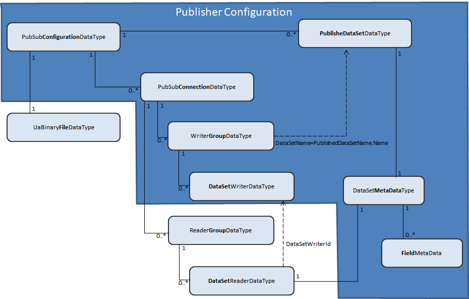

# OPC Foundation UA .Net Standard Library - Console Reference Publisher

## Introduction
This OPC application was created to provide the sample code for creating Publisher applications using the OPC Foundation UA .Net Standard PubSub Library. There is a .Net Core 3.1 (2.1) console version of the Publisher which runs on any OS supporting [.NET Standard](https://docs.microsoft.com/en-us/dotnet/articles/standard).
The Reference Publisher is configured to run in parallel with the [Console Reference Subscriber](../ConsoleReferenceSubscriber/README.md)

## How to build and run the console OPC UA Reference Publisher from Visual Studio
1. Open the solution **UA Reference.sln** with Visual Studio 2019.
2. Choose the project `ConsoleReferencePublisher` in the Solution Explorer and set it with a right click as `Startup Project`.
3. Hit `F5` to build and execute the sample.

## How to build and run the console OPC UA Reference Publisher on Windows, Linux and iOS
This section describes how to run the **ConsoleReferencePublisher**.

Please follow instructions in this [article](https://aka.ms/dotnetcoregs) to setup the dotnet command line environment for your platform. 

## Start the Publisher
1. Open a command prompt.
2. Navigate to the folder **Applications/ConsoleReferencePublisher**.
3. To run the Publisher sample execute: 

`dotnet run --project ConsoleReferencePublisher.csproj --framework netcoreapp3.1` 

The Publisher will start and publish network messages that can be consumed by the Reference Subscriber. 
Publisher Initialization

## Command Line Arguments for *ConsoleReferencePublisher*
 **ConsoleReferencePublisher** can be executed using the following command line arguments:
 

 -  -h|help - Shows usage information
 -  -m|mqtt_json - Creates a connection using there MQTT with Json encoding Profile. This is the default option.
 -  -u|udp_uadp - Creates a connection using there UDP with UADP encoding Profile. 

To run the Publisher sample using a connection with MQTT with Json encoding execute: 

		dotnet run --project ConsoleReferencePublisher.csproj --framework netcoreapp3.1 

		or 

		dotnet run --project ConsoleReferencePublisher.csproj --framework netcoreapp3.1 -m

To run the Publisher sample using a connection with the UDP with UADP encoding execute: 

		dotnet run --project ConsoleReferencePublisher.csproj --framework netcoreapp3.1 -u

# Programmer's Guide
To create a new OPC UA Publisher application:

 - Open Microsoft Visual Studio 2019 environment,
 - Create a new project and give it a name,
 - Add a reference to the [OPCFoundation.NetStandard.Opc.Ua.PubSub NuGet package](https://www.nuget.org/packages/OPCFoundation.NetStandard.Opc.Ua.PubSub/),
 - Initialize Publisher application (see [Publisher Initialization](#publisher-initialization)).

## Publisher Initialization

The following four steps are required to implement a functional Publisher:

 1. Create [Publisher Configuration](#publisher-configuration).
 
		// Create configuration using MQTT protocol and JSON Encoding
        PubSubConfigurationDataType pubSubConfiguration = CreatePublisherConfiguration_MqttJson();
    
      Or use the alternative configuration object for UDP with UADP encoding
	  
		// Create configuration using UDP protocol and UADP Encoding 
        PubSubConfigurationDataType pubSubConfiguration = CreatePublisherConfiguration_UdpUadp();      
        
	The CreatePublisherConfiguration methods can be found in  [ConsoleReferencePublisher/Program.cs](./Program.cs) file.

 2. Create an instance of the [UaPubSubApplication Class](../../Docs/PubSub.md#uapubsubapplication-class) using the configuration data from step 1.
 
        // Create an instance of UaPubSubApplication
        UaPubSubApplication uaPubSubApplication = UaPubSubApplication.Create(pubSubConfiguration);

 3. Provide the data to be published based on the configuration of published data sets. This step is described in the [Publisher Data](#publisher-data) section.
 4. Start PubSub application

        // Start the publisher
        uaPubSubApplication.Start();

After this step the Publisher will publish data as configured.

## Publisher Configuration

The Publisher configuration is a subset of the [PubSub Configuration](../../Docs/PubSub.md#pubsub-configuration). A functional *Publisher* application needs to have a configuration (*PubSubConfgurationDataType* instance) that contains a list of published data sets (*PublishedDataSetDataType* instances) and at least one connection (*PubSubConnectionDataType* instance) with at least one writer group configuration (*WriterGroupDataType* instance). The writer group contains at least one data set writer (*DataSetWriterDataType* instance) pointing to a published data set from the current configuration.

The diagram shows the subset of classes involved in an *OPC UA Publisher* configuration.

## Publisher Data

The [UaPubSubApplication Class](../../Docs/PubSub.md#uapubsubapplication-class) provides a property of type [IUaPubSubDataStore](../../Docs/PubSub.md#iuapubsubdatastore-interface) called DataStore. In **ConsoleReferencePublisher** there is no custom implementation provided for *IUaPubSubDataStore* therefore the pub sub application object is initialized using the default implementation of this interface, an instance of *UaPubSubDataStore*. 

The code responsible for generating the data values to be published is located in the [PublishedValuesWrites](/PublishedValuesWrites.cs)  file from the **ConsoleReferencePublisher** project. It maintains a list of all the fields from the table below and uses a timer for writing the values to *UaPubSubApplication.DataStore* using the *WritePublishedDataItem*() method from *DataStore* class. The data values simulator component is initialized like:

    // Start values simulator
    PublishedValuesWrites valuesSimulator = new PublishedValuesWrites(uaPubSubApplication);
    valuesSimulator.Start();

The **Publisher** component from **ConsoleReferencePublisher** application will use the data generated by *PublishedValuesWrites* to create the *NetworkMessages* that will be published as configured in [Publisher Configuration](#publisher-configuration).

Note:  
The current PubSub implementation only supports *PublishedDataItemsDataType* as *DataSetSource* of a *PublishedDataSetDataType* from the configuration. *Events* will be added in a future version.

The **ConsoleReferencePublisher** application is configured to use the following data sets and will generate values as specified in the table below if the default configuration method is used:

### PublishedDataSet 'Simple' - NamespaceIndex = 2
| Name  | DataType  |  ValueRank |Behavior  |
|--|--|--|--|
|BoolToggle |Boolean |Scalar |Toggles every 3 seconds|
|Int32|Int32|Scalar |Counts (1 per second) from 0 to 10,000 and then resets|
|Int32Fast|Int32Fast|Scalar |Counts (100 per second) from 0 to 10,000 and then resets|
|DateTime|DateTime|Scalar |Current time refreshed with every packet sent|

The *CreatePublishedDataSetSimple*() method from [Program.cs](Program.cs) creates a *PublishedDataSetDataType* configuration object that contains the metadata information for *'Simple' DataSet*.

### PublishedDataSet 'AllTypes' - NamespaceIndex = 3
| Name  | DataType  |  ValueRank |Behavior  |
|--|--|--|--|
|BoolToggle |Boolean |Scalar |Toggles every second|
|Byte|Byte|Scalar |Counts (1 per second) from 0 to type-max and then resets|
|Int16|Int16|Scalar |Counts (1 per second) from 0 to type-max and then resets|
|Int32|Int32|Scalar |Counts (1 per second) from 0 to type-max and then resets|
|SByte|SByte|Scalar |Counts (1 per second) from 0 to type-max and then resets|
|UInt16|UInt16|Scalar |Counts (1 per second) from 0 to type-max and then resets|
|UInt32|UInt32|Scalar |Counts (1 per second) from 0 to type-max and then resets|
|UInt64|UInt64|Scalar |Counts (1 per second) from 0 to type-max and then resets|
|Float|Float|Scalar |Counts (1 per second) from 0 to type-max and then resets|
|Double|Double|Scalar |Counts (1 per second) from 0 to type-max and then resets|
|String|String|Scalar |Spells the aviation alphabet (Alpha, Bravo …) (1 per second)|
|ByteString|ByteString|Scalar |1 new random ByteString per second|
|Guid|Guid|Scalar |1 new random Guid per second|
|DateTime|DateTime|Scalar |Current time refreshed with every packet sent|
|UInt32Array|UInt32|OneDimension|Counts (1 per second on every element) from 0 to type-max and then resets. The count starting point for each value should differ|

The *CreatePublishedDataSetAllTypes*() method from [Program.cs](Program.cs) creates a *PublishedDataSetDataType* configuration object that contains the metadata information for *'AllTypes' DataSet*.
