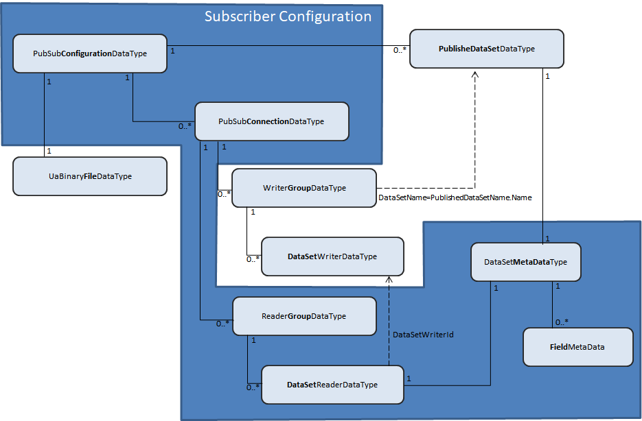

# OPC Foundation UA .Net Standard Library - Console Reference Subscriber

## Introduction
This OPC application was created to provide the sample code for creating Subscriber applications using the OPC Foundation UA .Net Standard PubSub Library. There is a .Net Core 3.1 (2.1) console version of the Subscriber which runs on any OS supporting [.NET Standard](https://docs.microsoft.com/en-us/dotnet/articles/standard).
The Reference Subscriber is configured to run in parallel with the [Console Reference Publisher](../ConsoleReferencePublisher/README.md)

## How to build and run the Windows OPC UA Reference Server from Visual Studio
1. Open the solution **UA Reference.sln** with Visual Studio 2019.
2. Choose the project `ConsoleReferenceSubscriber` in the Solution Explorer and set it with a right click as `Startup Project`.
3. Hit `F5` to build and execute the sample.

## How to build and run the console OPC UA Reference Subscriber on Windows, Linux and iOS
This section describes how to run the **ConsoleReferenceSubscriber**.

Please follow instructions in this [article](https://aka.ms/dotnetcoregs) to setup the dotnet command line environment for your platform. 

## Start the Subscriber
1. Open a command prompt.
2. Navigate to the folder **Applications/ConsoleReferenceSubscriber**.
3. To run the Subscriber sample type `dotnet run --project ConsoleReferenceSubscriber.csproj --framework netcoreapp3.1.` 
The Subscriber will start and listen for network messages sent by the Reference Publisher. 
# Programmer's Guide
To create a new OPC UA Subscriber application:

 - Open Microsoft Visual Studio 2019 environment,
 - Create a new project and give it a name,
 - Add a reference to the [OPCFoundation.NetStandard.Opc.Ua.PubSub NuGet package](https://www.nuget.org/packages/OPCFoundation.NetStandard.Opc.Ua.PubSub/),
 - Initialize Subscriber application (see [Subscriber Initialization](#subscriber-initialization)).
## Subscriber Initialization

The following four steps are required to implement a functional Subscriber:

 1. Create [Subscriber Configuration](#subscriber-configuration).
 
        // Create configuration using UDP protocol and UADP Encoding 
        PubSubConfigurationDataType pubSubConfiguration = CreateSubscriberConfiguration_UdpUadp();
    
      Or use the alternative configuration object for MQTT with JSON encoding
                
        // Create configuration using MQTT protocol and JSON Encoding
        PubSubConfigurationDataType pubSubConfiguration = CreateSubscriberConfiguration_MqttJson();

    The CreateSubscriberConfiguration methods can be found in  [ConsoleReferenceSubscriber/Program.cs](./Program.cs) file.

 2. Create an instance of the [UaPubSubApplication Class](../../Docs/PubSub.md#uapubsubapplication-class) using the configuration data from step 1.
 
        // Subscribe to data events 
        UaPubSubApplication uaPubSubApplication = UaPubSubApplication.Create(pubSubConfiguration);

 3. Provide the event handler for the *DataReceived* 	event. This event will be raised when data sets matching the subscriber configuration arrive over the network. See the DataReceived Event section for more details.

        // Create an instance of UaPubSubApplication
        uaPubSubApplication.DataReceived += PubSubApplication_DataReceived;

 4. Start PubSub application

        // Start the publisher
        uaPubSubApplication.Start();

After this step the *Subscriber* will listen for *NetworkMessages* as configured.
## Subscriber Configuration

The Subscriber configuration is a subset of the [PubSub Configuration](../../Docs/PubSub.md#pubsub-configuration). A functional *Subscriber* application needs to have a configuration (*PubSubConfgurationDataType* instance) that contains at least one connection (*PubSubConnectionDataType* instance) with at least one reader group configuration (*ReaderGroupDataType* instance). The reader group contains at least one data set reader (*DataSetReaderDataType* instance) that describes a published data set that can be processed and retrieved by the *Subscriber* application.
The diagram shows the subset of classes involved in an *OPC UA Publisher* configuration.

