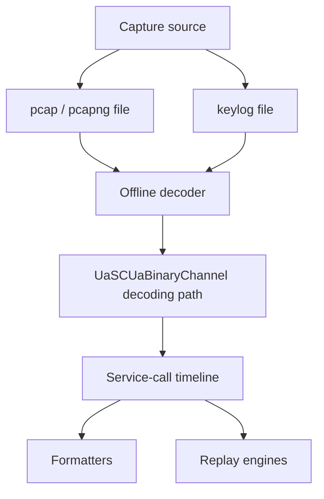

# Diagnostics

This document covers the diagnostics surface of the OPC UA .NET Standard
stack: how to plumb logs, traces, and metrics through `ITelemetryContext`;
the spec-defined OPC UA server audit events; the built-in OPC UA server
diagnostics information model; and the packet capture, dissection, and
replay engine shipped by `OPCFoundation.NetStandard.Opc.Ua.Core.Diagnostics`.

It replaces the previous `Observability.md` and `PacketCapture.md` docs.

- [1. Telemetry context (`ITelemetryContext`)](#1-telemetry-context-itelemetrycontext)
- [2. OPC UA server audit events](#2-opc-ua-server-audit-events)
- [3. OPC UA server built-in diagnostics nodes](#3-opc-ua-server-built-in-diagnostics-nodes)
- [4. Packet capture, dissection, and replay](#4-packet-capture-dissection-and-replay)
- [5. PubSub packet capture and dissection](#5-pubsub-packet-capture-and-dissection)
- [6. Related references](#6-related-references)

## 1. Telemetry context (`ITelemetryContext`)

`ITelemetryContext` is the single abstraction every stack component uses
to obtain `ILogger`, `ActivitySource`, and `Meter` instances. It removes
the prior process-wide singleton logger, supports dependency injection,
and aligns the stack with current .NET and OpenTelemetry practices. The
design follows Microsoft's [guidance for library authors](https://learn.microsoft.com/dotnet/core/extensions/logging-library-authors).

### Overview

```csharp
public interface ITelemetryContext
{
    // Creates a new Meter for recording metrics (caller disposes).
    Meter CreateMeter();

    // Factory used to create typed ILogger instances.
    ILoggerFactory LoggerFactory { get; }

    // Shared ActivitySource representing the current assembly/component.
    ActivitySource ActivitySource { get; }
}
```

One abstraction covers all three telemetry pillars (logs, traces,
metrics). Lifetime semantics are explicit: callers dispose meters they
create; the context owns the long-lived `ActivitySource` and
`LoggerFactory`. Multiple telemetry contexts may coexist in the same
process &mdash; e.g. a server and a client, or several servers with
different logging configurations inside a container.

### Extension methods

```csharp
public static class TelemetryExtensions
{
    // Creates a logger for the specified category.
    ILogger CreateLogger(this ITelemetryContext context, string categoryName);
    ILogger<T> CreateLogger<T>(this ITelemetryContext context);

    // Starts a new Activity with the shared ActivitySource.
    Activity StartActivity(this ITelemetryContext context, string activityName, ActivityKind kind = ActivityKind.Internal);
}
```

**Always use the extension methods**. They guarantee a non-null logger
and activity even when the supplied `ITelemetryContext` is `null` or
returns `null` from a property: in release builds the fallback is a
backwards-compatible trace logger; in debug builds it is a debug-check
logger that throws if used so missing telemetry is caught early.

### Obtaining a telemetry context

Telemetry context should be passed **via constructors only**. This
enables dependency injection, testability, and `readonly` fields. It
also aligns with the lifecycle of the owning class &mdash; for example
`Dispose` on the class can dispose the meter it created.

Existing code can obtain an `ITelemetryContext` from
`IServiceMessageContext.Telemetry`, `ISystemContext.Telemetry`, or
`IServerInternal.Telemetry`. Encoders, session users, and filtering
helpers all have one of these available.

When code may run on the server side or in client/server-shared code,
use this priority order:

0. From a private `ITelemetryContext` member (e.g. `m_telemetry`) of
   the current class. If the constructor receives any of the types
   below, pick the first and assign it to a `private readonly`
   `m_telemetry` &mdash; then use it everywhere in the class. Create
   a `m_logger` field at the same time when one is needed.
1. `ISystemContext.Telemetry`
2. `IServerInternal.Telemetry`
3. `IServiceMessageContext.Telemetry`

In pure client code:

0. From a private `ITelemetryContext` member, initialized in the
   constructor from any context in this list.
1. `ISession` &rarr; `session.MessageContext.Telemetry`
2. `ISystemContext.Telemetry`
3. `IServiceMessageContext.Telemetry`

When deriving from `NodeState`, override `void Initialize(ITelemetryContext)`
and store the context in a private field (call the base implementation
so it also receives the context). `Initialize` is called after the
`NodeState` is created and before any other method runs.

If you need to create a context yourself, use the
`DefaultTelemetry.Create(...)` static factory. Do **not** create new
contexts in code that already has access to one &mdash; plumb the
existing one through. The application root (typically where you
construct `ApplicationInstance` or `HostApplicationBuilder`) is the
right place to materialize the context.

### Using the telemetry context

Always use the extension methods to obtain loggers, meters, and
activities. The returned instance is guaranteed to be non-null.

```csharp
// Obtain telemetry context
ITelemetryContext telemetry = systemContext.Telemetry;

// Logging
ILogger logger = telemetry.CreateLogger("Sample");
// or
ILogger<MyClass> logger = telemetry.CreateLogger<MyClass>();

logger.LogInformation("Connecting to {Endpoint}", endpointUrl);

// Tracing
using Activity? activity = telemetry.StartActivity("ConnectSession");
// Perform OPC UA operation ...

// Metrics
using Meter meter = telemetry.CreateMeter();
Counter<long> connectCounter = meter.CreateCounter<long>("opc.ua.client.connects");
connectCounter.Add(1);
```

Store the obtained logger / meter / activity-source references in
`private readonly` fields populated in the constructor. Loggers are
cached by the `ILoggerProvider`, so obtaining one is cheap. Still,
be mindful of the per-object reference cost when creating loggers for
very large object populations (`NodeState`, `NodeId`).

`ConsoleReferenceClient` and `ConsoleReferenceServer` show the full
pattern end-to-end.

### Refactoring guidance

- Only pass an `ILogger` via constructor to objects that actually need
  it. `NodeState`-derived classes may use the telemetry context to
  create a logger on demand instead of taking one as a constructor
  parameter.
- Prefer **throwing** from "model" classes and **logging** in the
  caller. Example: parsing a `NodeId` should throw on failure; the
  caller decides whether to log a warning and return null, or
  rethrow. A `TryParse` flavour is often the better API shape.
- Use a "service" class to manage large populations of model objects
  and pass the telemetry context once into its constructor. The
  service class then creates loggers/meters once and reuses them.
  This is the pattern we follow for certificate handling, storage,
  and configuration management.
- A logger/meter created in the outer class can be passed to inner
  classes created inside the outer class &mdash; for example
  PubSub message objects.
- If a class genuinely cannot obtain a logger yet (gradual migration),
  initialize the field with `Telemetry.NullLogger.Instance`. In
  release builds this is a no-op; in debug builds it is a debug-check
  logger that asserts on use, surfacing the missing wiring. This is
  different from `NullLogger.Instance` in
  `Microsoft.Extensions.Logging.Abstractions`.

### High-speed logging and source generators

The repository uses [`LoggerMessageAttribute`](https://learn.microsoft.com/dotnet/core/extensions/logger-message-generator)
source-generated logging in hot paths. New logging additions in
hot paths should follow the same pattern:

```csharp
internal static partial class Log
{
    [LoggerMessage(
        EventId = 4201,
        Level = LogLevel.Warning,
        Message = "Token activation failed for channelId={ChannelId}.")]
    public static partial void TokenActivationFailed(ILogger logger, uint channelId, Exception ex);
}
```

Source-generated logging avoids boxing of value-type arguments and
emits efficient `IsEnabled` checks. Where present, Roslyn analyzers
will warn if new ad-hoc logging is added in instrumented areas.

### Extensibility patterns

#### Custom `ITelemetryContext` implementations

Derive from `TelemetryContextBase`, supplying an `ILoggerFactory`
(and optionally an `ActivitySource`) to the base constructor. Each
instance gets its own meters / loggers without affecting any other
context.

```csharp
public sealed class TenantTelemetry : TelemetryContextBase
{
    public TenantTelemetry(string tenantId, ILoggerFactory loggerFactory)
        : base(loggerFactory, new ActivitySource($"Opc.Ua.{tenantId}"))
    {
        TenantId = tenantId;
    }

    public string TenantId { get; }
}
```

Multi-tenant hosting can then attach a `TenantTelemetry` to every
`ApplicationInstance` or session it creates, keeping each tenant's
telemetry stream isolated.

#### Wiring into Microsoft.Extensions.DependencyInjection

The OPC UA stack ships a fluent `IOpcUaBuilder` surface that
registers a default `ITelemetryContext` for you. The recommended
shape is:

```csharp
HostApplicationBuilder builder = Host.CreateApplicationBuilder();

builder.Services
    .AddOpcUa()                              // registers ITelemetryContext
    .AddLogging(b => b.AddConsole())         // wires ILoggerFactory through the same builder
    .AddMetrics();                           // wires IMeterFactory through the same builder

// Feature libraries hang off the same IOpcUaBuilder:
builder.Services
    .AddOpcUa()
    .AddClient(opts => { /* ... */ })
    .AddServer(opts => { /* ... */ });
```

`services.AddOpcUa()` registers
[`ServiceProviderTelemetryContext`](../Stack/Opc.Ua.Core/Stack/Diagnostics/ServiceProviderTelemetryContext.cs)
as a singleton `ITelemetryContext` via `TryAddSingleton`. That
adapter resolves the host's `ILoggerFactory` from DI on first use
(falling back to `NullLoggerFactory` when none is registered) and
materializes a fresh `Meter` / `ActivitySource` per calling
assembly &mdash; no further wiring needed for the common case.

The fluent `.AddLogging(...)` / `.AddMetrics(...)` overloads on
`IOpcUaBuilder` are thin pass-throughs to the standard
`IServiceCollection` extensions, kept on the builder so the OPC UA
registration stays a single fluent chain. Parameterless overloads
exist for the "just turn it on" case.

To **replace** the default telemetry context with a custom
implementation (per-tenant context, prebuilt logger factory, opt-out
context, etc.), register it **before** calling `AddOpcUa()` so
`TryAddSingleton` keeps your registration:

```csharp
builder.Services.AddSingleton<ITelemetryContext>(sp
    => new TenantTelemetry("tenant-A", sp.GetRequiredService<ILoggerFactory>()));
builder.Services.AddOpcUa();  // sees the existing registration; does not overwrite
```

Or, for fine-grained per-component contexts, use keyed singletons
alongside the default one:

```csharp
builder.Services.AddOpcUa();
builder.Services.AddKeyedSingleton<ITelemetryContext>(
    "Client",
    (sp, _) => DefaultTelemetry.Create(sp.GetRequiredService<ILoggerFactory>()));
```

#### OpenTelemetry exporter wiring

`ITelemetryContext` exposes the standard .NET diagnostic primitives,
so any OpenTelemetry exporter that subscribes to an `ActivitySource`
or `Meter` works without bespoke integration. A typical OTLP export
looks like:

```csharp
builder.Services.AddOpenTelemetry()
    .ConfigureResource(r => r.AddService("opc-ua-client"))
    .WithTracing(t => t
        .AddSource("Opc.Ua.Core")             // names used by stack ActivitySources
        .AddSource("Opc.Ua.Client.Session")
        .AddOtlpExporter())
    .WithMetrics(m => m
        .AddMeter("Opc.Ua.Client.*")          // wildcard match for stack meters
        .AddMeter("Opc.Ua.Server.*")
        .AddOtlpExporter());
```

For Console / Jaeger / Application Insights, swap the
`AddOtlpExporter()` call for the corresponding exporter from
`OpenTelemetry.Exporter.*`.

#### Naming conventions

| Pillar | Convention | Example |
|---|---|---|
| `ActivitySource` name | Assembly or component-qualified | `Opc.Ua.Core`, `Opc.Ua.Client.Session`, `Opc.Ua.Core.Diagnostics` |
| `Activity` (span) name | Action-oriented, no parameters | `ConnectSession`, `CreateSubscription`, `StartCapture` |
| `Meter` name | Mirrors `ActivitySource` namespace | `Opc.Ua.Client.Session`, `Opc.Ua.Server.Subscriptions` |
| Counter / instrument name | `opc.ua.<area>.<noun>` lower-snake | `opc.ua.client.connects`, `opc.ua.server.subscriptions.active` |
| Tags / dimensions | Stable subset only | `endpoint.url`, `security.mode`, `security.policy.uri` |

Keep tag cardinality bounded &mdash; do not tag on session id or any
per-request identifier.

#### Testing patterns

For unit tests, use a `ListLoggerProvider` or `ITestOutputHelper`-backed
factory, then derive a `TelemetryContext` from it:

```csharp
var loggerFactory = LoggerFactory.Create(b => b.AddProvider(new ListLoggerProvider(out var logs)));
ITelemetryContext telemetry = DefaultTelemetry.Create(loggerFactory);

// Exercise the code-under-test, then assert on `logs`.
```

For activities, attach an `ActivityListener`:

```csharp
using var listener = new ActivityListener
{
    ShouldListenTo = src => src.Name == "Opc.Ua.Core",
    Sample = (ref ActivityCreationOptions<ActivityContext> _) => ActivitySamplingResult.AllDataAndRecorded,
    ActivityStopped = activity => observed.Add(activity)
};
ActivitySource.AddActivityListener(listener);
```

For metrics, use `MeterListener` to capture instrument writes without
needing a full OpenTelemetry pipeline.

### Metrics emitted by the stack

The stack creates one `Meter` per assembly that records measurements.
The meter's **name is the assembly name** of the component that
created it (via `ITelemetryContext.CreateMeter()` &rarr;
`Assembly.GetCallingAssembly().FullName`). Most tooling matches with
wildcards, so subscribe with `AddMeter("Opc.Ua.Core*", "Opc.Ua.Client*")`
to pick up everything the stack emits today.

The instruments below are the complete current inventory. Tag values
are documented next to the tag key.

#### Meter `Opc.Ua.Core`

Client transport channel manager &mdash; defined in
`ClientChannelManagerMetrics.cs`:

| Instrument | Kind | Unit | Tags | Description |
|---|---|---|---|---|
| `opc.ua.channel.open` | Counter&lt;long&gt; | &mdash; | `endpoint`, `reverse` (bool) | OPC UA client transport channels opened. |
| `opc.ua.channel.close` | Counter&lt;long&gt; | &mdash; | `endpoint`, `reverse`, `reason` (`lease-released` \| `manager-disposed` \| `faulted`) | OPC UA client transport channels closed. |
| `opc.ua.channel.active` | UpDownCounter&lt;long&gt; | &mdash; | `endpoint` | Current number of active OPC UA client channel entries. |
| `opc.ua.channel.reconnect.attempts` | Counter&lt;long&gt; | &mdash; | `endpoint`, `outcome` | OPC UA client channel reconnect attempts. |
| `opc.ua.channel.reconnect.duration` | Histogram&lt;double&gt; | `ms` | `endpoint`, `outcome` | Duration of reconnect cycles. |
| `opc.ua.channel.gate.wait` | Histogram&lt;double&gt; | `ms` | `endpoint` | Time spent waiting for the per-channel ready gate. |
| `opc.ua.channel.participant.timeout.count` | Counter&lt;long&gt; | &mdash; | `endpoint`, `participant` (kind prefix, e.g. `Session`, `Discovery`) | Reconnect participant callbacks that timed out. |
| `opc.ua.channel.participant.recreate.count` | Counter&lt;long&gt; | &mdash; | `endpoint`, `participant`, `success` (bool) | Reconnect participant recreate callbacks. |
| `opc.ua.channel.refcount` | ObservableGauge&lt;long&gt; | &mdash; | `endpoint` | Reference count per channel entry. |
| `opc.ua.channel.participants` | ObservableGauge&lt;long&gt; | &mdash; | `endpoint` | Participant count per channel entry. |

Note: the `participant` tag carries the **kind prefix only**
(`Session`, `Discovery`, etc.). The per-instance participant id is
deliberately omitted to keep metric cardinality bounded; the full id
is available on the related Activity tags and EventSource events for
correlation.

Client request duration &mdash; defined in `ClientBase.cs`:

| Instrument | Kind | Unit | Tags | Description |
|---|---|---|---|---|
| `opc.ua.client.request.duration` | Histogram&lt;double&gt; | `s` | `opc.ua.request.service` (service name), `opc.ua.response.status.code` (uint), `server.address` (endpoint URL), `opc.ua.request.timeout` (ms) | Wall-clock duration of each client service request. Default bucket boundaries: 5&nbsp;ms - 60&nbsp;s. Only emitted when the client's `ActivityTraceFlags` include `ClientTraceFlags.Metrics`. |

Certificate cache &mdash; defined in `CertificateCache.cs`:

| Instrument | Kind | Unit | Tags | Description |
|---|---|---|---|---|
| `opc.ua.certcache.hit` | ObservableCounter&lt;long&gt; | &mdash; | &mdash; | Total certificate cache hits (public + private key caches combined). |
| `opc.ua.certcache.miss` | ObservableCounter&lt;long&gt; | &mdash; | &mdash; | Total certificate cache misses. |
| `opc.ua.certcache.size` | ObservableGauge&lt;long&gt; | &mdash; | &mdash; | Current number of cached certificate entries (both caches). |
| `opc.ua.certcache.private_key_entries` | ObservableGauge&lt;long&gt; | &mdash; | &mdash; | Current number of cached entries that hold private keys. |
| `opc.ua.certcache.eviction` | ObservableCounter&lt;long&gt; | &mdash; | &mdash; | Total certificate cache evictions. |

#### Meter `Opc.Ua.Client`

Client node cache &mdash; defined in `NodeCache.cs`:

| Instrument | Kind | Unit | Tags | Description |
|---|---|---|---|---|
| `opc.ua.client.nodecache.hits` | ObservableCounter&lt;long&gt; | &mdash; | `cache` (`nodes` \| `values` \| `references`) | Hits on the named sub-cache. |
| `opc.ua.client.nodecache.misses` | ObservableCounter&lt;long&gt; | &mdash; | `cache` | Misses on the named sub-cache. |
| `opc.ua.client.nodecache.evictions` | ObservableCounter&lt;long&gt; | &mdash; | `cache` | Evictions from the named sub-cache. |
| `opc.ua.client.nodecache.size` | ObservableGauge&lt;long&gt; | &mdash; | `cache` | Current entry count of the named sub-cache. |

### Wiring up a metrics exporter

#### Prometheus (ASP.NET Core scrape endpoint)

```csharp
using OpenTelemetry.Metrics;

var builder = WebApplication.CreateBuilder(args);

builder.Services.AddOpenTelemetry()
    .ConfigureResource(r => r.AddService("opc-ua-client"))
    .WithMetrics(m => m
        .AddMeter("Opc.Ua.Core*")        // channel manager, ClientBase, cert cache
        .AddMeter("Opc.Ua.Client*")      // node cache
        .AddPrometheusExporter());

WebApplication app = builder.Build();

// Exposes /metrics in Prometheus text format.
app.MapPrometheusScrapingEndpoint();

await app.RunAsync();
```

Pair with the Prometheus server `scrape_configs` entry:

```yaml
scrape_configs:
  - job_name: opc-ua-client
    scrape_interval: 15s
    static_configs:
      - targets: ["opc-ua-client.svc.cluster.local:8080"]
```

The OpenTelemetry Prometheus exporter exposes one Prometheus metric
per OPC UA instrument; tag keys map directly to Prometheus labels.
The `.` separators in instrument names become `_` per Prometheus
naming rules (e.g. `opc_ua_client_request_duration`).

#### OTLP (OpenTelemetry Protocol &rarr; collector / vendor backend)

```csharp
using OpenTelemetry.Metrics;
using OpenTelemetry.Resources;

HostApplicationBuilder builder = Host.CreateApplicationBuilder(args);

builder.Services.AddOpenTelemetry()
    .ConfigureResource(r => r.AddService("opc-ua-client"))
    .WithMetrics(m => m
        .AddMeter("Opc.Ua.Core*")
        .AddMeter("Opc.Ua.Client*")
        .AddOtlpExporter(opt =>
        {
            opt.Endpoint = new Uri("http://otel-collector:4317");
            opt.Protocol = OpenTelemetry.Exporter.OtlpExportProtocol.Grpc;
        }));

await builder.Build().RunAsync();
```

For an HTTP/protobuf collector (default `http://otel-collector:4318/v1/metrics`),
set `opt.Protocol = OtlpExportProtocol.HttpProtobuf` and adjust the
endpoint.

Make sure the host's `ITelemetryContext` is materialized through the
same `ILoggerFactory` / `IServiceProvider` that wires the exporters
(see [Wiring into Microsoft.Extensions.DependencyInjection](#wiring-into-microsoftextensionsdependencyinjection)
above) so the `Meter` instances created by the stack are visible to
the OpenTelemetry MeterProvider.

### Opt-out / no-op contexts

Pass a no-op `ITelemetryContext` when telemetry is genuinely
unwanted (typically only in unit tests or constrained AOT
scenarios):

```csharp
sealed class NullTelemetry : TelemetryContextBase
{
    public NullTelemetry()
        : base(NullLoggerFactory.Instance) // Microsoft.Extensions.Logging.Abstractions
    {
    }
}
```

Passing literal `null` for an `ITelemetryContext` parameter is **not
recommended** &mdash; it triggers the legacy trace fallback and can
emit format exceptions when a non-semantic trace logger receives a
semantic logging template.

### Temporary compromises

A handful of static utilities still exist and take the telemetry
context as an additional argument. These are progressively being
removed:

- `CertificateFactory.Create / CreateCertificate / CreateCertificateWith{,PEM}PrivateKey`
  are now `[Obsolete]` and forward to `Certificate.FromRawData(...)` /
  `DefaultCertificateFactory.Instance.*` / `DefaultCertificateIssuer.Instance.*`.
  Internal callers have migrated; new code should use the factory /
  issuer interfaces (or their singletons) directly. See
  [CertificateManager](CertificateManager.md).
- Any remaining public-static method that gained an `ITelemetryContext`
  parameter accepts it as the last optional argument with a default
  of `null` (or before `CancellationToken` for async methods).
- `IServiceMessageContext` is occasionally needed where no context is
  in scope (e.g. inside the decoder during extension-object
  deserialization). An ambient `ServiceMessageContext` is exposed as
  an `AsyncLocal<T>` for these situations. The ambient pattern is
  marked `Experimental` and must not be used in new code.

These compromises will disappear over time as the codebase is
refactored to pass context purely through constructors.

## 2. OPC UA server audit events

OPC UA Part 5 defines a family of `AuditXxxEventType` event types that
servers raise for security-relevant operations (session lifecycle,
secure-channel events, certificate validation, history modification,
node management, role mapping, etc.). The stack provides ready-made
helpers in `Libraries/Opc.Ua.Server/Diagnostics/AuditEvents.cs` for
every event type the standard server raises.

### Enabling auditing

Auditing is controlled by the `ServerConfiguration.AuditingEnabled`
flag (and the `OpcUaServerOptions.AuditingEnabled` shortcut when
using the hosted-service builder). When `false`, audit helpers
short-circuit immediately so there is no runtime cost.

`StandardServer` exposes the active state through
`IServerInternal.Auditing` (via `IAuditEventServer.Auditing`). Custom
`NodeManager` implementations should honour this flag.

### Raising an audit event

The `AuditEvents` static class exposes one `Report<EventName>` method
per spec event &mdash; for example `ReportAuditCreateSessionEvent`,
`ReportAuditOpenSecureChannelEvent`, `ReportAuditCertificateEvent`,
`ReportAuditAddNodesEvent`, `ReportAuditHistoryValueUpdateEvent`,
`ReportAuditRoleMappingRuleChangedEvent`. Each helper:

1. Returns immediately when `IAuditEventServer.Auditing` is false.
2. Constructs the spec-defined `AuditEventState` with the required
   fields (`ActionTimeStamp`, `Status`, `ServerId`, `ClientAuditEntryId`,
   `ClientUserId`, ...) populated from the supplied operation context.
3. Calls `IAuditEventServer.ReportAuditEvent(...)` which publishes
   the event so any subscribed monitored item delivers it to clients.

```csharp
public sealed class MyAuditingNodeManager : CustomNodeManager
{
    private void OnUpdateCertificate(ISystemContext context, ...)
    {
        // ... apply update ...

        // Report a standard AuditCertificateUpdatedEventType notification.
        Server.ReportCertificateUpdatedAuditEvent(
            operationContext,
            objectId,
            methodId,
            inputArguments,
            certificateGroupId,
            certificateTypeId,
            certificate,
            Logger);
    }
}
```

`Server` is the `IAuditEventServer` exposed by `StandardServer` /
`IServerInternal`. The `logger` is your context logger from
`ITelemetryContext`.

### Redacted private-key material

`AuditEvents.RedactedPrivateKey` is the canonical placeholder used
in `UpdateCertificate` audit `InputArguments` per OPC 10000-12 §7.10.3
to prevent private-key bytes leaking into audit payloads. Use it in
custom audit emitters that handle private keys.

### Subscribing on the server

Audit events flow to monitored items just like any other OPC UA event.
A client must subscribe to the `Server` object (or a higher-level
`ObjectsFolder`) with an `EventFilter` that selects the audit event
type. The server's own `Auditing` property must be `true` for any
events to be published.

Audit events are additionally gated by the `ReceiveEvents` permission: the server validates `PermissionType.ReceiveEvents` on the event type and source node for every event-monitored item, so a session only receives audit events when its granted roles include that permission (typically the well-known `SecurityAdmin` role). An anonymous or otherwise unprivileged session receives no audit events even though they are being generated. In the `ConsoleReferenceServer`, connect with username `sysadmin` / password `demo` (mapped to `[SecurityAdmin, AuthenticatedUser]` in `ReferenceServer.cs`) to observe them.

> **Compliance note (OPC UA CTT).** The CTT *Auditing* conformance units collect audit events over a subscription and correlate them by `ClientAuditEntryId`. Configure the CTT connection to authenticate as a `SecurityAdmin` user (for this reference server, `sysadmin`/`demo`); an anonymous connection produces `TestFindActualFromExpected - Unable to Find Entry for ClientAuditEntryId ...` for every case because no audit events are delivered to the unprivileged session.

## 3. OPC UA server built-in diagnostics nodes

OPC UA Part 5 §6 defines a `Server` object with a rich `ServerStatus`
and `ServerDiagnostics` sub-tree. The stack populates these nodes
automatically through `Libraries/Opc.Ua.Server/Diagnostics/DiagnosticsNodeManager.cs`.

### Enabling diagnostics

The runtime cost of maintaining the diagnostics tree (per-session,
per-subscription counters) is gated by `ServerConfiguration.DiagnosticsEnabled`
(default **true** in `OpcUaServerOptions`). Toggle it at runtime
through the `Server.ServerDiagnostics.EnabledFlag` variable &mdash;
writes flow through `DiagnosticsNodeManager.SetDiagnosticsEnabledAsync`,
which atomically pauses or resumes the periodic scan loop.

When disabled, the diagnostics nodes remain present but are not
updated; reads return the last known values. Disable for
high-throughput production servers where per-monitored-item counters
become measurable overhead.

### Information-model surface

| Node | Variable type | Source |
|---|---|---|
| `Server.ServerStatus` | `ServerStatusDataType` | Liveness, state, build info, current time |
| `Server.ServerStatus.CurrentTime` | `UtcTime` | Server clock |
| `Server.ServerStatus.State` | `ServerState` | `Running`, `Failed`, `Shutdown`, ... |
| `Server.ServerStatus.BuildInfo` | `BuildInfoDataType` | Product URI, manufacturer, software/build version |
| `Server.ServerDiagnostics` | object | Container for diagnostics summaries |
| `Server.ServerDiagnostics.ServerDiagnosticsSummary` | `ServerDiagnosticsSummaryDataType` | Server-wide counters |
| `Server.ServerDiagnostics.SubscriptionDiagnosticsArray` | `SubscriptionDiagnosticsDataType[]` | Per-subscription counters |
| `Server.ServerDiagnostics.SessionsDiagnosticsSummary` | object | Per-session diagnostics container |
| `Server.ServerDiagnostics.SessionsDiagnosticsSummary.SessionDiagnosticsArray` | `SessionDiagnosticsDataType[]` | Per-session counters |
| `Server.ServerDiagnostics.SessionsDiagnosticsSummary.SessionSecurityDiagnosticsArray` | `SessionSecurityDiagnosticsDataType[]` | Per-session security info |
| `Server.ServerDiagnostics.EnabledFlag` | `Boolean` | Live toggle for diagnostics scanning |

Server vendors that need additional diagnostics should expose them
under their own object hierarchy rather than mutating the
spec-defined tree. The spec-defined tree is what tooling such as
UaExpert relies on.

### Performance considerations

- Per-monitored-item counters are the most expensive contributor.
  When `DiagnosticsEnabled = false` the scan loop short-circuits
  before iterating monitored items.
- Subscription diagnostics aggregate across the publishing thread;
  reading them while the server is under heavy load briefly stalls
  publishing.
- The scan loop runs at a fixed interval (default 1&nbsp;s). Custom
  servers can subclass `DiagnosticsNodeManager` and override the
  scan cadence for very large session populations.

## 4. Packet capture, dissection, and replay

The OPC UA packet-capture feature records UA traffic, stores the
secure-channel keys needed for offline decoding, reconstructs service
calls, and replays captured conversations. The reusable engine ships
as `OPCFoundation.NetStandard.Opc.Ua.Core.Diagnostics`; the OPC UA
MCP server exposes it as capture, decode, and replay tools.
Decoding follows OPC UA Part 6 secure conversation framing and reuses
the stack `UaSCUaBinaryChannel` path instead of reimplementing
cryptography.

### Security model

This component is a **diagnostics-only** tool. It captures live OPC
UA traffic and writes both the raw frames and the symmetric channel
keys (signing key, encryption key, IVs, nonces) to disk so the
traffic can be decrypted offline. **Do not enable in production.**
Operators who enable any part of it should treat every output file
as a secret.

#### Defaults &mdash; opt-in everything

| Capability | Default | Opt-in mechanism |
|---|---|---|
| Frame capture (`start_capture`) | available | `PcapBindings.Install()` / `InstallClient()` / `InstallServer()`, or `AddPcap()` |
| Keylog extraction | available when capture runs | implicit when capture is active |
| MCP `dump_keys` / `decode_pcap_with_keys` / `replay_pcap` | **off** | `PcapOptions.EnableDiagnosticsTools = true` or env `OPCUA_PCAP_ENABLE_DIAGNOSTICS=1` |
| Mock-client replay | **off** | `PcapOptions.AllowMockClientReplay = true` AND populate `PcapOptions.AllowedReplayEndpoints` |
| Tamper-evident audit log | **off** | `PcapOptions.EnableTamperEvidentAudit = true` |
| KMS-backed key escrow (instead of disk) | not registered | register your own `IKeyEscrowProvider` in DI |
| Env-var auto-start pcap | **off** | `AddPcapFromEnvironment()` + `OPCUA_PCAP_FILE=<path>` |
| Env-var stand-alone keylog | **off** | `AddPcapFromEnvironment()` + `OPCUA_KEYLOGFILE=<path>` |

When any diagnostic tool is enabled the host emits a `Warning`-level
log line at startup so the choice is observable in production logs.

#### File-system posture

| Artifact | Mode (Unix) | Encryption-at-rest | Rotation |
|---|---|---|---|
| `*.pcap` capture | `0600` | none (binary frames; key material lives elsewhere) | `MaxBytesPerCapture` (default 256 MB), then `.001.pcap` etc. |
| `*.keylog.json` / `*.keylog.txt` | `0600` | AES-256-GCM when constructed with a session key | `MaxBytesPerKeylog` (default 8 MB) |
| `*.keylog.json.key` (session key) | `0600` | n/a | rotated alongside keylog |
| `*.audit.jsonl` (tamper-evident audit) | `0640` | none, but hash-chained per line | append-only |

`MaxArtifactsPerSession` (default 16) prunes the oldest rotated files
when exceeded.

#### Default storage

The base folder defaults to a per-user data directory rather than a
shared `/tmp` directory:

- Linux: `~/.local/share/OPCFoundation/opcua-pcap`
- macOS: `~/Library/Application Support/OPCFoundation/opcua-pcap`
- Windows: `%LOCALAPPDATA%\OPCFoundation\opcua-pcap`

The base folder is created with mode `0700` on Unix and inherits the
user profile ACL on Windows. Override via `PcapOptions.BaseFolder`.

#### Environment-variable configuration

For deployments where the operator sets capture / keylog destinations
out-of-band (Kubernetes manifests, systemd unit files, container
launchers) the binding ships an optional auto-start path activated by
the dedicated DI extension:

```csharp
services.AddPcapFromEnvironment();
// optional: configure other PcapOptions on the same call
services.AddPcapFromEnvironment(options =>
{
    options.MaxBytesPerCapture = 64L * 1024 * 1024;
});
```

The extension reads two environment variables **once** during the
`AddXXX` call and registers an `IHostedService` that materializes the
behaviour at host start. Changing the variables later in the process
lifetime has no effect (matches the existing
`OPCUA_PCAP_ENABLE_DIAGNOSTICS` opt-in semantics):

| Variable | Effect |
|---|---|
| `OPCUA_PCAP_FILE` | Auto-start an in-process capture session on host start. Frames are written verbatim to this path; the parent directory becomes `PcapOptions.BaseFolder` so the capture-session's path-traversal validation still runs. |
| `OPCUA_KEYLOGFILE` | When set without `OPCUA_PCAP_FILE`: install a stand-alone keylog observer (SSLKEYLOGFILE-style) directly into `IChannelCaptureRegistry`. No pcap, no `CaptureSession`, no `BaseFolder` plumbing. When set together with `OPCUA_PCAP_FILE`: keylog records are written to this path inside the auto-started capture instead of the conventional `*.uakeys.json` next to the pcap. |

The keylog file extension selects the writer format:

- `*.txt` &rarr; NSS-style space-delimited hex tokens
  (`UaKeyLogTextWriter`).
- everything else (including `*.json` and `*.uakeys.json`) &rarr;
  JSON-lines (`UaKeyLogJsonWriter`).

Whitespace-only values are treated as unset, so accidentally exporting
`OPCUA_PCAP_FILE=""` does not silently activate auto-capture. When
both variables are unset `AddPcapFromEnvironment` behaves
exactly like `AddPcap`: the capture binding is registered
and no auto-start happens.

When the auto-start path is active the host emits a `Warning`-level
log line at startup naming the env var(s) consumed and the resolved
path(s); the variable values are never logged as anything other than
the literal path, and key material is never logged at all.

##### Example: Kubernetes / Docker

```yaml
env:
  - name: OPCUA_PCAP_FILE
    value: /var/log/opcua/cap.pcap
  - name: OPCUA_KEYLOGFILE
    value: /var/log/opcua/keys.uakeys.json
```

```csharp
// Program.cs
HostApplicationBuilder builder = Host.CreateApplicationBuilder();
builder.Services.AddOpcUa().AddClient(options => { });
builder.Services.AddPcapFromEnvironment();
await builder.Build().RunAsync();
```

##### Example: SSLKEYLOGFILE-style keylog only

When you only need to decrypt traffic captured by Wireshark or
`tcpdump` running outside the process, set just the keylog variable:

```bash
export OPCUA_KEYLOGFILE=$HOME/opcua-keys.uakeys.json
```

```csharp
builder.Services.AddOpcUa().AddClient(options => { });
builder.Services.AddPcapFromEnvironment();
```

Every OPC UA secure-channel token activation is appended to the
keylog file for the lifetime of the host. Use `decode_pcap_with_keys`
or any external decoder that consumes
`OPCFoundation.NetStandard.Opc.Ua.Core.Diagnostics`'s keylog format
to recover plaintext from a separately-recorded pcap.

##### Security note

Anyone (process, container runtime, host operator, sidecar) that can
set these environment variables can divert OPC UA channel keys and
traffic to attacker-controlled paths. Treat
`AddPcapFromEnvironment` as a privileged configuration
surface:

1. Only enable it on hosts where the env var is itself protected
   (e.g., Kubernetes Secret with a restricted `serviceAccount`,
   systemd `EnvironmentFile=` pointing at a `0600` file).
2. Pair the destination directory with file-system permissions so
   only the service account can read the resulting `*.pcap` /
   `*.uakeys.json` files. The binding writes them with mode `0600`
   on Unix; the directory permissions are the operator's
   responsibility.
3. The **Operator checklist** below applies in full when either
   variable is set.

#### Audit events

When `IPcapAuditSink` is registered (default: `LoggerPcapAuditSink`),
every security-relevant operation emits a structured event:

- `StartCapture`, `StopCapture`
- `DumpKeys`, `DecodePcapWithKeys`
- `StartReplay`, `StopReplay`
- `FrameCaptured` &mdash; rate-limited to 1/min per channel

For tamper-evident storage register the optional
`HashChainedAuditFileSink` (writes a JSONL ledger with per-line HMACs).

#### Operator checklist

Before enabling any part of this binding in a non-development
environment:

1. Confirm the host process runs under a dedicated service account
   with no shell access. Keylog files are `0600`; only that account
   can read them.
2. Confirm `PcapOptions.BaseFolder` points to a per-user / per-service
   directory (NOT `/tmp` or any shared directory).
3. Confirm `EnableDiagnosticsTools` is set explicitly (not defaulted)
   and that the MCP transport is authenticated (Bearer token / mutual
   TLS) and audited.
4. If using replay, populate `AllowedReplayEndpoints` with the
   minimum set of hostnames required. Never use a wildcard.
5. If using a KMS, register `IKeyEscrowProvider` and verify the disk
   writer is no longer invoked.
6. If using `AddPcapFromEnvironment`, confirm the
   `OPCUA_PCAP_FILE` / `OPCUA_KEYLOGFILE` values are set by a
   privileged orchestrator (Kubernetes Secret, systemd
   `EnvironmentFile`) and that the destination directory is owned by
   the service account with mode `0700`. See the
   **Environment-variable configuration** section above.
7. Subscribe to upstream CVE feeds for `SharpPcap` and `PacketDotNet`
   (see the **Dependencies and governance** section near the bottom of
   this document).

#### Out-of-scope (known limitations)

This binding does not yet satisfy a strong, production-grade security
bar prescription for handling secret material. The known gaps below
are acknowledged limitations that consumers must mitigate
operationally or accept as residual risk.

- **In-process keylog writer.** `UaKeyLog{Json,Text}Writer` and the
  per-session AES key live in the same AppDomain as the host
  application. A host-process compromise (e.g., an unrelated
  vulnerability in the OPC UA Client) can read keys directly from
  process memory before the encrypt-at-rest path runs. Mitigation
  options:
  1. Run the host under a **dedicated service account with no shell
     access** so a compromise can't pivot. The keylog files are
     already mode `0600` and confined to the per-user data
     directory; the service account boundary is the missing piece.
  2. Register a custom `IKeyEscrowProvider` that hands keys to a
     KMS (e.g., Azure Key Vault HSM) instead of the disk writer.
     The disk writer is then unused.
  3. A separate-process keylog writer is on the roadmap; until
     then, treat option 1 or 2 as required for any non-developer
     deployment.

- **`SuppressNonceValidationErrors` is unchanged.** This OPC UA
  Client configuration option remains as a footgun for misconfigured
  deployments. Keep the default (`false`) and add telemetry if you
  must override it.

- **Native dependencies on libpcap / Npcap.** `SharpPcap` and
  `PacketDotNet` are unmanaged native loads (see the **Dependencies
  and governance** section). Subscribe to upstream CVE feeds and bump
  within 30 days for HIGH or CRITICAL advisories.

### When to use it

- Debug OPC UA interoperability issues that only appear on a real wire.
- Capture a repro for a bug that cannot be reproduced under a debugger.
- Validate wire-level effects of stack, application, or
  security-policy changes.
- Build decoder and replay tests from real captures.

### Architecture



### Integration with the central channel manager

`Opc.Ua.Core.Diagnostics` composes with the central
[`IClientChannelManager`](Sessions.md#4-iclientchannelmanager--centralised-channel-sharing-and-reconnect)
introduced in issue [#3288](https://github.com/OPCFoundation/UA-.NETStandard/issues/3288)
via the global `TransportBindings.Channels` registry: `AddPcap`
installs a `PcapTransportChannelBinding` decorator over the TCP
channel factory, and `ClientChannelManager` &mdash; which by default
reads from that same global registry &mdash; picks the wrapped
factory up automatically. There is no extra wiring code; the
composition is pure layering at the transport binding level.

Three properties of the channel manager flow through to capture for
free:

- **Sharing.** When multiple participants share a single
  `IManagedTransportChannel` (the refcount + key-equivalence model in
  `ManagedChannelKey`), the underlying `CapturingMessageSocket`
  records all participant traffic onto a single wire stream. One
  capture session covers a `Session`, a `DiscoveryClient`, and a
  `RegistrationClient` all targeting the same endpoint.
- **Transparent reconnect.** During the manager's coalesced reconnect
  cycle the wrapping socket is re-created against the new transport
  but the `IChannelCaptureRegistry` keeps recording into the same
  session file &mdash; the reconnect transition appears in the
  timeline as a state edge rather than a capture interruption.
- **Faulted-entry swap.** The `Phase E` `SwapFaultedEntryAsync` path
  produces a fresh `ChannelEntry` under the same `ManagedChannelKey`;
  the active capture observer rolls onto the new entry so an
  exhaustion-then-recover cycle is recorded end-to-end in one
  session.

If you compose the channel manager and the capture binding via DI
the standard registration order is:

```csharp
services.AddOpcUa().AddClient(options => { });    // central IClientChannelManager
services.AddSingleton<OpcUaSessionManager>();     // your application services
services.AddPcap();                  // capture binding + CaptureSessionManager
services.AddPcapFormatters();        // service-timeline / pcap / pcapng / json / csv / text
services.AddPcapReplay();            // mock-client / mock-server replay engines
```

Registration order does not strictly matter (the binding installs
synchronously into the process-wide registry), but the order above
reads top-down as "register the channel manager, then your services,
then opt in to capture". For non-DI consumers, call
`PcapBindings.Install()` / `InstallClient()` / `InstallServer()` at
startup to achieve the same effect &mdash; see
[Enabling pcap capture without dependency injection](#enabling-pcap-capture-without-dependency-injection).

### Capture sources

**NIC (`nic`)** captures live traffic through SharpPcap. It requires
libpcap on Linux/macOS or Npcap on Windows and can use interface
names and BPF filters.

**In-process client (`inproc-client`)** taps OPC UA client channels
in the current process. It uses `IFrameCaptureSink` for wire chunks
and client token activation for key material. No native driver is
required.

**In-process server (`inproc-server`)** passively taps channels
accepted by a hosted OPC UA server. It uses the same frame sink plus
`TcpListenerChannel.OnTokenActivated`. No native driver is required.

**Replay (`replay`)** reads an existing pcap or pcapng plus
`.uakeys.json` or `.uakeys.txt`. Use it for offline decode, summaries,
and mock-client or mock-server replay.

### Enabling pcap capture without dependency injection

The `AddPcap()` DI extension is a convenience wrapper. Everything it
does can be wired by hand, which is the right approach for a console
server, a `ServerBase`/`StandardServer` host that is not built around
`Microsoft.Extensions.DependencyInjection`, or any client that creates
sessions through the static/fluent APIs.

There are **two independent steps**, and forgetting the second is the
most common reason "nothing is captured":

1. **Install a binding** so the affected channels become
   capture-*aware*. This alone records nothing.
2. **Start a capture session** (a `CaptureSessionManager` session)
   sharing the *same* `IChannelCaptureRegistry`. Recording is gated by
   the registry's `CurrentObserver`, which is `null` until a session is
   running. Only traffic that flows *while a session is active* is
   written.

There are three install helpers, all returning (or accepting) the
shared `IChannelCaptureRegistry`:

| Helper | Wraps | Captures |
|---|---|---|
| `PcapBindings.InstallClient(registry)` | the `opc.tcp` **channel** factory | outbound client channels created through `ClientChannelManager` |
| `PcapBindings.InstallServer(registry)` | the `opc.tcp` **listener** factory | inbound client→server channels accepted by a hosted server |
| `PcapBindings.Install(registry)` | both of the above | both directions on that one registry |

> **Two registries.** A hosted server and an in-process client use
> *different* transport binding registries. A server accepts inbound
> connections through the **listener** factory in
> `server.Server.TransportBindings` (a per-server registry). A non-DI
> client creates outbound channels through the process-wide
> `ClientChannelManager.DefaultChannelBindings`. Installing the server
> binding does **not** make client channels capture-aware, and vice
> versa. Install into the registry that matches the traffic you want,
> and share one `IChannelCaptureRegistry` across both installs so a
> single session records everything.

#### Server capture (inbound client→server traffic)

Install the server binding on the server's transport bindings
**before** the server is started (before its listeners open), then
drive a `CaptureSessionManager`:

```csharp
using Opc.Ua.Pcap.Bindings;
using Opc.Ua.Pcap.Capture;
using Opc.Ua.Pcap.Capture.Sources;
using Opc.Ua.Pcap.Models;

// 1. Install the server listener binding BEFORE starting the server.
//    (Reuse the returned registry for the capture session below.)
IChannelCaptureRegistry registry =
    PcapBindings.InstallServer(server.Server!.TransportBindings);

// ... configure node managers, certificates, etc. ...
await server.StartAsync().ConfigureAwait(false);   // listeners open now

// 2. Start recording. The capture source factory and the binding MUST
//    share the same registry instance.
var manager = new CaptureSessionManager(
    new DefaultCaptureSourceFactory(registry),
    baseFolder: @"C:\captures");
await using (manager.ConfigureAwait(false))
{
    CaptureSession session = await manager.StartAsync(new StartCaptureRequest
    {
        Source = CaptureSourceKind.InProcessServer,
        SessionFolder = @"C:\captures\server-run",
    }, ct).ConfigureAwait(false);

    // 3. Every client that connects while the session is running has its
    //    inbound/outbound frames and channel-token key material recorded.

    await manager.StopAsync(session.SessionId, ct).ConfigureAwait(false);
    // session.SessionFolder now contains capture.pcap (+ keys.uakeys.json).
}
```

`InstallServer` is a no-op when the registry has no `opc.tcp` listener
factory, and idempotent when the binding is already installed.

#### Client capture (outbound channels the app opens)

Install the channel binding into the registry the client actually uses.
For the non-DI/static client path that is
`ClientChannelManager.DefaultChannelBindings`:

```csharp
using Opc.Ua;                    // ClientChannelManager
using Opc.Ua.Pcap.Bindings;

IChannelCaptureRegistry registry =
    PcapBindings.InstallClient(ClientChannelManager.DefaultChannelBindings);

// then start a CaptureSessionManager session with
// Source = CaptureSourceKind.InProcessClient, exactly as above.
```

#### Both directions in one process

Share a single registry so one session records inbound and outbound
traffic together:

```csharp
var registry = new ChannelCaptureRegistry();

// server side (inbound): the hosted server's per-server registry
PcapBindings.InstallServer(server.Server!.TransportBindings, registry);

// client side (outbound): the process-wide client default registry
PcapBindings.InstallClient(ClientChannelManager.DefaultChannelBindings, registry);

// one CaptureSessionManager + one StartAsync(Source = InProcessServer or
// InProcessClient) now records both, because both bindings publish to the
// same registry observer.
```

> When a *single* binding registry serves both roles (for example a
> combined host that opens listeners and also acts as a client through
> that same registry), `PcapBindings.Install(registry)` wires both in
> one call.

### Quick start: in-process client capture

```csharp
services.AddOpcUa().AddClient(options => { });   // central IClientChannelManager
services.AddPcap();                  // capture binding + CaptureSessionManager

CaptureSessionManager manager = serviceProvider.GetRequiredService<CaptureSessionManager>();

var session = await manager.StartAsync(new StartCaptureRequest
{
    Source = CaptureSourceKind.InProcessClient,
    MaxDurationSeconds = 60,
    SessionFolder = "C:/captures"
}, ct);

// Do real OPC UA work here — every channel created through the central
// IClientChannelManager (Session.CreateAsync, ManagedSessionBuilder,
// DiscoveryClient, RegistrationClient, GDS clients, …) is automatically
// wrapped by the capture binding. Channel sharing means a single
// recording stream covers every participant on the same endpoint.

await manager.StopAsync(session.SessionId, ct);

var bytes = await manager.GetCaptureAsync(
    session.SessionId,
    FormatKind.ServiceTimeline,
    ct);
```

### Quick start: replay and decode an existing pcap

```csharp
services.AddPcap();

CaptureSessionManager manager = serviceProvider.GetRequiredService<CaptureSessionManager>();

var session = await manager.StartAsync(new StartCaptureRequest
{
    Source = CaptureSourceKind.Replay,
    PcapFilePath = "C:/captures/issue-1423.pcap",
    KeyLogFilePath = "C:/captures/issue-1423.uakeys.json",
    SessionFolder = "C:/captures"
}, ct);

var timeline = await manager.GetCaptureAsync(
    session.SessionId,
    FormatKind.ServiceTimeline,
    ct);
```

### Quick start: mock-server replay

```csharp
services.AddPcap();

CaptureSessionManager manager = serviceProvider.GetRequiredService<CaptureSessionManager>();

var replay = await manager.ReplayAsync(new ReplayPcapRequest
{
    PcapFilePath = "C:/captures/server-conversation.pcap",
    KeyLogFilePath = "C:/captures/server-conversation.uakeys.json",
    Mode = ReplayMode.MockServer,
    ListenEndpointUrl = "opc.tcp://localhost:4840/CapturedServer"
}, ct);
```

### Security profile coverage

Every stack-supported profile can be decoded because the offline
decoder reuses `UaSCUaBinaryChannel`, `ChannelToken`, and the stack
cryptography helpers:

- `Basic128Rsa15`
- `Basic256`
- `Basic256Sha256`
- `Aes128_Sha256_RsaOaep`
- `Aes256_Sha256_RsaPss`
- `RSA_DH_AesGcm`
- `RSA_DH_ChaChaPoly`
- `ECC_nistP256`, `ECC_nistP256_AesGcm`, `ECC_nistP256_ChaChaPoly`
- `ECC_nistP384`, `ECC_nistP384_AesGcm`, `ECC_nistP384_ChaChaPoly`
- `ECC_brainpoolP256r1`, `ECC_brainpoolP256r1_AesGcm`, `ECC_brainpoolP256r1_ChaChaPoly`
- `ECC_brainpoolP384r1`, `ECC_brainpoolP384r1_AesGcm`, `ECC_brainpoolP384r1_ChaChaPoly`
- `ECC_curve25519`, `ECC_curve25519_AesGcm`, `ECC_curve25519_ChaChaPoly`

### Transport coverage

- `opc.tcp`: full capture, decode, and replay support.
- `opc.tcp` reverse connect: full support; the TCP stream is decoded
  through the same Part 6 framing.
- `opc.https`: best-effort. The pcap can be captured, but decoding
  encrypted TLS payloads requires an external TLS keylog such as
  `SSLKEYLOGFILE`.

### File format reference

The library writes two artifacts per session: a pcap of the captured
chunks and a keylog of the activated tokens.

#### `.uakeys.json` format

`.uakeys.json` is JSON Lines (JSONL): one UTF-8 JSON object per line.
Each object describes one activated OPC UA secure-channel token.

| Field | Type | Meaning |
|---|---|---|
| `channelId` | `uint32` | OPC UA secure-channel id. |
| `tokenId` | `uint32` | Secure-channel token id used in symmetric chunks. |
| `securityPolicyUri` | `string` | OPC UA security policy URI. |
| `securityMode` | `string` | One of `None`, `Sign`, or `SignAndEncrypt`. |
| `createdAt` | `string` | Token creation time as ISO-8601 UTC. |
| `lifetimeMs` | `int` | Token lifetime in milliseconds. |
| `clientNonce` | base64 `string` | Client nonce for key derivation. |
| `serverNonce` | base64 `string` | Server nonce for key derivation. |
| `clientSigningKey` | base64 `string` | Client-to-server signing key; omitted for `None`. |
| `clientEncryptingKey` | base64 `string` | Client-to-server encryption key; omitted for `None`. |
| `clientInitializationVector` | base64 `string` | Client-to-server IV; omitted for `None`. |
| `serverSigningKey` | base64 `string` | Server-to-client signing key; omitted for `None`. |
| `serverEncryptingKey` | base64 `string` | Server-to-client encryption key; omitted for `None`. |
| `serverInitializationVector` | base64 `string` | Server-to-client IV; omitted for `None`. |

Worked example:

```json
{"channelId":1001,"tokenId":7,"securityPolicyUri":"http://opcfoundation.org/UA/SecurityPolicy#Basic256Sha256","securityMode":"SignAndEncrypt","createdAt":"2026-06-06T11:48:00Z","lifetimeMs":3600000,"clientNonce":"Y2xpZW50","serverNonce":"c2VydmVy","clientSigningKey":"MDEyMw==","clientEncryptingKey":"NDU2Nw==","clientInitializationVector":"ODlhYg==","serverSigningKey":"Y2RlZg==","serverEncryptingKey":"MDEyMw==","serverInitializationVector":"NDU2Nw=="}
```

For `SecurityMode=None`, key fields are omitted:

```json
{"channelId":1002,"tokenId":1,"securityPolicyUri":"http://opcfoundation.org/UA/SecurityPolicy#None","securityMode":"None","createdAt":"2026-06-06T11:49:00Z","lifetimeMs":3600000,"clientNonce":"","serverNonce":""}
```

#### `.uakeys.txt` format

`.uakeys.txt` is a Wireshark-style, single-line keylog format. The
file begins with this header:

```text
# OPC UA channel key log v1
```

Each record uses a single space as the field separator:

```text
OPCUA_CHANNEL <channelId-hex> <tokenId-hex> <securityPolicyUri> <securityMode> <client_signing_hex> <client_encrypting_hex> <client_iv_hex> <server_signing_hex> <server_encrypting_hex> <server_iv_hex>
```

Hex values are uppercase with no separators. `-` denotes a null or
empty field. Lines beginning with `#` are comments.

Worked example:

```text
# OPC UA channel key log v1
OPCUA_CHANNEL 000003E9 00000007 http://opcfoundation.org/UA/SecurityPolicy#Basic256Sha256 SignAndEncrypt 30313233 34353637 38396162 63646566 30313233 34353637
OPCUA_CHANNEL 000003EA 00000001 http://opcfoundation.org/UA/SecurityPolicy#None None - - - - - -
```

#### PCAP file format

Produced `.pcap` files use standard libpcap and are compatible with
Wireshark and other readers.

NIC captures preserve real link-layer and IP/TCP headers. In-process
taps write BSD-loopback records (`link_type=0`) and synthesize IP/TCP
headers around each OPC UA chunk so dissectors see TCP traffic while
the UA Secure Conversation chunk bytes remain exact.

For synthesized in-process captures:

- Client endpoint: `127.0.1.x`
- Server endpoint: `127.0.2.x`
- `x = channelId & 0xFF`
- Server port: `4840`
- Client port: `49152 + (channelId & 0x3FFF)`

The synthesized addresses are deterministic local analysis
identifiers, not real endpoints.

#### Wireshark interop

Wireshark's bundled OPC UA dissector can read the generated pcap
files and understands HEL, ACK, OPN, MSG, and CLO framing. It cannot
decrypt encrypted MSG or CLO chunks because it does not know the OPC
UA symmetric keys.

The `.uakeys.txt` format is line-oriented and Wireshark-style so a
future Lua plugin can:

1. Load `# OPC UA channel key log v1` files.
2. Index records by `channelId` and `tokenId`.
3. Match OPC UA symmetric chunks to a token id.
4. Pass the matching signing, encrypting, and IV material to the
   decoder.

This only defines the future plugin format; no delivery date is
promised.

### Dependencies and governance

The packet-capture binding has two native-code transitive
dependencies:

| Package | Native binding | Upstream advisories |
|---|---|---|
| `PacketDotNet` | Wireshark-style packet decode | https://github.com/dotpcap/packetnet/security/advisories |
| `SharpPcap` | `libpcap` / `Npcap` capture | https://github.com/dotpcap/sharppcap/security/advisories |

Both are pinned in `Directory.Packages.props` and tracked in the
project SBOM. Operators deploying this binding should subscribe to
the upstream advisory feeds and review at least monthly. HIGH or
CRITICAL CVEs should be addressed within 30 days.

Run `dotnet list package --vulnerable --include-transitive` against
`Stack/Opc.Ua.Core.Diagnostics/Opc.Ua.Core.Diagnostics.csproj` in
your CI pipeline; the project does this as part of its release gate.

### Security considerations

> **Keylog files are secrets.** See [Security model](#security-model)
> at the top of this section for the full posture.

### Limitations

- The stack does not produce live TLS keylogs for `opc.https`;
  provide an external TLS keylog when TLS decryption is required.
- PubSub UDP and MQTT capture are out of scope for this feature.
- A Wireshark Lua plugin is not included. The text keylog format is
  documented so a plugin can be added later.

### Troubleshooting

- `list_interfaces` returns empty: install libpcap or Npcap and
  ensure the process has permission to enumerate adapters.
- `decode_pcap_with_keys` returns 0 service calls: verify the pcap
  and keylog are from the same capture and include the same channel
  and token ids.
- Frames are captured but keys are missing: start the in-process
  capture before opening the secure channel so token activation is
  observed.

## 5. PubSub packet capture and dissection

The `OPCFoundation.NetStandard.Opc.Ua.PubSub.Diagnostics` package is the PubSub
(Part 14) counterpart of the UA-SC capture engine described in
[§4 Packet capture, dissection, and replay](#4-packet-capture-dissection-and-replay). It
captures the raw NetworkMessages exchanged over the UDP datagram and MQTT broker
transports, writes them to `.pcap` / `.pcapng` for Wireshark, and dissects them
back into structured DataSets &mdash; including **decryption of encrypted UADP
messages** when the matching security keys are available. Targets `net8.0`,
`net9.0`, `net10.0`.

PubSub is connectionless and message-secured, so it uses its own frame and
key-material abstractions rather than the UA-SC channel/token model, but reuses
the [§4](#4-packet-capture-dissection-and-replay) `.pcap` / `.pcapng` writers.

### Architecture &mdash; capturing transport decorator

Capture is implemented as a **transport decorator**, not as code inside the UDP /
MQTT transports. `AddPubSubPcap()` wraps every registered
`IPubSubTransportFactory` in a `CapturingPubSubTransportFactory`, whose
`CapturingPubSubTransport` decorates the real `IPubSubTransport`: on send and
receive it taps the raw payload to the active observer and delegates everything
else. This mirrors the UA-SC `CapturingMessageSocket` decorator &mdash; the UDP
and MQTT transports contain **no** capture code, and the decorator is inserted
only when the diagnostics package is configured via DI. When no capture session
has installed an observer, the tap is a single volatile read.

- `IPubSubCaptureObserver` receives each frame's bytes + a `PubSubCaptureContext`
  (direction, transport profile, topic, timestamp).
- `IPubSubCaptureRegistry` / `PubSubCaptureRegistry` is a lock-free holder for the
  active observer, shared between the decorator and the capture tooling.

> Call `AddPubSubPcap()` (or `AddPubSubPcapFromEnvironment()`) **after** the
> transport registrations (`AddUdpTransport` / `AddMqttTransport`) so the
> factories exist to be decorated.

### Capturing and dissecting

`PubSubCaptureSessionManager` owns a single in-process capture session;
`InProcessPubSubCaptureSource` buffers frames for replay.
`PubSubOfflineDissector` projects captured bytes into DataSets by reusing the
standard `UadpDecoder` / `JsonDecoder`; malformed input yields an undecodable
result rather than throwing. `PubSubPcapWriter` writes UDP frames to
`.pcap` / `.pcapng` (synthesized Ethernet/IPv4/UDP framing); MQTT payloads go to
the JSON / text formatters.

```csharp
IPubSubCaptureRegistry registry = serviceProvider
    .GetRequiredService<IPubSubCaptureRegistry>();
await using var manager = new PubSubCaptureSessionManager(registry);

IPubSubCaptureSource source = await manager.StartAsync();
// ... run the publisher / subscriber ...
await manager.StopAsync();

var dissector = new PubSubOfflineDissector();
await foreach (PubSubCaptureFrame frame in source.ReadCapturedFramesAsync(null, ct))
{
    PubSubDissectionResult result = await dissector.DissectAsync(frame, ct);
}
```

### Decrypting encrypted UADP

Encrypted UADP NetworkMessages
([Part 14 §8.3](https://reference.opcfoundation.org/specs/OPC-10000-14/v1.05.06/8.3),
[Annex A.2.2.5](https://reference.opcfoundation.org/specs/OPC-10000-14/v1.05.06/A.2.2.5))
carry a `SecurityTokenId` in the UADP SecurityHeader. The dissector decrypts a
secured frame when a key resolves for that token id &mdash; reusing the
production `UadpSecurityWrapper` &mdash; then dissects the recovered cleartext.
Keys come from an `IPubSubKeyResolver`: `CapturedKeyLogKeyResolver` (a captured
key log via `PubSubKeyLogReader`, or the keys buffered during capture) or
`SksKeyResolver` (a live `IPubSubSecurityKeyProvider`, e.g. a pull provider
backed by `OpcUaSecurityKeyServiceClient.GetSecurityKeys`). When no key resolves,
the result reports `Encrypted` + the token id ("key required"). JSON PubSub has
no message-level security in Part 14 (confidentiality is the MQTT TLS transport),
so JSON frames are always dissected as cleartext.

### Environment-variable auto-capture

`AddPubSubPcapFromEnvironment()` auto-starts an in-process capture and flushes it
on host shutdown:

| Variable | Effect |
| --- | --- |
| `OPCUA_PUBSUB_PCAP_FILE` | Auto-start capture; write to this `.pcap` / `.pcapng` on stop. |

### MCP tools

The reference MCP server exposes the PubSub surface as tools &mdash; Action /
configuration, Security Key Service, in-process publish/subscribe runtime, and
capture / dissection. See [McpServer.md](McpServer.md#pubsub-tools) for the full
catalogue.

### Security considerations

The captured key log contains **live security keys** in plaintext JSON-lines.
`PubSubKeyMaterial` defensively copies and zeroizes key bytes on dispose, but the
key-log file must be protected like a private key and deleted when no longer
needed. Capture is opt-in and inert until an observer is registered; decryption
is an offline diagnostic aid that reuses the production security primitives
unchanged.

## 6. Related references

- [Dependency Injection](DependencyInjection.md) &mdash; how the
  stack composes its services, including telemetry, around
  `IServiceCollection`.
- [Sessions](Sessions.md) &mdash; the central
  `IClientChannelManager` that packet capture decorates.
- [MCP Server](McpServer.md) &mdash; surfaces the packet-capture
  tools (`start_capture`, `dump_keys`, `decode_pcap_with_keys`,
  `replay_pcap`) over JSON-RPC for LLM-driven workflows.
- [Migration Guide](MigrationGuide.md) &mdash; previous releases used
  static `Utils.SetLogger` / `Utils.Trace*` instead of
  `ITelemetryContext`. The migration appendix lists every breaking
  change required to adopt the telemetry context.
- [Certificate Manager](CertificateManager.md) &mdash; certificate
  factories and stores all take `ITelemetryContext` on construction.
