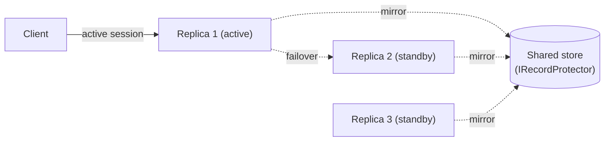
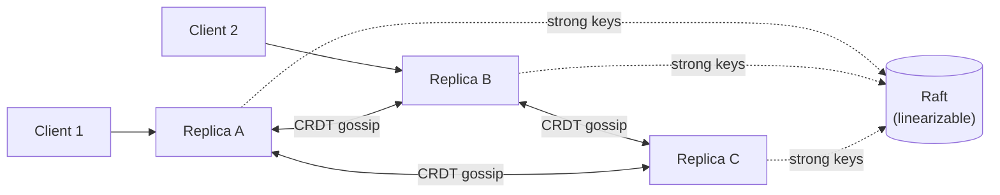
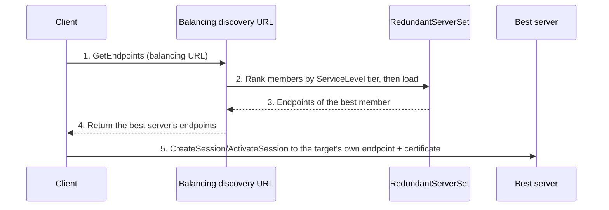
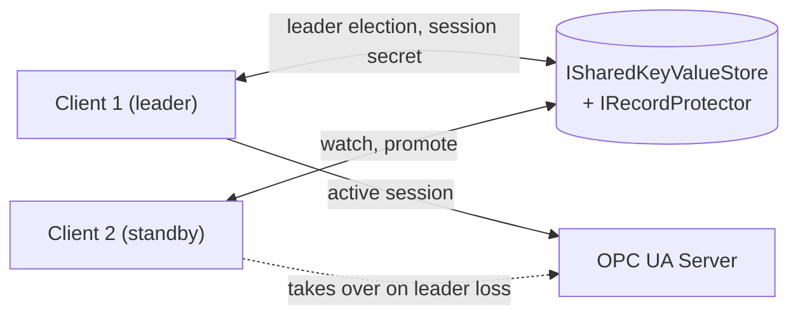

# High Availability and OPC UA Redundancy

This guide maps the OPC UA .NET Standard high-availability APIs to OPC 10000-4 §6.6 Redundancy. It documents the implemented server, client, subscription, session, [Kubernetes](Kubernetes.md), and active/active extension seams; the worked examples are `Applications/RedundantServer` and `Applications/RedundantClient`.

Redundancy and high availability are opt-in and require adding the extra `OPCFoundation.NetStandard.Opc.Ua.Redundancy.*` NuGet packages (for example `OPCFoundation.NetStandard.Opc.Ua.Redundancy.Server` or `.Client`) to your application. A server or client built only with the standard `OPCFoundation.NetStandard.Opc.Ua.Client` and `OPCFoundation.NetStandard.Opc.Ua.Server` libraries does not support OPC UA redundancy.

## 6.6.1 Redundancy overview

OPC UA defines three independent but composable redundancy dimensions: **server redundancy** gives clients multiple servers that expose the same data, **client redundancy** lets backup clients take over work from an active client, and **network redundancy** gives a client and server more than one communication path. The stack implements standardized discovery and failover metadata in the core server/client packages, and adds opt-in distributed state through `OPCFoundation.NetStandard.Opc.Ua.Redundancy.Server`.

Server redundancy is either **transparent** or **non-transparent**. In transparent redundancy, the redundant set looks like one server and failover is hidden from the client. In non-transparent redundancy, each server has its own identity and endpoint, and the client reads `Server.ServerRedundancy` plus `Server.ServiceLevel` to decide what to do.

## 6.6.2 Server redundancy

`Opc.Ua.RedundancySupport` is the stack enum published by `Server.ServerRedundancy.RedundancySupport` and consumed by the client. The modes are:

| Mode | OPC UA meaning | Stack behavior |
| --- | --- | --- |
| `None` | No server redundancy is advertised. | Single-server default. |
| `Cold` | Only one server is active at a time; backups may be unavailable or not running. | Client connects to one server and creates a fresh session/subscriptions on failover. |
| `Warm` | Backup servers are running but have less functionality or no process data. | Client can connect to peers, keep subscriptions created but sampling/publishing inactive on backups, and promote the highest-`ServiceLevel` server. |
| `Hot` | Multiple servers are running and can independently provide data. | Client connects to peers and either hands reporting over to one active server or merges reporting streams. |
| `HotAndMirrored` | Hot servers mirror communication state. | `ManagedSession` keeps one active session, may keep lightweight ServiceLevel status-check sessions to backups, and fails over by opening a channel and re-activating the mirrored session with the existing `AuthenticationToken`; subscriptions are not recreated client-side. |
| `Transparent` | One virtual server identity hides physical failover. | Server publishes `CurrentServerId`; deployment infrastructure supplies the virtual address and shared certificate/endpoint identity. |

### Server.ServerRedundancy model

Register `AddServerRedundancy(...)` on the server builder to populate the live `Server.ServerRedundancy` nodes after the server starts. `ServerRedundancyOptions.Mode` writes `RedundancySupport`. `PeerServerUris` and `RedundantPeers` populate `RedundantServerArray`; for non-transparent modes the startup task also populates `ServerUriArray`, and for transparent mode it publishes `CurrentServerId`.

For non-transparent redundancy, set `RedundantPeers` when clients should resolve peers through `FindServers`; `ConfiguredRedundantServerSetProvider` exposes those `ApplicationDescription` entries server-side. `AdvertiseNtrsCapability` defaults to `true`, so non-transparent modes add the `NTRS` discovery capability for GDS/NTRS registration.

All servers in a `RedundantServerSet` must have identical application AddressSpaces: identical NodeIds, browse paths, AddressSpace structure, and `ServiceLevel` algorithm. Only local server diagnostics may differ. `UseDistributedAddressSpace(...)` helps satisfy this by mirroring node topology and values through `INodeStateStore`/`ISharedKeyValueStore`, but application-specific method handlers and callbacks still need to be attached by each node manager.

### Add* and Use* API convention

High-availability builder methods follow the stack's standard `Add*`/`Use*` convention. `Add*` methods wire OPC 10000-4 §6.6 nodes and methods that are part of the standardized server model, such as `AddServerRedundancy(...)` for `Server.ServerRedundancy`, `AddServerServiceLevel(...)` for `Server.ServiceLevel`, and `AddRequestServerStateChange(...)` for `Server.RequestServerStateChange`. `Use*` methods register beyond-spec extension building blocks that make a redundant deployment work, such as `UseDistributedAddressSpace(...)`, `UseDistributedSessions(...)`, `UseDistributedSubscriptionMirroring(...)`, `UseReplicatedAddressSpace(...)`, `UseReplicatedSessions(...)`, and the Kubernetes helpers.

`AddServerRedundancy(...)` only publishes the redundancy metadata. It does not calculate or drive `Server.ServiceLevel`; register a ServiceLevel provider with `AddServerServiceLevel(...)`, or register an `IServiceLevelProvider` plus `ServiceLevelStartupTask`, when clients and Kubernetes readiness need live health or leader-state values.

```csharp
services.AddOpcUa()
    .AddServer(server =>
    {
        // normal endpoint, security, and application configuration
    })
    .AddNodeManager<MyNodeManagerFactory>()
    .UseDistributedAddressSpace(options =>
    {
        options.UseLeaderElection = true;
        options.NodeId = Environment.MachineName;
    })
    .AddServerRedundancy(options =>
    {
        options.Mode = RedundancySupport.Warm;
        options.CurrentServerId = Environment.MachineName;
        options.AddRedundantPeer(
            "urn:example:ha-server-2",
            new ArrayOf<string>(["opc.tcp://ha-server-2:4840"]));
        options.PeerServiceLevel = ServiceLevels.DegradedMaximum;
    })
    .AddServerServiceLevel(new LeaderServiceLevelProvider(leaderElection, RedundancySupport.Warm))
    .AddRequestServerStateChange(options =>
    {
        options.ServiceLevelSelector = state => state == ServerState.Running
            ? ServiceLevels.Maximum
            : ServiceLevels.Maintenance;
    });
```

## 6.6.2.4.2 ServiceLevel and 6.6.2.4.3 load balancing

OPC 10000-4 Table 105 defines `ServiceLevel` as a byte split into mandatory sub-ranges. The stack exposes these constants and helpers in `ServiceLevels` and `ServiceLevelSubrange`.

| Range | Name | Client interpretation |
| --- | --- | --- |
| `0` | Maintenance | New clients should not connect; connected clients should disconnect and use `EstimatedReturnTime` before retrying. |
| `1` | NoData | Server is not operational for process data; clients may connect only for status/diagnostics. |
| `2..199` | Degraded | Server is partially operational; clients should prefer any Healthy peer and may choose a higher degraded peer when no Healthy peer exists. |
| `200..255` | Healthy | Server is fully operational; clients connect to the highest value for selection/load balancing and should not fail over while the current server remains Healthy. |

`ConstantServiceLevelProvider` reports a fixed value, defaulting to `255`, preserving single-instance behavior. `LeaderServiceLevelProvider` follows an `ILeaderElection`: the leader reports `255`, Cold standbys report `1`, Warm standbys report `199`, and Hot/HotAndMirrored standbys report `255` unless explicit levels are supplied. Optional health and connected-client delegates cap or decrement Healthy values so Hot servers can load-balance within the 200-255 range. `IServiceLevelController` lets `RequestServerStateChange` override the published value for manual maintenance.

Client-side, `DefaultServerRedundancyHandler.FetchRedundancyInfoAsync` reads `RedundancySupport`, `ServiceLevel`, `EstimatedReturnTime`, `RedundantServerArray`, `ServerUriArray`, and `CurrentServerId` as applicable. `ServerRedundancyInfo.ServiceLevelSubrange` is calculated with `ServiceLevels.GetSubrange`.

```csharp
ManagedSession session = await new ManagedSessionBuilder(configuration, telemetry)
    .UseEndpoint(endpoint)
    .WithServerRedundancy(new DefaultServerRedundancyHandler())
    .ConnectAsync(ct);

var handler = new DefaultServerRedundancyHandler();
ServerRedundancyInfo info = await handler.FetchRedundancyInfoAsync(session, ct);
Console.WriteLine($"Mode={info.Mode}, ServiceLevel={info.ServiceLevel} ({info.ServiceLevelSubrange})");

ServerFailoverDecision decision = handler.ShouldFailover(info, session.ConfiguredEndpoint);
if (decision.IsFailoverWarranted)
{
    ConfiguredEndpoint? target = handler.SelectFailoverTarget(info, session.ConfiguredEndpoint);
    Console.WriteLine($"Fail over to {target?.EndpointUrl}: {decision.Reason}");
}
```

## 6.6.2.4.5 Non-transparent failover modes and client actions

`ManagedSession` implements the Table 107 client patterns over `ManagedSession` instances discovered from `RedundantServerArray`/`ServerUriArray` and resolved with `IRedundantServerEndpointResolver`. The default resolver calls `FindServers` and `GetEndpoints` from the current endpoint's discovery URLs, chooses matching security policy/mode and URL scheme when possible, and caches the result.

| Mode | Table 107 actions | `ManagedSession` realization |
| --- | --- | --- |
| Cold | Initial connection to one active server. At failover open a SecureChannel, create/activate a session, create subscriptions/monitored items, activate sampling, then activate publishing. | Starts with the initial endpoint only. `FailoverAsync` selects a peer, connects it, applies subscriptions only to the current session, and enables reporting/publishing. |
| Warm | Connect to more than one server and create subscriptions/monitored items on backups; sampling and publishing become active at failover. | Connects all peers, stores templates with `AddSubscriptionAsync`, creates subscriptions on each connected server, and keeps only the selected server in Reporting/publishing while backups are Sampling/publishing disabled. |
| Hot (a) | Connect to more than one server, create subscriptions everywhere, activate sampling everywhere, publish from one server; at failover activate publishing on the next server. | Default `HotRedundancyNotificationMode.ReportingHandoff`: all connected peers host subscriptions; current server Reports and publishes, backups Sample only. |
| Hot (b) | Connect to more than one server, create subscriptions everywhere, activate sampling and publishing everywhere; client handles duplicate streams. | `HotRedundancyNotificationMode.ReportingMerge`: all connected peers Report and publish; duplicate suppression/merge is a client responsibility above the event callback. |
| HotAndMirrored | Client normally connects to one server; optional status sessions only; on failover open a SecureChannel and call `ActivateSession` against the mirrored session. | Keeps a single active session and, when `EnableHotAndMirroredStatusChecks` is set, periodically reads ServiceLevel from backup status sessions. `FailoverAsync` reuses the mirrored `AuthenticationToken` and single-use nonce by calling `ActivateSession` on the backup; it does not recreate subscriptions because the server mirrors session and subscription state. |

`ManagedSession.RefreshServiceLevelsAsync` reads service levels from connected sessions and selects the highest value. The default handler will not fail over away from a server that is still in the Healthy sub-range, defers retries for Maintenance using `EstimatedReturnTime` or a longer default backoff, and selects a Running peer with an operational `ServiceLevel`.

```csharp
ManagedSession coldClient = await new ManagedSessionBuilder(configuration, telemetry)
    .UseEndpoint(initialEndpoint)
    .ConnectRedundantAsync(ct: ct);

await coldClient.AddSubscriptionAsync("process", subscriptionTemplate, ct);
await coldClient.FailoverAsync(ct);
```

```csharp
ManagedSession warmClient = await new ManagedSessionBuilder(configuration, telemetry)
    .UseEndpoint(initialEndpoint)
    .ConnectRedundantAsync(ct: ct);

await warmClient.AddSubscriptionAsync("process", subscriptionTemplate, ct);
await warmClient.RefreshServiceLevelsAsync(ct);
```

Hot handoff is the default Hot mode: every connected peer hosts the subscriptions and samples, but only the active server publishes, so the client sees a single stream and the next server starts publishing on failover. Use it for fast failover without client-side de-duplication.

```csharp
ManagedSession hotHandoffClient = await new ManagedSessionBuilder(configuration, telemetry)
    .UseEndpoint(initialEndpoint)
    .ConnectRedundantAsync(
        new ManagedSessionOptions
        {
            HotNotificationMode = HotRedundancyNotificationMode.ReportingHandoff
        },
        ct);
```

Hot merge has every connected peer publish at once, so the client receives duplicate streams with near-zero failover latency and merges or de-duplicates them in the `NotificationReceived` handler (by application key, source timestamp, EventId, or sequence context). Use it when the lowest possible failover gap is worth handling duplicates.

```csharp
ManagedSession hotMergeClient = await new ManagedSessionBuilder(configuration, telemetry)
    .UseEndpoint(initialEndpoint)
    .ConnectRedundantAsync(
        new ManagedSessionOptions
        {
            HotNotificationMode = HotRedundancyNotificationMode.ReportingMerge
        },
        ct);

hotMergeClient.NotificationReceived += (sender, args) =>
{
    // Merge or de-duplicate streams by application key, source timestamp, EventId, or sequence context.
};
```

For a `HotAndMirrored` server, the client keeps one active session and, with `EnableHotAndMirroredStatusChecks`, periodically polls the backups' `ServiceLevel` over lightweight status-check sessions so it can pick the healthiest survivor. Because the server mirrors session and subscription state, failover re-activates the mirrored session on the survivor and does not recreate subscriptions. Use it when the server set runs `HotAndMirrored` (or `Transparent`) mirroring.

```csharp
ManagedSession mirroredClient = await new ManagedSessionBuilder(configuration, telemetry)
    .UseEndpoint(initialEndpoint)
    .ConnectRedundantAsync(
        new ManagedSessionOptions
        {
            EnableHotAndMirroredStatusChecks = true,
            HotAndMirroredStatusCheckInterval = TimeSpan.FromSeconds(5)
        },
        ct);
```

## 6.6.5 Manual failover and Maintenance

OPC 10000-4 §6.6.5 allows a server to be taken out of the set by shutdown or by moving `ServiceLevel` to Maintenance, either through a vendor tool or `Server.RequestServerStateChange`. `AddRequestServerStateChange(...)` wires the standard method and validates administrative access through `IConfigurationNodeManager.HasApplicationSecureAdminAccess` unless `RequestServerStateChangeOptions.AdminAccessValidator` is supplied.

The startup task updates `Server.ServiceLevel`, `Server.ServerStatus.State`, `Server.ServerStatus.SecondsTillShutdown`, `Server.ServerStatus.ShutdownReason`, and `Server.EstimatedReturnTime`. The current implementation publishes the requested maintenance/no-data state so clients back off; it does **not** install a transport-level hook that rejects newly created sessions.

Non-transparent servers registered with `AddServerRedundancy(...)` advertise the `NTRS` capability by default. In Kubernetes deployments, register the non-transparent set or transparent virtual address with GDS/NTRS according to your discovery model.

## HotAndMirrored and Transparent state mirroring

OPC 10000-4 requires HotAndMirrored and Transparent sets to synchronize enough state that a client can continue after failover. The spec names sessions, subscriptions, registered nodes, continuation points, sequence numbers, sent notifications, and synchronized EventIds.

Every replica reads and writes that state through a shared store. One replica serves the client's active session; the others stand by and continuously mirror the session, subscription, retransmission, continuation-point, EventId, and node-state records so any standby can resume the client after a failover. Records are serialized through `IRecordProtector`, so the store is treated as an untrusted conduit.



You enable mirroring by registering the seams below on the server builder; each one mirrors one category of state and is independently opt-in:

- `UseDistributedSessions(...)` installs `DistributedSessionManager` and `ISharedSessionStore`. Session records include the session id, authentication token, nonces, client certificate chain, security policy/mode, endpoint URL, session timeout, client description, and user identity material. `EnableFastReconnect` defaults to `false`; when enabled, a failover reconnect still performs full `ActivateSession` signature validation against the mirrored server nonce. (`UseDistributedSessionMirroring(...)` is the mirroring-only variant: it mirrors the session record — keyed by a digest of the authentication token and protected by the configured `IRecordProtector` — without replacing the session manager.)
- `ISingleUseNonceRegistry` and `SharedSingleUseNonceRegistry` enforce the security boundary: the mirrored `serverNonce` is consumed exactly once across the replica set, and the authentication token is only a lookup key.
- `UseDistributedSubscriptionMirroring(...)` registers `SharedKeyValueSubscriptionStore` as `ISubscriptionStore`. It mirrors subscription definitions and monitored-item definitions: publishing interval, lifetime, keepalive, priority, node id, attribute id, monitoring mode, sampling interval, queue size, filters, discard policy, and related metadata.
- The same store also implements `ISubscriptionRetransmissionStore`. Retransmission state is mirrored asynchronously through a non-blocking background drain: `NextSequenceNumber`, sent `NotificationMessage` entries, acknowledgements, and deletes are coalesced and persisted so `Republish` can continue after failover without blocking the publishing path.
- `IContinuationPointStore` mirrors best-effort `ContinuationPointEnvelope` records for Browse and HistoryRead continuation points. The envelope contains the owner session, continuation point id, kind, and re-issuable request metadata.
- `IEventIdProvider` is an optional event-publishing seam. `DeterministicEventIdProvider` derives EventIds from a shared replica-set seed and stable event fields so Transparent/HotAndMirrored replicas can publish the same logical EventId and clients do not double-process events; the default remains the existing random GUID EventId behavior.
- `RegisterNodes` returns the input NodeIds in this stack, so registered-node handles are already replica-consistent when the AddressSpace NodeIds are identical.
- `UseDistributedAddressSpace(...)` mirrors node topology and values through `INodeStateStore`, helping each server present the same NodeIds and browse paths. Hydration on startup and failover promotion uses a snapshot + delta-log fast path when the store implements `INodeStateSnapshotStore` (the default `InMemoryNodeStateStore` does): the writer periodically publishes a chunked, atomically-swapped snapshot of the graph and trims a bounded delta log, so a standby reads a handful of large chunks and replays only the changes after the snapshot instead of transferring one key/value entry per node. Each record carries a single-writer monotonic sequence, and the standby applies the snapshot, delta log, and live feed through a per-key sequence guard so the paths are idempotent and cannot apply a stale change over a newer one. When no snapshot has been published (or the store lacks the capability) the standby falls back to two streamed passes — `EnumerateAsync` for topology and `EnumerateValuesAsync` for values.

Notes:

- Hydration fully materializes the mirrored node graph (topology plus values): the snapshot + delta log reduces the store round trips and per-node work, but the whole graph is resident. True on-demand fault-in (materializing a node only when it is first browsed/read) would further cut time-to-ready and memory for very large, sparsely-accessed graphs; it requires an asynchronous node-resolution seam through the core node-manager read/browse path and is tracked as future work in OPCFoundation/UA-.NETStandard#3938. The eventual-consistency conflict-free replicated data type (CRDT) path already exchanges a compact state snapshot plus deltas.
- `SharedKeyValueSubscriptionStore` restores subscription definitions and retransmission state, but the per-monitored-item data/event queues are not restored (`RestoreDataChangeMonitoredItemQueue`/`RestoreEventMonitoredItemQueue` run on the synchronous monitored-item creation path). The impact is that after failover a monitored item resumes sampling and delivers fresh values, but values that were queued on the failed replica and not yet published are lost; subscription definitions and `Republish` of already-sent notifications are preserved. Restoring the queues is tracked in OPCFoundation/UA-.NETStandard#3939.
- Continuation-point mirroring is best-effort. Built-in node-manager `ContinuationPoint.Data` is opaque and is not reconstructed on a backup; after failover a client may receive `BadContinuationPointInvalid` and re-issue Browse or HistoryRead, which OPC 10000-4 §6.6.2.2 permits. Node managers that can serialize their own continuation-point data may opt in through `IContinuationPointStore`.
- Deterministic EventIds (`DeterministicEventIdProvider`) are opt-in rather than on by default: they change the EventId values a server emits — a single-server deployment keeps the standard random GUID EventIds — and they require a shared replica-set seed. Enable them for a HotAndMirrored/Transparent set so every replica emits the same logical EventId and clients do not double-process events. They are only as stable as the event fields used, so Alarms & Conditions clients should still call `ConditionRefresh` after failover as required by OPC UA.

## 6.6.3 Client redundancy

OPC UA client redundancy is implemented with `TransferSubscriptions` plus server diagnostics. `ClientFailoverCoordinator` helps a backup client find the active client's session by `ActiveSessionId` or `ActiveSessionName`, discover subscription ids from diagnostics, verify the backup uses the same user display name when configured, and call `TransferSubscriptionsAsync` with `SendInitialValues` defaulting to `true`.

```csharp
var coordinator = new ClientFailoverCoordinator();
ArrayOf<TransferResult> results = await coordinator.TransferActiveSubscriptionsAsync(
    backupSession,
    new ClientRedundancyTransferOptions
    {
        ActiveSessionName = "LineA-PrimaryClient",
        ActiveUserDisplayName = backupSession.Identity.DisplayName,
        SendInitialValues = true
    },
    ct);
```

OPC UA does not standardize how active and backup clients exchange `SessionId` or subscription ids. In this stack the client replica set coordinates through the registered client-side shared store (`AddRedundantClientSharedStore` / `AddRaftClientSharedStore` — a CRDT- or [Raft](https://raft.github.io/)-backed `ISharedKeyValueStore` that the `ClientReplicaCoordinator` consumes).

## 6.6.4 Network redundancy

Transparent network redundancy is handled below OPC UA by routers, virtual adapters, load balancers, or Kubernetes Services. Non-transparent network redundancy uses multiple endpoints for the same logical server; the client selects another endpoint and recreates only the SecureChannel while reusing the session and subscriptions.

`NetworkRedundancyOptions.AlternateEndpoints` and `NetworkRedundancyEndpointSelector` model non-transparent endpoint alternates. `ManagedSession` accepts these options and cycles to the next endpoint for the same logical server when reconnecting.

```csharp
ManagedSession session = await new ManagedSessionBuilder(configuration, telemetry)
    .UseEndpoint(primaryEndpoint)
    .WithNetworkRedundancy(new ArrayOf<ConfiguredEndpoint>([secondaryEndpoint, tertiaryEndpoint]))
    .ConnectAsync(ct);
```

## Beyond §6.6: distributed extensions

The base package uses `ISharedKeyValueStore` as the common seam for address-space, session, subscription, retransmission, nonce, and lease records. The in-memory implementation is for tests and single-process samples; multi-pod production deployments need a networked, authenticated, encrypted, and capacity-bounded backend. `IRecordProtector` protects serialized records before they reach the store.



Three active/active replicas converge bulk state (address space, sessions) leaderlessly over CRDT gossip, while the exactly-once keyspaces ride the linearizable Raft store. Clients connect to any replica (each is a writer) and fail over between them.

`OPCFoundation.NetStandard.Opc.Ua.Redundancy.Server` goes further than OPC 10000-4 §6.6. It provides active/active multi-writer address-space replication with CRDTs and gossip (`UseReplicatedAddressSpace`) and CRDT-backed session metadata (`UseReplicatedSessions`). CRDT state is eventually consistent and cannot provide compare-and-swap; the single-use nonce registry and other areas that require exactly-once behavior must and are by default mapped to a strongly consistent store (see *Consistency modes*).

```csharp
services.AddOpcUa()
    .AddServer(server => { })
    .AddNodeManager<MyNodeManagerFactory>()
    .UseReplicatedAddressSpace(options =>
    {
        options.ReplicaId = Crdt.ReplicaId.New();
        options.UseTcpGossip(IPAddress.Any, port: 4840, tls: mutualTlsOptions);
        options.AddPeer(peerEndpoint);
    })
    .UseReplicatedSessions();
```

Networked CRDT gossip fails closed unless peers are authenticated. Configure TCP gossip with mutual TLS (`GossipTlsOptions` with a server certificate, required client certificates, a client certificate, and remote certificate validation). UDP gossip has no built-in peer authentication and should only be enabled with `AllowUnauthenticatedGossip` inside an isolated development/test network. Address-space values are not secrets, but LWW CRDT frames require integrity/authenticity because a forged high-clock update wins convergence.

> For Kubernetes, add a NetworkPolicy for the gossip port in addition to any Kubernetes API or shared-store policies. Allow ingress and egress only between the replica pods that participate in the CRDT fabric, and keep the gossip port closed to clients, other namespaces, and infrastructure that is not part of the replica set.

### Consistency modes: strong (Raft) and eventual (CRDT complemented by Raft)

CRDT gossip is eventually consistent — it stays available under network partitions but is not linearizable: it converges without a leader but cannot offer a linearizable compare-and-swap or a change-feed, so exactly-once primitives — the single-use session nonce, lease/leader election — need a strongly consistent (linearizable, quorum-based) backend. `OPCFoundation.NetStandard.Opc.Ua.Redundancy` provides that backend as a Raft layer — Raft is the same consensus algorithm used by systems like etcd and Kafka to replicate state — and `UseRedundancyConsistency` lets you pick the model for the whole `RedundantServerSet`:

- **Eventual (default).** Bulk replicated state (address space, sessions, subscriptions) stays on the leaderless CRDT store; a `HybridSharedKeyValueStore` routes only the strong keyspaces (`nonce/`, `lease/`, `election/` by default, configurable) to a linearizable `RaftSharedKeyValueStore`. Behaviour and performance for the common case are unchanged, and the single-use nonce registry and lease election become linearizable with no extra backend.
- **Strong.** All shared state is served by the linearizable `RaftSharedKeyValueStore`; no CRDT is used. Choose this when every replicated value must be linearizable, accepting that writes require a quorum.

```csharp
services.AddOpcUa()
    .AddServer(server => { })
    // Pick the model BEFORE the distributed features so they compose over it.
    .UseRedundancyConsistency(options =>
    {
        options.Mode = RedundancyConsistencyMode.Eventual; // or Strong
        // options.BulkStoreFactory = sp => /* CRDT bulk store */;    // eventual mode
        // options.RaftConsensusFactory = sp => /* RaftCs replica */; // multi-pod
    })
    .UseDistributedAddressSpace()
    .UseDistributedSessions(o => o.EnableFastReconnect = true);
```

`UseRedundancyConsistency` registers a shared `IRaftConsensus` plus a native `RaftLeaderElection` (`ILeaderElection`). Raft leadership is decided by the consensus protocol itself — a single leader per term, no split-brain — which is stronger than the lease-CAS `SharedStoreLeaseElection`. Because the distributed features register their store and election with `TryAddSingleton`, call `UseRedundancyConsistency` first and they compose over the chosen store and election.

The consensus engine is pluggable through the `IRaftConsensus` seam. By default the DI registration uses a single-node in-package Raft replica (`DefaultRaftConsensus.CreateSingleNode()`, a real RaftNode with in-memory storage/transport that elects itself leader); `InProcessRaftConsensus` is a lighter deterministic in-process alternative for tests and in-process replica sets. For a multi-pod cluster, build a multi-node replica with `DefaultRaftConsensus.CreateCluster(nodeId, memberIds, transport, …)` — a `RaftCs.Transport.NanoMsg` transport (peers addressed by DNS) plus an in-memory or durable `RaftCs.Storage.File` write-ahead log (WAL) — and register it through `RaftConsensusFactory`. On Kubernetes, `UseKubernetesRaftConsensus` (in `Opc.Ua.Redundancy.Kubernetes`) does this for you from the StatefulSet ordinal and headless-Service DNS. RaftCs ships its own `IRaftTransport` (NanoMsg), so Raft shares the NanoMsg substrate with the CRDT gossip layer. The `Applications/RedundantServer` sample (`docker-compose.yml` with the `active-passive.env` env file) is a runnable multi-node example.

On the client side, `AddRaftClientSharedStore` registers a Raft-backed `ISharedKeyValueStore` and a native `RaftLeaderElection` for a client replica set in one call (the `ClientReplicaCoordinator` consumes both), `AddCrdtClientSharedStore` registers the CRDT-gossip (eventual) equivalent, and `AddRedundantClientSharedStore(mode, …)` is the mode-aware entry point that selects between them.

For Kubernetes, run the Raft members as a `StatefulSet` with stable network identities (so each Raft peer keeps its node id and address across restarts) and an odd member count (3 or 5) for a fault-tolerant quorum; a durable `RaftCs.Storage.File` WAL on a `PersistentVolume` lets a restarted pod rejoin without a full snapshot. See the [Kubernetes High Availability Deployment](Kubernetes.md) guide.

### GetEndpoints load direction (beyond §6.6, opt-in)

`UseServerLoadDirection(...)` lets a `GetEndpoints` request on a **dedicated balancing discovery URL** be answered with the endpoints of the best member of the `RedundantServerSet`, so a Client that connects there is **directed** to the active server (active/passive) or spread across equally-healthy servers by load (active/active). This is a non-standard, server-side load-direction *hint*: it **complements**, and never replaces, the standard client-driven `RedundantServerArray` + `ServiceLevel` selection of OPC 10000-4 §6.6.2.4, which remains the authoritative Failover mechanism.



How it works. Each member publishes three integrity-protected records to the shared store: its health `ServiceLevel` (`svc/<uri>`), a separate **load weight** (`load/<uri>`, 0 idle … 255 fully loaded, from an injected `ILoadWeightProvider`), and its own `EndpointDescription`s (`endpoint/<uri>`, observed from normal discovery). A request that arrives on the balancing URL is resolved by the direction policy: rank members by health-`ServiceLevel` tier (Healthy › Degraded › NoData › Maintenance); if a peer is in a strictly higher tier it wins (active/passive → the active server), otherwise the least-loaded member of the top tier is chosen using the load weight, with random tie-breaking among equally-loaded members (active/active → load spreading). The local server serves its own endpoints when it is the best choice, when the peer view is stale, or when the target's endpoints are unavailable (fail-safe). `ServiceLevel` keeps its OPC UA meaning (health and Failover); load is a *separate* signal, so load never triggers a spurious Failover and a stale load weight only affects tie-breaking.

```csharp
services.AddOpcUa()
    .AddServer(server => { })
    .AddNodeManager<MyNodeManagerFactory>()
    .UseRedundancyConsistency(RedundancyConsistencyMode.Eventual)   // or Strong
    .AddServerRedundancy(r => r.Mode = RedundancySupport.Hot)
    .AddServerServiceLevel(new LeaderServiceLevelProvider(/* … */)) // real health signal
    .UseServerLoadDirection(options =>
    {
        options.BalancingEndpointUrl = "opc.tcp://ha.example.com:4840"; // the virtual/LB discovery URL
        // options.StalenessWindow = TimeSpan.FromSeconds(15);
        // options.LoadBandSize = 16;             // quantize load to damp oscillation
        // options.HealthSubBandSize = 0;         // 0 = all Healthy is one eligibility tier
    });
// Register an ILoadWeightProvider for load-aware balancing (default is a constant 0 = random spread).
```

Consistency. The direction inputs follow `UseRedundancyConsistency`: in **Eventual** (default) the `svc/`, `load/`, and `endpoint/` records ride the leaderless CRDT store; in **Strong** they are linearizable via Raft. The high-churn `load/` weight is always coalesced (`LoadPublishInterval`) so it never issues a write per load tick — a per-write quorum on a rapidly changing value is the overhead to avoid, and a slightly stale load tie-break still picks a healthy peer.

Conformance and client behavior. `GetEndpoints` (§5.4.2) is defined to describe *the server that received the request*, so directing to a peer is a deliberate extension; it is kept **gated** — plain discovery on any other URL returns the local server unchanged, so generic clients and tooling that inspect a specific server are unaffected. A returned `EndpointDescription` carries the target's own `ApplicationUri` and certificate, so the CreateSession server-endpoint tamper check (§5.6.2) still holds once the Client connects to the target. The stack's own Client needs no change to follow the redirect (it uses the returned endpoints to connect); point it at the balancing URL and pair it with `WithServerRedundancy()` so the standard client-driven `ServiceLevel` selection remains the authoritative complement — it already fails a Client that lands on a non-Healthy server over to the active one and, on a connect failure, retries the normal discovery URL / `FindServers`/`RedundantServerArray` path. This is **connect-time placement, not continuous balancing** — ongoing Failover still relies on the Client monitoring `ServiceLevel` per §6.6.

Security. The store is treated as an untrusted conduit: every direction and endpoint record is written through the configured `IRecordProtector` and verified before use, so a forged or tampered record is dropped fail-closed. Configure an authenticated-encryption protector (`AesCbcHmacRecordProtector`) for any networked backend; the default `NullRecordProtector` is for single-process/in-memory use only. Because the redirect returns a peer's certificate, Clients must trust every member's certificate (non-transparent redundancy uses per-server certificates). The balancing endpoint is typically unauthenticated discovery, so a rogue replica could bias or deny direction, but it cannot force a Client onto an untrusted server (the Client validates the returned certificate); this is the same rogue-replica trust boundary as the rest of the shared store. Keep the balancing decision damped (load banding + random tie-break + the load coalescing interval) to avoid herding every Client onto a momentary best.

### Client-side high availability (replica sets)

OPC 10000-4 §6.6 covers redundant *servers* and the client behavior for connecting to them. A complementary, beyond-spec capability is a redundant *client* replica set: two or more client processes that cooperate so that exactly one — the leader — holds the active session and subscriptions while the others stand by (hot, warm, or cold) and take over on leader loss. This is provided by `OPCFoundation.NetStandard.Opc.Ua.Client.Redundancy`.



The two client replicas elect a leader and share the leader's session secret through the protected store; on leader loss the standby is promoted and reuses the token to re-activate (or recreates the session and transfers subscriptions).

The simplest way to consume this is `AddRedundantClientSession(...)` in `OPCFoundation.NetStandard.Opc.Ua.Redundancy.Client`: register a client shared store and election, then a redundant session, and resolve a single, stable `ISession`. Failover, leader election, and the underlying session churn are hidden — the application reasons only about `ISession`, and service calls block until this replica is the leader with a live session (synchronous members throw `BadInvalidState` until then).

```csharp
services
    .AddRaftClientSharedStore()                     // ISharedKeyValueStore + ILeaderElection
    .AddRedundantClientSession(options =>
    {
        options.NodeId = replicaId;
        options.Mode = ClientStandbyMode.Hot;
        options.CreateSessionAsync = ct => new ManagedSessionBuilder(configuration, telemetry)
            .UseEndpoint(endpoint)
            .WithServerRedundancy()
            .WithTokenReuseFailover()
            .ConnectAsync(ct);
    });

// A hosted service starts the coordinator; resolve the transparent handle anywhere and use it:
ISession session = provider.GetRequiredService<ISession>();
BrowseResponse response = await session.BrowseAsync(/* … */, ct);   // blocks until this replica leads
```

Under the hood it reuses the same seams as the server, now shared from `Opc.Ua.Core` under the `Opc.Ua.Redundancy` namespace:

- **Leader election** among the client replicas (`ILeaderElection`, e.g. `SharedStoreLeaseElection`), so exactly one replica is the active client at a time.
- **Shared session secret.** The leader persists its session secrets (`AuthenticationToken`, nonces) through `ISharedKeyValueStore`, encrypted and integrity-protected at rest by `IRecordProtector`. The coordinator is fail-closed: a non-in-memory store with no real protector is rejected. A follower promoted to leader reuses the token to `ActivateSession` against a `HotAndMirrored` server, or recreates the session and transfers subscriptions otherwise.
- **Standby modes** (`ClientStandbyMode`): Cold (elect only; connect+activate on promotion), Warm (keep a connected session, create subscriptions on promotion), Hot (keep a connected session with subscriptions sampling-only, enable publishing on promotion).

For non-DI callers, `RedundantClientSessionBuilder` builds the same `RedundantClientSession` (an `ISession`) directly. The lower-level `ClientReplicaSetBuilder` / `ClientReplicaCoordinator` seam is still available when you want to hold and drive the leader `ManagedSession` yourself:

```csharp
var coordinator = new ClientReplicaSetBuilder(telemetry)
    .WithNodeId(replicaId)
    .WithStandbyMode(ClientStandbyMode.Hot)
    .UseRedundancy(election, sharedStore, recordProtector)
    .UseSession(ct => new ManagedSessionBuilder(configuration, telemetry)
        .UseEndpoint(endpoint)
        .WithServerRedundancy()
        .WithTokenReuseFailover()
        .ConnectAsync(ct))
    .ConfigureLeader((session, fastActivated, ct) => ApplySubscriptionsAsync(session, ct))
    .Build();
await coordinator.StartAsync(ct);
```

The full token-reuse fast-activate from shared secrets and subscription recreate/transfer are exercised by the client replica-set sample and integration tests.

## Kubernetes deployment

Use the consolidated [Kubernetes High Availability Deployment](Kubernetes.md) guide for the `Opc.Ua.Redundancy.Kubernetes` package. It covers Kubernetes Lease election, EndpointSlice peer discovery, ServiceLevel-driven readiness, StatefulSet/Deployment and Service manifests, RBAC, probes, time synchronization, secrets, and GDS/NTRS registration.

## Samples

`Applications/RedundantServer` demonstrates the server-side distributed and redundancy registrations, with `docker-compose` files for active/active and active/passive replica sets. `Applications/RedundantClient` shows the recommended managed-client pattern: a single `ManagedSession` with `WithServerRedundancy()` that connects to any server, reads its redundancy metadata, and fails over transparently — the same code works whether or not the server is configured for redundancy.

## Security considerations

Distributed high-availability deployments protect the shared store as part of the OPC UA trust boundary. Use an authenticated and encrypted channel to the store, protect serialized records with `IRecordProtector`, provision record-protection keys through a key ring or secret manager, apply TTLs and quotas to session/nonce/subscription keys, and fail closed if a required strongly consistent store is unavailable.

Transparent redundancy uses one logical application identity. Every replica that serves the transparent virtual endpoint must use the same endpoint URL, ApplicationUri, application instance certificate, and private key so clients can validate one server identity and complete `ActivateSession` against any replica. The compromise blast radius of that shared private key is the entire transparent set: an attacker can impersonate the virtual server, terminate or redirect client trust, and participate in failover until the certificate is revoked and trust lists are updated. Prefer non-transparent redundancy with per-replica certificates when that shared-key risk is unacceptable.

The `Applications/RedundantServer` sample includes a worked transparent deployment (`Transparent/docker-compose.yml`): two `REDUNDANCY_MODE=transparent` replicas that share one `ApplicationUri` and one certificate and mirror session + address-space state by CRDT gossip, behind an `nginx` TCP load balancer that publishes a single virtual endpoint. Each replica advertises the load-balancer host, so discovery and `CreateSession` echo the one endpoint the client uses, and a mirrored session resumes on the survivor when a replica fails. The sample seeds the shared certificate into a volume for convenience; a secured deployment provisions it from a secret to every replica (see `Docs/Kubernetes.md`).

Rotate the transparent shared application certificate/key as a coordinated replica-set operation. Issue the replacement certificate with the same virtual identity and endpoint subject alternative names, distribute the new private key through the certificate store or a secret manager without baking it into images, stage client and GDS trust-list updates so both old and new certificates are trusted during the overlap, restart or hot-reload replicas in a controlled window, verify every replica presents the new certificate at the virtual endpoint, then revoke/remove the old certificate and securely delete the old private key from all nodes and secret versions. Treat an emergency rotation after suspected compromise as a fail-closed event: drain or stop replicas that still hold the old key before restoring client access.

On the client side, a client replica set shares the same trust boundary. The leader persists its session secret (`AuthenticationToken`, nonces) through `ISharedKeyValueStore`, so it must be encrypted and integrity-protected at rest by `IRecordProtector`; the `ClientReplicaCoordinator` is fail-closed and rejects a non-in-memory store that has no real protector. Because non-transparent redundancy and GetEndpoints load direction return per-server certificates, a failing-over or directed client must trust every member's certificate, and a promoted standby re-validates the server endpoint and certificate on reconnect. Treat the client shared store, like the server's, as an untrusted conduit: authenticate and encrypt the channel to it and scope its keys with TTLs and quotas.
