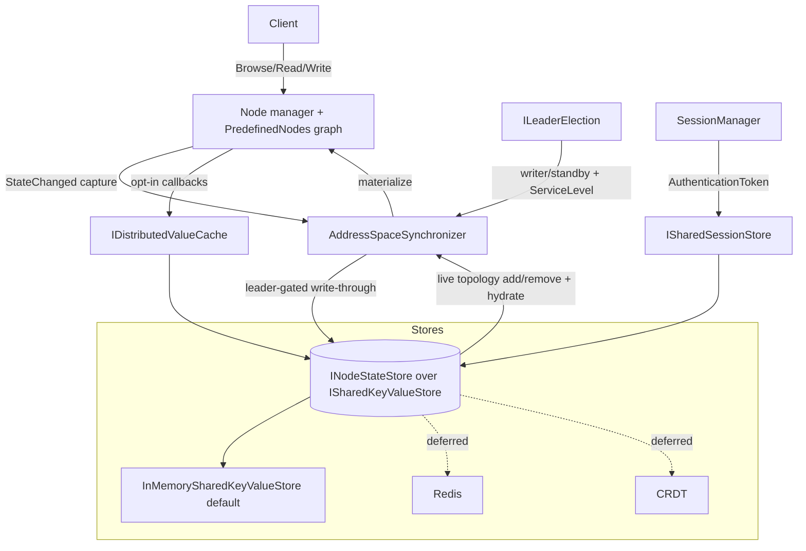

# High Availability and Distributed Address Space

This document describes the building blocks that let an OPC UA server share its address-space state (node topology and variable values) and session state across replicas, so servers can run in a redundant set (for example a Kubernetes replicaset) and expose that redundancy to clients through the documented OPC UA mechanisms.

The feature is **opt-in and additive**. A single-instance server that does not configure any of the components below behaves exactly as before: node state lives in process-local `NodeState` fields and the in-process `PredefinedNodes` dictionary, with no extra indirection or allocation on read/write paths.

## Goals

The design follows the high-availability goals of the stack: running servers in a distributed system with shared state, while keeping the simple single-instance path as efficient as it is today and exposing advanced HA features progressively through dependency injection and a fluent API.

- The authoritative node state (topology **and** values) is pluggable behind a provider, registrable through DI with a direct-construction fallback.
- The single-instance, in-memory path stays zero/near-zero overhead — the local `NodeState` graph remains the in-process serving cache for Browse/Read/Translate.
- Addition and removal of nodes and references propagate to other replicas.
- Both **active/passive** and **active/active** are supported out of the box through a leader-election model (shared read, master write — or better).
- A variable's read/write callbacks can participate in the distributed store: cache the last value they read and serve the last value with a freshness bound.
- Monitored items are unchanged — they read through the normal pipeline and therefore participate in shared state only when the read path participates.
- Session state can be shared across active/passive for fast reconnect using just the session `AuthenticationToken`.

## Architecture

The key decision is *not* to route every attribute access through an asynchronous provider call. Instead the local `NodeState` graph keeps serving reads and browses in-process (fast and local), and a synchronizer bridges that graph to a shared, authoritative store.



- **Local → store (write-through).** The synchronizer captures committed local mutations through the existing `NodeState.StateChanged` event — the same change-capture seam the historian uses — and writes them to the store. Writes are leader-gated: only the writer (leader) writes.
- **Store → local (live apply + hydration).** Node and reference add/remove propagate live to every replica via the store change-feed, so all replicas keep a consistent topology. Full materialization also runs on startup and on failover promotion. Value changes are not force-fed to subscribers; monitored items read as today.

All of these types live in the `Opc.Ua.Server.Distributed` namespace in the `Opc.Ua.Server` library.

## Components

### Shared key/value store — `ISharedKeyValueStore`

The lowest-level abstraction: a minimal key/value backend with `TryGetAsync`, `SetAsync`, `CompareAndSwapAsync` (the atomic "master write" primitive), `DeleteAsync`, `ScanAsync` (prefix scan for hydration) and `WatchAsync` (a prefix change-feed). The default `InMemorySharedKeyValueStore` is thread-safe and can be shared by multiple node managers or multiple in-process server instances. Redis or another external store is a thin adapter over the same contract.

### Node state store — `INodeStateStore`

The authoritative store of a node manager's address-space state, layered on `ISharedKeyValueStore`. It persists serialized nodes (topology) under one key prefix and encoded `DataValue`s (values) under another, and exposes a combined `SubscribeChangesAsync` change-feed. `INodeStateStoreRegistry` resolves a store per node with the same three-scope precedence as the historian registry (exact NodeId, then namespace, then a default). `ServerInternalData` exposes the registry through the optional `INodeStateStoreRegistryProvider` interface, so node managers can discover it without any change to `IServerInternal`.

Nodes are serialized with `NodeStateSerializer`, which frames the node class ahead of the standard `NodeState.SaveAsBinary` payload so a replica can reconstruct a generic node of the correct class (`BaseObjectState`, `BaseDataVariableState`, …). Type-specific behavior (method handlers, custom callbacks) is not carried in the payload — it is re-attached by the owning node manager on the active replica. This is sufficient for browse/read/value replication and active/passive failover.

### Synchronizer — `IAddressSpaceSynchronizer`

Bridges a local node graph (`ILocalAddressSpace`) to its `INodeStateStore`. It runs in one of two roles, selected by the leader-election predicate:

- **Writer (leader):** captures committed local changes and writes them through to the store.
- **Reader (standby):** applies topology and value changes from the store change-feed to its local graph and never writes.

`SeedOrHydrateAsync` seeds the store from the local graph when the store is empty and this replica is the writer, otherwise hydrates the local graph from the store. `Start` begins background replication. A node manager adapts its `PredefinedNodes` to `ILocalAddressSpace`; the bundled `DictionaryAddressSpace` is a ready-to-use flat implementation.

> Single-writer is the active/passive default. Active/active with conflict-free multi-writer merge is layered on top later (CRDT, deferred). On the simple key/value store, active/active uses compare-and-swap / last-writer-wins with a master writer elected per partition.

### Leader election — `ILeaderElection`

Determines whether this replica is the writer. `StaticLeaderElection` is a fixed role (single instance, or an externally-assigned leader). `SharedStoreLeaseElection` is dynamic: a single lease key holds the current leader's id and an expiry, acquired and renewed atomically with `CompareAndSwapAsync`. A leader that stops renewing loses the lease once it expires, allowing a standby to take over; a leader that shuts down gracefully releases the lease immediately. The lease clock is an injectable `TimeProvider`.

### Read/write callback participation — `IDistributedValueCache`

Lets a variable's read/write callbacks cache the last value they observe and serve the last value with a freshness bound from the shared store. `DistributedValueParticipation.ReadThroughAsync` returns the cached value while it is fresh (within `maxAge`), otherwise reads the live value and caches it; the `EnableDistributedValueParticipation` extension wires a variable's asynchronous read/write callbacks to do this automatically. Monitored items continue to read through the normal pipeline and therefore observe the cached value only when the read path participates — exactly the "can or cannot participate" behavior intended.

### Service level — `IServiceLevelProvider`

Computes the value of the server's `ServiceLevel` variable (0–255). In a redundant set, clients connect to the server reporting the highest service level, so a healthy active leader reports the maximum and standbys report a lower value. `ConstantServiceLevelProvider` reports a fixed 255 (the historical single-instance behavior, and the default). `LeaderServiceLevelProvider` follows an `ILeaderElection`: leader reports the high level, standby reports the low level, and `ServiceLevelChanged` fires on every transition.

### Session sharing — `ISharedSessionStore`

Shares session context across replicas keyed by the session `AuthenticationToken`, enabling fast active/passive reconnect: after a failover a client re-activates against the promoted replica using only its token, without a full re-handshake. This is analogous to `ISubscriptionStore` for subscriptions. The default `SharedKeyValueSessionStore` persists entries in the same shared key/value backend. The `SecretMaterial` field is an opaque, caller-encrypted blob — the store never sees plaintext secrets. Certificate stores are assumed to be shared independently.

## Usage

The default in-memory store wires both replicas in one process (useful for tests and single-process active/active); a Redis-backed store (deferred) shares state across pods.

```csharp
// Shared backend (one per process; Redis-backed in a real replicaset).
var kv = new InMemorySharedKeyValueStore();
var store = new InMemoryNodeStateStore(kv, messageContext);

// Leader election (dynamic lease) — drives writer role and service level.
var election = new SharedStoreLeaseElection(
    kv, leaseKey: "addressspace/leader", nodeId: Environment.MachineName,
    leaseDuration: TimeSpan.FromSeconds(30), renewInterval: TimeSpan.FromSeconds(10));
election.Start();

// Bridge the node graph to the shared store.
var synchronizer = new AddressSpaceSynchronizer(
    store, addressSpace, isWriter: () => election.IsLeader);
await synchronizer.SeedOrHydrateAsync();
synchronizer.Start();

// Advertise redundancy via ServiceLevel.
var serviceLevel = new LeaderServiceLevelProvider(election);

// Opt a variable into the distributed value cache.
var cache = new DistributedValueCache(store);
temperature.EnableDistributedValueParticipation(
    cache, maxAge: TimeSpan.FromSeconds(1),
    liveRead: ct => ReadSensorAsync(ct));

// Share session state for fast reconnect.
var sessions = new SharedKeyValueSessionStore(kv, messageContext);
```

## Exposing redundancy to clients

Server redundancy is advertised through the standard OPC UA nodes under `Server.ServerRedundancy` and the `Server.ServiceLevel` variable (OPC UA Part 4 §6.6.2, Part 5 §6.3). Clients in this stack already consume them: `DefaultServerRedundancyHandler` and `ManagedSession` read `RedundancySupport`, `RedundantServerArray` and `ServiceLevel` and fail over to the running server with the highest service level (see [Sessions](Sessions.md)).

To advertise non-transparent redundancy, wire the DI fluent API on the server builder:

```csharp
services.AddOpcUa()
    .AddServer(o => { /* ... */ })
    .AddNodeManager<MyNodeManagerFactory>()   // a CustomNodeManager2-derived manager
    .UseDistributedAddressSpace(d =>
    {
        d.UseLeaderElection = true;            // lease election over the shared store
        d.NodeId = Environment.MachineName;    // unique per replica
    })
    .AddServerRedundancy(r =>
    {
        r.Mode = RedundancySupport.Hot;
        r.PeerServerUris.Add("opc.tcp://replica-2:4840");
    });
```

`UseDistributedAddressSpace` registers the shared store, leader election, and a startup task that — once the server is running — builds the node-state store with the server's message context, attaches a synchronizer to every `CustomNodeManager2`-derived node manager (built-in Core / Diagnostics / Configuration managers do not participate), and drives `Server.ServiceLevel` from a `LeaderServiceLevelProvider` (leader high, standby low). `AddServerRedundancy` sets `RedundancySupport` and populates `RedundantServerArray` from the peer set, so the client `DefaultServerRedundancyHandler` can fail over to the highest-service-level replica.

The wiring runs through the additive `IServerStartupTask` hosting seam, so no `StandardServer` subclass is required.

### Transparent redundancy

Transparent redundancy (a single virtual endpoint that hides failover) is achieved by fronting the replicas with a single network endpoint — for example a Kubernetes `Service` or load balancer — and transferring subscriptions on failover (see [TransferSubscription](TransferSubscription.md)). The shared session store enables the fast reconnect that makes this transparent to clients. This deployment-level approach is documented here rather than implemented as a distinct transport.

## Kubernetes deployment

A typical replicaset deployment:

- Run the server as a `Deployment`/`StatefulSet` with several replicas. Each replica is its own OPC UA endpoint for non-transparent redundancy, or all replicas sit behind one `Service` for transparent redundancy.
- Use a **headless `Service`** for peer discovery when peers gossip directly, or a shared store (Redis) reachable by all pods.
- Elect a leader with `SharedStoreLeaseElection` over the shared store, or with a Kubernetes `Lease` (coordination.k8s.io). The leader writes; standbys hydrate and apply.
- Tie the pod **readiness probe** to `ServiceLevel` (or leadership) so traffic is only routed to replicas that are in service, and so a demoted leader drains gracefully.
- Share certificate and secret stores across pods (mounted secrets / a shared certificate store) — these are assumed shared and are out of scope of the distributed address space.

## Status and limitations

- The shared key/value store, node-state store, synchronizer, leader election, value cache/participation, service-level provider and shared session store are implemented and unit/integration tested (including two-replica topology-and-value replication).
- Server integration is wired through the additive **`IServerStartupTask`** hosting seam: **`UseDistributedAddressSpace(...)`** attaches a synchronizer to every `CustomNodeManager2`-derived node manager and drives `Server.ServiceLevel`; **`AddServerRedundancy(...)`** populates `Server.ServerRedundancy`; **`AddServerServiceLevel(...)`** drives `ServiceLevel` from a custom provider. Active/passive redundancy can be advertised and consumed end-to-end today.
- Async node managers deriving from `AsyncCustomNodeManager` do not yet opt into replication (only `CustomNodeManager2`-derived managers do).
- **Session fast-reconnect** (`ISharedSessionStore` integration into `SessionManager` for token-only reconnect) is not yet wired: it is security-sensitive (server-nonce sharing) and needs a `SessionManager` factory seam plus a security review. The building blocks (`ISharedSessionStore` / `SharedKeyValueSessionStore`) exist and are tested.
- **Active/active** on the simple key/value store relies on compare-and-swap / last-writer-wins with a single elected writer; conflict-free multi-writer merge is provided later by the deferred CRDT store.
- A **Redis** store and a **CRDT** store are planned providers of the same `ISharedKeyValueStore` / `INodeStateStore` contracts and are deferred.

## See also

- [Sessions](Sessions.md) — client-side reconnect and redundancy failover.
- [TransferSubscription](TransferSubscription.md) — moving subscriptions between servers.
- [DurableSubscription](DurableSubscription.md) — persisting subscriptions.
- [Dependency Injection](DependencyInjection.md) — the server builder and provider registration conventions.
