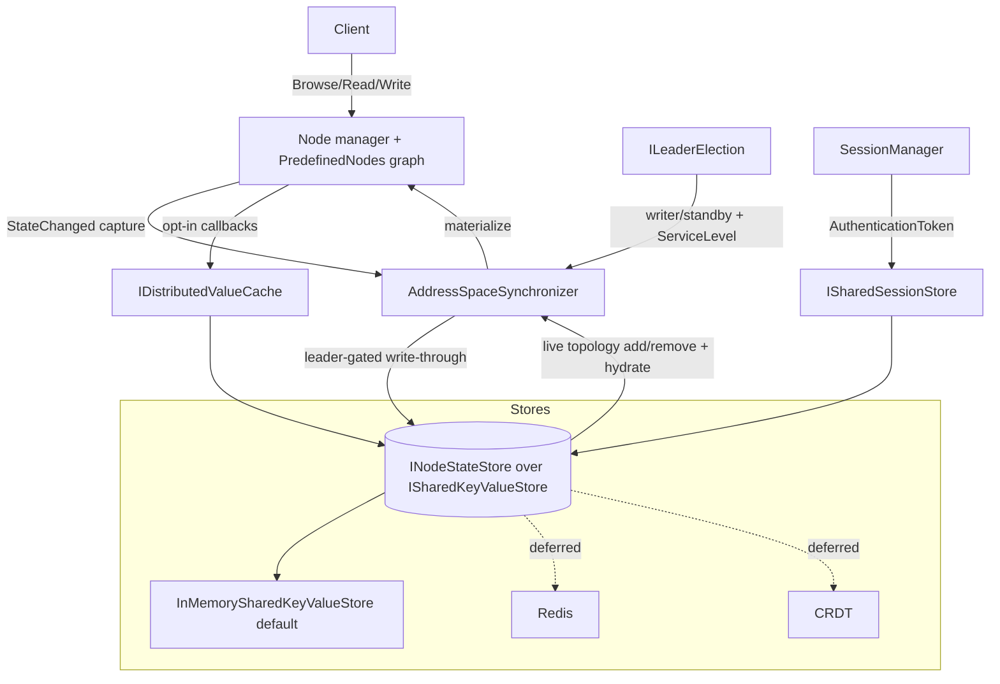

# High Availability and Distributed Address Space

This document describes the building blocks that let an OPC UA server share its address-space state (node topology and variable values) and session state across replicas, so servers can run in a redundant set (for example a Kubernetes replicaset) and expose that redundancy to clients through the documented OPC UA mechanisms.

The feature is **opt-in and additive**. A single-instance server that does not configure any of the components below behaves exactly as before: node state lives in process-local `NodeState` fields and the in-process `PredefinedNodes` dictionary, with no extra indirection or allocation on read/write paths.

## Goals

The design follows the high-availability goals of the stack: running servers in a distributed system with shared state, while keeping the simple single-instance path as efficient as it is today and exposing advanced HA features progressively through dependency injection and a fluent API.

- The authoritative node state (topology **and** values) is pluggable behind a provider, registrable through DI with a direct-construction fallback.
- The single-instance, in-memory path stays zero/near-zero overhead — the local `NodeState` graph remains the in-process serving cache for Browse/Read/Translate.
- Addition and removal of nodes and references propagate to other replicas.
- Both **active/passive** and **active/active** are supported out of the box through a leader-election model (shared read, master write — or better).
- A variable's read/write callbacks can participate in the distributed store: cache the last value they read and serve the last value with a freshness bound.
- Monitored items are unchanged — they read through the normal pipeline and therefore participate in shared state only when the read path participates.
- Session state can be shared across active/passive for fast reconnect: after a failover a client re-runs `ActivateSession` on the promoted replica, validated by the standard client-certificate signature check against a single-use mirrored `serverNonce`. The `AuthenticationToken` is only a lookup key, never an authenticator on its own.

## Architecture

The key decision is *not* to route every attribute access through an asynchronous provider call. Instead the local `NodeState` graph keeps serving reads and browses in-process (fast and local), and a synchronizer bridges that graph to a shared, authoritative store.



- **Local → store (write-through).** The synchronizer captures committed local mutations through the existing `NodeState.StateChanged` event — the same change-capture seam the historian uses — and writes them to the store. Writes are leader-gated: only the writer (leader) writes.
- **Store → local (live apply + hydration).** Node and reference add/remove propagate live to every replica via the store change-feed, so all replicas keep a consistent topology. Full materialization also runs on startup and on failover promotion. Value changes are not force-fed to subscribers; monitored items read as today.

All of these types live in the `Opc.Ua.Server.Distributed` namespace in the `Opc.Ua.Server` library.

## Components

### Shared key/value store — `ISharedKeyValueStore`

The lowest-level abstraction: a minimal key/value backend with `TryGetAsync`, `SetAsync`, `CompareAndSwapAsync` (the atomic "master write" primitive), `DeleteAsync`, `ScanAsync` (prefix scan for hydration) and `WatchAsync` (a prefix change-feed). The default `InMemorySharedKeyValueStore` is thread-safe and can be shared by multiple node managers or multiple in-process server instances. Redis or another external store is a thin adapter over the same contract.

### Node state store — `INodeStateStore`

The authoritative store of a node manager's address-space state, layered on `ISharedKeyValueStore`. It persists serialized nodes (topology) under one key prefix and encoded `DataValue`s (values) under another, and exposes a combined `SubscribeChangesAsync` change-feed. `INodeStateStoreRegistry` resolves a store per node with the same three-scope precedence as the historian registry (exact NodeId, then namespace, then a default). `ServerInternalData` exposes the registry through the optional `INodeStateStoreRegistryProvider` interface, so node managers can discover it without any change to `IServerInternal`.

Nodes are serialized with `NodeStateSerializer`, which frames the node class ahead of the standard `NodeState.SaveAsBinary` payload so a replica can reconstruct a generic node of the correct class (`BaseObjectState`, `BaseDataVariableState`, …). Type-specific behavior (method handlers, custom callbacks) is not carried in the payload — it is re-attached by the owning node manager on the active replica. This is sufficient for browse/read/value replication and active/passive failover.

### Synchronizer — `IAddressSpaceSynchronizer`

Bridges a local node graph (`ILocalAddressSpace`) to its `INodeStateStore`. It runs in one of two roles, selected by the leader-election predicate:

- **Writer (leader):** captures committed local changes and writes them through to the store.
- **Reader (standby):** applies topology and value changes from the store change-feed to its local graph and never writes.

`SeedOrHydrateAsync` seeds the store from the local graph when the store is empty and this replica is the writer, otherwise hydrates the local graph from the store. `Start` begins background replication. A node manager adapts its `PredefinedNodes` to `ILocalAddressSpace`; the bundled `DictionaryAddressSpace` is a ready-to-use flat implementation.

> Single-writer is the active/passive default. Active/active with conflict-free multi-writer merge is layered on top later (CRDT, deferred). On the simple key/value store, active/active uses compare-and-swap / last-writer-wins with a master writer elected per partition.

### Leader election — `ILeaderElection`

Determines whether this replica is the writer. `StaticLeaderElection` is a fixed role (single instance, or an externally-assigned leader). `SharedStoreLeaseElection` is dynamic: a single lease key holds the current leader's id and an expiry, acquired and renewed atomically with `CompareAndSwapAsync`. A leader that stops renewing loses the lease once it expires, allowing a standby to take over; a leader that shuts down gracefully releases the lease immediately. The lease clock is an injectable `TimeProvider`.

### Read/write callback participation — `IDistributedValueCache`

Lets a variable's read/write callbacks cache the last value they observe and serve the last value with a freshness bound from the shared store. `DistributedValueParticipation.ReadThroughAsync` returns the cached value while it is fresh (within `maxAge`), otherwise reads the live value and caches it; the `EnableDistributedValueParticipation` extension wires a variable's asynchronous read/write callbacks to do this automatically. Monitored items continue to read through the normal pipeline and therefore observe the cached value only when the read path participates — exactly the "can or cannot participate" behavior intended.

### Service level — `IServiceLevelProvider`

Computes the value of the server's `ServiceLevel` variable (0–255). In a redundant set, clients connect to the server reporting the highest service level, so a healthy active leader reports the maximum and standbys report a lower value. `ConstantServiceLevelProvider` reports a fixed 255 (the historical single-instance behavior, and the default). `LeaderServiceLevelProvider` follows an `ILeaderElection`: leader reports the high level, standby reports the low level, and `ServiceLevelChanged` fires on every transition.

### Session sharing — `ISharedSessionStore`

Shares session context across replicas keyed by the session `AuthenticationToken` so a client can fail over to a standby and reconnect by re-running `ActivateSession` on a new SecureChannel (OPC UA HotAndMirrored fast reconnect, Part 4 §6.6). The token is a **lookup key only**: the standby still performs the full `ActivateSession` client-certificate signature check against the mirrored, **single-use** `serverNonce`, so a captured activation cannot be replayed and the token alone cannot resume a session. The default `SharedKeyValueSessionStore` persists entries in the same shared key/value backend, **encrypted and integrity-protected** by an `IRecordProtector` (the store never sees plaintext secrets). The server-side integration is the `DistributedSessionManager` (opt-in; the safe default is re-authentication on failover). Certificate stores are assumed to be shared independently. See [Security & threat model](#security--threat-model).

## Usage

The default in-memory store wires both replicas in one process (useful for tests and single-process active/active); a Redis-backed store (deferred) shares state across pods.

```csharp
// Shared backend (one per process; Redis-backed in a real replicaset).
var kv = new InMemorySharedKeyValueStore();
var store = new InMemoryNodeStateStore(kv, messageContext);

// Leader election (dynamic lease) — drives writer role and service level.
var election = new SharedStoreLeaseElection(
    kv, leaseKey: "addressspace/leader", nodeId: Environment.MachineName,
    leaseDuration: TimeSpan.FromSeconds(30), renewInterval: TimeSpan.FromSeconds(10));
election.Start();

// Bridge the node graph to the shared store.
var synchronizer = new AddressSpaceSynchronizer(
    store, addressSpace, isWriter: () => election.IsLeader);
await synchronizer.SeedOrHydrateAsync();
synchronizer.Start();

// Advertise redundancy via ServiceLevel.
var serviceLevel = new LeaderServiceLevelProvider(election);

// Opt a variable into the distributed value cache.
var cache = new DistributedValueCache(store);
temperature.EnableDistributedValueParticipation(
    cache, maxAge: TimeSpan.FromSeconds(1),
    liveRead: ct => ReadSensorAsync(ct));

// Share session state for fast reconnect.
var sessions = new SharedKeyValueSessionStore(kv, messageContext);
```

## Exposing redundancy to clients

Server redundancy is advertised through the standard OPC UA nodes under `Server.ServerRedundancy` and the `Server.ServiceLevel` variable (OPC UA Part 4 §6.6.2, Part 5 §6.3). Clients in this stack already consume them: `DefaultServerRedundancyHandler` and `ManagedSession` read `RedundancySupport`, `RedundantServerArray` and `ServiceLevel` and fail over to the running server with the highest service level (see [Sessions](Sessions.md)).

To advertise non-transparent redundancy, wire the DI fluent API on the server builder:

```csharp
services.AddOpcUa()
    .AddServer(o => { /* ... */ })
    .AddNodeManager<MyNodeManagerFactory>()   // a CustomNodeManager2-derived manager
    .UseDistributedAddressSpace(d =>
    {
        d.UseLeaderElection = true;            // lease election over the shared store
        d.NodeId = Environment.MachineName;    // unique per replica
    })
    .AddServerRedundancy(r =>
    {
        r.Mode = RedundancySupport.Hot;
        r.PeerServerUris.Add("opc.tcp://replica-2:4840");
    });
```

`UseDistributedAddressSpace` registers the shared store, leader election, and a startup task that — once the server is running — builds the node-state store with the server's message context, attaches a synchronizer to every `CustomNodeManager2`-derived node manager (built-in Core / Diagnostics / Configuration managers do not participate), and drives `Server.ServiceLevel` from a `LeaderServiceLevelProvider` (leader high, standby low). `AddServerRedundancy` sets `RedundancySupport` and populates `RedundantServerArray` from the peer set, so the client `DefaultServerRedundancyHandler` can fail over to the highest-service-level replica.

The wiring runs through the additive `IServerStartupTask` hosting seam, so no `StandardServer` subclass is required.

### Session fast reconnect

Add `UseDistributedSessions(...)` to mirror session state across replicas. It composes with `UseDistributedAddressSpace` over the same shared store and record protector:

```csharp
services.AddOpcUa()
    .AddServer(o => { /* ... */ })
    .UseDistributedAddressSpace(d => { d.UseLeaderElection = true; })
    .UseDistributedSessions(s =>
    {
        // Opt into mirrored fast reconnect; the default is re-auth on failover.
        s.EnableFastReconnect = true;
    });
```

`UseDistributedSessions` registers an `ISessionManagerFactory` that the server uses to build a `DistributedSessionManager`. On `CreateSession` / `ActivateSession` it mirrors the encrypted session record — including the last `serverNonce` — to the shared store. On a failover reconnect the standby restores the record, **consumes the nonce single-use across the replica set** (replay defence), enforces the same SecurityPolicy/Mode, and runs the standard `ActivateSession` client-signature validation. The `AuthenticationToken` is never an authenticator on its own. The safe default (`EnableFastReconnect = false`) re-authenticates on failover and needs no shared session state. See [Security & threat model](#security--threat-model) for the threat model and the key / transport requirements.

#### Client side

To consume the mirrored fast reconnect, the client opts in to token-reuse failover. On failover to a redundant server, the managed session re-activates the existing session by reusing its `AuthenticationToken` (signing over the new channel + last `serverNonce`) instead of creating a new one, falling back to re-authentication if the standby rejects it:

```csharp
ManagedSession session = await new ManagedSessionBuilder(config, telemetry)
    .UseEndpoint(endpoint)
    .WithServerRedundancy()        // fail over to the highest ServiceLevel replica
    .WithTokenReuseFailover()      // fast reconnect (default: re-auth on failover)
    .ConnectAsync(ct);
```

When token-reuse succeeds the client keeps the same `SessionId` across the failover; otherwise it transparently re-authenticates. This is validated end-to-end by `DistributedSessionFailoverIntegrationTests` (two secured servers sharing one store).

### Transparent redundancy

Transparent redundancy (a single virtual endpoint that hides failover) is achieved by fronting the replicas with a single network endpoint — for example a Kubernetes `Service` or load balancer — and transferring subscriptions on failover (see [TransferSubscription](TransferSubscription.md)). The shared session store enables the fast reconnect that makes this transparent to clients. This deployment-level approach is documented here rather than implemented as a distinct transport.

## Active/active with CRDTs

The active/passive model above elects a single writer. For **active/active** — where every replica accepts writes concurrently — the `OPCFoundation.NetStandard.Opc.Ua.Server.Distributed.Crdt` package models the address space as conflict-free replicated data types (CRDTs) and gossips them between replicas, so concurrent edits converge without a leader. It builds on the `Crdt` and `Crdt.Transport` packages and ships `net8.0`+ only (the gossip transport requires .NET 8+); the base distributed package keeps active/passive on all of its target frameworks.

Node topology (additions, removals, references) and variable values are each modelled as a last-writer-wins map keyed by node id and gossiped as state over an in-memory transport (tests / single process) or TCP/UDP gossip with optional TLS (real deployments). Every replica is a writer: a local change mutates the local CRDT replica and broadcasts it, and received state is merged and the resulting differences are applied to the local graph. Because values are versioned by their own entries, a topology merge never regresses a value that a concurrent value update already advanced.

Opt in with the fluent API (active/passive remains the default):

```csharp
services.AddOpcUa()
    .AddServer(...)
    .AddNodeManager<MyNodeManagerFactory>()
    .UseCrdtAddressSpace(crdt =>
    {
        crdt.ReplicaId = ReplicaId.New();                 // stable per replica
        crdt.UseTcpGossip(IPAddress.Any, port: 4840);     // or UseUdpGossip / TLS
        crdt.AddPeer(new IPEndPoint(peerAddress, 4840));
    })
    .UseCrdtSessions();
```

### Session active/active and the single-use-nonce boundary

`UseCrdtSessions(...)` replicates mirrored session entries active/active by gossiping them as a CRDT, reusing the existing `DistributedSessionManager` over a CRDT-backed key/value store. The **single-use server nonce is deliberately not a CRDT**: enforcing that a nonce is consumed exactly once is a uniqueness/consensus guarantee that conflict-free (AP) types cannot provide — two partitioned replicas could each accept the same captured activation. The session manager therefore keeps the nonce on a strongly-consistent `ISingleUseNonceRegistry` (compare-and-swap), resolved from the container (for example the address-space backend or a Redis adapter); the CRDT key/value store rejects compare-and-swap for exactly this reason. The result: session metadata converges active/active while the cross-replica replay defence retains its strong guarantee.

## Kubernetes deployment

See [KubernetesDeployment.md](KubernetesDeployment.md) for a worked replicaset deployment (StatefulSet, headless `Service`, leader election, readiness tied to `ServiceLevel`, and KEK / shared-certificate provisioning via Secrets). In summary, a typical replicaset deployment:

- Run the server as a `Deployment`/`StatefulSet` with several replicas. Each replica is its own OPC UA endpoint for non-transparent redundancy, or all replicas sit behind one `Service` for transparent redundancy.
- Use a **headless `Service`** for peer discovery when peers gossip directly, or a shared store (Redis) reachable by all pods.
- Elect a leader with `SharedStoreLeaseElection` over the shared store, or with a Kubernetes `Lease` (coordination.k8s.io). The leader writes; standbys hydrate and apply.
- Tie the pod **readiness probe** to `ServiceLevel` (or leadership) so traffic is only routed to replicas that are in service, and so a demoted leader drains gracefully.
- Share certificate and secret stores across pods (mounted secrets / a shared certificate store) — these are assumed shared and are out of scope of the distributed address space.

## Status and limitations

- The shared key/value store, node-state store, synchronizer, leader election, value cache/participation, service-level provider and shared session store are implemented and unit/integration tested (including two-replica topology-and-value replication).
- Server integration is wired through the additive **`IServerStartupTask`** hosting seam: **`UseDistributedAddressSpace(...)`** attaches a synchronizer to every `CustomNodeManager2`-derived node manager and drives `Server.ServiceLevel`; **`AddServerRedundancy(...)`** populates `Server.ServerRedundancy`; **`AddServerServiceLevel(...)`** drives `ServiceLevel` from a custom provider. Active/passive redundancy can be advertised and consumed end-to-end today.
- Async node managers deriving from `AsyncCustomNodeManager` opt into replication on the same `ILocalAddressSpaceSource` seam as `CustomNodeManager2`-derived managers.
- **Session fast-reconnect** is wired through **`UseDistributedSessions(...)`** plus the additive **`ISessionManagerFactory`** seam on `StandardServer`: the `DistributedSessionManager` mirrors encrypted session state and, when `EnableFastReconnect` is enabled, restores a session on a standby with a full `ActivateSession` client-signature check, the same SecurityPolicy/Mode, and a single-use `serverNonce` (cross-replica replay defence). The client opts in with **`ManagedSessionBuilder.WithTokenReuseFailover()`**; the safe default on both sides is re-authentication on failover. Validated end-to-end by `DistributedSessionFailoverIntegrationTests` (two secured servers sharing one store; token-reuse preserves the `SessionId`). See [Security & threat model](#security--threat-model).
- **Active/active** is available two ways: the simple key/value store with last-writer-wins plus a single elected writer (active/passive promotion), and true multi-writer **CRDT** replication in the `OPCFoundation.NetStandard.Opc.Ua.Server.Distributed.Crdt` package (`UseCrdtAddressSpace(...)` / `UseCrdtSessions(...)`), where every replica accepts writes and converges by gossip. See [Active/active with CRDTs](#activeactive-with-crdts).
- A **Redis** store is a planned provider of the same `ISharedKeyValueStore` / `INodeStateStore` contracts (and the strongly-consistent backend for the single-use nonce under CRDT sessions) and is deferred.


## Security & threat model

High-availability deployments introduce trust boundaries that a single-instance server does not have: the shared store conduit and peer replicas. The design treats the shared store as an untrusted conduit and preserves the OPC UA session security model when address-space and session state are shared across replicas.

### Assets

- **Process data integrity** — variable values and address-space topology served to clients, which can be safety-relevant in an industrial server.
- **Session credentials** — the `AuthenticationToken` (a secret per OPC UA Part 4 §7.35), the `serverNonce` / `ClientNonce`, the client `ApplicationInstanceCertificate`, and the user identity token.
- **Availability** — the server must keep serving and fail over.

### Data-flow diagram and trust boundaries

```
            ┌──────────── replica (server) trust boundary ────────────┐
 Client ──TLS/UA-SC──▶  OPC UA endpoint ─▶ NodeManager / SessionManager │
                       │            │                                   │
                       ▼            ▼                                   │
                AddressSpaceSynchronizer   DistributedSessionManager    │
                       │            │                                   │
            ───────────┼────────────┼─── shared-store conduit ─────────┐│  ← new trust boundary
                       ▼            ▼                                   ││
                 ISharedKeyValueStore  (in-memory / Redis)             ││
                       ▲            ▲                                   ││
            ───────────┼────────────┼───────────────────────────────── ┘│
                       │            │                                    │
                 peer replica  peer replica   ← new trust boundary (rogue replica)
            └──────────────────────────────────────────────────────────┘
```

The store conduit and peer replicas are outside the single replica's trust boundary. The store must be treated as an untrusted conduit, with zero trust between replicas.

### STRIDE analysis

| Element / flow | Threat (STRIDE) | Risk | Mitigation |
|----------------|-----------------|------|------------|
| Client → standby reconnect | **S**poofing / Elevation: token-only reconnect impersonates a session | CRITICAL | Full `ActivateSession` signature validation; token = lookup key only |
| `serverNonce` in shared record | **T**ampering / replay: reuse a captured `ActivateSession` | CRITICAL | Single-use nonce, compare-and-swap invalidated on consume; fresh nonce per activation |
| Node/value/session records in store | **T**ampering: rogue replica or compromised store forges values, topology, or sessions applied to the live graph | HIGH | Authenticated encryption and MAC on every record, verify-before-apply, fail-closed |
| Secrets at rest in store | **I**nformation disclosure: nonce, identity, or token readable from Redis dump / monitoring | HIGH | Authenticated encryption at rest; envelope DEK/KEK |
| Store keys = raw token | **I**nformation disclosure via keyspace enumeration or slow logs | MEDIUM | HMAC or hash the sensitive key part; redact tokens from logs |
| Decrypted secrets in memory | **I**nformation disclosure through heap dumps | MEDIUM | `CryptographicOperations.ZeroMemory` after use where practical |
| Replica ↔ store link | **S**poofing / **T**ampering / **I**nformation disclosure on the wire | HIGH | Mutual TLS and authenticated access to the store, fail-closed in production |
| Cross-replica session restore | **R**epudiation: no audit trail for a session appearing on a standby | MEDIUM | Emit `AuditActivateSession` and restored-from-store provenance |
| Shared store growth | **D**enial of service: unbounded sessions, nodes, or watchers | LOW | TTL / eviction, bounded channels, and caps |
| Encryption key | **E**levation: single static fleet key causes fleet-wide compromise | HIGH | Per-session HKDF keys, rotation, and KMS provisioning |

### Security principles adopted

1. **The shared store is untrusted.** Every record is authenticated and confidential; unverified records are rejected fail-closed. A compromised store or rogue replica cannot forge state served to clients.
2. **The OPC UA session security model is preserved on failover.** Reconnect always performs a full `ActivateSession`: the standby verifies the client-certificate signature, the same `ClientUserId`, and the same SecurityPolicy/Mode (OPC UA Part 4 §5.7.3). The `AuthenticationToken` is never an authenticator, only a lookup key.
3. **Secrets are encrypted at rest and zeroized in memory where practical**, keyed by rotation-capable, least-privilege keys provisioned from a secret store — never a static constant.
4. **Secure by default / fail closed.** Production transport to the store must be authenticated TLS; absence fails closed.
5. **Auditable.** Cross-replica session restore emits audit events with provenance.

### Implemented mitigations and usage

The store-hardening mitigations are implemented and unit-tested; session-mirroring fast reconnect is gated behind them and is opt-in. The safe default is re-authentication on failover, which requires no shared session state.

#### Record protection — `IRecordProtector`

Every record the shared store persists — node payloads (`n/…`), encoded values (`v/…`), and session entries (`session/…`) — is wrapped in an authenticated-encryption envelope before it leaves the replica, and is verified-then-decrypted on the way back in. `AesCbcHmacRecordProtector` uses AES-256-CBC with HMAC-SHA256 in Encrypt-then-MAC order; the MAC is checked **before** any decryption (no padding oracle), so a tampered or forged record is rejected fail-closed and never reaches `LoadAsBinary` / the live graph. The default `NullRecordProtector` is a pass-through for the single-process in-memory case, so that path keeps its zero-overhead behavior.

Wire it through DI:

```csharp
services.AddOpcUaServer(...)
    .UseDistributedAddressSpace(o =>
    {
        // 32-byte master key provisioned from a secret store / KMS — never a constant.
        o.RecordProtectorFactory = sp => new AesCbcHmacRecordProtector(masterKey, keyId: 2);
    });
```

This treats the store as an untrusted conduit by adding integrity and confidentiality to shared records.

#### Key rotation — `KeyRingRecordProtector`

`KeyRingRecordProtector` writes new records under a single *active* key while still verifying reads against any number of *retired* keys. An operator can roll out a new key fleet-wide, let records re-write under it over time, and only then drop the old key — no flag-day re-encryption. Each key carries a `keyId`, so a record is only ever decrypted by the key version that produced it.

```csharp
o.RecordProtectorFactory = sp => new KeyRingRecordProtector(
    active:  new AesCbcHmacRecordProtector(newKey, keyId: 3),
    retired: new AesCbcHmacRecordProtector(oldKey, keyId: 2));
```

#### Single-use server nonce — `ISingleUseNonceRegistry`

`SharedSingleUseNonceRegistry` records each consumed `serverNonce` as a compare-and-swap marker in the shared store, so a nonce can be consumed **exactly once across the whole replica set**. This is the cross-replica enforcement of OPC UA Part 4 §5.7.3.1's single-use requirement and the replay defense that mirrored fast reconnect needs: a Sign-mode `ActivateSession` captured against one replica is rejected when replayed against a standby. The nonce is never stored; the key is its SHA-256 digest, keeping the secret-bearing keyspace one-way.

#### Secret zeroization

`AesCbcHmacRecordProtector` derives distinct AES and MAC subkeys from the master key, zeroizes the master immediately after derivation, and zeroizes both subkeys on `Dispose` (`CryptographicOperations.ZeroMemory` on net8+ and `Array.Clear` on down-level frameworks).

#### Secure session sharing — `DistributedSessionManager`

`DistributedSessionManager` (a `SessionManager` subclass, wired via `UseDistributedSessions(...)` and the additive `ISessionManagerFactory` seam on `StandardServer`) mirrors the encrypted session record — including the last `serverNonce` — to the shared session store on `CreateSession` / `ActivateSession`, and removes it on close. On a failover reconnect to a standby, the base `SessionManager` calls the additive `RestoreSessionAsync` hook, which:

1. enforces the same SecurityPolicy/Mode as the original session;
2. **consumes the mirrored `serverNonce` exactly once across the replica set** via `ISingleUseNonceRegistry` — a replayed or already-consumed nonce is rejected;
3. reconstructs the session and lets the **standard** activation path run the full client-certificate signature validation against that nonce.

The `AuthenticationToken` is therefore only a lookup key — it never admits a session without a valid client signature. The safe default is `EnableFastReconnect = false` (re-authentication on failover, no shared session state).

**Keyspace hygiene.** The session store keys entries by the **SHA-256 digest of the authentication token** (`SharedKeyValueSessionStore.KeyFor`), not the raw token, so a backend's key enumeration, monitoring, or dumps never expose the token. The consumed-nonce registry does the same.

**Restore audit.** A successful cross-replica restore emits a distinct `AuditSessionEventState` (`Session/RestoredFromSharedStore`, via `IAuditEventServer.ReportAuditSessionRestoredEvent`) in addition to the standard `AuditActivateSession`, carrying a one-way token digest for provenance; restores are also logged.

**Restore-path secrets.** The decrypted `serverNonce` becomes the restored session's working `Nonce` (retained, not copied), so the manager holds no extra plaintext copy to zeroize; zeroizing the live nonce would break activation. Zeroizing `Nonce.Data` on dispose is a pre-existing, server-wide Core concern because it affects every session, not just HA.

A residual, intentional trade-off remains: an attacker who can open a SecureChannel to a standby and replays a token can cause that session's mirrored nonce to be consumed, degrading a legitimate client's fast reconnect to a full re-authentication (the secure default), but it never grants access. The client opts into token-reuse failover with `ManagedSessionBuilder.WithTokenReuseFailover()`; on the wire the standby still runs the full `ActivateSession` signature check, so a token-reuse failover that succeeds preserves the client's `SessionId` while a rejected one transparently re-authenticates. This is validated end-to-end by `DistributedSessionFailoverIntegrationTests` (two secured servers sharing one store) and `DistributedSessionMirrorIntegrationTests` (encrypted mirror-on-activate / remove-on-close); the security-decision logic (policy match + single-use nonce) is unit-tested.

### Deployment guidance and operator responsibilities

These mitigations are not enforced by the in-process default and must be supplied by the deployment. They are mandatory before any production or networked-store use.

- **Key provisioning.** Provision the `AesCbcHmacRecordProtector` master key (the KEK) from a secret store or KMS — a Kubernetes Secret mounted via the CSI Secrets Store driver, or an external KMS — never a compiled-in constant. Give each replica the **same** key (required so any replica can read shared records) but the **least** privilege needed. Rotate with the key-ring above.
- **Authenticated, encrypted store transport.** When the `ISharedKeyValueStore` is a network backend (for example Redis), require mutual TLS with authentication on the conduit and **fail closed** if it is unavailable. Use a least-privilege, per-replica credential. Treat the store conduit as a zone boundary; do not run it in the clear.
- **Availability caps.** Apply a TTL / eviction policy to `session/` and consumed-`nonce/` entries, bound the watch channels, and cap the shared keyspace so a faulty or hostile replica cannot exhaust it.
- **Token redaction.** The shared keyspace no longer contains the raw token because it is keyed by the token's SHA-256 digest; additionally ensure `AuthenticationToken` values are excluded from logs, metrics, and traces and treat the keyspace as sensitive.
- **Transparent redundancy.** Spec-transparent redundancy requires an identical `ApplicationInstanceCertificate` and private key across replicas. Provision the shared key material through the certificate / secret store; this is a deployment decision.

For historical remediation details, severities, OPC UA Part 2/4/5 citations, phased remediation, and open decisions such as default failover mode, KEK provisioning, and transparent-redundancy shared certificate provisioning, see [distributed HA session security plan](../plans/30-distributed-ha-session-security.md).

## See also

- [Sessions](Sessions.md) — client-side reconnect and redundancy failover.
- [TransferSubscription](TransferSubscription.md) — moving subscriptions between servers.
- [DurableSubscription](DurableSubscription.md) — persisting subscriptions.
- [Dependency Injection](DependencyInjection.md) — the server builder and provider registration conventions.
