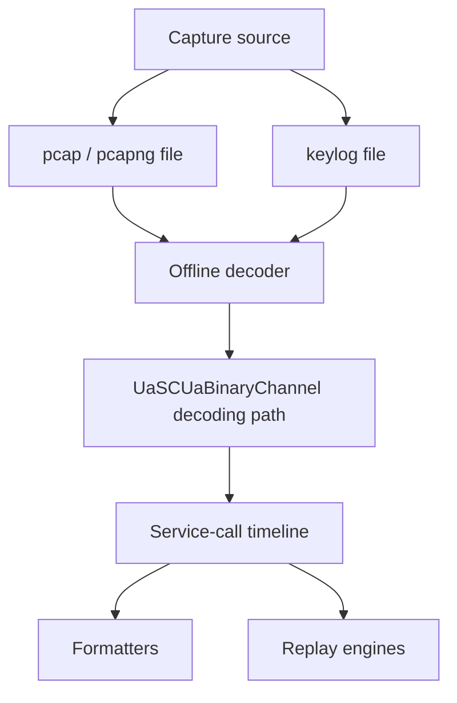

# OPC UA Packet Capture, Dissection, and Replay

The OPC UA packet-capture feature records UA traffic, stores the secure-channel keys needed for offline decoding, reconstructs service calls, and replays captured conversations. The reusable engine ships as `OPCFoundation.NetStandard.Opc.Ua.Bindings.Pcap`; the OPC UA MCP server exposes it as capture, decode, and replay tools. Decoding follows OPC UA Part 6 secure conversation framing and reuses the stack `UaSCUaBinaryChannel` path instead of reimplementing cryptography.

## When to use it

- Debug OPC UA interoperability issues that only appear on a real wire.
- Capture a repro for a bug that cannot be reproduced under a debugger.
- Validate wire-level effects of stack, application, or security-policy changes.
- Build decoder and replay tests from real captures.

## Architecture



## Integration with the central channel manager

The Pcap binding composes with the central [`IClientChannelManager`](Sessions.md#4-iclientchannelmanager--centralised-channel-sharing-and-reconnect) introduced in issue [#3288](https://github.com/OPCFoundation/UA-.NETStandard/issues/3288) via the global `TransportBindings.Channels` registry: `AddOpcUaBindingsPcap` installs a `PcapTransportChannelBinding` decorator over the TCP channel factory, and `ClientChannelManager` — which by default reads from that same global registry — picks the wrapped factory up automatically. There is no extra wiring code; the composition is pure layering at the transport binding level.

Three properties of the channel manager flow through to capture for free:

- **Sharing.** When multiple participants share a single `IManagedTransportChannel` (the refcount + key-equivalence model in `ManagedChannelKey`), the underlying `CapturingMessageSocket` records all participant traffic onto a single wire stream. One capture session covers a `Session`, a `DiscoveryClient`, and a `RegistrationClient` all targeting the same endpoint.
- **Transparent reconnect.** During the manager's coalesced reconnect cycle the wrapping socket is re-created against the new transport but the `IChannelCaptureRegistry` keeps recording into the same session file — the reconnect transition appears in the timeline as a state edge rather than a capture interruption.
- **Faulted-entry swap.** The `Phase E` `SwapFaultedEntryAsync` path produces a fresh `ChannelEntry` under the same `ManagedChannelKey`; the active capture observer rolls onto the new entry so an exhaustion-then-recover cycle is recorded end-to-end in one session.

If you compose the channel manager and the capture binding via DI the standard registration order is:

```csharp
services.AddOpcUa().AddClient(options => { });    // central IClientChannelManager
services.AddSingleton<OpcUaSessionManager>();     // your application services
services.AddOpcUaBindingsPcap();                  // capture binding + CaptureSessionManager
services.AddOpcUaBindingsPcapFormatters();        // service-timeline / pcap / pcapng / json / csv / text
services.AddOpcUaBindingsPcapReplay();            // mock-client / mock-server replay engines
```

Registration order does not strictly matter (the Pcap binding installs synchronously into the process-wide registry), but the order above reads top-down as "register the channel manager, then your services, then opt in to capture". For non-DI consumers, call `PcapBindings.Install()` at startup to achieve the same effect.

## Capture sources

**NIC (`nic`)** captures live traffic through SharpPcap. It requires libpcap on Linux/macOS or Npcap on Windows and can use interface names and BPF filters.

**In-process client (`inproc-client`)** taps OPC UA client channels in the current process. It uses `IFrameCaptureSink` for wire chunks and client token activation for key material. No native driver is required.

**In-process server (`inproc-server`)** passively taps channels accepted by a hosted OPC UA server. It uses the same frame sink plus `TcpListenerChannel.OnTokenActivated`. No native driver is required.

**Replay (`replay`)** reads an existing pcap or pcapng plus `.uakeys.json` or `.uakeys.txt`. Use it for offline decode, summaries, and mock-client or mock-server replay.

## Quick start: in-process client capture

```csharp
services.AddOpcUa().AddClient(options => { });   // central IClientChannelManager
services.AddOpcUaBindingsPcap();                  // capture binding + CaptureSessionManager

CaptureSessionManager manager = serviceProvider.GetRequiredService<CaptureSessionManager>();

var session = await manager.StartAsync(new StartCaptureRequest
{
    Source = CaptureSourceKind.InProcessClient,
    MaxDurationSeconds = 60,
    SessionFolder = "C:/captures"
}, ct);

// Do real OPC UA work here — every channel created through the central
// IClientChannelManager (Session.CreateAsync, ManagedSessionBuilder,
// DiscoveryClient, RegistrationClient, GDS clients, …) is automatically
// wrapped by the Pcap binding. Channel sharing means a single recording
// stream covers every participant on the same endpoint.

await manager.StopAsync(session.SessionId, ct);

var bytes = await manager.GetCaptureAsync(
    session.SessionId,
    FormatKind.ServiceTimeline,
    ct);
```

## Quick start: replay and decode an existing pcap

```csharp
services.AddOpcUaBindingsPcap();

CaptureSessionManager manager = serviceProvider.GetRequiredService<CaptureSessionManager>();

var session = await manager.StartAsync(new StartCaptureRequest
{
    Source = CaptureSourceKind.Replay,
    PcapFilePath = "C:/captures/issue-1423.pcap",
    KeyLogFilePath = "C:/captures/issue-1423.uakeys.json",
    SessionFolder = "C:/captures"
}, ct);

var timeline = await manager.GetCaptureAsync(
    session.SessionId,
    FormatKind.ServiceTimeline,
    ct);
```

## Quick start: mock-server replay

```csharp
services.AddOpcUaBindingsPcap();

CaptureSessionManager manager = serviceProvider.GetRequiredService<CaptureSessionManager>();

var replay = await manager.ReplayAsync(new ReplayPcapRequest
{
    PcapFilePath = "C:/captures/server-conversation.pcap",
    KeyLogFilePath = "C:/captures/server-conversation.uakeys.json",
    Mode = ReplayMode.MockServer,
    ListenEndpointUrl = "opc.tcp://localhost:4840/CapturedServer"
}, ct);
```

## Security profile coverage

Every stack-supported profile can be decoded because the offline decoder reuses `UaSCUaBinaryChannel`, `ChannelToken`, and the stack cryptography helpers:

- `Basic128Rsa15`
- `Basic256`
- `Basic256Sha256`
- `Aes128_Sha256_RsaOaep`
- `Aes256_Sha256_RsaPss`
- `RSA_DH_AesGcm`
- `RSA_DH_ChaChaPoly`
- `ECC_nistP256`, `ECC_nistP256_AesGcm`, `ECC_nistP256_ChaChaPoly`
- `ECC_nistP384`, `ECC_nistP384_AesGcm`, `ECC_nistP384_ChaChaPoly`
- `ECC_brainpoolP256r1`, `ECC_brainpoolP256r1_AesGcm`, `ECC_brainpoolP256r1_ChaChaPoly`
- `ECC_brainpoolP384r1`, `ECC_brainpoolP384r1_AesGcm`, `ECC_brainpoolP384r1_ChaChaPoly`
- `ECC_curve25519`, `ECC_curve25519_AesGcm`, `ECC_curve25519_ChaChaPoly`

## Transport coverage

- `opc.tcp`: full capture, decode, and replay support.
- `opc.tcp` reverse connect: full support; the TCP stream is decoded through the same Part 6 framing.
- `opc.https`: best-effort. The pcap can be captured, but decoding encrypted TLS payloads requires an external TLS keylog such as `SSLKEYLOGFILE`.

## File format reference

The library writes two artifacts per session: a pcap of the captured chunks and a keylog of the activated tokens.

### `.uakeys.json` format

`.uakeys.json` is JSON Lines (JSONL): one UTF-8 JSON object per line. Each object describes one activated OPC UA secure-channel token.

| Field | Type | Meaning |
|---|---|---|
| `channelId` | `uint32` | OPC UA secure-channel id. |
| `tokenId` | `uint32` | Secure-channel token id used in symmetric chunks. |
| `securityPolicyUri` | `string` | OPC UA security policy URI. |
| `securityMode` | `string` | One of `None`, `Sign`, or `SignAndEncrypt`. |
| `createdAt` | `string` | Token creation time as ISO-8601 UTC. |
| `lifetimeMs` | `int` | Token lifetime in milliseconds. |
| `clientNonce` | base64 `string` | Client nonce for key derivation. |
| `serverNonce` | base64 `string` | Server nonce for key derivation. |
| `clientSigningKey` | base64 `string` | Client-to-server signing key; omitted for `None`. |
| `clientEncryptingKey` | base64 `string` | Client-to-server encryption key; omitted for `None`. |
| `clientInitializationVector` | base64 `string` | Client-to-server IV; omitted for `None`. |
| `serverSigningKey` | base64 `string` | Server-to-client signing key; omitted for `None`. |
| `serverEncryptingKey` | base64 `string` | Server-to-client encryption key; omitted for `None`. |
| `serverInitializationVector` | base64 `string` | Server-to-client IV; omitted for `None`. |

Worked example:

```json
{"channelId":1001,"tokenId":7,"securityPolicyUri":"http://opcfoundation.org/UA/SecurityPolicy#Basic256Sha256","securityMode":"SignAndEncrypt","createdAt":"2026-06-06T11:48:00Z","lifetimeMs":3600000,"clientNonce":"Y2xpZW50","serverNonce":"c2VydmVy","clientSigningKey":"MDEyMw==","clientEncryptingKey":"NDU2Nw==","clientInitializationVector":"ODlhYg==","serverSigningKey":"Y2RlZg==","serverEncryptingKey":"MDEyMw==","serverInitializationVector":"NDU2Nw=="}
```

For `SecurityMode=None`, key fields are omitted:

```json
{"channelId":1002,"tokenId":1,"securityPolicyUri":"http://opcfoundation.org/UA/SecurityPolicy#None","securityMode":"None","createdAt":"2026-06-06T11:49:00Z","lifetimeMs":3600000,"clientNonce":"","serverNonce":""}
```

### `.uakeys.txt` format

`.uakeys.txt` is a Wireshark-style, single-line keylog format. The file begins with this header:

```text
# OPC UA channel key log v1
```

Each record uses a single space as the field separator:

```text
OPCUA_CHANNEL <channelId-hex> <tokenId-hex> <securityPolicyUri> <securityMode> <client_signing_hex> <client_encrypting_hex> <client_iv_hex> <server_signing_hex> <server_encrypting_hex> <server_iv_hex>
```

Hex values are uppercase with no separators. `-` denotes a null or empty field. Lines beginning with `#` are comments.

Worked example:

```text
# OPC UA channel key log v1
OPCUA_CHANNEL 000003E9 00000007 http://opcfoundation.org/UA/SecurityPolicy#Basic256Sha256 SignAndEncrypt 30313233 34353637 38396162 63646566 30313233 34353637
OPCUA_CHANNEL 000003EA 00000001 http://opcfoundation.org/UA/SecurityPolicy#None None - - - - - -
```

### PCAP file format

Produced `.pcap` files use standard libpcap and are compatible with Wireshark and other readers.

NIC captures preserve real link-layer and IP/TCP headers. In-process taps write BSD-loopback records (`link_type=0`) and synthesize IP/TCP headers around each OPC UA chunk so dissectors see TCP traffic while the UA Secure Conversation chunk bytes remain exact.

For synthesized in-process captures:

- Client endpoint: `127.0.1.x`
- Server endpoint: `127.0.2.x`
- `x = channelId & 0xFF`
- Server port: `4840`
- Client port: `49152 + (channelId & 0x3FFF)`

The synthesized addresses are deterministic local analysis identifiers, not real endpoints.

### Wireshark interop

Wireshark's bundled OPC UA dissector can read the generated pcap files and understands HEL, ACK, OPN, MSG, and CLO framing. It cannot decrypt encrypted MSG or CLO chunks because it does not know the OPC UA symmetric keys.

The `.uakeys.txt` format is line-oriented and Wireshark-style so a future Lua plugin can:

1. Load `# OPC UA channel key log v1` files.
2. Index records by `channelId` and `tokenId`.
3. Match OPC UA symmetric chunks to a token id.
4. Pass the matching signing, encrypting, and IV material to the decoder.

This only defines the future plugin format; no delivery date is promised.

## Security considerations

> **Keylog files are secrets.** They contain symmetric keys that grant full decrypt access to captured payloads. Keep them in the per-session folder, do not commit them, restrict access, and redact before sharing.

## Limitations

- The stack does not produce live TLS keylogs for `opc.https`; provide an external TLS keylog when TLS decryption is required.
- PubSub UDP and MQTT capture are out of scope for this feature.
- A Wireshark Lua plugin is not included. The text keylog format is documented so a plugin can be added later.

## Troubleshooting

- `list_interfaces` returns empty: install libpcap or Npcap and ensure the process has permission to enumerate adapters.
- `decode_pcap_with_keys` returns 0 service calls: verify the pcap and keylog are from the same capture and include the same channel and token ids.
- Frames are captured but keys are missing: start the in-process capture before opening the secure channel so token activation is observed.
