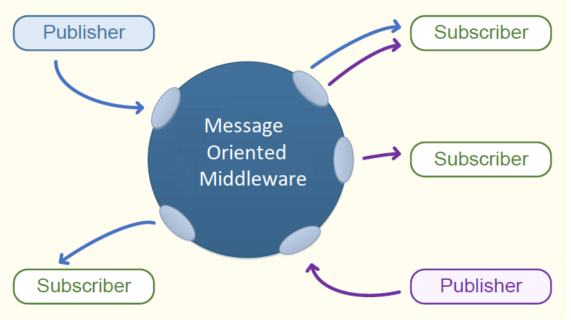

## PubSub 
## Overview

In software architecture, Publish/Subscribe is a messaging pattern where senders do not communicate directly with specific receivers. Instead senders, called Publishers, categorize messages into classes without knowing which receivers, if any, there may be. Similarly receivers, called Subscribers, express interest in one or more classes and only receive messages that are of interest, without knowing which senders, if any, there are.

In February 2018 the OPC Foundation published [Part 14 of the OPC UA Specification](https://reference.opcfoundation.org/v104/Core/docs/Part14/), version 1.04, specifying the OPC UA PubSub communication model. The OPC UA PubSub communication model defines an OPC UA Publish/Subscribe pattern instead of the client/server pattern defined by the services in [Part 4 of the OPC UA Specification](https://reference.opcfoundation.org/v104/Core/docs/Part4/).

OPC UA PubSub is designed to be flexible and is not bound to a particular messaging system.

**Decoupling by use of middleware**

In OPC UA PubSub the participating OPC UA applications can assume the roles of Publishers and Subscribers. Publishers are the sources of data, while Subscribers consume that data. Communication in OPC UA PubSub is message-based. Publishers send messages to a Message-Oriented Middleware, without knowledge of what, if any, Subscribers there may be. Similarly, Subscribers express interest in specific types of data, and process messages that contain this data, without knowledge of what Publishers there are.

Message-Oriented Middleware is a software or hardware infrastructure that supports sending and receiving messages between distributed systems. The implementation of the message distribution depends on the Message-Oriented Middleware.

The image bellow illustrates that for communication Publishers and Subscribers only interact with the Message-Oriented Middleware which provides the means to receive data from one or more senders and forward data to one or more receivers:
PubSub Overview

To cover a large number of use cases, OPC UA PubSub supports two largely different Message-Oriented Middleware variants. These are:

 - A broker-less Message-Oriented Middleware is a network infrastructure that is able to route datagram-based messages. Subscribers and Publishers use datagram protocols like UDP. 

 - A broker-based Message-Oriented Middleware is a network infrastructure that uses a message Broker as core component. Subscribers and Publishers use standard messaging protocols like AMQP or MQTT to communicate with the Broker. All messages are published to specific queues (e.g. topics, nodes) that the Broker exposes and Subscribers can listen to these queues. The Broker may translate messages from the formal messaging protocol of the Publisher to the formal messaging protocol of the Subscriber.

**Synergy of Models**

OPC UA PubSub and OPC UA Client/Server are both based on the OPC UA Information Model but there is no necessity for Publishers or Subscribers to be either an OPC UA Server or an OPC UA Client to participate in OPC UA PubSub communications.

The PubSub implementation is part of OPC UA .NET Standard Stack from OPC Foundation. It is totally decoupled from the Client/Server implementation but any Publisher or Subscriber component can easily be integrated into OPC UA Servers and OPC UA Clients.

Quite typically, a Publisher will be an OPC UA Server (the owner of information) and a Subscriber is often an OPC UA Client, but it is also possible that OPC UA Clients can be Publishers and OPC UA Servers can be Subscribers.

**PubSub Concepts**

The following image provides an overview of the Publisher and Subscriber entities. It illustrates the flow of messages from a Publisher to one or more Subscribers. The PubSub communication model supports many other scenarios; for example, a Publisher may send a DataSet to multiple Message-Oriented Middleware and a Subscriber may receive messages from multiple Publishers.

# PubSub Configuration

The Publishers and Subscribers are configured using the data types defined in the OPC UA version 1.04 address space. 

A *PubSubConfigurationDataType* object is the root container for all configuration objects within a PubSub application implemented using **OPC UA .NET Standard Stack from OPC Foundation**.

The following diagram shows a simplified class diagram for the Opc.Ua classes involved in PubSub configuration:

# Configuration API

OPC UA .NET Standard Stack from OPC Foundation provides the API for creating and managing PubSub configuration, all in one class called: [UaPubSubConfigurator](PubSub_UaPubSubConfigurator.md).

The *UaPubSubConfigurator* class allows changing the PubSub configuration at runtime and when it is associated with a *UaPubSubApplication* instance all the changes done by calling *UaPubSubConfigurator* methods are reflected in the behaviour of the PubSub application.

**Note**: The properties of configuration objects added to the *UaPubSubConfigurator* class shall not be changed after they are added to the configuration.

It has methods for loading an entire configuration (an instance of Opc.Ua.PubSubConfigurationDataType) or for adding or removing configuration objects like instances of PublishedDataSetDataType, PubSubConnectionDataType,  WriterGroupDataType, DataSetWriterDataType, ReaderGroupDataType and  DataSetReaderDataType. Each change in the configuration triggers an event that can be handled by custom implementations of Publisher/Subscriber applications.

The *UaPubSubConfigurator* class has methods to Enable or Disable a configuration object as well. The rules and outcome of these methods are described in [PubSubState](PubSubState.md) section.

The following image shows a part of *UaPubSubConfigurator*'s methods and the events they are triggering.

*UaPubSubConfigurator* class assigns a unique configuration id to every configuration object added to current configuration by Add methods or by LoadConfiguration method. It provides methods that find the configuration id for a configuration object (FindIdForObject() method) or they can find the configuration object by id (FindObjectById() method) .

UaPubSubConfigurator class provides also methods for finding the  [PubSubState](PubSubState.md)  value for any of its configured objects that support it:

 - FindStateForId() method returns the PubSubState for the configuration object that has the specified configuration id.
 - FindStateForObject() method returns the PubSubState for the specified configuration object.