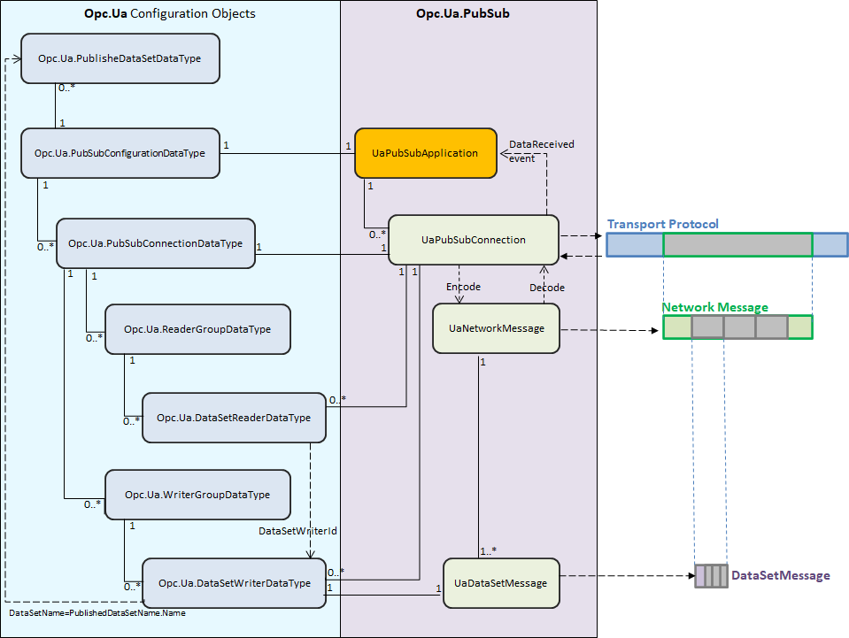

## PubSub 
## Overview

In software architecture, Publish/Subscribe is a messaging pattern where senders do not communicate directly with specific receivers. Instead senders, called Publishers, categorize messages into classes without knowing which receivers, if any, there may be. Similarly receivers, called Subscribers, express interest in one or more classes and only receive messages that are of interest, without knowing which senders, if any, there are.

In February 2018 the OPC Foundation published [Part 14 of the OPC UA Specification](https://reference.opcfoundation.org/v104/Core/docs/Part14/), version 1.04, specifying the OPC UA PubSub communication model. The OPC UA PubSub communication model defines an OPC UA Publish/Subscribe pattern instead of the client/server pattern defined by the services in [Part 4 of the OPC UA Specification](https://reference.opcfoundation.org/v104/Core/docs/Part4/).

OPC UA PubSub is designed to be flexible and is not bound to a particular messaging system.

## Decoupling by use of middleware

In OPC UA PubSub the participating OPC UA applications can assume the roles of Publishers and Subscribers. Publishers are the sources of data, while Subscribers consume that data. Communication in OPC UA PubSub is message-based. Publishers send messages to a Message-Oriented Middleware, without knowledge of what, if any, Subscribers there may be. Similarly, Subscribers express interest in specific types of data, and process messages that contain this data, without knowledge of what Publishers there are.

Message-Oriented Middleware is a software or hardware infrastructure that supports sending and receiving messages between distributed systems. The implementation of the message distribution depends on the Message-Oriented Middleware.

The image bellow illustrates that for communication Publishers and Subscribers only interact with the Message-Oriented Middleware which provides the means to receive data from one or more senders and forward data to one or more receivers:
PubSub Overview

To cover a large number of use cases, OPC UA PubSub supports two largely different Message-Oriented Middleware variants. These are:

 - A broker-less Message-Oriented Middleware is a network infrastructure that is able to route datagram-based messages. Subscribers and Publishers use datagram protocols like UDP. 

 - A broker-based Message-Oriented Middleware is a network infrastructure that uses a message Broker as core component. Subscribers and Publishers use standard messaging protocols like AMQP or MQTT to communicate with the Broker. All messages are published to specific queues (e.g. topics, nodes) that the Broker exposes and Subscribers can listen to these queues. The Broker may translate messages from the formal messaging protocol of the Publisher to the formal messaging protocol of the Subscriber.

## Synergy of Models

OPC UA PubSub and OPC UA Client/Server are both based on the OPC UA Information Model but there is no necessity for Publishers or Subscribers to be either an OPC UA Server or an OPC UA Client to participate in OPC UA PubSub communications.

The PubSub implementation is part of OPC UA .NET Standard Stack from OPC Foundation. It is totally decoupled from the Client/Server implementation but any Publisher or Subscriber component can easily be integrated into OPC UA Servers and OPC UA Clients.

Quite typically, a Publisher will be an OPC UA Server (the owner of information) and a Subscriber is often an OPC UA Client, but it is also possible that OPC UA Clients can be Publishers and OPC UA Servers can be Subscribers.

**PubSub Concepts**

The following image provides an overview of the Publisher and Subscriber entities. It illustrates the flow of messages from a Publisher to one or more Subscribers. The PubSub communication model supports many other scenarios; for example, a Publisher may send a DataSet to multiple Message-Oriented Middleware and a Subscriber may receive messages from multiple Publishers.

# Getting Started
## UaPubSubApplication Class

The *UAPubSubApplication* class is the root element of the OPC UA PubSub implementation.
The [Configuration API](#configuration-api) section describes how to configure a *UAPubSubApplication* object. 

*UAPubSubApplication* instances are created using the static Create() methods from the UAPubSubApplication class:

 - **Create(IUaPubSubDataStore dataStore)**
 Creates a *UAPubSubApplication* instance, with an empty configuration and associates it with the provided dataStore (see [IUaPubSubDataStore Interface](#iuapubsubdatastore-interface)).

 - **Create(string configFilePath, IUaPubSubDataStore dataStore = null)**
 Creates *UAPubSubApplication* from configuration file path and assigns the provided dataStore.

	 - If the *configFilePath* parameter is null or points to an non-existent file the method will throw an ArgumentException.   
	 - If the *dataStore* parameter is null or it is omitted, the dataStore will be initialized with a new instance of UaPubSubDataStore.

 - **Create(PubSubConfigurationDataType pubSubConfiguration = null, IUaPubSubDataStore dataStore = null)**  
Creates *UAPubSubApplication* from configuration object and dataStore.

	 - If the *pubSubConfiguration* parameter is null or omitted the *UaPubSubApplication* instance will be created with an empty configuration.
	 - If the *dataStore* parameter is null or it is omitted, the dataStore will be initialized with a new instance of UaPubSubDataStore.
Note: *UAPubSubApplication* configuration can be altered using the *UaPubSubConfigurator* Class instance associated with it.

The *UaPubSubApplication* class has the following read-only properties:

 - **SupportedTransportProfiles**  
Get the list of currently supported TransportProfileUri in OPC UA .NET Standard Stack from OPC Foundation. (See [PubSubConnection Parameters](pubsubconnection_parameters.htm) for more details).
 - **UaPubSubConfigurator**  
Gets a read-only copy of PubSubConfigurationDataType configuration object associated with this instance of UAPubSubApplication.
 - **DataStore**  
Gets the associated [IUaPubSubDataStore](#iuapubsubdatastore-interface) object. It can be a custom implementation that is provided when this instance of UaPubSubApplication object is created, or the default implementation provided by the OPC UA .NET Standard Stack from OPC Foundation. Publisher applications have the responsibility to populate this object with all DataValues that need to be published.

The *UaPubSubApplication* class has the following methods:

 - **Create**()  
A set of static methods specialized in creating and initializing instances of UAPubSubApplication. They are described at the beginning of this chapter.
 - **Start**()  
Starts all Publish/Subscribe jobs configured for this instance.  
This method must be called after creating and configuring an OPC UA Pub/Sub application in order to start the Publish/Subscribe functionality.
 - **Stop**()  
Stops Publish/Subscribe for this instance of UAPubSubApplication.

The *UaPubSubApplication* class has the following events:

 - **DataReceived**  
Event triggered when a NetworkMessage containing the configured DataSets in current application are received and decoded. This event will provide a SubscribedDataEventArgs object that will store the decoded NetworkMessage as an instance of UaNetworkMessage and the Source as string.

The following diagram highlights the *UAPubSubApplication* class within the PubSub Library from OPC UA .NET Standard Stack from OPC Foundation:

## IUaPubSubDataStore Interface

The IUaPubSubDataStore interface has 2 methods:

 - **WritePublishedDataItem**(NodeId nodeId, uint attributeId = Attributes.Value, DataValue dataValue = null)  
Stores a DataValue associated with a NodeId and an AttributeId. It shall be returned by ReadPublishedDataItem when requested for the specified identifiers (NodeId and AttributeId).
 - **ReadPublishedDataItem**(NodeId nodeId, uint attributeId = Attributes.Value)  
Reads the DataValue stored for the specific NodeId and AttributeId.  
This method is used when a network message is created and retrieves the values published by the Publisher.

OPC UA .NET Standard Stack from OPC Foundation  provides a default implementation of IUaPubSubDataStore in UaPubSubDataStore class. It stores and retrieves DataValues to be used by the Publish mechanism.

Each [UaPubSubApplication Class](#uapubsubapplication-class) instance can be created using an instance of IUaPubSubDataStore that is provided as parameter to its Create() method. If no IUaPubSubDataStore instance is provided, the default implementation will instantiate the UaPubSubDataStore class. At any time the associated IUaPubSubDataStore is available using UaPubSubApplication.DataStore property.

Note:  
It is important to feed the IUaPubSubDataStore object from current [UaPubSubApplication Class](#uapubsubapplication-class) with the data to be published.

The *IUaPubSubDataStore* instance that is passed to the *UaPubSubApplication* will be used to create the *DataCollector* object responsible to build the [DataSet ](#dataset-class) objects that are encoded and sent as part of NetworkMessages.

The following diagram highlights the *IUaPubSubDataStore* interface within the PubSub Library from OPC UA .NET Standard Stack from OPC Foundation:

## DataSet Class

The *DataSet* class contains the data published and received using the PubSub library. *DataSet* instances are created by the Publish mechanism and are afterwards written in DataSetMessage objects inside a NetworkMessage.

The *DataSet* class has the following properties:

 - **Name** - Represents the name of the data set coming from the corresponding DataSetMetaDataType configuration object.
 - **DataSetWriterId** - Gets or sets the DataSetWriterId producing this DataSet.
 - **SequenceNumber** - Gets SequenceNumber - a strictly monotonically increasing sequence number assigned by the publisher to each DataSetMessage sent.
 - **Fields** - Gets or sets a collection of Field objects representing the actual data of this DataSet.

The *Field* class contains the field data published and received using the PubSub Library. The *Field* class instances are delivered in *DataSet* object's Fields property.

The *Field* class has the following properties:

 - **Value** - Represents the value of current instance.
 - **TargetNodeId** - Represents the NodeId of the target node for the current field.
 - **TargetAttribute** - Represents the Attribute where the *Field* value shall be written.
 - **FieldMetaData** - Get configured FieldMetaData object for this *Field* instance.

The following diagram highlights the *DataSet* class within the PubSub Liberary from OPC UA .NET Standard Stack from OPC Foundation:

## UADP and MQTT NetworkMessages

The PubSub Library can handle **UADP** and **MQTT** network messages.

The *TransportProfileUri* property of the *PubSubConnectionDataType* configuration object dictates the type of messages that are sent and also the network protocol that is used.

When the *TransportProfileUri* is:

 1. "http://opcfoundation.org/UA-Profile/Transport/pubsub-udp-uadp"

The PubSub Library will create UadpNetworkMessage and  UadpDataSetMessage objects that will be transported over UDP.

 2. "http://opcfoundation.org/UA-Profile/Transport/pubsub-mqtt-uadp"

The PubSub Library will create UadpNetworkMessage and  UadpDataSetMessage objects that will be transported over MQTT.

 3. "http://opcfoundation.org/UA-Profile/Transport/pubsub-mqtt-json"

The PubSub Library will create JsonNetworkMessage and  JsonDataSetMessage objects that will be transported over MQTT.

The following diagram shows the classes involved in creating the NetworkMessage that is published over the selected protocol:

# Configuration API
## PubSub Configuration

The Publishers and Subscribers are configured using the data types defined in the OPC UA version 1.04 address space. 

A *PubSubConfigurationDataType* object is the root container for all configuration objects within a PubSub application implemented using **OPC UA .NET Standard Stack from OPC Foundation**.

The following diagram shows a simplified class diagram for the Opc.Ua classes involved in PubSub configuration:

OPC UA .NET Standard Stack from OPC Foundation provides the API for creating and managing PubSub configuration, all in one class called: **UaPubSubConfigurator**.

## UaPubSubConfigurator class
The *UaPubSubConfigurator* class It is instantiated by default for any new instance of [UaPubSubApplication Class](#uapubsubapplication-class). This instance shall be used to change the PubSub configuration at runtime by calling its specific methods. The changes are reflected in the behaviour of the PubSub application.

**Note**: The properties of configuration objects added to the *UaPubSubConfigurator* class shall not be changed after they are added to the configuration.

The *UaPubSubConfigurator* class has the following methods:

 - **LoadConfiguration**()  
Loads the configuration from a file path or from a PubSubConfigurationDataType instance and raises the corresponding Added events for all the objects added from that configuration. It can entirely replace the configuration if the parameter replaceExisting is set on true, or it can append to existing configuration the contents of the new configuration.

 - **Enable**()  
Tries to set the [PubSubState](#pubsubstate) of the specified configuration object to Operational and if successful raises the PubSubStateChanged event for all configuration objects that changed their state because of this action.
If the configuration object that is specified does not have status = Disabled the method will return BadInvalidState status code without any effect.
 - **Disable**()  
Tries to set the [PubSubState](#pubsubstate) of the specified configuration object to Disabled and if successful raises the PubSubStateChanged event for all configuration objects that changed their state because of this action.
If the configuration object that is specified has status = Disabled the method will return BadInvalidState status code without any effect.

 - **AddPublishedDataSet**(PublishedDataSetDataType publishedDataSetDataType)  
Adds the specified publishedDataSetDataType object to current configuration and raises the PublishedDataSetAdded event.
The UaPubSubConfigurator will assign a unique configuration id to this newly added configuration object that will be useful for finding it at a later point using the Find methods.
If the provided publishedDataSetDataType object has an already used name then BadBrowseNameDuplicated status code is returned and the dataset is not added to the configuration.

 - **RemovePublishedDataSet**()  
Removes the specified published data set object from configuration and raises the PublishedDataSetRemoved event.
If the configuration cannot find the object to remove then it will return BadNodeIdUnknown status code.

 - **AddExtensionField**(uint publishedDataSetConfigId, KeyValuePair extensionField)  
Adds the specified extensionField object to the specified publishedDataSet and raises the ExtensionFieldAdded event.
The UaPubSubConfigurator will assign a unique configuration id to this newly added configuration object that will be useful for finding it at a later point using the Find methods.
If the provided extensionField object has an already used name then BadNodeIdExists status code is returned and the extension field is not added to the configuration.

 - **RemoveExtensionField**()  
Removes the specified extension field from parent published data set and raises the ExtensionFieldRemoved event.
If the configuration cannot find the object to remove then it will return BadNodeIdUnknown status code.

 - **AddConnection**(PubSubConnectionDataType pubSubConnectionDataType)  
Adds the specified pubSubConnectionDataType object to current configuration and raises the ConnectionAdded event.
The UaPubSubConfigurator will assign a unique configuration id to this newly added configuration object that will be useful for finding it at a later point using the Find methods.
If the provided pubSubConnectionDataType object has an already used name then BadBrowseNameDuplicated status code is returned and the connection is not added to the configuration.

 - **RemoveConnection**()  
Removes the specified connection object from configuration and raises ConnectionRemoved event.
If the configuration cannot find the object to remove then it will return BadNodeIdUnknown status code.

 - **AddWriterGroup**(uint parentConnectionId, WriterGroupDataType writerGroupDataType)  
Adds the specified writerGroupDataType object to current configuration as a child of the connection specified by parentConnectionId and raises the WriterGroupAdded event.
The UaPubSubConfigurator will assign a unique configuration id to this newly added configuration object that will be useful for finding it at a later point using the Find methods.
If the provided writerGroupDataType object has an already used name then BadBrowseNameDuplicated status code is returned and the writer group is not added to the configuration.

 - **RemoveWriterGroup**()  
Removes the specified writer group object from configuration and raises WriterGroupRemoved event.
If the configuration cannot find the object to remove then it will return BadNodeIdUnknown status code.

 - **AddDataSetWriter**(uint parentWriterGroupId, DataSetWriterDataType dataSetWriterDataType)  
Adds the specified dataSetWriterDataType object to current configuration as a child of the writer group specified by parentWriterGroupId and raises the DataSetWriterAdded event.
The UaPubSubConfigurator will assign a unique configuration id to this newly added configuration object that will be useful for finding it at a later point using the Find methods.
If the provided dataSetWriterDataType object has an already used name then BadBrowseNameDuplicated status code is returned and the dataset writer is not added to the configuration.

 - **RemoveDataSetWriter**()  
Removes the specified dataset writer object from configuration and raises DataSetWriterRemoved event.
If the configuration cannot find the object to remove then it will return BadNodeIdUnknown status code.

 - **AddReaderGroup**(uint parentConnectionId, ReaderGroupDataType readerGroupDataType)  
Adds the specified readerGroupDataType object to current configuration as a child of the connection specified by parentConnectionId and raises the ReaderGroupAdded event.
The UaPubSubConfigurator will assign a unique configuration id to this newly added configuration object that will be useful for finding it at a later point using the Find methods.
If the provided readerGroupDataType object has an already used name then BadBrowseNameDuplicated status code is returned and the reader group is not added to the configuration.

 - **RemoveReaderGroup**()  
Removes the specified reader group object from configuration and raises ReaderGroupRemoved event.
If the configuration cannot find the object to remove then it will return BadNodeIdUnknown status code.

 - **AddDataSetReader**(uint parentReaderGroupId, DataSetReaderDataType dataSetReaderDataType)  
Adds the specified dataSetReaderDataType object to current configuration as a child of the reader group specified by parentReaderGroupId and raises the DataSetReaderAdded event.
The UaPubSubConfigurator will assign a unique configuration id to this newly added configuration object that will be useful for finding it at a later point using the Find methods.
If the provided dataSetReaderDataType object has an already used name then BadBrowseNameDuplicated status code is returned and the dataset reader is not added to the configuration.

 - **RemoveDataSetReader**()  
Removes the specified dataset reader object from configuration and raises DataSetReaderRemoved event.
If the configuration cannot find the object to remove then it will return BadNodeIdUnknown status code.

The following image shows the relation between *UaPubSubConfigurator*'s methods and the events they are triggering.

*UaPubSubConfigurator* class assigns a unique configuration id to every configuration object added to current configuration by Add methods or by LoadConfiguration method. It provides methods that find the configuration id for a configuration object (**FindIdForObject**() method) or they can find the configuration object by id (**FindObjectById**() method) .

UaPubSubConfigurator class provides also methods for finding the  [PubSubState](#pubsubstate)  value for any of its configured objects that support it:

 - **FindStateForId**() method returns the PubSubState for the configuration object that has the specified configuration id.
 - **FindStateForObject**() method returns the PubSubState for the specified configuration object.
 
## PubSubState

The *PubSubState* is used to expose and control the operation of a PubSub component. It is an enumeration and the possible values are described in the following table:

| Value |Description |
|-----|-----|
| Disabled(0) |The PubSub component is configured but currently disabled.  |
| Paused(1) |The PubSub component is enabled but currently paused by a parent component. The parent component is either Disabled or Paused.  |
| Operational(2)|The PubSub component is operational. |
| Error(3) |PubSub component is in an error state. |

The image below shows the PubSub components that have a PubSub state and their parent-child relationship. State changes of children are based on changes of the parent state. The root of the hierarchy is the PublishSubscribe component and, if part an on OPC UA server it is located under Server node and has the well known NodeId = ObjectIds.PublishSubscribe.

The Configuration API from [UaPubSubConfigurator class](#uapubsubconfigurator-class) is responsible for changing PubSub components states using the Enable() and Disable() methods. It will raise a PubSubStateChanged event for each PubSub component whose state was changed according to the PubSubState state machine transitions described in the following picture:

