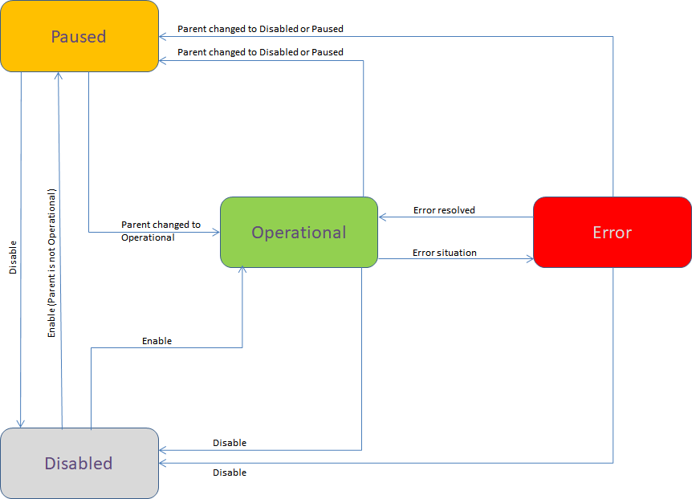

# PubSubState

The *PubSubState* is used to expose and control the operation of a PubSub component. It is an enumeration and the possible values are described in the following table:

| Value |Description |
|-----|-----|
| Disabled(0) |The PubSub component is configured but currently disabled.  |
| Paused(1) |The PubSub component is enabled but currently paused by a parent component. The parent component is either Disabled or Paused.  |
| Operational(2)|The PubSub component is operational. |
| Error(3) |PubSub component is in an error state. |

The image below shows the PubSub components that have a PubSub state and their parent-child relationship. State changes of children are based on changes of the parent state. The root of the hierarchy is the PublishSubscribe component and, if part an on OPC UA server it is located under Server node and has the well known NodeId = ObjectIds.PublishSubscribe.

The Configuration API from [UaPubSubConfigurator](PubSub_UaPubSubConfigurator.md) class is responsible for changing PubSub components states using the Enable() and Disable() methods. It will raise a PubSubStateChanged event for each PubSub component whose state was changed according to the PubSubState state machine transitions described in the following picture:

