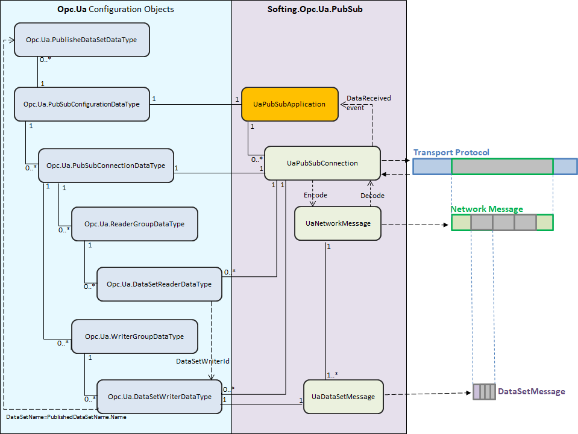

# UaPubSubApplication Class

The *UAPubSubApplication* class is the root element of the OPC UA PubSub implementation.

*UAPubSubApplication* instances are created using the static Create() methods from the UAPubSubApplication class:

    public static UaPubSubApplication Create(IUaPubSubDataStore dataStore)

Creates a UAPubSubApplication instance, with an empty configuration and associates it with the provided dataStore.

    public static UaPubSubApplication Create(string configFilePath, IUaPubSubDataStore dataStore = null)

Creates UAPubSubApplication from configuration file path and assigns the provided dataStore.

 - If the configFilePath parameter is null or points to an non-existent file the method will throw an ArgumentException.   
 - If the dataStore parameter is null or it is omitted, the dataStore will be initialized with a new instance of UaPubSubDataStore.

    public static UaPubSubApplication Create(PubSubConfigurationDataType pubSubConfiguration = null, IUaPubSubDataStore dataStore = null)  

Creates UAPubSubApplication from configuration object and dataStore.

 - If the pubSubConfiguration parameter is null or omitted the UaPubSubApplication instance will be created with an empty configuration.
 - If the dataStore parameter is null or it is omitted, the dataStore will be initialized with a new instance of UaPubSubDataStore.
Note: UAPubSubApplication configuration can be altered using the [UaPubSubConfigurator Class](PubSub_UaPubSubConfigurator.md) instance associated with it.

The *UaPubSubApplication* class has the following read-only properties:

 - **SupportedTransportProfiles**  
Get the list of currently supported TransportProfileUri in OPC UA .NET Standard Stack from OPC Foundation. (See [PubSubConnection Parameters](pubsubconnection_parameters.htm) for more details).
 - **UaPubSubConfigurator**  
Gets a read-only copy of PubSubConfigurationDataType configuration object associated with this instance of UAPubSubApplication.
 - **DataStore**  
Gets the associated IUaPubSubDataStore object. It can be a custom implementation that is provided when this instance of UaPubSubApplication object is created, or the default implementation provided by the OPC UA .NET Standard Stack from OPC Foundation. Publisher applications have the responsibility to populate this object with all DataValues that need to be published.

The *UaPubSubApplication* class has the following methods:

 - **Create**()  
A set of static methods specialized in creating and initializing instances of UAPubSubApplication. They are described at the beginning of this chapter.
 - **Start**()  
Starts all Publish/Subscribe jobs configured for this instance.  
This method must be called after creating and configuring an OPC UA Pub/Sub application in order to start the Publish/Subscribe functionality.
 - **Stop**()  
Stops Publish/Subscribe for this instance of UAPubSubApplication.

The *UaPubSubApplication* class has the following events:

 - **DataReceived**  
Event triggered when a NetworkMessage containing the configured DataSets in current application are received and decoded. This event will provide a SubscribedDataEventArgs object that will store the decoded NetworkMessage as an instance of UaNetworkMessage and the Source as string.

The following diagram highlights the *UAPubSubApplication* class within the PubSub component from OPC UA .NET Standard Stack from OPC Foundation:
