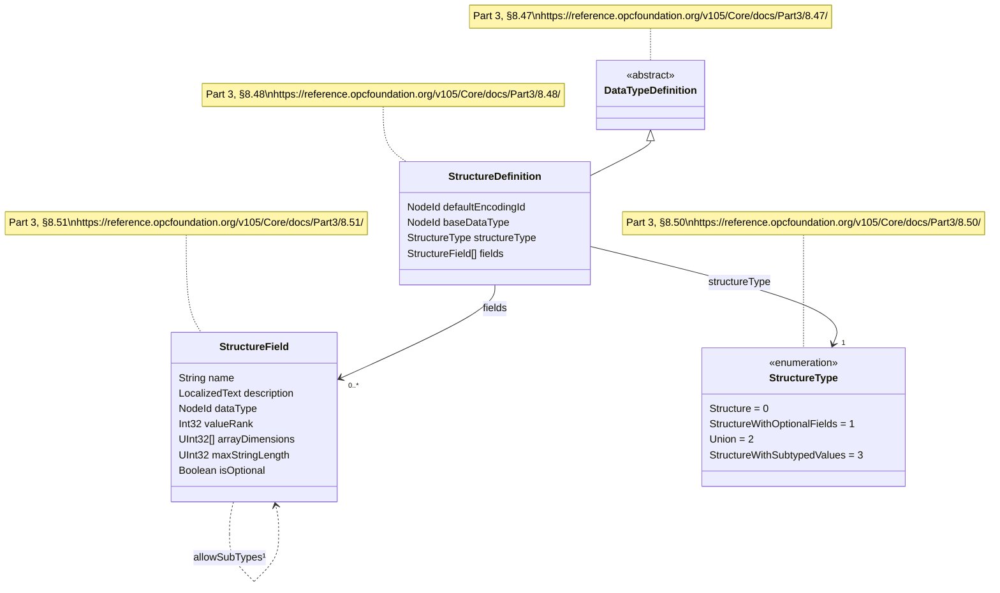

# OPC UA Structure Encoding Decision Tree

A reference guide for encoding and decoding structure fields in OPC UA binary encoding, based on the `StructureDefinition` and `StructureField` metadata.

## Class Diagram



> ¹ The `AllowSubTypes` flag was added in OPC UA 1.05.02 as part of the `StructureWithSubtypedValues` feature. It is encoded as a flag on the `StructureField` in the `DataTypeDefinition` attribute. See [Part 3, §5.8.3](https://reference.opcfoundation.org/v105/Core/docs/Part3/5.8.3/).

### StructureDefinition Members

| Member | Type | Description | Spec Reference |
|--------|------|-------------|----------------|
| `defaultEncodingId` | `NodeId` | NodeId of the default DataTypeEncoding node for this structure | [Part 3, §8.48](https://reference.opcfoundation.org/v105/Core/docs/Part3/8.48/) |
| `baseDataType` | `NodeId` | NodeId of the direct supertype DataType | [Part 3, §8.48](https://reference.opcfoundation.org/v105/Core/docs/Part3/8.48/) |
| `structureType` | `StructureType` | Enum controlling the overall encoding strategy (see below) | [Part 3, §8.48](https://reference.opcfoundation.org/v105/Core/docs/Part3/8.48/) |
| `fields` | `StructureField[]` | Ordered list of fields including inherited fields from supertypes | [Part 3, §8.48](https://reference.opcfoundation.org/v105/Core/docs/Part3/8.48/) |

### StructureField Members

| Member | Type | Description | Spec Reference |
|--------|------|-------------|----------------|
| `name` | `String` | Field name, unique within the structure | [Part 3, §8.51](https://reference.opcfoundation.org/v105/Core/docs/Part3/8.51/) |
| `description` | `LocalizedText` | Human-readable field description | [Part 3, §8.51](https://reference.opcfoundation.org/v105/Core/docs/Part3/8.51/) |
| `dataType` | `NodeId` | The DataType of the field value | [Part 3, §8.51](https://reference.opcfoundation.org/v105/Core/docs/Part3/8.51/) |
| `valueRank` | `Int32` | Scalar (−1), OneDimension (1), or n-dimensional (>1) | [Part 3, §8.51](https://reference.opcfoundation.org/v105/Core/docs/Part3/8.51/) |
| `arrayDimensions` | `UInt32[]` | Fixed dimensions for array fields (empty if not fixed) | [Part 3, §8.51](https://reference.opcfoundation.org/v105/Core/docs/Part3/8.51/) |
| `maxStringLength` | `UInt32` | Maximum length for String/ByteString fields (0 = unlimited) | [Part 3, §8.51](https://reference.opcfoundation.org/v105/Core/docs/Part3/8.51/) |
| `isOptional` | `Boolean` | Whether this field may be absent (only valid when `structureType = StructureWithOptionalFields`) | [Part 3, §8.51](https://reference.opcfoundation.org/v105/Core/docs/Part3/8.51/) |

> **Note:** The `AllowSubTypes` flag is not a separate member of `StructureField`. It is inferred from the `structureType` being `StructureWithSubtypedValues` (3) combined with the field's `dataType` pointing to an abstract DataType. Pre-1.05.02, such fields were declared with `dataType = Structure`; post-1.05.02, the actual abstract base type is used. See [OPC Foundation Forum discussion](https://reference.opcfoundation.org/opcfoundation_org/forum/opc-ua-standard/encoding-of-data-type-fields-which-use-abstract-data-types/index.html).

### StructureType Enum

| Value | Name | Description | Spec Reference |
|-------|------|-------------|----------------|
| 0 | `Structure` | All fields are mandatory, encoded sequentially | [Part 3, §8.50](https://reference.opcfoundation.org/v105/Core/docs/Part3/8.50/) |
| 1 | `StructureWithOptionalFields` | Some fields may be absent; a bitmask prefix indicates presence | [Part 3, §8.50](https://reference.opcfoundation.org/v105/Core/docs/Part3/8.50/) |
| 2 | `Union` | Only one field is active; a switch field indicates which | [Part 3, §8.50](https://reference.opcfoundation.org/v105/Core/docs/Part3/8.50/) |
| 3 | `StructureWithSubtypedValues` | Fields may contain subtypes of their declared DataType, encoded as ExtensionObjects | [Part 3, §8.50](https://reference.opcfoundation.org/v105/Core/docs/Part3/8.50/) |

---

## Encoding Decision Tree

### Step 1 — Structure-Level Prefix

Before encoding any fields, determine the prefix based on `StructureType`:

```
StructureType = ?
│
├─ 0: Structure
│   PREFIX: (none)
│   All fields encoded sequentially in definition order.
│   [Part 6, §5.2.7]
│
├─ 1: StructureWithOptionalFields
│   PREFIX: UInt32 EncodingMask
│   One bit per optional field (bit 0 = first optional field).
│   Mandatory fields always encoded; optional fields only if their bit = 1.
│   [Part 6, §5.2.7]
│
├─ 2: Union
│   PREFIX: UInt32 SwitchField
│   Value 0 = null (no field encoded).
│   Value N = the Nth field (1-based) is the active field.
│   Only the active field is encoded after the switch.
│   [Part 6, §5.2.7]
│
└─ 3: StructureWithSubtypedValues
    PREFIX: (none)
    All fields encoded sequentially.
    Fields whose DataType is abstract are wrapped in ExtensionObject.
    [Part 6, §5.2.7]
```

> **Spec Reference:** The structure-level encoding rules for all four `StructureType` values are defined in [Part 6, §5.2.7](https://reference.opcfoundation.org/v105/Core/docs/Part6/5.2.7/). See also [Part 6, §5.2.2.15](https://reference.opcfoundation.org/v105/Core/docs/Part6/5.2.2/) for ExtensionObject binary encoding.

### Step 2 — Per-Field Presence

For each `StructureField`, determine whether it is encoded in this instance:

```
For StructureField F:
│
├─ Is StructureType = Union?
│  ├─ F is the active field (matches SwitchField) → ENCODE
│  └─ F is not active → SKIP entirely
│
├─ Is F.isOptional = true?  (StructureType must be 1)
│  ├─ EncodingMask bit is SET → ENCODE
│  └─ EncodingMask bit is CLEAR → SKIP entirely (no placeholder bytes)
│
└─ Otherwise (mandatory) → ENCODE (always present)
```

> **Spec Reference:** Optional field handling via encoding mask is defined in [Part 6, §5.2.7](https://reference.opcfoundation.org/v105/Core/docs/Part6/5.2.7/). The `isOptional` field property is defined in [Part 3, §8.51](https://reference.opcfoundation.org/v105/Core/docs/Part3/8.51/).

### Step 3 — Field Value Encoding

When a field IS present, determine the wire format based on its DataType:

```
How to encode the VALUE of field F with DataType D:
│
├─ Is StructureType = StructureWithSubtypedValues (3)
│  AND is D an abstract DataType (IsAbstract = true on the DataType node)?
│  │
│  └─ YES → Encode as ExtensionObject
│           Wire format: [NodeId TypeId] [Byte Encoding] [Int32 Length] [Bytes Body]
│           TypeId = the DataTypeEncoding NodeId of the concrete instance.
│           This allows the decoder to identify and decode the actual subtype.
│           [Part 6, §5.2.2.15] [Part 3, §5.8.3]
│
├─ Is D a built-in type?
│  │  (Boolean, SByte, Byte, Int16, UInt16, Int32, UInt32, Int64, UInt64,
│  │   Float, Double, String, DateTime, Guid, ByteString, NodeId,
│  │   ExpandedNodeId, StatusCode, QualifiedName, LocalizedText,
│  │   DiagnosticInfo, XmlElement)
│  │
│  └─ YES → Encode INLINE per built-in type rules
│           Integers: little-endian byte order
│           Floats/Doubles: IEEE 754 binary representation
│           Strings: [Int32 byteLength] [UTF-8 bytes] (−1 = null)
│           ByteStrings: [Int32 length] [bytes] (−1 = null)
│           [Part 6, §5.2.2]
│
├─ Is D an Enumeration DataType?
│  │
│  └─ YES → Encode as Int32 (the enumeration's integer value)
│           [Part 6, §5.2.4]
│
├─ Is D a concrete Structure or Union subtype (IsAbstract = false)?
│  │
│  └─ YES → Encode INLINE (recursively apply this entire decision tree)
│           The nested structure follows its own StructureType rules.
│           No ExtensionObject wrapper — the decoder knows the exact type
│           from F.dataType in the StructureDefinition.
│           [Part 6, §5.2.7]
│
└─ Is D abstract but StructureType ≠ 3?
   │  (Legacy scenario, pre-1.05.02)
   │
   └─ The field DataType was declared as "Structure" (i=22) or another
      abstract type. Encode as ExtensionObject — the TypeId in the
      ExtensionObject header identifies the concrete type.
      [Part 6, §5.2.2.15]
```

> **Spec Reference:** Built-in type encoding: [Part 6, §5.2.2](https://reference.opcfoundation.org/v104/Core/docs/Part6/5.2.2/). Enumeration encoding: [Part 6, §5.2.4](https://reference.opcfoundation.org/v104/Core/docs/Part6/5.2.4/). Structure/Union encoding: [Part 6, §5.2.7](https://reference.opcfoundation.org/v105/Core/docs/Part6/5.2.7/). ExtensionObject encoding: [Part 6, §5.2.2.15](https://reference.opcfoundation.org/v104/Core/docs/Part6/5.2.2/). `IsAbstract` attribute: [Part 3, §5.8.3](https://reference.opcfoundation.org/v105/Core/docs/Part3/5.8.3/).

### Step 4 — Array Handling

If `F.valueRank ≠ −1` (i.e., the field is an array), the value encoding from Step 3 is wrapped:

```
F.valueRank = ?
│
├─ −1 (Scalar)
│   Encode single value per Step 3.
│   [Part 6, §5.2.5]
│
├─ 1 (OneDimension)
│   [Int32 ArrayLength] [Element₀] [Element₁] ... [ElementN₋₁]
│   ArrayLength = −1 for null arrays, 0 for empty arrays.
│   Each element encoded per Step 3.
│   [Part 6, §5.2.5]
│
└─ >1 (MultiDimension)
    [Int32 TotalElements] [Element₀] ... [ElementN₋₁]
    [Int32 NumDimensions] [Int32 Dim₀] [Int32 Dim₁] ...
    Elements serialized in row-major order.
    [Part 6, §5.2.5]
```

> **Spec Reference:** Array encoding rules are defined in [Part 6, §5.2.5](https://reference.opcfoundation.org/v104/Core/docs/Part6/5.2.5/).

---

## Summary Tables

### Structure-Level Encoding

| StructureType | Value | Prefix | Field Presence | Spec |
|---|---|---|---|---|
| `Structure` | 0 | None | All mandatory, sequential | [Part 6, §5.2.7](https://reference.opcfoundation.org/v105/Core/docs/Part6/5.2.7/) |
| `StructureWithOptionalFields` | 1 | `UInt32` bitmask | Mandatory always; optional if bit set | [Part 6, §5.2.7](https://reference.opcfoundation.org/v105/Core/docs/Part6/5.2.7/) |
| `Union` | 2 | `UInt32` switch (1-based) | Only the active field | [Part 6, §5.2.7](https://reference.opcfoundation.org/v105/Core/docs/Part6/5.2.7/) |
| `StructureWithSubtypedValues` | 3 | None | All mandatory, sequential | [Part 6, §5.2.7](https://reference.opcfoundation.org/v105/Core/docs/Part6/5.2.7/) |

### Per-Field Value Encoding

| Condition | Encoding | Spec |
|---|---|---|
| Built-in type (Int32, String, etc.) | Inline per type rules | [Part 6, §5.2.2](https://reference.opcfoundation.org/v104/Core/docs/Part6/5.2.2/) |
| Enumeration | `Int32` | [Part 6, §5.2.4](https://reference.opcfoundation.org/v104/Core/docs/Part6/5.2.4/) |
| Concrete Structure/Union | Inline, recursive | [Part 6, §5.2.7](https://reference.opcfoundation.org/v105/Core/docs/Part6/5.2.7/) |
| Abstract DataType + `StructureWithSubtypedValues` | `ExtensionObject` wrapper | [Part 6, §5.2.2.15](https://reference.opcfoundation.org/v104/Core/docs/Part6/5.2.2/) |
| Abstract DataType (legacy pre-1.05.02) | `ExtensionObject` wrapper | [Part 6, §5.2.2.15](https://reference.opcfoundation.org/v104/Core/docs/Part6/5.2.2/) |
| `isOptional = true`, bit clear | Not encoded (skipped) | [Part 6, §5.2.7](https://reference.opcfoundation.org/v105/Core/docs/Part6/5.2.7/) |
| Array (`valueRank ≥ 1`) | `[Int32 length] [elements...]` | [Part 6, §5.2.5](https://reference.opcfoundation.org/v104/Core/docs/Part6/5.2.5/) |

### Constraints

| Rule | Spec |
|---|---|
| `isOptional` and `AllowSubTypes` are mutually exclusive on a field | [Part 3, §5.8.3](https://reference.opcfoundation.org/v105/Core/docs/Part3/5.8.3/), [Forum](https://reference.opcfoundation.org/opcfoundation_org/forum/opc-ua-standard/structure-with-subtyping-and-optional-fields/) |
| `isOptional = true` only valid when `structureType = StructureWithOptionalFields` | [Part 3, §8.51](https://reference.opcfoundation.org/v105/Core/docs/Part3/8.51/) |
| `AllowSubTypes` only valid when `structureType = StructureWithSubtypedValues` | [Part 3, §8.50](https://reference.opcfoundation.org/v105/Core/docs/Part3/8.50/) |
| `fields` array includes inherited fields from the supertype chain | [Part 3, §8.48](https://reference.opcfoundation.org/v105/Core/docs/Part3/8.48/) |
| `DataTypeDefinition` is mandatory for DataTypes derived from Structure or Union | [Part 3, §5.8.3](https://reference.opcfoundation.org/v105/Core/docs/Part3/5.8.3/) |

---

## ExtensionObject Wire Format

When a field is encoded as an `ExtensionObject` ([Part 6, §5.2.2.15](https://reference.opcfoundation.org/v104/Core/docs/Part6/5.2.2/)):

```
┌──────────────┬───────────────┬──────────────┬──────────────────────┐
│ NodeId TypeId│ Byte Encoding │ Int32 Length  │ Byte[] Body          │
│ (variable    │ 0x00 = none   │ (present if  │ (encoded per the     │
│  length)     │ 0x01 = binary │  body exists)│  concrete type's     │
│              │ 0x02 = xml    │              │  StructureDefinition)│
└──────────────┴───────────────┴──────────────┴──────────────────────┘
```

| Field | Description | Spec |
|-------|-------------|------|
| **TypeId** | `NodeId` of the concrete type's DataTypeEncoding node (the "Default Binary" encoding node reachable via `HasEncoding` from the DataType node) | [Part 3, §5.8.3](https://reference.opcfoundation.org/v105/Core/docs/Part3/5.8.3/) |
| **Encoding** | `0x01` for OPC UA Binary, `0x02` for XML | [Part 6, §5.2.2.15](https://reference.opcfoundation.org/v104/Core/docs/Part6/5.2.2/) |
| **Length** | Total byte length of Body; omitted if Encoding = `0x00` | [Part 6, §5.2.2.15](https://reference.opcfoundation.org/v104/Core/docs/Part6/5.2.2/) |
| **Body** | The structure's fields encoded per its own `StructureDefinition` | [Part 6, §5.2.7](https://reference.opcfoundation.org/v105/Core/docs/Part6/5.2.7/) |

---

## Version History

| OPC UA Version | Change | Spec Reference |
|----------------|--------|----------------|
| 1.04 | `DataTypeDefinition` attribute introduced; `StructureWithOptionalFields` and `Union` added | [Part 3, §8.48](https://reference.opcfoundation.org/v105/Core/docs/Part3/8.48/) |
| 1.05.02 | `StructureWithSubtypedValues` (value 3) added; `AllowSubTypes` flag formalized; replaces the pre-1.04 pattern of declaring abstract fields as `Structure` | [Part 3, §8.50](https://reference.opcfoundation.org/v105/Core/docs/Part3/8.50/), [Forum](https://reference.opcfoundation.org/opcfoundation_org/forum/opc-ua-standard/ua-1-05-02-change-in-handling-of-structure-types/) |

---

## Full Specification References

| Document | Section | Topic | URL |
|----------|---------|-------|-----|
| OPC 10000-3 | §5.8.3 | DataType NodeClass, IsAbstract, DataTypeDefinition | [Link](https://reference.opcfoundation.org/v105/Core/docs/Part3/5.8.3/) |
| OPC 10000-3 | §8.47 | DataTypeDefinition (abstract base) | [Link](https://reference.opcfoundation.org/v105/Core/docs/Part3/8.47/) |
| OPC 10000-3 | §8.48 | StructureDefinition | [Link](https://reference.opcfoundation.org/v105/Core/docs/Part3/8.48/) |
| OPC 10000-3 | §8.49 | EnumDefinition | [Link](https://reference.opcfoundation.org/v105/Core/docs/Part3/8.49/) |
| OPC 10000-3 | §8.50 | StructureType enumeration | [Link](https://reference.opcfoundation.org/v105/Core/docs/Part3/8.50/) |
| OPC 10000-3 | §8.51 | StructureField | [Link](https://reference.opcfoundation.org/v105/Core/docs/Part3/8.51/) |
| OPC 10000-6 | §5.2.2 | Built-in Types Binary Encoding | [Link](https://reference.opcfoundation.org/v104/Core/docs/Part6/5.2.2/) |
| OPC 10000-6 | §5.2.4 | Enumeration Encoding | [Link](https://reference.opcfoundation.org/v104/Core/docs/Part6/5.2.4/) |
| OPC 10000-6 | §5.2.5 | Array Encoding | [Link](https://reference.opcfoundation.org/v104/Core/docs/Part6/5.2.5/) |
| OPC 10000-6 | §5.2.7 | Structure, Union, and Optional Field Encoding | [Link](https://reference.opcfoundation.org/v105/Core/docs/Part6/5.2.7/) |
| OPC 10000-6 | §5.2.2.15 | ExtensionObject Binary Encoding | [Link](https://reference.opcfoundation.org/v104/Core/docs/Part6/5.2.2/) |
