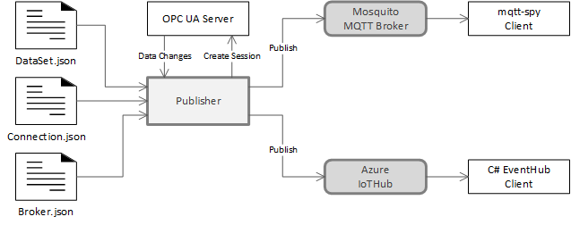
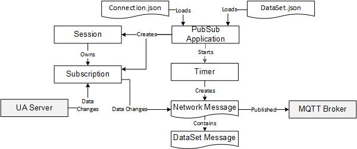

# OPC Foundation MQTT Prototype Readme
## Overview
This code demonstrates the use of OPC UA PubSub over MQTT using the JSON encoding.
The components of the prototype are shown in Figure 1.



The OPC UA Server is any OPC UA Server. 

The Publisher is the prototype application that subscribes to the OPC UA Server, constructs PubSub messages and sends them to the specified MQTT broker. 

The prototype has been tested with 2 standard MQTT brokers: Mosquito broker (see Setting Up the Mosquito MQTT Broker) and the Azure IoT Hub (see Setting up Azure IoT Hub). The information needed to connect to a broker (address, user credentials) are stored in the “broker.json” file.

The “connection.json” file is an instance of the PubSubConnectionDataType serialized with the JSON encoding. It specifies the parameters for the PubSubConnection, WriterGroups and DataSetWriters which the Publisher is configured to use. A publisher that was also a OPC UA server would expose this information in its address space. In a complete publisher implementation the connection would specify a specific broker, however, the prototype uses the “broker.json” file passed on the command line instead.

The WriterGroups defined in “connection.json” file control the format of the NetworkMessages sent to the broker. The prototype provides two WriterGroups: one which constructs a minimal message using non-reversible JSON encoding and one which constructs a message with complete detail (see Example MQTT Messages). 

The DataSetWriters reference DataSets which are defined in a “dataset.json” file of the same name. The “dataset.json” file contains the mappings to NodeIds defined in the OPC UA server. This file needs to be changed before the Publisher can connect to a different OPC UA Server.
## Software
The components of the prototype application are shown in Figure 2.



The PubSubApplication loads the connection.json file and creates the Sessions and Subscriptions necessary to collect the data to publish. It then loads the dataset.job files referenced by the connection.json file and creates the monitored items specified for the specfied variables.

When the data changes arrive from the server they are cached by the MonitoredItem objects. The timer that runs at the publishing interval specified in the connection.json will construct a JSON NetworkMessage with the current values and publish it to the broker. 

## Command Line Parameters
Parameter | Short Form | Description
-|-|-
-h|-help|show this message and exit.
-s|-source|the URL for the source of the data to publish.
-c|-config|the connection configuration file to use.
-b|-broker|the broker configuration file to use.
          
Example:
```bash
-s=opc.tcp://localhosr:62547/Quickstarts/DataAccessServer -c=localhost-connection.json -b=mosquito-localhost.json
```
The prototype code includes Quickstarts.DataAccessServer.exe which is an OPC UA server with an address space referenced by boiler01-dataset.json. Build and run this application before running the PubSub samples.

## Building
The prototype requires Visual Studio 2017 and the .NET 4.6 and Core 2.0 frameworks.

Open "MQTT Prototype.sln" in Visual Studio and build.

Binaries are automatically written to the 'build' subdirectory.

## Sample Messages
### Minimal Message Using Non-Reversible JSON Encoding
```json
{
  "BoilerId": "Boiler #1",
  "DrumLevel": 125,
  "DrumLevel.EURange": {
    "Low": 64,
    "High": 164
  },
  "DrumLevel.EngineeringUnits": {
    "NamespaceUri": "http://opcfoundation.org/Quickstarts/DataAccess",
    "DisplayName": "liters"
  },
  "FlowSetPoint": 2,
  "LevelSetPoint": 2,
  "InputPipeFlow": 95,
  "OutputPipeFlow": 78
}
```

### Full Message Using Reversible JSON Encoding
```json
{
  "MessageId": "32235546-05d9-4fd7-97df-ea3ff3408574",
  "MessageType": "ua-data",
  "PublisherId": "MQTT-Localhost",
  "DataSetClassId": "2dc07ece-cab9-4470-8f8a-2c1ead207e0e",
  "Messages": [
    {
      "DataSetWriterId": "1",
      "SequenceNumber": 224,
      "MetaDataVersion": {
        "MajorVersion": 1,
        "MinorVersion": 1
      },
      "Payload": {
        "BoilerId": {
          "Value": {
            "Type": 12,
            "Body": "Boiler #1"
          },
          "SourceTimestamp": "2018-03-25T13:32:20.7604426Z"
        },
        "DrumLevel": {
          "Value": {
            "Type": 10,
            "Body": 99
          },
          "SourceTimestamp": "2018-03-25T13:32:20.3198208Z"
        },
        "DrumLevel.EURange": {
          "Value": {
            "Type": 22,
            "Body": {
              "TypeId": { "Id": 884 },
              "Body": {
                "Low": 67,
                "High": 167
              }
            }
          },
          "SourceTimestamp": "2018-03-25T13:07:36.3503012Z"
        },
        "DrumLevel.EngineeringUnits": {
          "Value": {
            "Type": 22,
            "Body": {
              "TypeId": { "Id": 887 },
              "Body": {
                "NamespaceUri": "http://opcfoundation.org/Quickstarts/DataAccess",
                "DisplayName": { "Text": "liters" }
              }
            }
          },
          "SourceTimestamp": "2018-03-25T13:07:36.3503012Z"
        },
        "FlowSetPoint": {
          "Value": {
            "Type": 10,
            "Body": 2
          },
          "SourceTimestamp": "2018-03-25T13:31:43.0132416Z"
        },
        "LevelSetPoint": {
          "Value": {
            "Type": 10,
            "Body": 2
          },
          "SourceTimestamp": "2018-03-25T13:31:29.5634923Z"
        },
        "InputPipeFlow": {
          "Value": {
            "Type": 10,
            "Body": 75
          },
          "SourceTimestamp": "2018-03-25T13:32:19.4542576Z"
        },
        "OutputPipeFlow": {
          "Value": {
            "Type": 10,
            "Body": 85
          },
          "SourceTimestamp": "2018-03-25T13:32:19.5266645Z"
        }
      }
    }
  ]
}
```

## Setting Up the Mosquito MQTT Broker
### Prerequisites:
OpenSSL
    Link: http://slproweb.com/products/Win32OpenSSL.html
    Install "Win32 OpenSSL <version>"
    Required DLLs: libeay32.dll ssleay32.dll
Latest version is v1.0.2o when this document was written.
Do not use OpenSSL 1.1; It is not supported.

pthreads
    Link: ftp://sourceware.org/pub/pthreads-win32
    Install "pthreads-w32-<version>-release.zip
    Required DLLs: pthreadVC2.dll
Latest version is 2-9-1 when this document was written.

The DLLs have to go into the path. The OpenSSL installer provides the option of copying the files to C:\Windows\SysWOW64 (System32 for 32-bit processes).

### Install
A pre-built WIN32 version can be found here: https://mosquitto.org/download/
The installer will create a Windows Service.
Once installed the broker will be in C:\Program Files (x86)\mosquitto

mqtt-spy is an open source utility for publishing and monitoring activity on MQTT topics.
It is described here:
https://github.com/eclipse/paho.mqtt-spy/wiki/Overview

The latest version of mqtt-spy requires at least Java Runtime Environment (JRE) 8 Update 40. You can download it from the Oracle website. It can be downloaded from here: http://www.oracle.com/technetwork/java/javase/downloads/jre8-downloads-2133155.html

After starting mqtt-spy create a default configuration and connect to the Mosquito Broker installed in the previous step by clicking on the ‘Open mqtt-spy@localhost’ button (see figure).

### Configuring
Connecting to the previously installed Mosquito Broker requires a broker.json that looks like this:

```json
{
  "Broker": "localhost",
  "Topic": "opcua/pubsub/prototype",
  "ClientId": "opcua-mqtt-client",
  "UseTls": false,
  "CredentialType": 1,
  "CredentialName": "",
  "CredentialSecret": ""
}
```
Using mqtt-spy to subscribe to the topic "opcua/pubsub/prototype" will display messages published.

## Setting up Azure IoT Hub
### Prerequisites
Access to an IoT Hub instance.

Any developer with an MSDN subscription should be able to set up a test broker.
Documentation starts here: https://docs.microsoft.com/en-us/azure/iot-hub/iot-hub-what-is-iot-hub

Note that MQTT clients are called “devices” within the Azure IoT Hub user interfaces.

The “DeviceExplorer” is a IoT Hub test client that can be downloaded from:
https://github.com/Azure/azure-iot-sdks/releases (Scroll down to the Azure IoT SDKs section)

### DeviceExplorer Setup
DeviceExplorer needs to be configured with a connection string from the IoT Hub which can be found in the ‘Shared Access Policies’ menu item.

Copy the connection string to the configuration tab in Device Explorer. This will allow DeviceExplorer to manage and monitor devices registered with IoT Hub.


### Registering an MQTT Client
#### SharedKeys
This section describes the step required to set up a device for shared keys.

The steps to register a new device:
* Goto the ‘Management’ tab in Device Explorer and click the ‘Create’.;
* Enter a new unique device name. e.g. ‘mqtt-prototype-sharedkey’;
* Verify that the ‘Security Keys’ option is selected;
* Copy the primary key and click 'Create'.

Create a new broker.json file:

```json
{
  "Broker": "[broker-hostname]",
  "Topic": "devices/[device-id]/messages/events/",
  "ClientId": "[device-id]",
  "UseTls": true,
  "CredentialType": 3,
  "CredentialName": "[broker-hostname]/[device-id]",
  "CredentialSecret": "[shared-key]"
}
```
Where
* [broker-hostname] is the hostname from the HostName in the Device Explorer connection string.
* [device-id] is name given to the new device.
* [shared-key] is the primary key copied when the device was created;

#### Certificate
This section describes the step required to set up a device for certificate based authentication.

First create a CA certificate:
```bash
.\Opc.Ua.CertificateGenerator.exe -cmd issue -sp pki\test -sn CN=mqtt-prototype-ca -ca true
```
The output will be:
```bash
-privateKeyFilePath pki\test\private\mqtt-prototype-ca [<thumbprint>].pfx
-publicKeyFilePath pki\test\certs\mqtt-prototype-ca [<thumbprint>].der
-thumbprint <thumbprint>
```
Then issue the client certificate:
```bash
.\Opc.Ua.CertificateGenerator.exe -cmd issue -sp pki\test -sn CN=mqtt-prototype-client -au urn:<hostname>:mqtt-prototype -dn <hostname> -ikf ".\pki\test\private\mqtt-prototype-ca [<thumbprint>].pfx"
```
Register the CA with Azure IoT Hub
* Navigate the 'Certificates' panel in the IoT Hub web interface;
* Click 'Add' and select the newly created CA certificate DER file (will have to change the file extension to CER);
* Click 'Generate Verification Code'.;
* Issue the verification certificate with command:

Then issue the client certificate:
```bash
.\Opc.Ua.CertificateGenerator.exe -cmd issue -sp pki\test -sn CN=<verification-code> -au urn:<hostname>:mqtt-prototype -dn <hostname> -ikf ".\pki\test\private\mqtt-prototype-ca [<thumbprint>].pfx"
```
Note that the prototype includes an updated version of "Opc.Ua.CertificateGenerator.exe". Previous versions did not produce certificates that Azure IoT Hub will accept.

* Upload the verification certificate to IoT Hub (rename DER to CER file again);
* Double click on CA DER file and click 'Install Certificate';
* Install the CA certificate in the Windows 'Trusted Root Certification Authorities' store; 

Create a new broker.json file:

```json
{
  "Broker": "[broker-hostname]",
  "Topic": "devices/[device-id]/messages/events/",
  "ClientId": "[device-id]",
  "UseTls": true,
  "CredentialType": 2,
  "CredentialName": "[broker-hostname]/[device-id]",
  "CredentialSecret": ""
}
```
Where
* [broker-hostname] is the hostname from the HostName in the Device Explorer connection string.
* [device-id] is name given to the new device.


 