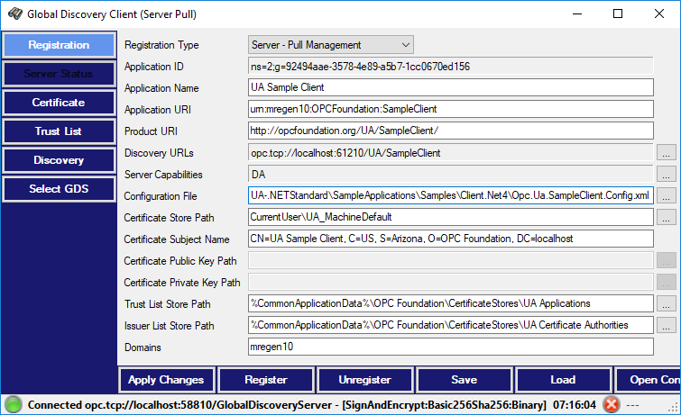

# UA .Net Standard Global Discovery Server and Client

## Introduction
This Global Discovery Server and Client implement the `Global Discovery and Certificate Management Server` profile as specified in the OPC Unified Architecture Specification Part 12: Discovery Release 1.03.

The Solution is split into these projects:
- **GlobalDiscoveryServer:** Global Discovery Server for .Net 4.6 with SQL server as registration and certificate database.
- **GlobalDiscoveryServerLibrary:** Common Global Discovery Server classes for .Net 4.6 and .Net Standard.
- **NetCoreGlobalDiscoveryServer:** Global Discovery Server for .Net Standard with Json database implementation to demonstrate the abstracted database registration and certificate authority interface. (The gdsdb.json is not a secure database and should only be used for testing).
- **GlobalDiscoveryClient:** Global Discovery Client for .Net 4.6. with Windows forms user interface.
- **GlobalDiscoveryClientControls:** Global Discovery Client reusable controls for .Net 4.6.
- **GlobalDiscoveryClientLibrary:** Common Global Discovery Client classes for .Net 4.6 and .Net Standard.
- **GlobalDiscoveryClientTest:** Unit tests for .Net Standard Global Discovery client and server libraries.

## How to build and run the Windows OPC UA Global Discovery Server
1. Open the solution **UA Global Discovery Server.sln** with VisualStudio.
2. Choose the project `GlobalDiscoveryServer` in the Solution Explorer and set it with a right click as `Startup Project`.
3. The server has a dependency on the Entity Framework and SQL server. By default the server connects to the data source `Data Source=(localdb)\MSSQLLocalDB` which is the SQL server installed with Visual Studio. The default location for the database files is the user home directory. To change the data source modify the connection string in the `app.config` file.
4. Hit `Ctrl-F5` to build and execute the sample.
5. The server loads and initializes all [Certificates](#certificates).
6. If the SQL database is opened for the first time, the server initializes it according to the script in `\DB\Tables.sql`.
7. The server is now running and waiting for the connection of a GDS client. 

## How to build and run the console OPC UA Global Discovery Server on Windows, Linux and iOS
This section describes how to run the **NetCoreGlobalDiscoveryServer**.

Please follow instructions in this [article](https://aka.ms/dotnetcoregs) to setup the dotnet command line environment for your platform. 

### Start the server 
1. Open a command prompt.
2. Now navigate to the folder **SampleApplications/Samples/GDS/NetCoreGlobalDiscoveryServer**.
3. Execute `dotnet restore`. This command calls into NuGet to restore the tree of dependencies. In latest .Net versions this command is optional.
4. To run the server type `dotnet run`. 
5. The server loads and initializes all [Certificates](#certificates).
6. The server is now running and waiting for the connection of a GDS client. 

## GDS Users
The sample GDS servers only implement the username/password authentication. The following combinations can be used to connect to the servers:
- **GDS Administrator:** 
  - Username: **appadmin**, PW: **demo**
  - This user has the ability to register and unregister applications and to issue new certificates. It should be used by the GDS Client application to connect.
- **GDS User:**
  - Username: **appuser**, PW: **demo**
  - This user has only a limited ability to search for applications.
- **System Administrator:** 
  - Username: **sysadmin**, PW: **demo**
  - This user is defined for server push management and has the ability to access the server configuration nodes of the GDS server to update the server certificate and the trust lists. Server push configuration management is not a requirement for a GDS server and only supported here to demonstrate the functionality.

## Certificates
The global discovery server creates the CA certificates for all configured certificate groups on the first start.

By default, a global discovery server accepts any incoming secure connection with an authenticated user ([GDS Users](#gds-users)). 

The console server certificates are stored in **%LocalApplicationData%/OPC Foundation/GDS/PKI** while the Windows .Net 4.6 server stores the certificates in **%CommonApplicationData%\OPC Foundation\GDS\PKI**. 
**%CommonApplicationData%** maps to the path set by the environment variable **ProgramData** on Windows. 

On Linux and macOS **%LocalApplicationData%** maps to **~/root/.local/share**.

On Windows **%LocalApplicationData%** maps to **%USERPROFILE%\AppData\Local**. 

### GDS Certificate stores
Under **PKI**, the following stores contain certificates under **certs**, CRLs under **crl** or private keys under **private**.
- **own** contains the GDS public certificate and private key.
- **rejected** contains the rejected client certificates. To trust a client certificate, copy the rejected certificate to the **trusted/certs** folder.
- **trusted** contains *trusted* client and CAs certificates and CRLs.
- **issuers** contains CAs certificates and CRLs needed for validation of certificate chains.

### GDS CA Certificate stores
Under **PKI**, the following stores contain certificates under **certs**, CRLs under **crl** or private keys under **private**.
- **authorities** contains the public certificates, CRLs and private keys of the CA authorities.
- **applications** contains the public certificates of all applications registered with the GDS.
- **PKI/CA** contains folders for all supported certificate groups. At this point only the `DefaultApplicationGroup` **default** is supported.
  - **PKI/CA/default** contains the *issuer* and *trusted* list for the default application group. Each store contains the CA certificates and CRLs.

### Customize the GDS CA Certificates
To customize the CA certificate search for `<SubjectName>CN=IOP-2017 CA, O=OPC Foundation</SubjectName>` and enter your new subject. Then search the code and the configuration files for `SomeCompany` and enter your company name as appropriate.

## How to build and run the Windows OPC UA Global Discovery Client
1. Open the solution **UA Global Discovery Server.sln** with VisualStudio.
2. Choose the project `GlobalDiscoveryClient` in the Solution Explorer and set it with a right click as `Startup Project`.
3. Hit `Ctrl-F5` to build and execute the sample.
4. Press the `Registration` button to connect to a running GDS. Use the `GDS Administrator` credentials in [GDS Users](#gds-users) to connect and to be able to register applications and to issue certificates.
5. Select the appropriate `Registration Type`: [Client or Server Pull Management](#client-or-server-pull-management) or [Server Push Management](#server-push-management) and proceed with the registration.

### Client or Server Pull Management
1. Always `Clear` registration form to start a new or to update an existing registration.
2. Register the application in one of the described ways under [Pull Registration](#pull-registration).
3. Press the `Certificate` button. Inspect an existing certificate in the form. To issue a CA signed certificate press `Request New` certificate which triggers either a certificate signing request or a new keypair request, whichever is more appropriate. After a short while the new CA signed certificates are issued and the GDS client may ask to override existing certificates.
4. Press the `Trust List` button. Inspect the existing trusted and issuer list of the application. To add the CA certificate and the CRL to the trusted list press the `Merge with GDS` button.

### Pull Registration

#### Manually enter the registration for an application
1. In this case the entries in the `Client -` or `Server - Pull management` form must be filled in. Some fields are *ignored* if the application type is Client, some fields are *optional*.
- Application ID: The unique identifier *assigned by the GDS* to the application.
- Application Name: The default name of the Application.
- Application URI: The URI for the Application. This URI is also stored in the application certificate extensions.
- Product URI: A globally unique URI for the product associated with the Application. This URI is assigned by the vendor of the Application.
- Discovery URLs: The list of discovery URLs for a *Server Application*.
- Server Capabilities: The list of *Server* capability identifiers for the Application.
- To use an existing store with or without existing public/private key:
  - Certificate Store Path: local X509 store (CurrentUser\UA_MachineDefault) or directory store.
  - Certificate Subject Name: The certificate distinguished name.
- or the path to new or existing public/private key pair:
  - Certificate Public Key Path: A DER encoded certificate with a public key.
  - Certificate Private Key Path: A PFX or PEM encoded private key.
- Trust List Store Path: *optional* to copy the GDS CA public certificate to the trusted store.
- Issuer List Store Path: *optional* to copy the GDS CA public certificate to the issuer store.
- Domains: Enter the domain names to be added to the certificate extension as hostnames or IP addresses.
2. `Register` the application or `Apply Changes`. 
3. The `Application ID` should display a proper NodeId after registration.
4. `Save` the configuration for future use.
5. Continue with `Certificate`and `Trust List`management.

#### Load the existing certificate to register an application
The manual registration is simplified if there is already an existing certificate available, with or without private key.
1. Select `Client`or `Server - Pull Management`.
2. Load existing certificate in the `Certificate Public Key Path` field.
3. Fill in remaining fields.
4. Continue with step 2 in the previous section.

#### Load registration from a sample configuration file
The GDS client can fill in the full information from a UA .Net Standard application configuration. However, for legacy .Net applications Windows certificate stores are not permitted.
1. `Load` configuration, for example chose **UA-.NETStandard\SampleApplications\Samples\Client.Net4\Opc.Ua.SampleClient.Config.xml**
2. The registration type is `Server - Pull management`, because the UA Sample Client is also a server.
2. `Register` the UA Sample Client. The `Application ID` should now contain a valid NodeId.
3. Press the `Certificate` button and `Request New` certificate. After a short while the UA Sample Server/Client certificate is updated with a CA signed application certificate.
4. Press the `Trust List` button to add the CA certificate and CRL with `Merge with GDS` to the application trusted store.
5. UA Sample Client is now ready to use and trust the GDS issued and CA signed certificates.

### Server Push Management
Push configuration requires server configuration node support and a session with the managed server. 
1. Select `Server - Push Management`
2. Press `Pick Server` to connect to the managed server. Special system administrator credentials might be necessary to access the server configuration nodes - see [GDS Users](#gds-users).
3. Fill the remaining registration fields which can not be extracted from the server endpoint information.
2. `Register` the application or `Apply Changes`. 
3. The `Application ID` should display a proper NodeId after registration.
6. Press the `Server Status` and then the `green arrow` connect button to inspect the status. Being connected is mandatory to remote manage the server in the next steps.
3. Press the `Certificate` button. Inspect an existing certificate in the form. To issue a CA signed certificate press `Request New` certificate, which triggers a certificate signing request. After a short while the new CA signed certificates is updated on the server directly. After the update, the GDS client user might be asked to `Apply Changes` in the `Server Status` form.
8. Press the `Trust List` button. `Reload`the trust list from the managed server. Manage the certificates and `Merge with GDS` to add the GDS CA certificate to the trust list. `Push To Server` to save the updated trust list on the server.
8. Press the `Server Status` button and then press `Apply Changes` to update the security settings on the server. After a regular certificate update the managed server may require a reboot or at least closes all sessions and requires a reconnect. Press the `green arrow` connect button to reconnect to the server using the new certificate.  
9. Press the `Certificate` button and inspect the new CA signed certificate to verify the new certificate is being used for the new session.

