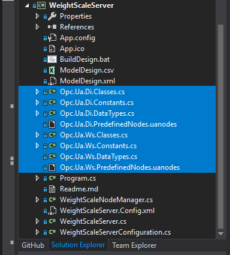
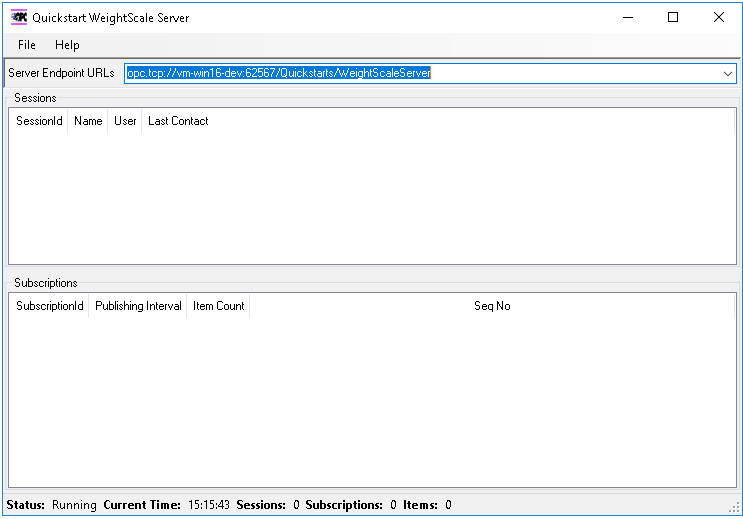
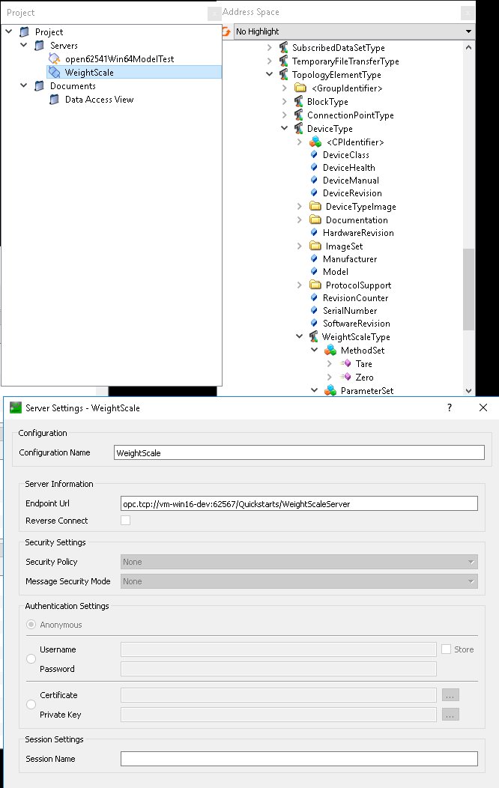

# WeightScaleServer
[Anglická verzia je dostupná tu...](readme.md)

Projekt je odvodený od **Boiler Server**. Jeho cieľom je vytvorenie OPC UA serveru s _informačným modelom (IM)_ založeným na _Device Information Model (DI)_.
DI IM je z git [OPCFoundation/UA-Nodeset](https://github.com/OPCFoundation/UA-Nodeset) vetva v1.04, pretože aktuálny _NETStandard stack_ používa túto verziu.
## Pridanie DI a WS name space (menného priestoru) do address space (adresného priestoru)
Menný priestor váhy _Weight Scale (WS)_ používa objekty definované v mennom priestore DI, preto je potrebné nahrať do adresného priestoru oba menné priestory.
Súbory popisujúce menné priestory sú tieto:



Vo vlastnostiach súborov s príponou _.uanodes_ treba nastaviť **Build Action = [Embedded Resource](https://docs.microsoft.com/en-us/visualstudio/ide/build-actions?view=vs-2019)**.

Tieto súbory obsahujú predefinované uzly, ktoré je treba pridať do adresného priestoru servera pomocou metódy **LoadPredefinedNodes** v [WeightScaleNodeManager.cs](WeightScaleNodeManager.cs):

```
protected override NodeStateCollection LoadPredefinedNodes(ISystemContext context)
{
    NodeStateCollection predefinedNodes = new NodeStateCollection();

    NodeStateCollection tmp = new NodeStateCollection();

    tmp.LoadFromBinaryResource(context,
    "Quickstarts.WeightScale.Server.Opc.Ua.Di.PredefinedNodes.uanodes",
    typeof(WeightScaleNodeManager).GetTypeInfo().Assembly,
    true);

    tmp.ForEach((ns) => predefinedNodes.Add(ns));
            
    tmp.LoadFromBinaryResource(context,
        "Quickstarts.WeightScale.Server.Opc.Ua.Ws.PredefinedNodes.uanodes",
        typeof(WeightScaleNodeManager).GetTypeInfo().Assembly, 
        true);

    tmp.ForEach((ns) => predefinedNodes.Add(ns));
            

    return predefinedNodes;
}
```
Súbory _.uanodes_ taktiež obsahujú informáciu o tom, do ktoréhe menného priestoru patria predefinované uzly. Na to aby predefinované uzly bolo zobrazené v adresnom priestore je treba do adresného priestoru pridať menné priestory DI a WS. 

Názovy menných priestorov sú zadefinované v súboroch [Opc.Ua.Di.Constants.cs](Opc.Ua.Di.Constants.cs) a [Opc.Ua.Ws.Constants.cs](Opc.Ua.Ws.Constants.cs) ako:

```
/// </summary>
public const string OpcUaDi = "http://opcfoundation.org/UA/DI/";

/// </summary>
public const string OpcUaWs = "http://phi-ware.com/FEISTU/WS/";
```

Pridanie menných prestorov do adresného priestoru sa deje v konštruktory triedy [**WeightScaleNodeManager**](WeightScaleNodeManager.cs):

```
public WeightScaleNodeManager(IServerInternal server, ApplicationConfiguration configuration)
:
    base(server, configuration, Opc.Ua.Ws.Namespaces.OpcUaDi, Opc.Ua.Ws.Namespaces.OpcUaWs)
{
...
}
```

Takto upravný program je potrebné skompilovať a spustiť.


Na overenie obsahu adresného priestoru je možné použit program [UaExpert](https://www.unified-automation.com/products/development-tools/uaexpert.html) a pridať server podľa návodu.


## Vytvorenie obslužného kódu pre metódy _Tare_ a _Zero_ adresného priestoru _WeightScale_
Kompiler _OPC UA Model Compiler_ vytvoril metódy iba v adresnom priestore. Ak by sme túto metódu dopytovali z OPC UA klienta prišla by nám zo serveru odpoveď že metóda nie je implementovaná: **_BadNotImplemented_**.
Preto je potrebné vytvoriť obslužný kód, ktorý môže vyzerať nasledovne:
```
public ServiceResult OnTare(
    ISystemContext context,
    MethodState method,
    IList<object> inputArguments,
    IList<object> outputArguments)
{
    lock(m_COMLock)
    {
        try
        {
            SerialPort port = new SerialPort("COM2", 9600, Parity.None, 8, StopBits.One);
            string response = "T\r\n";
            byte[] sData;
            sData = Encoding.ASCII.GetBytes(response);
            port.Open();
            port.BaseStream.Write(sData, 0, sData.Length);
            port.Close();

        }
        catch (Exception ee)
        {

        }
    }
    return ServiceResult.Good;
}
```
Argumenty obslužnej metódy _OnTare_ sú dané dátovým typom _GenericMethodCalledEventHandler_. Kód posiela cez COM port **T**, čo pre váhu znamená príkaz tare. Podobne vyzerá aj kód pre metódu _OnZero_, akurát že posiela **Z**.

Ďalej je potrebné priradiť oblužné metódy príslušným uzlom:

```
public override void CreateAddressSpace(IDictionary<NodeId, IList<IReference>> externalReferences)
{
    lock (Lock)
    {
        LoadPredefinedNodes(SystemContext, externalReferences);

        // Add method handler
        MethodState methodState;

        methodState = (MethodState)FindPredefinedNode(new NodeId(Opc.Ua.Ws.Methods.WeightScale01_MethodSet_Tare, 3), typeof(MethodState));
        methodState.OnCallMethod = OnTare;

        methodState = (MethodState)FindPredefinedNode(new NodeId(Opc.Ua.Ws.Methods.WeightScale01_MethodSet_Zero, 3), typeof(MethodState));
        methodState.OnCallMethod = OnZero;
...
```
Hore uvedený kód sa nachádza v súbore [WeightScaleNodeManager.cs](WeightScaleNodeManager.cs).
Check [Is there any solution to import nodeset xml file to opc ua server in C#? #546](https://github.com/OPCFoundation/UA-.NETStandard/issues/546)
