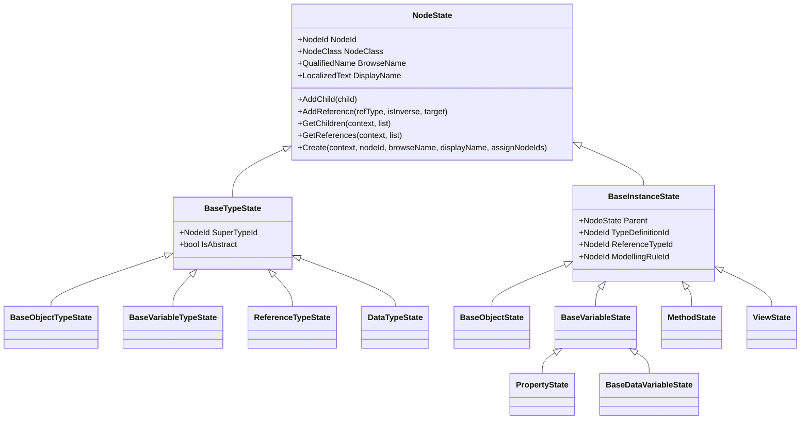
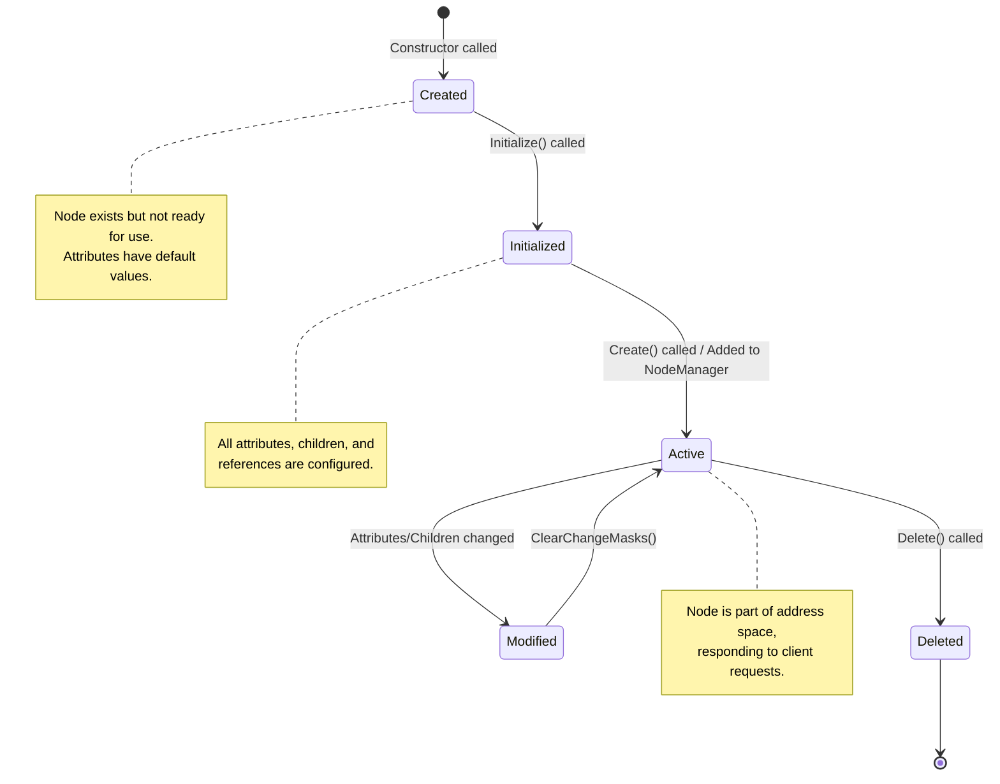
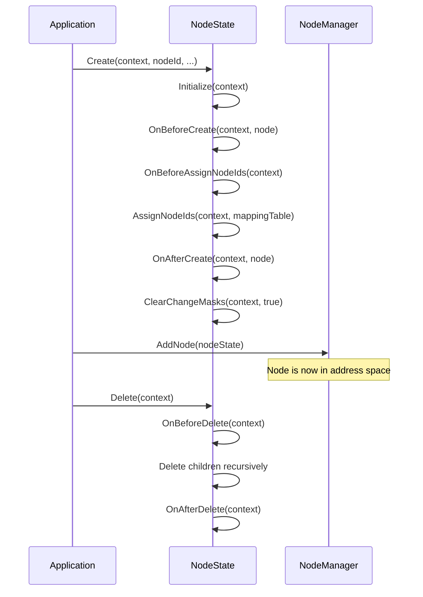
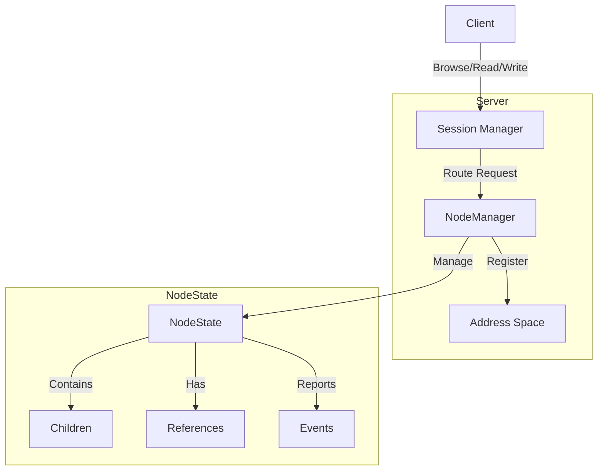
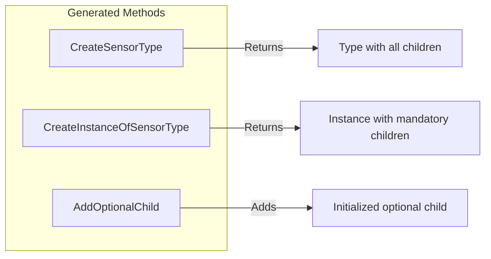

# NodeState System

The `NodeState` system is the in-memory representation of OPC UA nodes in the server address
space. It provides the foundation for managing nodes, their attributes, children, references,
and the events that occur during their lifecycle.

## Overview



## Lifecycle of a NodeState

The lifecycle of a `NodeState` involves creation, initialization, usage in the server, and disposal.



### Initialization Methods

The `NodeState` class provides several `Initialize` overloads for different scenarios:

| Method | Purpose |
|--------|---------|
| `Initialize(ITelemetryContext)` | Sets up telemetry/logging. Called by all other overloads. |
| `Initialize(ISystemContext)` | Initializes with default values. Called when creating new nodes. |
| `Initialize(ISystemContext, NodeState)` | Copies attributes from a source node (for deserialization). |
| `Initialize(ISystemContext, string)` | Initializes from XML or binary encoded string. |
| `InitializeOptionalChildren(ISystemContext)` | Initializes optional children that have been set as properties. |

### Key Lifecycle Callbacks

The following virtual methods can be overridden to customize node behavior:



## Usage Inside the Server

The generated Create<SymoblicId> and CreateInstanceOf<SymoblicId> methods (static extension 
method to ISystemContext) create a new type or instance of a type (respectively) and returns 
it with all mandatory children set (for the instantiation) and with all children set for the
type (but then the child will only define the "modelling rule" for the instance.

CreateInstanceOf<SymoblicId> does call Initialize(ITelemetryContext) method.  TODO:

The caller can then add optional children and place holders as needed using "Add<ChildName>()" 
and "Add<ChildName>(QualifiedName browseName)" methods (for optional children and placeholders
defined in the type definition). 

These internally call Create<SymoblicId>(this, forInstance: true) to create the optional 
children of the instantiated type.

No "user" initialization calls are needed after the Create<SymoblicId> method is called.
User can add additional references and children to all states using AddChild/AddReference
and so on.
        
### Legacy behavior
        
If the constructor is called directly the instance is created but still must be initialized
in this case the caller *must* call Initialize(context) before using the instance which will
call Initialize(context, CreateInstanceOf<SymoblicId>(context)) to initialize all attributes, 
references and mandatory children. 

If the class is extended, the same applies.
        
If optional children are "set" as properties, the InitializeOptionalChildren(context) method
*must* be called to call Initialize on all children (if they are not yet initialized).

### Address Space Integration

Nodes are managed by `NodeManager` implementations within the server. The typical flow:



### Reading and Writing Attributes

The server reads and writes node attributes through callback handlers:

```csharp
// Example: Setting up attribute callbacks
myVariable.OnReadValue = (context, node, indexRange, dataEncoding, 
                          ref value, ref statusCode, ref timestamp) =>
{
    // Custom read logic
    value = GetCurrentSensorValue();
    return ServiceResult.Good;
};

myVariable.OnWriteValue = (context, node, indexRange, dataEncoding,
                           ref value, ref statusCode, ref timestamp) =>
{
    // Custom write logic
    SetActuatorValue(value);
    return ServiceResult.Good;
};
```

### Event Handling

Nodes can report events and track monitored items:

```csharp
// Report an event from a node
nodeState.ReportEvent(context, eventInstance);

// Check if events are being monitored
if (nodeState.AreEventsMonitored)
{
    // Generate and report event
}
```

### Change Tracking

The `ChangeMasks` property tracks what has changed since the last `ClearChangeMasks()` call:

```csharp
// After modifying a node
nodeState.DisplayName = "New Name";  // Sets NodeStateChangeMasks.NonValue

// The OnStateChanged callback is invoked when clearing change masks
nodeState.OnStateChanged = (context, node, changes) =>
{
    // Handle changes (e.g., persist to database)
    if ((changes & NodeStateChangeMasks.Children) != 0)
    {
        // Children were added/removed
    }
};

nodeState.ClearChangeMasks(context, includeChildren: true);
```

## Usage Guidelines for Developers

### Creating Nodes with Generated Code (Recommended)

The source generator creates helper methods that properly initialize nodes:

```csharp
// Create a type node (includes all children from the type definition)
var sensorType = context.CreateSensorType();

// Create an instance of a type (includes mandatory children)
var sensor = context.CreateInstanceOfSensorType();

// Add optional children defined in the type
sensor.AddOptionalProperty();  // Creates and initializes the optional property

// Add placeholder instances
sensor.AddSensorReading(new QualifiedName("Temperature", namespaceIndex));
```



### Creating Nodes Manually (Legacy)

When not using generated code, manual initialization is required:

```csharp
// Step 1: Create the node
var variable = new BaseDataVariableState(parent);

// Step 2: Initialize the node (REQUIRED before use)
variable.Initialize(context);

// Step 3: Set attributes
variable.NodeId = new NodeId(1234, namespaceIndex);
variable.BrowseName = new QualifiedName("MyVariable", namespaceIndex);
variable.DisplayName = "My Variable";
variable.TypeDefinitionId = VariableTypeIds.BaseDataVariableType;
variable.DataType = DataTypeIds.Double;
variable.ValueRank = ValueRanks.Scalar;
variable.Value = 0.0;

// Step 4: Create and assign node IDs
variable.Create(context, variable.NodeId, variable.BrowseName, 
                variable.DisplayName, assignNodeIds: true);

// Step 5: Add to parent
parent.AddChild(variable);
```

### Managing Children

```csharp
// Add a child node
parent.AddChild(childNode);

// Remove a child node
parent.RemoveChild(childNode);

// Find a child by browse name
var child = parent.FindChild(context, new QualifiedName("ChildName", ns));

// Get all children
var children = new List<BaseInstanceState>();
parent.GetChildren(context, children);

// Find child by symbolic path
var deepChild = parent.FindChildBySymbolicName(context, "Child1/Child2/Target");
```

### Managing References

```csharp
// Add a reference to another node
sourceNode.AddReference(
    ReferenceTypeIds.Organizes,
    isInverse: false,
    targetId: targetNode.NodeId);

// Check if reference exists
bool exists = sourceNode.ReferenceExists(
    ReferenceTypeIds.Organizes,
    isInverse: false,
    targetId: targetNode.NodeId);

// Remove a reference
sourceNode.RemoveReference(
    ReferenceTypeIds.Organizes,
    isInverse: false,
    targetId: targetNode.NodeId);

// Get all references
var references = new List<IReference>();
sourceNode.GetReferences(context, references);
```

### Serialization and Deserialization

Nodes can be saved and loaded from streams:

```csharp
// Save to XML
using var stream = new MemoryStream();
nodeState.SaveAsXml(context, stream);

// Save to binary
using var binaryStream = new MemoryStream();
nodeState.SaveAsBinary(context, binaryStream);

// Load from XML
nodeState.LoadFromXml(context, xmlStream);

// Load from binary
nodeState.LoadAsBinary(context, binaryStream);
```

### Node State Factory

The `NodeStateFactory` creates node instances based on type definitions:

```csharp
// Register a custom factory for a type
context.NodeStateFactory.RegisterType(
    typeDefinitionId,
    new MyCustomNodeActivator());

// Create an instance using the factory
var node = context.NodeStateFactory.CreateInstance(
    context,
    parent,
    NodeClass.Object,
    browseName,
    referenceTypeId,
    typeDefinitionId);
```

### Best Practices

1. **Always Initialize**: Never use a `NodeState` without calling `Initialize()` first.

2. **Use Generated Code**: Prefer generated `Create*` and `CreateInstanceOf*` methods for type safety
   and proper initialization.

3. **Clear Change Masks**: Call `ClearChangeMasks()` after making changes to trigger
   the `OnStateChanged` callback.

4. **Thread Safety**: Use appropriate locking when accessing nodes from multiple threads.
   The `NodeState` class uses internal locks for children and references collections.

5. **Memory Management**: Call `Dispose()` when nodes are no longer needed, especially
   for nodes with event handlers or external resources.

6. **Use Callbacks Sparingly**: Only attach callbacks (`OnReadValue`, `OnWriteValue`, etc.)
   when custom behavior is needed. Default behavior is often sufficient.

### Common Pitfalls

| Issue | Solution |
|-------|----------|
| Node not appearing in address space | Ensure `Create()` was called and node is added to `NodeManager` |
| Children not visible | Verify children have valid `NodeId` and are added with `AddChild()` |
| Attribute changes not persisted | Implement `OnStateChanged` callback and persist changes |
| Deserialization fails | Check namespace URIs match and type definitions are registered |
| Memory leaks with events | Unsubscribe from `StateChanged` and other events before disposal |
