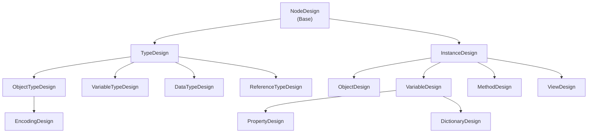
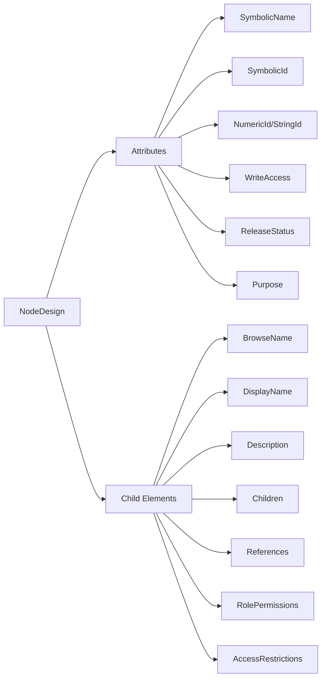
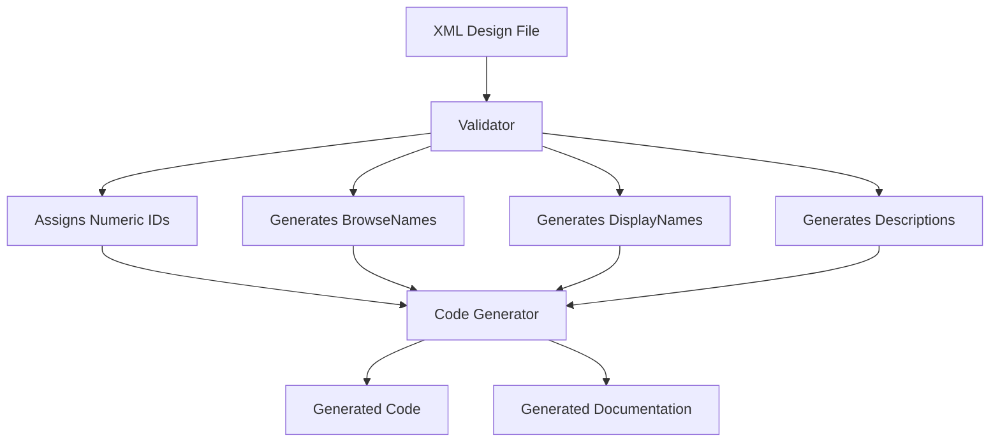

# OPC UA Model Design File Schema Documentation

## Overview

The **UA Model Design Schema** is a proprietary schema that supports a more visual modelling
experience defining OPC UA types and instances. This definition is used by the model compiler
and source generator to generate code, documentation, and validate model consistency. 

The schema allows modellers to:
- Define **Types** ([ObjectType](#objecttypedesign), [VariableType](#variabletypedesign), [DataType](#datatypedesign), [ReferenceType](#referencetypedesign))
- Define **Instances** ([Object](#objectdesign), [Variable](#variabledesign), [Method](#methoddesign), [Property](#propertydesign))
- Organize entities within **[Namespaces](#namespace-organization)**
- Manage **[Permissions](#permission-management)** and **[Access Restrictions](#access-restrictions)**
- Create **[References](#reference-pattern)** between nodes
- Specify **Default Values** and **Parameters**

> **Note:** This schema is not part of the official OPC UA specification. The official definition 
> of nodes and references is in the form of .Nodeset2.xml whose schema is defined in 
> [OPC UA Part 6 - Annex F](https://reference.opcfoundation.org/Core/Part6/v105/docs/F). This 
> [code](./NodeSetToModelDesign.cs) is used internally to convert .Nodeset2.xml files to this 
> schema format.

---

## Table of Contents

1. [Document Structure](#document-structure)
   - [Example Model Structure](#example-model-structure)

2. [Core Components](#core-components)
   - [Root Element: ModelDesign](#1-root-element-modeldesign)
   - [Namespace Organization](#2-namespace-organization)
   - [Permission Management](#3-permission-management)
     - [Permission Sets (Global)](#permission-sets-global)
     - [Role-Based Permissions](#role-based-permissions)

3. [Type System](#type-system)
   - [Type Designs](#31-type-designs-inherits-from-typedesign)
     - [ObjectTypeDesign](#objecttypedesign)
     - [VariableTypeDesign](#variabletypedesign)
     - [DataTypeDesign](#datatypedesign)
     - [ReferenceTypeDesign](#referencetypedesign)
   - [Instance Designs](#32-instance-designs-inherits-from-instancedesign)
     - [ObjectDesign](#objectdesign)
     - [VariableDesign](#variabledesign)
     - [PropertyDesign](#propertydesign)
     - [MethodDesign](#methoddesign)
     - [ViewDesign](#viewdesign)

4. [Common Patterns](#common-patterns)
   - [Node Design Pattern](#node-design-pattern)
   - [Instance Design Pattern](#instance-design-pattern)
   - [Reference Pattern](#reference-pattern)

5. [Access Control](#access-control)
   - [Access Restrictions](#access-restrictions)
   - [Role-Based Access](#role-based-access)

6. [Complex Types](#complex-types)
   - [DataType with Fields](#datatype-with-fields)
   - [DataType with Encodings](#datatype-with-encodings)

7. [Hierarchical Structure](#hierarchical-structure)

8. [Processing Workflow](#processing-workflow)

9. [Best Practices](#best-practices)
   - [Naming Conventions](#naming-conventions)
   - [Type Hierarchy](#type-hierarchy)
   - [Validation Indicators](#validation-indicators)

10. [Release Status and Purpose](#release-status-and-purpose)
    - [Release Status](#release-status)
    - [Purpose](#purpose)

11. [Schema Validation](#schema-validation)

12. [Extensions](#extensions)

13. [Related Resources](#related-resources)

14. [Summary](#summary)

---

## Document Structure

A valid [ModelDesign](#1-root-element-modeldesign) XML document must:
1. Start with a `<ModelDesign>` root element
2. Include a `TargetNamespace` attribute (required)
3. Optionally define `<Namespaces>` and `<PermissionSets>`
4. Contain zero or more type and instance declarations
5. Optionally include `<Extensions>` for custom metadata

### Example Model Structure

```xml
<?xml version="1.0" encoding="utf-8"?>
<ModelDesign
    TargetNamespace="http://example.com/MyModel"
    TargetVersion="1.0"
    TargetXmlNamespace="http://example.com/MyModel/Types.xsd"
    DefaultLocale="en">

    <Namespaces>
        <Namespace Name="MyNamespace" 
                   Prefix="Example.MyModel">
            http://example.com/MyModel
        </Namespace>
    </Namespaces>

    <ObjectType SymbolicName="MyObjectType">
        <!-- Type definition -->
    </ObjectType>

</ModelDesign>
```

```json
{
  "TargetNamespace": "http://example.com/MyModel",
  "TargetVersion": "1.0",
  "TargetXmlNamespace": "http://example.com/MyModel/Types.xsd",
  "DefaultLocale": "en",
  "Namespaces": [
    {
      "Name": "MyNamespace",
      "Prefix": "Example.MyModel",
      "Content": "http://example.com/MyModel"
    }
  ],
  "ObjectTypes": [
    {
      "SymbolicName": "MyObjectType"
    }
  ]
}
```

---

## Core Components

### 1. Root Element: ModelDesign

The `<ModelDesign>` element is the container for all model definitions.

**Attributes:**
- `TargetNamespace` *(required)* - The URI identifying the namespace
- `TargetVersion` *(optional)* - Version of the model
- `TargetPublicationDate` *(optional)* - Publication date (ISO 8601)
- `TargetXmlNamespace` *(optional)* - XML namespace URI (if different from TargetNamespace)
- `DefaultLocale` *(optional, default: "en")* - Default language locale

See also: [Namespaces](#2-namespace-organization), [Permission Management](#3-permission-management), [Extensions](#extensions)

---

### 2. Namespace Organization

[Namespaces](#namespace-organization) organize OPC UA entities and create numeric indices for browse paths.

```xml
<Namespaces>
    <Namespace Name="Core" 
               Prefix="Opc.Ua"
               InternalPrefix="Opc.Ua.Server"
               XmlNamespace="http://opcfoundation.org/UA/2008/02/Types.xsd"
               FilePath="Opc.Ua.Types.xml">
        http://opcfoundation.org/UA/
    </Namespace>
</Namespaces>
```

```json
{
  "Namespaces": [
    {
      "Name": "Core",
      "Prefix": "Opc.Ua",
      "InternalPrefix": "Opc.Ua.Server",
      "XmlNamespace": "http://opcfoundation.org/UA/2008/02/Types.xsd",
      "FilePath": "Opc.Ua.Types.xml",
      "Content": "http://opcfoundation.org/UA/"
    }
  ]
}
```

**Namespace Attributes:**
- `Name` - Symbolic identifier for the namespace
- `Prefix` - C# namespace for generated classes
- `InternalPrefix` - C# namespace for server-only types
- `XmlNamespace` - XML namespace URI (if different from content)
- `XmlPrefix` - XML namespace prefix
- `FilePath` - Path to separate design file
- `Version` - Namespace version
- `PublicationDate` - Publication date

---

### 3. Permission Management

[Permission Management](#permission-management) controls access and security for nodes.

#### Permission Sets (Global)
Define reusable permission configurations at the model level.

```xml
<PermissionSets>
    <PermissionSet Name="AdminPermissions">
        <RolePermission Role="Administrator">
            <Permission>All</Permission>
        </RolePermission>
        <RolePermission Role="Guest">
            <Permission>Browse</Permission>
            <Permission>Read</Permission>
        </RolePermission>
    </PermissionSet>
</PermissionSets>
```

```json
{
  "PermissionSets": [
    {
      "Name": "AdminPermissions",
      "RolePermissions": [
        {
          "Role": "Administrator",
          "Permissions": ["All"]
        },
        {
          "Role": "Guest",
          "Permissions": ["Browse", "Read"]
        }
      ]
    }
  ]
}
```

#### Role-Based Permissions
Each node can have role-specific permissions. Available permissions include:
- **Browse** - Browse the node
- **Read** - Read the node value
- **Write** - Write the node value
- **ReadHistory** - Read node history
- **InsertHistory**, **ModifyHistory**, **DeleteHistory**
- **ReceiveEvents** - Subscribe to node events
- **Call** - Invoke methods
- **AddReference**, **RemoveReference**
- **DeleteNode**, **AddNode**
- **All**, **AllRead**, **None**

See also: [Role-Based Access](#role-based-access), [Access Restrictions](#access-restrictions)

---

## Type System

The schema defines four main type categories through a type hierarchy:



### 3.1 Type Designs (Inherits from TypeDesign)

Type designs define the structure and behavior of types in the information model.

#### ObjectTypeDesign
Defines the structure of objects in the information model. See [Instance Designs](#32-instance-designs-inherits-from-instancedesign) for related [ObjectDesign](#objectdesign).

```xml
<ObjectType SymbolicName="MyObjectType" 
            BaseType="ua:BaseObjectType"
            IsAbstract="false"
            SupportsEvents="true">
    <DisplayName>My Custom Object</DisplayName>
    <Description>Describes an instance of MyObjectType</Description>
    <Children>
        <Variable SymbolicName="Status" TypeDefinition="ua:BaseVariableType" />
        <Method SymbolicName="Initialize" />
    </Children>
</ObjectType>
```

```json
{
  "ObjectType": {
    "SymbolicName": "MyObjectType",
    "BaseType": "ua:BaseObjectType",
    "IsAbstract": false,
    "SupportsEvents": true,
    "DisplayName": "My Custom Object",
    "Description": "Describes an instance of MyObjectType",
    "Children": [
      {
        "Variable": {
          "SymbolicName": "Status",
          "TypeDefinition": "ua:BaseVariableType"
        }
      },
      {
        "Method": {
          "SymbolicName": "Initialize"
        }
      }
    ]
  }
}
```

**Key Attributes:**
- `BaseType` - Parent type (default: BaseObjectType)
- `IsAbstract` - Cannot instantiate if true
- `SupportsEvents` - Generates events
- `NoClassGeneration` - Skip code generation

#### VariableTypeDesign
Defines the structure of variables in the information model. See [Instance Designs](#32-instance-designs-inherits-from-instancedesign) for related [VariableDesign](#variabledesign).

```xml
<VariableType SymbolicName="TemperatureType"
              DataType="xs:double"
              ValueRank="Scalar"
              AccessLevel="ReadWrite">
    <DefaultValue>
        <Double>20.5</Double>
    </DefaultValue>
</VariableType>
```

```json
{
  "VariableType": {
    "SymbolicName": "TemperatureType",
    "DataType": "xs:double",
    "ValueRank": "Scalar",
    "AccessLevel": "ReadWrite",
    "DefaultValue": {
      "Double": 20.5
    }
  }
}
```

**Key Attributes:**
- `DataType` - The data type of the variable
- `ValueRank` - Scalar, Array, ScalarOrArray, OneOrMoreDimensions, ScalarOrOneDimension, Any
- `ArrayDimensions` - Dimensions specification
- `AccessLevel` - Read, Write, ReadWrite, HistoryRead, HistoryWrite, HistoryReadWrite
- `MinimumSamplingInterval` - Sampling rate in milliseconds
- `Historizing` - Supports historical data
- `ExposesItsChildren` - Children are exposed in address space

#### DataTypeDesign
Defines the structure of data types (complex types). See [Complex Types](#complex-types) for detailed examples.

```xml
<DataType SymbolicName="MyStructure"
          IsAbstract="false"
          IsOptionSet="false"
          IsUnion="false">
    <Fields>
        <Field Name="Field1" DataType="xs:int" />
        <Field Name="Field2" DataType="xs:string" IsOptional="true" />
    </Fields>
    <Encodings>
        <Encoding SymbolicName="MyStructureEncoding">
            <!-- Encoding specification -->
        </Encoding>
    </Encodings>
</DataType>
```

```json
{
  "DataType": {
    "SymbolicName": "MyStructure",
    "IsAbstract": false,
    "IsOptionSet": false,
    "IsUnion": false,
    "Fields": [
      {
        "Name": "Field1",
        "DataType": "xs:int"
      },
      {
        "Name": "Field2",
        "DataType": "xs:string",
        "IsOptional": true
      }
    ],
    "Encodings": [
      {
        "SymbolicName": "MyStructureEncoding"
      }
    ]
  }
}
```

**Key Attributes:**
- `IsOptionSet` - Structure is an option set (bitmask)
- `IsUnion` - Structure is a union type
- `NoArraysAllowed` - Instances cannot be arrays
- `ForceEnumValues` - Force numeric values for enums
- `NoEncodings` - Skip encoding generation

**Special Cases:**
- **OptionSet**: Represents a set of flags combined with bitwise operations
- **Union**: Only one field is active at a time

See also: [DataType with Fields](#datatype-with-fields), [DataType with Encodings](#datatype-with-encodings)

#### ReferenceTypeDesign
Defines typed [References](#reference-pattern) between nodes.

```xml
<ReferenceType SymbolicName="MyReference"
               BaseType="ua:References"
               Symmetric="false">
    <InverseName>IsReferencedBy</InverseName>
</ReferenceType>
```

```json
{
  "ReferenceType": {
    "SymbolicName": "MyReference",
    "BaseType": "ua:References",
    "Symmetric": false,
    "InverseName": "IsReferencedBy"
  }
}
```

**Attributes:**
- `Symmetric` - Same reference type applies in both directions

---

### 3.2 Instance Designs (Inherits from InstanceDesign)

Instance designs represent actual instances of types in the OPC UA address space. See [Type Designs](#31-type-designs-inherits-from-typedesign) for the corresponding type definitions.

#### ObjectDesign
Represents an object instance in the address space. Instances of [ObjectTypeDesign](#objecttypedesign).

```xml
<Object SymbolicName="MyObject"
        TypeDefinition="MyObjectType"
        ModellingRule="Mandatory"
        SupportsEvents="true">
    <DisplayName>My Object Instance</DisplayName>
    <Children>
        <Variable SymbolicName="Status" />
    </Children>
</Object>
```

```json
{
  "Object": {
    "SymbolicName": "MyObject",
    "TypeDefinition": "MyObjectType",
    "ModellingRule": "Mandatory",
    "SupportsEvents": true,
    "DisplayName": "My Object Instance",
    "Children": [
      {
        "Variable": {
          "SymbolicName": "Status"
        }
      }
    ]
  }
}
```

#### VariableDesign
Represents a variable instance in the address space. Instances of [VariableTypeDesign](#variabletypedesign).

```xml
<Variable SymbolicName="Temperature"
          TypeDefinition="TemperatureType"
          DataType="xs:double"
          AccessLevel="Read"
          ModellingRule="Mandatory">
    <DefaultValue>
        <Double>20.0</Double>
    </DefaultValue>
</Variable>
```

```json
{
  "Variable": {
    "SymbolicName": "Temperature",
    "TypeDefinition": "TemperatureType",
    "DataType": "xs:double",
    "AccessLevel": "Read",
    "ModellingRule": "Mandatory",
    "DefaultValue": {
      "Double": 20.0
    }
  }
}
```

#### PropertyDesign
A specialized [VariableDesign](#variabledesign) used for node properties.

```xml
<Property SymbolicName="SerialNumber"
          DataType="xs:string"
          AccessLevel="Read"
          ModellingRule="Mandatory" />
```

```json
{
  "Property": {
    "SymbolicName": "SerialNumber",
    "DataType": "xs:string",
    "AccessLevel": "Read",
    "ModellingRule": "Mandatory"
  }
}
```

#### MethodDesign
Represents a method (callable operation).

```xml
<Method SymbolicName="Initialize"
        ModellingRule="Mandatory"
        NonExecutable="false">
    <InputArguments>
        <Argument Name="Parameter1" DataType="xs:int" />
    </InputArguments>
    <OutputArguments>
        <Argument Name="Result" DataType="xs:string" />
    </OutputArguments>
</Method>
```

```json
{
  "Method": {
    "SymbolicName": "Initialize",
    "ModellingRule": "Mandatory",
    "NonExecutable": false,
    "InputArguments": [
      {
        "Name": "Parameter1",
        "DataType": "xs:int"
      }
    ],
    "OutputArguments": [
      {
        "Name": "Result",
        "DataType": "xs:string"
      }
    ]
  }
}
```

#### ViewDesign
Represents a view in the address space.

```xml
<View SymbolicName="MyView"
      ContainsNoLoops="true"
      SupportsEvents="false" />
```

```json
{
  "View": {
    "SymbolicName": "MyView",
    "ContainsNoLoops": true,
    "SupportsEvents": false
  }
}
```

---

## Common Patterns

### Node Design Pattern

All nodes share common attributes and child elements:



**Key Attributes (on all nodes):**
- `SymbolicName` - Local identifier (required)
- `SymbolicId` - Globally unique identifier (auto-generated if not specified)
- `NumericId` - UA numeric node ID
- `StringId` - UA string node ID (alternative to NumericId)
- `IsDeclaration` - Node is declared elsewhere (no code generation)
- `WriteAccess` - Bitmask of writable attributes
- `PartNo` - Which part of specification defines it
- `Category` - Comma-separated categories
- `ReleaseStatus` - See [Release Status](#release-status)
- `Purpose` - See [Purpose](#purpose)
- `IsDynamic` - Node value may change during runtime

See also: [Instance Design Pattern](#instance-design-pattern), [Validation Indicators](#validation-indicators)

### Instance Design Pattern

Instances ([Object](#objectdesign), [Variable](#variabledesign), [Method](#methoddesign)) inherit from InstanceDesign:

```xml
<Object SymbolicName="MyInstance"
        Declaration="ua:BaseObjectType"
        TypeDefinition="MyObjectType"
        ModellingRule="Mandatory"
        MinCardinality="0"
        MaxCardinality="0"
        PreserveDefaultAttributes="false"
        DesignToolOnly="false">
    <!-- Content -->
</Object>
```

```json
{
  "Object": {
    "SymbolicName": "MyInstance",
    "Declaration": "ua:BaseObjectType",
    "TypeDefinition": "MyObjectType",
    "ModellingRule": "Mandatory",
    "MinCardinality": 0,
    "MaxCardinality": 0,
    "PreserveDefaultAttributes": false,
    "DesignToolOnly": false
  }
}
```

**Modelling Rules:**
- `None` - Not constrained
- `Mandatory` - Must be present in instances
- `Optional` - May be present
- `MandatoryShared` - Shared mandatory instance
- `OptionalPlaceholder` - Optional placeholder
- `MandatoryPlaceholder` - Mandatory placeholder
- `ExposesItsArray` - Array elements exposed separately
- `CardinalityRestriction` - Cardinality is restricted

See also: [Node Design Pattern](#node-design-pattern)

### Reference Pattern

[References](#reference-pattern) create semantic relationships between nodes. See [ReferenceTypeDesign](#referencetypedesign) for type definitions.

```xml
<References>
    <Reference IsInverse="false" IsOneWay="false">
        <ReferenceType>ua:HasComponent</ReferenceType>
        <TargetId>MyTargetNode</TargetId>
    </Reference>
</References>
```

```json
{
  "References": [
    {
      "IsInverse": false,
      "IsOneWay": false,
      "ReferenceType": "ua:HasComponent",
      "TargetId": "MyTargetNode"
    }
  ]
}
```

**Attributes:**
- `IsInverse` - Reference direction is inverted
- `IsOneWay` - Only forward reference exists

---

## Access Control

### Access Restrictions

Nodes can specify security requirements:

```xml
<AccessRestrictions>SigningRequired</AccessRestrictions>
<AccessRestrictions>EncryptionRequired</AccessRestrictions>
```

```json
{
  "AccessRestrictions": [
    "SigningRequired",
    "EncryptionRequired"
  ]
}
```

**Available Restrictions:**
- `SigningRequired` - Messages must be signed
- `EncryptionRequired` - Messages must be encrypted
- `SessionRequired` - Active session required
- `SessionWithSigningRequired` - Session + signing
- `SessionWithEncryptionRequired` - Session + encryption
- *(AndApplyToBrowse variants)* - Restrictions apply to browse operations

See also: [Role-Based Access](#role-based-access), [Permission Management](#3-permission-management)

### Role-Based Access

Assign permissions to roles using [RolePermissions](#role-based-access). See [Role-Based Permissions](#role-based-permissions) for available permission types.

```xml
<RolePermissions Name="MyPermissions" DoNotInheirit="false">
    <RolePermission Role="Administrator">
        <Permission>All</Permission>
    </RolePermission>
    <RolePermission Role="User">
        <Permission>Browse</Permission>
        <Permission>Read</Permission>
    </RolePermission>
</RolePermissions>
```

```json
{
  "RolePermissions": {
    "Name": "MyPermissions",
    "DoNotInherit": false,
    "RolePermissions": [
      {
        "Role": "Administrator",
        "Permissions": ["All"]
      },
      {
        "Role": "User",
        "Permissions": ["Browse", "Read"]
      }
    ]
  }
}
```

See also: [Permission Management](#3-permission-management), [Access Restrictions](#access-restrictions)

---

## Complex Types

### DataType with Fields

[Fields](#datatype-with-fields) define the structure of complex [DataType](#datatypedesign) definitions.

```xml
<DataType SymbolicName="UserIdentity">
    <Fields>
        <Field Name="UserId" DataType="xs:int" Identifier="1" />
        <Field Name="UserName" DataType="xs:string" Identifier="2" />
        <Field Name="Email" DataType="xs:string" Identifier="3" IsOptional="true" />
        <Field Name="Permissions" DataType="xs:unsignedInt" BitMask="Permissions" />
    </Fields>
</DataType>
```

```json
{
  "DataType": {
    "SymbolicName": "UserIdentity",
    "Fields": [
      {
        "Name": "UserId",
        "DataType": "xs:int",
        "Identifier": 1
      },
      {
        "Name": "UserName",
        "DataType": "xs:string",
        "Identifier": 2
      },
      {
        "Name": "Email",
        "DataType": "xs:string",
        "Identifier": 3,
        "IsOptional": true
      },
      {
        "Name": "Permissions",
        "DataType": "xs:unsignedInt",
        "BitMask": "Permissions"
      }
    ]
  }
}
```

**Field Attributes:**
- `Name` - Field identifier
- `DataType` - Type of the field
- `Identifier` - Unique numeric identifier
- `ValueRank` - Scalar or Array
- `ArrayDimensions` - Dimensions if array
- `BitMask` - Named bitmask for flag fields
- `AllowSubTypes` - Subtypes allowed
- `IsOptional` - Field is optional

See also: [DataType with Encodings](#datatype-with-encodings)

### DataType with Encodings

[Encodings](#datatype-with-encodings) define how [DataType](#datatypedesign) instances are serialized.

```xml
<DataType SymbolicName="MyStructure">
    <Encodings>
        <Encoding SymbolicName="MyStructureXml" 
                  TypeDefinition="ua:DataTypeEncodingType">
            <DisplayName>XML Encoding</DisplayName>
        </Encoding>
        <Encoding SymbolicName="MyStructureBinary" 
                  TypeDefinition="ua:DataTypeEncodingType">
            <DisplayName>Binary Encoding</DisplayName>
        </Encoding>
    </Encodings>
</DataType>
```

```json
{
  "DataType": {
    "SymbolicName": "MyStructure",
    "Encodings": [
      {
        "SymbolicName": "MyStructureXml",
        "TypeDefinition": "ua:DataTypeEncodingType",
        "DisplayName": "XML Encoding"
      },
      {
        "SymbolicName": "MyStructureBinary",
        "TypeDefinition": "ua:DataTypeEncodingType",
        "DisplayName": "Binary Encoding"
      }
    ]
  }
}
```

See also: [DataType with Fields](#datatype-with-fields)

---

## Hierarchical Structure

### Complete Example with Hierarchy

Demonstrates how [ObjectType](#objecttypedesign), [Property](#propertydesign), [Variable](#variabledesign), and [Method](#methoddesign) definitions create a complete hierarchy.

```xml
<ObjectType SymbolicName="DeviceType">
    <DisplayName>Device</DisplayName>
    <Children>
        <Property SymbolicName="SerialNumber" DataType="xs:string" />
        <Variable SymbolicName="Status" DataType="xs:string" />
        <Method SymbolicName="Start" />
        <Method SymbolicName="Stop" />
        <Object SymbolicName="Parameters" TypeDefinition="ParameterGroupType">
            <Children>
                <Property SymbolicName="Timeout" DataType="xs:int" />
                <Property SymbolicName="RetryCount" DataType="xs:int" />
            </Children>
        </Object>
    </Children>
</ObjectType>
```

```json
{
  "ObjectType": {
    "SymbolicName": "DeviceType",
    "DisplayName": "Device",
    "Children": [
      {
        "Property": {
          "SymbolicName": "SerialNumber",
          "DataType": "xs:string"
        }
      },
      {
        "Variable": {
          "SymbolicName": "Status",
          "DataType": "xs:string"
        }
      },
      {
        "Method": {
          "SymbolicName": "Start"
        }
      },
      {
        "Method": {
          "SymbolicName": "Stop"
        }
      },
      {
        "Object": {
          "SymbolicName": "Parameters",
          "TypeDefinition": "ParameterGroupType",
          "Children": [
            {
              "Property": {
                "SymbolicName": "Timeout",
                "DataType": "xs:int"
              }
            },
            {
              "Property": {
                "SymbolicName": "RetryCount",
                "DataType": "xs:int"
              }
            }
          ]
        }
      }
    ]
  }
}
```

---

## Processing Workflow



The workflow:
1. **Design** - Model is authored in XML
2. **Validation** - Validator checks consistency (see [Schema Validation](#schema-validation))
3. **Augmentation** - Auto-generate missing attributes
4. **Generation** - Create code and documentation
5. **Output** - Type classes, instances, constants

---

## Best Practices

### Naming Conventions

- **SymbolicName**: Use PascalCase (e.g., `TemperatureType`, `MyObject`)
- **BrowseName**: Same as SymbolicName (auto-generated)
- **DisplayName**: Human-readable label
- **ClassName**: For types, remove 'Type' suffix (auto-generated)

### Type Hierarchy

```xml
<!-- ✓ Good: Proper inheritance -->
<VariableType SymbolicName="AnalogItemType" 
              BaseType="ua:VariableType" />

<VariableType SymbolicName="TemperatureType" 
              BaseType="AnalogItemType" />

<!-- ✗ Avoid: Unnecessary abstraction levels -->
```

```json
{
  "comment": "Good: Proper inheritance",
  "VariableTypes": [
    {
      "SymbolicName": "AnalogItemType",
      "BaseType": "ua:VariableType"
    },
    {
      "SymbolicName": "TemperatureType",
      "BaseType": "AnalogItemType"
    }
  ]
}
```

See also: [Type System](#type-system)

### Validation Indicators

- Always specify `SymbolicName` (see [Node Design Pattern](#node-design-pattern))
- Use `IsDeclaration="true"` for external references
- Include descriptions for public types
- Assign unique `NumericId` values
- Use `ModellingRule` consistently (see [Instance Design Pattern](#instance-design-pattern))

---

## Release Status and Purpose

### Release Status

Controls visibility and stability of nodes. Used in [Node Design Pattern](#node-design-pattern):

```xml
<ObjectType SymbolicName="ExperimentalType" 
            ReleaseStatus="Draft">
    <!-- Type under development -->
</ObjectType>

<ObjectType SymbolicName="StableType" 
            ReleaseStatus="Released">
    <!-- Production-ready type -->
</ObjectType>
```

```json
{
  "ObjectTypes": [
    {
      "SymbolicName": "ExperimentalType",
      "ReleaseStatus": "Draft"
    },
    {
      "SymbolicName": "StableType",
      "ReleaseStatus": "Released"
    }
  ]
}
```

### Purpose

Indicates intended usage. Used in [Node Design Pattern](#node-design-pattern):

```xml
<DataType SymbolicName="RequestType" Purpose="ServicesOnly">
    <!-- Used only in service definitions -->
</DataType>

<DataType SymbolicName="TempStruct" Purpose="Testing">
    <!-- Used for testing only -->
</DataType>
```

```json
{
  "DataTypes": [
    {
      "SymbolicName": "RequestType",
      "Purpose": "ServicesOnly"
    },
    {
      "SymbolicName": "TempStruct",
      "Purpose": "Testing"
    }
  ]
}
```

---

## Schema Validation

The validator performs these checks on [ModelDesign](#1-root-element-modeldesign) documents:

✓ **Consistency** - All [References](#reference-pattern) are valid  
✓ **Uniqueness** - No duplicate SymbolicIds  
✓ **Completeness** - All required attributes present  
✓ **Type Safety** - DataTypes match [References](#reference-pattern)  
✓ **Circular References** - No invalid cycles  

---

## Extensions

Custom [Extensions](#extensions) can be added for tool-specific metadata:

```xml
<ModelDesign TargetNamespace="..." >
    <!-- Standard content -->
    <Extensions>
        <Extension>
            <CustomMetadata>
                <Property Name="Author">John Doe</Property>
                <Property Name="Version">1.0</Property>
            </CustomMetadata>
        </Extension>
    </Extensions>
</ModelDesign>
```

```json
{
  "TargetNamespace": "...",
  "Extensions": [
    {
      "CustomMetadata": {
        "Author": "John Doe",
        "Version": "1.0"
      }
    }
  ]
}
```

See also: [Root Element: ModelDesign](#1-root-element-modeldesign)

---

## Related Resources

- [OPC UA Specification](https://reference.opcfoundation.org/)
- [UA Part 3 - Address Space Model](https://reference.opcfoundation.org/Core/Part3/v105/)
- [UA Part 5 - Information Model](https://reference.opcfoundation.org/Core/Part5/v105/)
- [UA Part 6 - Mappings](https://reference.opcfoundation.org/Core/Part6/v105/)


