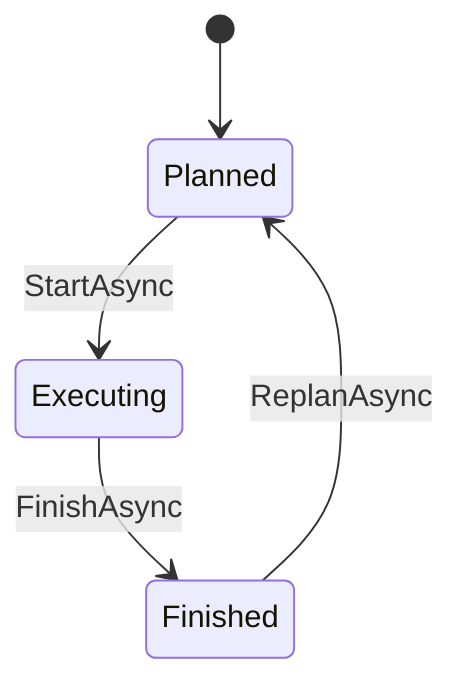

# OPC UA Asset Management Basics (OPC 10000-110)

The `Opc.Ua.AMB*` packages implement
[OPC 10000-110](https://reference.opcfoundation.org/specs/OPC-10000-110),
Asset Management Basics, version 1.01.1. AMB is not a model of a kind of
device: it is a set of rules and building blocks that make any object of a
server a *manageable asset* - a Device Integration device, a Machinery
machine, a pump or a scale - so that an asset management system can find it,
identify it, follow its health and maintenance, link it to its documentation
and place it in the plant.

A server registers its assets with a sidecar node manager; a client discovers
them and reads them back into records.

## Contents

- [Library layout](#library-layout)
- [The model](#the-model)
- [Where an asset lives](#where-an-asset-lives)
- [Quick start - server](#quick-start---server)
- [Quick start - client](#quick-start---client)
- [Server hosting](#server-hosting)
- [Builder reference](#builder-reference)
- [Discovery](#discovery)
- [Health](#health)
- [Maintenance](#maintenance)
- [Documentation links](#documentation-links)
- [Locations, version information, classification and structure](#locations-version-information-classification-and-structure)
- [Conformance matrix](#conformance-matrix)
- [Client reference](#client-reference)
- [Samples](#samples)
- [Testing](#testing)
- [Troubleshooting](#troubleshooting)
- [Known limitations](#known-limitations)
- [Model provenance](#model-provenance)
- [Generator gaps this model uncovered](#generator-gaps-this-model-uncovered)
- [MCP tools](#mcp-tools)
- [See also](#see-also)

## Library layout

| Package | Contents |
| --- | --- |
| `Opc.Ua.AMB` | The source-generated AMB model (interfaces, condition classes, the maintenance state machine, `DocumentationLinksType`, the reference types, `RootCauseDataType`, `NameNodeIdDataType`, `AddOpcUaAMB`), `AmbBrowseNames`, `AmbConditionClass` and the shared contracts `MaintenanceStateKind`, `AssetFaultSeverity` and `AssetLocationKind` |
| `Opc.Ua.AMB.Server` | `AmbNodeManager`, the asset registry `IAssetManagement` with its builders and handles, the configuration stores, and `AddAssetManagement()` / `ConfigureAssetManagement()` |
| `Opc.Ua.AMB.Client` | `AmbClient` for discovery, identification, health alarms, maintenance, documentation links, locations and structure, plus `AddAssetManagementClient()` |

The model package depends on the base namespace only. The server and client
packages use the OPC 10000-100 Device Integration building blocks AMB applies
to an asset - identification, `DeviceHealth`, the health alarm types - so a
server needs the DI namespace; registering an asset without it fails.

## The model

| Model URI | C# namespace | `Namespaces` member | Model loader |
| --- | --- | --- | --- |
| `http://opcfoundation.org/UA/AMB/` | `Opc.Ua.AMB` | `AMB` | `AddOpcUaAMB` |

The NodeSet has 92 nodes. AMB defines no event types and attaches nothing to
the types of other models; it defines three building blocks an application
applies:

| Building block | Applied to | Section |
| --- | --- | --- |
| `IRootCauseIndicationType` with `PotentialRootCauses` | alarm types | 9.4 |
| `IMaintenanceEventType` with `MaintenanceState` and eight optional details | condition types | 12.2 |
| `DocumentationLinksType` | assets, as an AddIn (`0:HasAddIn`) | 10.5 |

Its instances are the alias category `Assets` below `0:Aliases` with
`AssetsByProductInstanceUri` and `AssetsByAssetId`, and the location entry
points `HierarchicalLocations` and `OperationalLocations` below `0:Locations`.
The fourteen condition classes (`ConnectionFailureConditionClassType` and so
on) are listed in `AmbConditionClass`.

## Where an asset lives

AMB concerns assets across every model of a server, while the Device
Integration address space has exactly one owner (`AddOpcUaDi`, `AddMachinery`,
`AddPumps` or `AddScales`). The AMB node manager is therefore a sidecar: it
loads the AMB model and serves the alias categories, the location hierarchies
and the server-specific types, but the assets stay in the node manager that
owns them.

Everything AMB adds to an asset - `DeviceHealth`, alarms, maintenance
conditions, the DocumentationLinks AddIn, properties - is created in that
owner. The owner registers each asset with the shared `IAssetManagement`
registry from its setup; the registry is the meeting point of the managers.

```
DI / Machinery / Pumps / Scales node manager       AMB node manager (sidecar)
  DeviceSet/Pump  ---- registered with ---->        Aliases/Assets/AssetsBy...
    2:DeviceHealth, 2:DeviceHealthAlarms             Locations/HierarchicalLocations
    AMB:DocumentationLinks, AssetId, ...             server-specific alarm types
```

## Quick start - server

```csharp
services.AddOpcUa()
    .AddServer(options => { /* application name, endpoints, PKI */ })
    .AddOpcUaDi()                        // or AddMachinery, AddPumps, AddScales
    .AddAssetManagement(options => options.UseFileSystemStores("amb-state"))
    .ConfigureDevicesFor<DiNodeManager>(async context =>
    {
        IDeviceBuilder<DeviceState> device = await context.CreateDeviceAsync(
            new QualifiedName("Sensor_1", context.Manager.InstanceNamespaceIndex));
        device.WithIdentification(i => i.ProductInstanceUri = "urn:acme:sensor:4711");

        await device.RegisterAsAssetAsync(
            context.GetRequiredService<IAssetManagement>(),
            asset => asset
                .WithConfigurableAssetId()
                .WithDeviceHealth(deriveFromAlarms: true)
                .WithHealthAlarm("Fieldbus", AssetHealthAlarmKind.Failure, AmbConditionClass.ConnectionFailure)
                .WithMaintenance("AnnualInspection", AmbConditionClass.Inspection,
                    details => details.PlannedDate = new DateTime(2027, 3, 1, 8, 0, 0, DateTimeKind.Utc))
                .WithDocumentationLinks(links => links
                    .Add("Manual", "https://acme.example/sensor/manual.pdf")
                    .AllowUserLinks())
                .LocatedIn(AssetLocationKind.Hierarchical, "Plant1/Hall3/Line2"),
            context.CancellationToken);
    });
```

Registering checks that the asset publishes a non-empty `ProductInstanceUri`,
on the asset or in its `2:Identification` group (§7). The returned
`IAssetHandle` drives the asset at runtime:

```csharp
IAssetHealthAlarm fieldbus = handle.Health!.Alarms[0];
await fieldbus.RaiseAsync(700, new LocalizedText("The fieldbus is down."),
    [AssetRootCauses.Of(cableId, new LocalizedText("Cable cut"))]);
await handle.Maintenance!.Activities[0].StartAsync();
```

## Quick start - client

```csharp
AmbClient amb = session.AssetManagement(telemetry);

foreach (NodeId asset in await amb.DiscoverAssetsAsync())
{
    AssetSnapshot snapshot = await amb.ReadAssetAsync(asset);
    Console.WriteLine($"{snapshot.Identification.ProductInstanceUri}: {snapshot.DeviceHealth}");
}

await foreach (AssetAlarmRecord alarm in amb.ObserveHealthAlarmsAsync())
{
    Console.WriteLine($"{alarm.SourceName}/{alarm.ConditionName} {alarm.Severity} {alarm.Message.Text}");
}
```

## Server hosting

### `AddAssetManagement` and `ConfigureAssetManagement`

`AddAssetManagement(options => ...)` registers the AMB node manager factory,
the options, the shared `AssetManagement` registry (also as
`IAssetManagement`) and the configuration store. It claims no DI ownership, so
it is combined with the registration that does, in either order.

`ConfigureAssetManagement(context => ...)` runs inside the AMB node manager
while it builds its address space. The context gives the manager, the
registry, the fluent builder of the AMB manager and the services; use it to
define location hierarchies or to register objects the AMB manager itself
creates. A failing configurator aborts the start; the server reports
`BadInternalError` and logs the cause.

Without hosting, create an `AssetManagement` and pass it to
`new AmbNodeManager(server, configuration, assetManagement)`.

### Options

| Option | Default | Meaning |
| --- | --- | --- |
| `InstanceNamespaceUri` | `urn:opcua-netstandard:amb:instances` | Namespace of the alias objects and location objects |
| `TypeNamespaceUri` | `urn:opcua-netstandard:amb:types` | Namespace of the server-specific alarm and condition types |
| `RequireProductInstanceUri` | `true` | Refuse assets without `ProductInstanceUri` |
| `Discovery` | `AssetDiscovery.All` | The alias categories assets are listed in |
| `MaxAssetIdLength` | 255 (at least 40) | Longest AssetId a client may write, in Unicode characters |
| `UseServerDefinedAlarmTypes` | `true` | Apply the AMB interfaces on server-specific types; without them the Root Causes and maintenance units are not met (see [Health](#health)) |
| `MaxDocumentationLinkLength` | 2048 (at least 255) | Longest link a client may write or add |
| `MaxUserLinksPerAsset` | 16 (at least 2) | How many links users may add to one asset |
| `MaxDocumentationLinkNameLength` | 128 | Longest browse name and display name of a link a user adds |
| `MaxDocumentationLinkDescriptionLength` | 1024 | Longest description of a link a user adds |
| `MaxLocationLength` | 1024 | Longest value a client may write to a writable location Property |
| `AuthorizeLinkEdit` | authenticated users | Who may change documentation links |
| `UseFileSystemStores(directory)` | memory | Persist what clients configure below a directory |

### Persistence

What clients configure - the AssetId, editable and added documentation links,
writable locations and the local time - is kept in an
`IAssetConfigurationStore` under the asset's `ProductInstanceUri`.
`MemoryAssetConfigurationStore` keeps it for the life of the process;
`FileSystemAssetConfigurationStore` (`UseFileSystemStores`) writes one JSON
file per asset and restores the values on start. A document is written to a
temporary file first and then replaces the old one, so a crash leaves either
the old or the complete new document. A restart has to keep the
application identity, because the namespaces of persisted NodeIds are stored
by URI.

### When to register

Health alarms and maintenance conditions are created while the node manager
that owns the asset builds its address space - from `ConfigureDevicesFor`, an
`IMachineryConfigurator`, `ConfigurePumps`, `ConfigureScales` or
`ConfigureAssetManagement`. Afterwards the fluent builder is sealed and
creating them fails. Identification, discovery, links and locations work for
assets registered later as well.

## Builder reference

`IAssetBuilder`, passed to `RegisterAssetAsync` (and to
`IDeviceBuilder<T>.RegisterAsAssetAsync`):

| Method | Adds | Section |
| --- | --- | --- |
| `WithConfigurableAssetId(default)` | a writable, persistent `2:AssetId` | 7 |
| `WithDeviceHealth(initial, deriveFromAlarms)` | `2:DeviceHealth`, with `2:IDeviceHealthType` where the type lacks it | 9.2 |
| `WithHealthAlarm(name, kind, class)` | an OPC 10000-100 health alarm with root causes, and `2:DeviceHealth` following the alarms unless `WithDeviceHealth` sets it up | 9.2 to 9.4 |
| `WithMaintenance(name, class, details, onStateChanged)` | a maintenance condition with its state machine | 12 |
| `WithDocumentationLinks(links)` | the DocumentationLinks AddIn | 10.5 |
| `WithVersionInformation(hardware, software, counter)` | revisions and `RevisionCounter` | 10.2 |
| `WithLocation(kind, value, writable)` | `HierarchicalLocation`, `OperationalLocation` or `DigitalLocation` | 13.3.2, 13.4.2, 13.5 |
| `WithLocalTime(offset, daylightSaving, writable)` | `0:LocalTime` | 13.2 |
| `LocatedIn(kind, "A/B/C")` | membership in a location hierarchy | 13.3.3, 13.4.3 |
| `ClassifiedAs(dictionaryEntry)` | a `0:HasDictionaryEntry` reference to a dictionary entry (`DefineDictionaryEntryAsync`) | 11 |
| `WithRequirements(entries)`, `WithCapabilities(entries)` | the two folders | 10.6, 10.7 |
| `RelatesTo(referenceType, target)` | a sub-asset (hierarchical) or a relation (non-hierarchical) | 14 |

Properties the asset publishes already are used rather than duplicated, and an
existing write handler of the `AssetId` keeps running.

## Discovery

Every registered asset with a `ProductInstanceUri` is listed in
`AssetsByProductInstanceUri`, and every asset that has a `2:AssetId` in
`AssetsByAssetId` (§8.2): under its value, or as `NoAssetIdAssigned` while the
value is empty (§8.2.3). An asset without an AssetId is not listed there. One
`AliasNameType` object stands for each alias name and references its assets
with `0:AliasFor` - assets that share a name share the object (§8.1); each
asset gets the inverse `0:HasAlias`. `FindAlias` works on each of the three
categories; a search on `Assets` covers both subcategories.

Listing, moving or withdrawing an asset changes the `NodeVersion` of the
category and is announced with a `GeneralModelChangeEvent`. Writing a
configurable AssetId moves the asset once the value is persisted; the writes of
one asset are serialized, so the stored value, the value clients read and the
alias never disagree. A
`ProductInstanceUri` or an AssetId outside the binding that the application
changes later moves the asset as well, once the change is reported through
`ClearChangeMasks`; an asset registered without a `ProductInstanceUri`
(`RequireProductInstanceUri = false`) is listed then. An AssetId that clients
cannot write is logged as a warning: §7 asks for a writable one.

## Health

`DeviceHealth` is set by the application (`SetDeviceHealthAsync`) or, with
`deriveFromAlarms: true`, follows the active alarms: failure before function
check before out of specification before maintenance required. An asset with
health alarms always has `DeviceHealth` (§9.2); without `WithDeviceHealth` it
follows the alarms. Its source
timestamp changes only with the value, because it marks when the asset
entered the state (§9.2).

A health alarm is an instance of an OPC 10000-100 alarm type
(`AssetHealthAlarmKind`: `Failure`, `CheckFunction`, `OffSpec`,
`MaintenanceRequired`), created on the asset so that `SourceNode` and
`SourceName` identify the asset (§9.3), listed in the `2:DeviceHealthAlarms`
folder, and reporting an AMB condition class.

OPC 10000-110 applies `IRootCauseIndicationType` to alarm *types*. By default
the manager therefore creates `AssetFailureAlarmType`,
`AssetCheckFunctionAlarmType`, `AssetOffSpecAlarmType` and
`AssetMaintenanceRequiredAlarmType` in its type namespace, each a subtype of
the DI alarm type that implements the interface; a client filtering for the DI
type still receives the alarms. `UseServerDefinedAlarmTypes = false` keeps the
DI types and references the interface from each alarm instead; the alarm types
then do not implement the interface, so the server does not claim "AMB Asset
Health Status Root Causes" (§9.4.1).

`RaiseAsync(severity, message, rootCauses)` takes a severity of one of the
active bands of OPC 10000-110 Table 15 (`AssetFaultSeverities`):

| Severity | Category |
| --- | --- |
| 801 to 1000 | Critical fault |
| 601 to 800 | Major recoverable fault |
| 401 to 600 | Minor recoverable fault |
| 301 to 400 | Maintenance needed |
| 201 to 300 | Limited resource capacity near limit |
| 1 to 200 | Inactive |

The potential root causes follow §9.4.2: no list means the cause is unknown
and becomes one "unknown" entry, `AssetRootCauses.Self` (an empty list) means
the alarm itself is the cause. `ClearAsync` drops the severity into the
inactive band; an unacknowledged alarm stays retained until a client
acknowledges it, and the acknowledgement is reported as an event.

## Maintenance

A maintenance activity is a condition of the server-specific
`AssetMaintenanceActivityConditionType`, a subtype of
`2:MaintenanceRequiredAlarmType` that implements `IMaintenanceEventType`
(`UseServerDefinedAlarmTypes = false`: the DI type with the interface on the
instance, which does not meet "AMB Current and Future Maintenance Activities",
since §12.1 asks the condition type to implement it). It reports a
maintenance condition class and moves through the
`MaintenanceEventStateMachineType`:



| State | Condition |
| --- | --- |
| Planned | active, retained, severity 301 |
| Executing | active, retained, severity 301 |
| Finished | inactive, severity 100, retained until acknowledged |

The description of `MaintenanceActivityDetails` is the message of the events
(§12.1); a failed execution is told through the message of `FinishAsync`.
The details (planned date, estimated downtime, supplier, qualification,
replaced and serviced parts, method, configuration change) are published once
they are set, and `UpdateAsync` changes them in any state. Every transition and
update reports an event, so the event history keeps planned and actual values
apart. A transition the state machine does not allow - starting a finished
activity, for example - fails with `BadInvalidState`, and so does one a handler
on `OnBeforeTransition` of the `MaintenanceState` refuses. Those handlers, the
one on `OnAfterTransition` and the delegate of `UpdateAsync` run outside the
lock of the activity, so they may read it; a transition whose activity moved
while its guard ran is refused. An
`onStateChangedAsync` callback ties the activity to the application, for
example to switch a machine into its `Maintenance` operation mode, as the
sample does.

## Documentation links

`WithDocumentationLinks` adds the AddIn `AMB:DocumentationLinks`:

- `Add(name, uri)` - a link of the manufacturer; read only.
- `AddEditable(name, default)` - a link users change to one of their own
  ("AMB DocumentationLinks Edit Base").
- `AllowUserLinks()` - the `AddLink` and `RemoveLink` methods ("AMB
  DocumentationLinks Edit Advanced").

`AddLink` persists the link before it creates the variable, and the variable
keeps its NodeId across restarts; since §10.5.3 asks for that,
`AllowUserLinks()` needs a persistent store - with the memory store,
registering the asset fails with `BadConfigurationError`. `RemoveLink` removes
only links `AddLink` created. An editable link nobody has set is published as
null and, like a cleared one, does not count for "AMB DocumentationLinks
Base". Both answer with `BadUserAccessDenied` and `BadInvalidArgument` as
§10.5 defines; `AddLink` refuses names, display names and descriptions longer
than the options allow. Links restored after a restart are cut to the limits
then in force, with a warning in the log, and the stores refuse any value
longer than `AssetConfigurationNames.MaxValueLength`. `AuthorizeLinkEdit` decides who may write, add and remove
links; by default every authenticated user may and an anonymous one may not.
The `UserAccessLevel` of an editable link and the `UserExecutable` of `AddLink`
and `RemoveLink` show a user who may not change links that he cannot.

OPC 10000-110 gives a client no way to tell the links of the manufacturer from
the ones users added, although `RemoveLink` accepts only the latter. §10.5.1
lets vendors add Properties with metadata to the links, so every link `AddLink`
created - and only such a link - carries the `Boolean` Property
`UserLink` (`DocumentationLinkProperties.UserLink`) with the value `true`. Its
browse name is qualified with the namespace of the server-specific types
(`AmbServerOptions.TypeNamespaceUri`), not with the AMB namespace, and its
NodeId follows from the link's, so it is the same after a restart.
`DocumentationLinkRecord.IsUserLink` reports it on the client, which compares
the name only, as the namespace is configurable.

## Locations, version information, classification and structure

`LocatedIn(kind, "Plant1/Hall3/Line2")` creates the levels below
`HierarchicalLocations` or `OperationalLocations` in the AMB manager - the
first organized by the entry point, deeper ones as components, as §13.3.3
recommends - and connects the deepest level and the asset with
`HierarchicalContains` or `OperationalContains` in both directions (§13.1).
`IAssetManagement.DefineLocationAsync` creates a location without an asset.
Unregistering an asset removes the `*Contains` references; the locations
stay.

The version information writes the hardware and software revisions and the
`RevisionCounter` onto the properties the asset has and creates the missing
ones; `IAssetHandle.IncrementRevisionCounterAsync` counts configuration
changes. A Device Integration device has all three properties, but their
OPC 10000-100 defaults - empty revisions and a `RevisionCounter` of -1 - say
that the device does not provide them and do not count as version
information. Asking for version information starts a counter of -1 at 0.

Requirements and capabilities are folders in the AMB namespace whose entries
may reference entries of external dictionaries such as IEC CDD or ECLASS;
`ClassifiedAs` classifies the asset itself. OPC 10000-19 asks the target of
`HasDictionaryEntry` to be a `DictionaryEntryType` object:
`IAssetManagement.DefineDictionaryEntryAsync(irdi)` creates an
`IrdiDictionaryEntryType` object below `Server/Dictionaries` whose NodeId is the
IRDI in the namespace `http://opcfoundation.org/UA/Dictionary/IRDI`
(`AmbServerOptions.IrdiNamespaceUri`), so an asset is classified with
`new ExpandedNodeId(irdi, AmbServerOptions.IrdiNamespaceUri)`, before or after
the entry is defined. "AMB Classification" counts only such references. `RelatesTo` with a hierarchical
reference makes a sub-asset, with a non-hierarchical one - `0:Utilizes`,
`0:IsPhysicallyConnectedTo` and the other OPC 10000-23 references - a
relation; the target gets the inverse reference.

## Conformance matrix

### Server

The manager advertises the conformance units the registered assets meet, and
the AMB Base Asset Management Server Facet
(`http://opcfoundation.org/UA-Profile/AMB/Server/BaseServer`) exactly when
its only mandatory unit, AMB Asset Identification, is met; the other 27 units
are optional (§15.2). A unit whose rule reads "every asset" is met only with
at least one asset registered. The units are qualified names in namespace 0,
as Device Integration and Machinery publish theirs. The capabilities describe
the current configuration (OPC 10000-5 §6.3.2): registering or unregistering an
asset publishes the list again, with the units and the facet the assets meet
now, so a unit they no longer meet is withdrawn.

In the Tests column, "session" means a test checks the unit through a real
client session, "in-process" that a test checks it inside the server only.

| Conformance unit (Table 54) | Status | Rule the server applies | Tests |
| --- | --- | --- | --- |
| AMB Asset Identification (mandatory) | Implemented | every asset has a ProductInstanceUri, on the asset or in `2:Identification` | session |
| AMB Configurable Asset Identification | Implemented | every asset has a writable AssetId of at least 40 characters, and the store is persistent | session |
| AMB Asset Discovery by ProductInstanceUri | Implemented | every asset is listed in the category | session |
| AMB Asset Discovery by AssetId | Implemented | every asset with an AssetId is listed in the category, and at least one has one | session |
| AMB Asset Health Status Base | Implemented | every asset has `2:DeviceHealth` | session |
| AMB Asset Health Status Alarms | Implemented | every asset has a health alarm | session |
| AMB Asset Health Status Root Causes | Implemented | as Alarms; the alarm types implement `IRootCauseIndicationType` (`UseServerDefinedAlarmTypes`) | session |
| AMB Asset Health Status Alarm Categories | Implemented | as Alarms; every alarm reports a condition class | session |
| AMB Asset Health Tracking Overall Asset Status | Not implemented yet (history) | - | - |
| AMB Asset Health Tracking Events | Not implemented yet (history) | - | - |
| AMB Version Information | Implemented | every asset has a non-empty hardware or software revision and a RevisionCounter of at least 0 | session |
| AMB Operation Counters | Inspected only; AMB defines no counters (§10.3) | an asset has `2:OperationCounters` with a counter | in-process |
| AMB DocumentationLinks Base | Implemented | an asset has a link with a value | session |
| AMB DocumentationLinks Edit Base | Implemented | every asset has an editable link of at least 255 characters, and the store is persistent | session |
| AMB DocumentationLinks Edit Advanced | Implemented | every asset has AddLink and RemoveLink and room for two links of at least 255 characters, and the store is persistent | session |
| AMB Requirements | Implemented | an asset has a Requirements folder with an entry | session |
| AMB Capabilities | Implemented | an asset has a Capabilities folder with an entry | in-process |
| AMB Classification | Implemented | an asset has a `HasDictionaryEntry` reference to a dictionary entry object (OPC 10000-19) | session |
| AMB Current and Future Maintenance Activities | Implemented | every asset has a maintenance activity, and the condition type implements `IMaintenanceEventType` (`UseServerDefinedAlarmTypes`) | session |
| AMB Past Maintenance Activities | Not implemented yet (history) | - | - |
| AMB Local Time | Implemented | an asset has `0:LocalTime` | session |
| AMB Hierarchical Location Property | Implemented | an asset has the property | session |
| AMB Hierarchical Location Objects | Implemented | an asset is contained in a hierarchical location | session |
| AMB Operational Location Property | Implemented | an asset has the property | in-process |
| AMB Operational Location Objects | Implemented | an asset is contained in an operational location | in-process |
| AMB Digital Location | Implemented | an asset has the property | in-process |
| AMB Sub-assets | Implemented | an asset has another asset below it | session |
| AMB Asset relations | Implemented | an asset has a non-hierarchical reference to another asset | session |

The unit and facet names follow Tables 54 to 56 of the specification. The
profile database has no AMB entries yet (checked on 2026-10-01).

### Client

A client does not advertise conformance units; the table says which calls of
`AmbClient` serve the client units of OPC 10000-110 and the AMB Base Asset
Management Client Facet (`http://opcfoundation.org/UA-Profile/AMB/Client/BaseClient`),
whose only mandatory unit is AMB Client Asset Identification.

| Client conformance unit | Status | Calls |
| --- | --- | --- |
| AMB Client Asset Identification (mandatory) | Implemented | `ReadIdentificationAsync` |
| AMB Client Asset Discovery by ProductInstanceUri | Implemented | `FindAssetsAsync`, `EnumerateAssetsAsync` |
| AMB Client Asset Discovery by AssetId | Implemented | `FindAssetsAsync`, `EnumerateAssetsAsync` |
| AMB Client Asset Health Status | Implemented | `ReadDeviceHealthAsync`, `ReadHealthAlarmsAsync`, `ObserveHealthAlarmsAsync` |
| AMB Client Asset Health Tracking Status | Not implemented yet (history) | - |
| AMB Client Current and Future Maintenance Activities | Implemented | `ReadMaintenanceActivitiesAsync`, `ObserveMaintenanceAsync` |
| AMB Client Past Maintenance Activities | Not implemented yet (history) | - |
| AMB Client sub-assets | Implemented | `EnumerateSubAssetsAsync` |
| AMB Client sub-assets remote | Partly: an asset of another server is reported, not followed | `EnumerateSubAssetsAsync` |

## Client reference

`AmbClient` is created with `session.AssetManagement(telemetry)` or through
`AddAssetManagementClient()` (an `AmbClientFactory` and a
`Func<CancellationToken, Task<AmbClient>>`). It registers the AMB data types
with the session.

| Area | Calls |
| --- | --- |
| Discovery | `FindAssetsAsync(pattern, category)`, `EnumerateAssetsAsync(category)`, `DiscoverAssetsAsync`, `ReadNodeVersionAsync`, `ObserveAssetSetChangesAsync` |
| Identification | `ReadIdentificationAsync` (on the asset, then in `2:Identification`; empty values count as not set), `WriteAssetIdAsync` |
| Health | `ReadDeviceHealthAsync`, `ReadHealthAlarmsAsync`, `ObserveHealthAlarmsAsync`, `AcknowledgeAsync` |
| Maintenance | `ReadMaintenanceActivitiesAsync`, `ObserveMaintenanceAsync`, `AcknowledgeAsync` |
| Documentation links | `ReadDocumentationLinksAsync` (with `IsWritable` from the `UserAccessLevel` and `IsUserLink` from the `UserLink` Property), `AddDocumentationLinkAsync`, `RemoveDocumentationLinkAsync`, `WriteDocumentationLinkAsync` |
| Locations and structure | `BrowseLocationsAsync`, `ReadLocationsOfAssetAsync`, `ReadContextAsync`, `ReadEntriesAsync`, `EnumerateSubAssetsAsync`, `ReadRelationsAsync` |
| Snapshot | `ReadAssetAsync` |

The observe calls need an `IStreamingSubscription`; without one they use the
default streaming subscription of a `ManagedSession`. Both select the
conditions of the notifier (`ConditionType`) and tell maintenance activities
apart by their condition class - `MaintenanceConditionClassType` or a subtype,
read from the server once (§12.1) - so the health and the maintenance stream
each get their own events and one does not see the other's. The fields of the
AMB interfaces are selected with `BaseEventType`, since the Device Integration
types are only recommended. `ReadHealthAlarmsAsync` and
`ReadMaintenanceActivitiesAsync` read the conditions an asset lists in its
`2:DeviceHealthAlarms` folder, and without the folder ask for a condition
refresh (`ManagedSession` only), which reports the retained conditions of the
asset. A `RevisionCounter` of -1, the "not supported" of OPC 10000-100, is
read as not set.

## Samples

| Sample | Shows |
| --- | --- |
| [AmbServer](../samples/AMB/AmbServer) | A cooling pump and a flow sensor (DI devices) and a hydraulic press (Machinery machine) registered as assets, with every building block, file-system persistence, and a simulation of alarms and maintenance; the press switches into its Maintenance operation mode while it is serviced |
| [AmbClient](../samples/AMB/AmbClient) | Discovery, snapshots of every asset, the location hierarchies, AddLink and RemoveLink, writing an AssetId, and streams of health alarms and maintenance activities |

See [samples/AMB](../samples/AMB/README.md) for how to run them.

## Testing

```bash
dotnet test tests/Opc.Ua.AMB.Tests
```

| Fixture | Covers |
| --- | --- |
| `AmbModelTests`, `AmbContractsTests` | The generated model and the contracts |
| `AmbNodeManagerTests`, `AmbHostingTests`, `AmbCompositionTests` | The manager, hosting, composition with DI and Pumps |
| `AssetRegistrationTests`, `ConfigurableAssetIdTests`, `AssetConfigurationStoreTests` | Registration, identification and the stores |
| `AssetDiscoveryTests` | The alias categories, FindAlias, NodeVersion |
| `HealthAlarmTests`, `MaintenanceActivityTests`, `DocumentationLinksTests`, `AssetStructureTests` | The building blocks in-process |
| `Amb*SessionTests` | Each area over a real client session |
| `AmbClientTests` | The client without a server |
| `AmbClientServerE2eTests` | `AmbClient` against a hosted server, a restart with persistence, and a Machinery machine as an asset |

## Troubleshooting

| Symptom | Cause | Fix |
| --- | --- | --- |
| An event field of `PotentialRootCauses` or `MaintenanceState` is always null | The select clause names the interface (`IRootCauseIndicationType`, `IMaintenanceEventType`) as its type definition; a server checks it against the type hierarchy of the event, which an interface is not part of | Select with `BaseEventType` as the type definition, as `AmbClient` does; the DI types work only for conditions that derive from them |
| `0:Aliases/FindAlias` does not find assets | The AMB categories are served through a registry of the AMB manager, not the server-wide one | Call `FindAlias` on `Assets`, `AssetsByProductInstanceUri` or `AssetsByAssetId` |
| `BadInvalidState` when registering an asset with an alarm or a maintenance activity | The owner's address space is already built and its builder sealed | Register the asset from the owner's setup (see [When to register](#when-to-register)) |
| `BadConfigurationError`: the AMB node manager is not part of the server | `AddAssetManagement` is missing | Add it |
| `BadConfigurationError`: no Device Integration namespace | No DI owner is registered | Add `AddOpcUaDi`, `AddMachinery`, `AddPumps` or `AddScales` |
| `BadConfigurationError`: no ProductInstanceUri | The asset publishes none | Set it, or turn off `RequireProductInstanceUri` for an asset completed later |
| `BadConfigurationError` when registering an asset with `AllowUserLinks()` | The store keeps what users add in memory only (§10.5.3) | Use `UseFileSystemStores` or another persistent store |
| `BadUserAccessDenied` from `AddLink` or writing a link | Anonymous session, or `AuthorizeLinkEdit` refuses | Authenticate, or set `AuthorizeLinkEdit` |
| An added link or the AssetId is gone after a restart | Memory store, or a changed application identity | Use `UseFileSystemStores` and keep the ApplicationUri and the namespaces |
| "AMB Configurable Asset Identification" is not advertised | The memory store does not survive a restart | Use a persistent store |
| An observe call fails with `BadInvalidState` | No streaming subscription and no `ManagedSession` | Pass an `IStreamingSubscription` |
| A server shows no `0:Locations`, or `BrowseLocationsAsync` finds nothing | `0:Locations` came with UA 1.05.02, and a location exists only once an asset is put into it or it is defined | `AmbClient` browses from `HierarchicalLocations` and `OperationalLocations` directly; on the server use `LocatedIn` or `DefineLocationAsync` |

## Known limitations

| Topic | Behaviour | Section |
| --- | --- | --- |
| Source timestamp of `DeviceHealth` after a restart | The timestamp marks when the asset entered its state while the server runs; after a restart it is the time of the restart, since the state is not persisted | 9.2 ("should") |
| Optional members of a maintenance activity | Once published, a member keeps its property; `UpdateAsync` changes its value but does not remove it | 12.2 |
| `2:PatchIdentifiers` | `WithVersionInformation` does not create it; an asset that publishes it keeps it | 10.2 |
| Location objects | An asset is contained by the deepest level of each path it is put into, not by the levels above | 13.3.3.1 |
| Event history | "AMB Asset Health Tracking" and "AMB Past Maintenance Activities" need a historian and are left for a later change | Table 54 |

## Model provenance

`src/Opc.Ua.AMB/Model/Opc.Ua.AMB.NodeSet2.xml` is the unmodified OPC
Foundation publication from
[`UA-Nodeset/latest/AMB`](https://github.com/OPCFoundation/UA-Nodeset/tree/latest/AMB):
model version 1.01.1, published 2024-02-27, requiring UA 1.05.02. The
`RequiredModel` version is a lower bound, not a pin.

`Opc.Ua.AMB.Upstream.NodeIds.csv` is the identifier table of the publication,
vendored unchanged. `Opc.Ua.AMB.NodeIds.csv` is derived from it with
`tools/nodesets/derive-identifier-table.py` (92 rows, 25 symbols renamed to
the generator's naming, for example `Aliases_Assets` to `Assets` for the
instances below namespace-0 objects) and pins the symbol-to-NodeId mapping;
the generator fails the build when the two disagree.

## Generator gaps this model uncovered

AMB is the first companion model that instantiates namespace-0 types at the
top level (`AliasNameCategoryType` below `0:Aliases`). That showed one new
gap; two known ones apply as well:

- **No identifier constants for instance children the NodeSet adds itself.**
  The `NodeVersion` properties of `AssetsByProductInstanceUri` and
  `AssetsByAssetId` are generated correctly, but get no `VariableIds`
  constants, because the generator takes children of a top-level instance only
  when the type declares them as mandatory. The server finds the property
  through its browse name, the client through a browse path.
  `AmbModelTests.NodeVersionHasNoIdentifierConstant` records the gap and fails
  once the generator emits the constants. The obvious fix changes the
  identifiers of other generated models, among them the reference server's,
  and is left for a separate change.
- **A child created through `CreateChild` is invisible to clients.** As
  described for [Pumps](Pumps.md#generator-gap-this-model-uncovered), the
  generic path creates a child without reference type, type definition and
  data type. When the AMB manager adds a `2:AssetId` through the slot of a
  device type, it completes the property the way the generated helpers do.
- **The generated maintenance state machine has no transition tables.** Like
  the Machinery state machines, `MaintenanceEventStateMachineState` does not
  override `StateTable`, `TransitionTable` and `TransitionMappings`. The server
  drives it with tables built from the generated
  `MaintenanceEventStateMachineTypeIds`.

## MCP tools

`opcua-mcp --profile amb` exposes the AMB client as twelve tools: local
asset discovery, alias search/browse, category/version inspection, finite
asset-facet reads, location browsing, bounded observations, asset-ID changes,
acknowledgements and documentation-link add/write/remove operations.

Start with `amb_discover_assets` or `amb_find_assets`, then pass the returned
NodeId to `amb_read_asset`. Choose a finite `facet`, such as `Identification`,
`HealthAlarms`, `Maintenance`, `Documentation` or `Snapshot`. Collection facets
are paged; snapshots are live sequential reads, not atomic plant snapshots.
The read tools never acknowledge conditions or change identifiers.

```json
{
  "assetNodeId": "ns=2;s=Asset1",
  "facet": "Identification",
  "sessionName": "plant"
}
```

`amb_acknowledge` requires the exact condition ID and base64 event ID returned
by a read/observation. Remote alias and sub-asset identities are retained but
not followed. There is no historical health or maintenance tool where the
current typed client has no history implementation.

Embed `Opc.Ua.Mcp.AMB` with `AddOpcUaMcpAmb()` and `WithOpcUaAmbTools(...)`.
See [industrial companion MCP tools](McpServer.md#industrial-companion-tools) for profiles, session
selection, result/error contracts and embedding.

## See also

- [Device Integration developer guide](DeviceIntegration.md): `DiNodeManager`,
  `ConfigureDevicesFor`, identification and the alarm types AMB builds on
- [Alias names](AliasNames.md): the Part 17 categories AMB discovery uses
- [Machinery developer guide](Machinery.md): the machine builders; a machine
  becomes an asset through `IMachineHandle<T>.AsNode()`
- [OPC 10000-110 on the OPC Foundation reference site](https://reference.opcfoundation.org/specs/OPC-10000-110)
