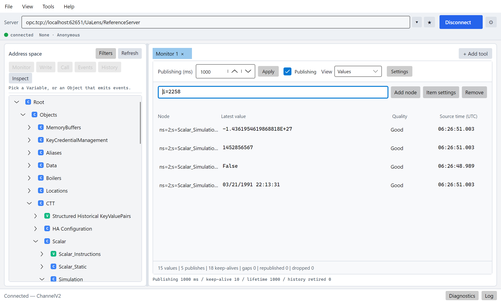
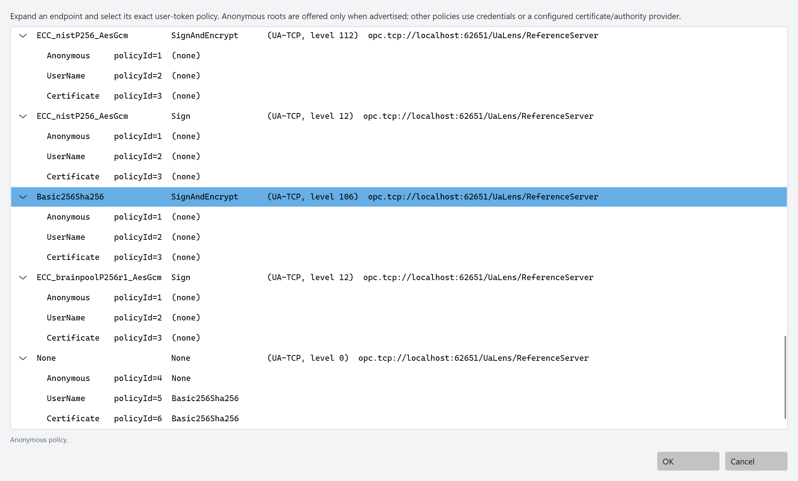
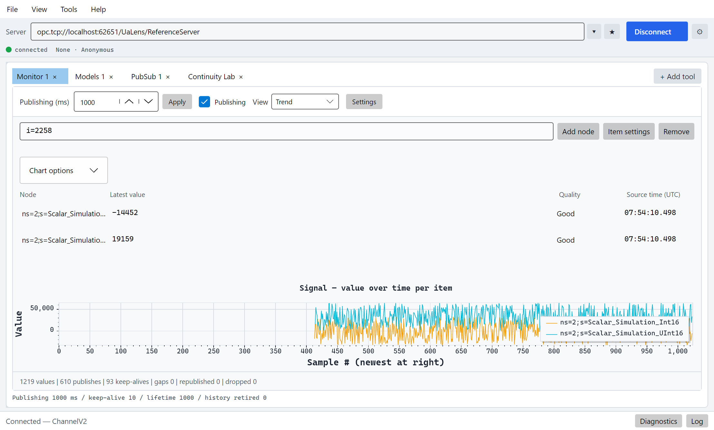
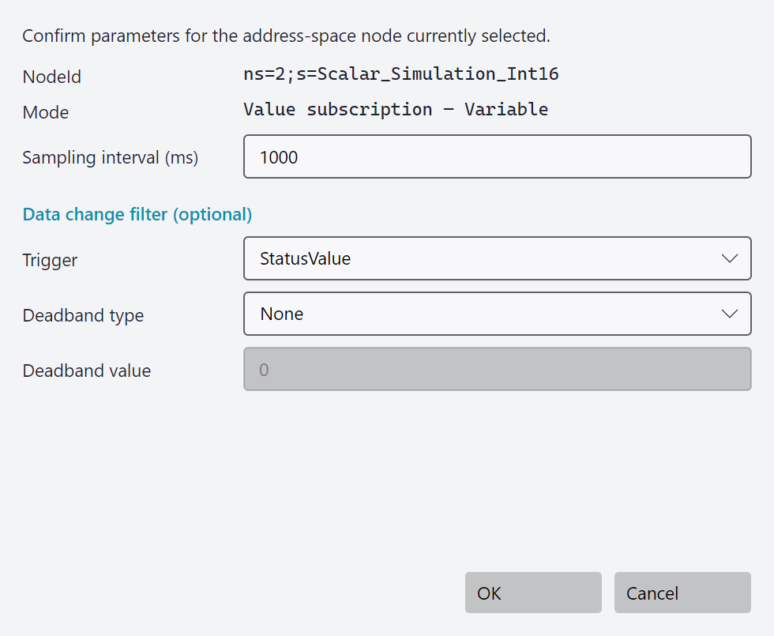
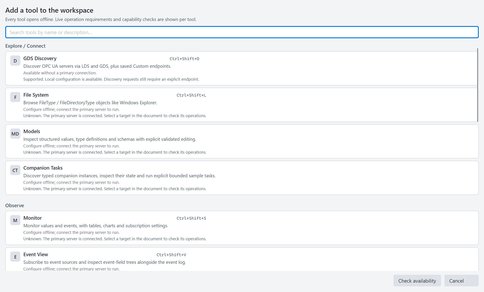
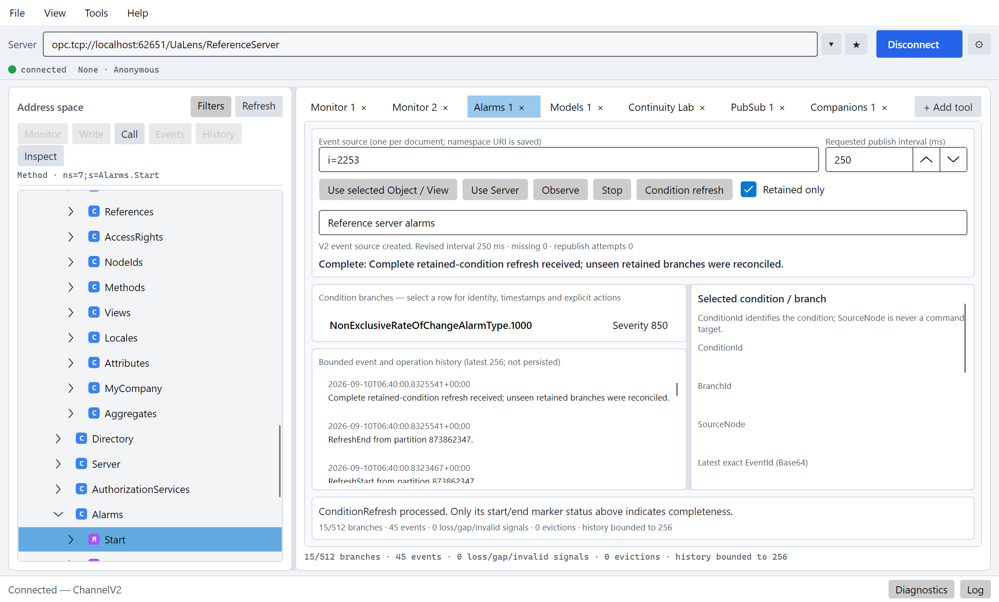
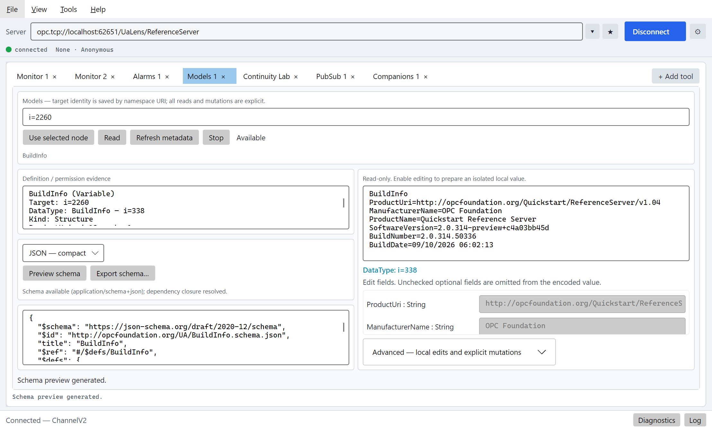
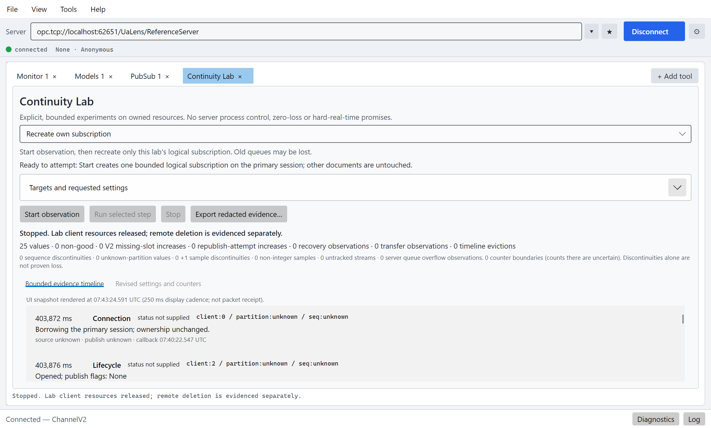
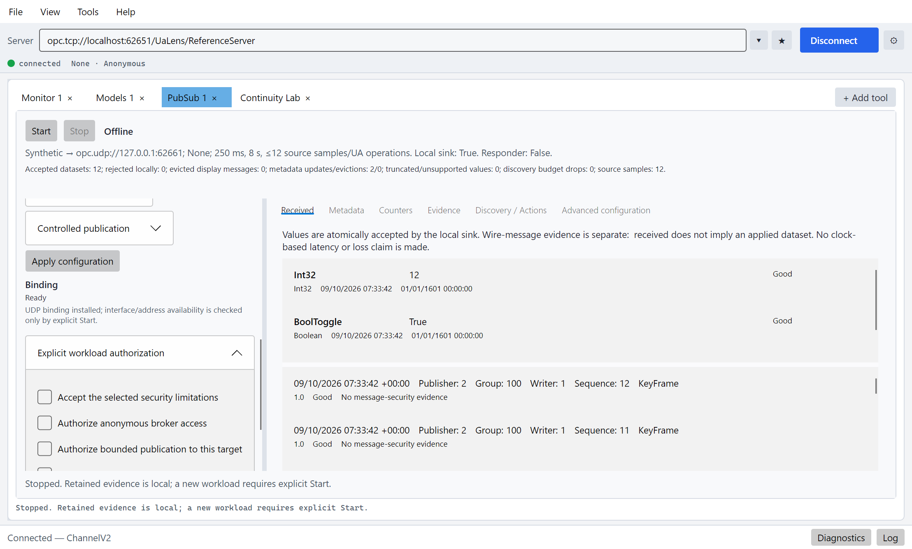

# UaLens

UaLens is the stack's Avalonia desktop engineering tool. It combines address-space
exploration, monitoring, history, events, diagnostics, and administration in one
workspace. Its source is in [`tools/Opc.Ua.Lens`](../tools/Opc.Ua.Lens).

The tool catalog provides browse/read/monitor workflows and allows you to perform
advanced operations or control advanced settings, such as connection settings.
UaLens is an engineering workspace, not a conformance certificate or a real-time
delivery guarantee.

There is one primary server connection. GDS tools can use a suitable primary
session or maintain their own secondary connection. Document tabs are working
contexts, not separate primary server sessions.

The screenshots show local examples using the repository's ConsoleReferenceServer.
The live examples use Anonymous/None on a loopback endpoint; this is not a
deployment security recommendation. Select the appropriate security policy,
identity and certificate trust for a deployed server. Sample values and counters
illustrate the interface, not timing or delivery guarantees.

## Getting started

From the repository root:

```powershell
$env:CustomTestTarget = 'net10.0'
dotnet build tools\Opc.Ua.Lens\Opc.Ua.Lens.csproj -c Release -f net10.0
dotnet run --project tools\Opc.Ua.Lens\Opc.Ua.Lens.csproj -c Release -f net10.0 --no-build
```

The application also targets .NET 8 and .NET 9. Its assembly is `UaLens`, its
package is `OPCFoundation.NetStandard.Opc.Ua.Lens`, and its tool command is `ualens`.

Use the connection bar to choose an endpoint and connect. The endpoint picker
shows the server's advertised security and identity policies. The primary state,
security policy, and identity are visible while working.

The standard headless `--smoke` and protocol probes are development diagnostics
for a reference server's explicitly selected Anonymous/None endpoint. They do
not prove secure desktop behavior or authorize accepting an untrusted certificate.

## Workspace

The menu contains **File**, **View**, **Tools**, and **Help**. Add a document
through **Add Tool**, the Tools menu, or an applicable address-space action.
The searchable catalog groups tools into Explore / Connect, Observe, Administer,
and Diagnose. Use document actions and document or connection settings to perform
advanced operations and control their configuration.

The empty workspace offers connection, workspace, discovery, and local-certificate
entry points; it is not a permanent Home or General tab. The address-space explorer
and contextual attributes/references inspector are resizable. Monitor, Write, Call,
Events, History, and Inspect are available according to the selected node.

An unavailable operation does not hide an entire document. Local certificate
management and discovery are available without a primary connection. Session-bound
documents retain their configuration while disconnected.



*Browse the address space beside a monitor document. The connection bar applies
to the primary session shared by the documents.*

The default appearance follows the operating system. Light and Dark can be
selected explicitly. Saved Light, DarkStandard, and DarkNavy preferences select
an explicit appearance; System follows the operating system. Charts use the
same semantic colors as dialogs and document surfaces.

Standard text-editing shortcuts retain their usual meaning. F2 renames a document;
Ctrl+Tab and Ctrl+Shift+Tab cycle documents. The command registry is the source of
truth for displayed shortcuts and their availability.

Close and Quit await local cleanup, with bounded V2 server-side subscription
deletion even when the server is unavailable. The status bar shows shutdown
progress. A remote cleanup failure is logged rather than presented as confirmed
deletion; the server may retain resources until their lifetime expires.

## Connection and trust

An untrusted server certificate is rejected unless the user makes an explicit
decision. The choices are Reject, Accept Once, and Trust Permanently.

Accept Once applies to the selected endpoint, certificate, and overridable
validation error. It is not global trust and does not authorize a GDS secondary
connection. Disconnecting or selecting a different target clears it. Permanent
trust must be written successfully to the certificate store before retrying.
Invalid or revoked certificates are not made acceptable by the untrusted-certificate
choice.



*Choose an advertised endpoint and its user-token policy. Selecting SignAndEncrypt
does not automatically grant certificate trust.*

The validation callback never blocks on a window. Connection coordination rejects
and captures the validation failure, prompts asynchronously, and makes a bounded
retry using the decision. Cancellation does not apply a late dialog answer.

Changing engines or reconnecting preserves the selected security and identity
profile. Credentials are reacquired when necessary; a disposed session identity
is not reused. Changing the user replaces the session through the connection
owner, updating its profile and retained credentials together; document
configurations are rebound to the new session. Workspaces contain profile intent,
not passwords, private keys, or bearer tokens. The connection flow supports
Anonymous, UserName, X.509 user certificates and issued-token providers registered
by the host. Certificate stores, password/PIN providers, token
authorities, application-key providers, and reverse-connect listeners have explicit
configuration requirements; a saved provider name cannot install a provider or load
an arbitrary native module.

### Identities, hardware keys and reverse connect

X.509 user identity resolves an existing certificate through a configured source
and password/PIN provider; it is not the same certificate role as the application's
secure channel. The selected token policy must match the key and provider capability.

Issued-token selection resolves a named access-token provider and pinned authority/
profile metadata. The application does not include a general OAuth enrollment UI
or accept a workspace as authority to create a token broker. Reconnect and user
changes reacquire identity material through its owner, never reuse a disposed
session identity or downgrade to Anonymous.

Hardware-backed selection references host-registered certificate/crypto providers.
Keys stay inside their provider; PINs and bearer tokens never go into workspace
JSON. Provider modules, device enrollment, token authorities, and HSM provisioning
are external setup. No hardware or FIPS claim follows merely from selecting a name.

Reverse connect requires an explicit listener, expected ServerUri/endpoint, registered
binding and secure identity/trust configuration. Restoring a profile does not bind
its socket. A received reverse handshake is not sufficient authorization to trust
an arbitrary peer. WSS also requires listener TLS configuration. Forward transport
selection is constrained to the registered bindings and actual platform support.
Ordinary Connect goes directly to endpoint/security selection. Configure listeners
and application identity through connection settings.

Connection setup shows the selected binding's forward/reverse support, named
application-key and listener-TLS registrations, expected peer and outstanding
network/trust prerequisites. **Discover endpoints** is an explicit forward
operation; reverse mode uses **Start listener**, then **Wait / discover**.
**Use setup** saves the selected intent without creating a channel or listener.
Saved profiles stay pinned to their exact endpoint, application URI, security and
user-token policy; unavailable registrations remain visible instead of selecting
an unrelated default.

Reverse waits and startup can be canceled independently. Stop prevents new
listener leases while existing work drains; the primary reverse session must be
released before its listener is disposed. Discovery and a registered certificate
provider do not prove current certificate trust, private-key access or reachability.

See [Identity Providers](IdentityProviders.md), [Crypto Provider](CryptoProvider.md),
[Reverse Connect](ReverseConnect.md) and [Transports](Transports.md).

## Monitoring

A monitor document starts with values, quality, and source timestamps. Its **View**
selector offers Values, Trend, Timing: dots, Timing: bars, Timing: lines, Histogram,
and Heatmap. Trend plots the sampled signal; choosing a visualization does not
change server publishing.



*Trend combines the latest values and quality with a signal chart. The sample
axis is a display sequence, not a measurement of network latency.*

The requested publishing interval and publishing-enabled control are immediately
available. The server's revised values are displayed separately. Item settings
control sampling, monitoring mode, queues, discard policy, and data-change filtering.
Source and server timestamps have different meanings; neither is replaced with
the time at which the UI happens to render.



*The address-space Monitor action lets you confirm sampling and an optional
data-change filter before adding the selected variable.*

Publishing, sampling, and display timing are distinct:

| Setting | Meaning |
|---|---|
| Sampling interval | How often the server evaluates a monitored value, subject to server revision and source behavior |
| Publishing interval | When a subscription has publishing opportunities; it does not force the source to change |
| Monitoring mode | Whether an item is disabled, sampling, or reporting |
| Publishing enabled | Whether the server publishes subscription notifications |
| Display pause or rendering throttle | A client presentation choice, not a server subscription setting |

Publish-worker/request limits belong to the **connection**. They affect every
subscription using that session and are not reapplied by unrelated per-document
settings changes.

Each monitor owns one notification-capture task. Charts have independent playback
cursors, so switching documents or views does not steal notifications from another
reader or reset collected history. Retention and rendering work are bounded;
retired history, dropped notifications, gaps, and republish activity must not be
confused with a lossless delivery guarantee.

Raw publish diagnostics use server subscription identifiers where the public
stack interface exposes an unambiguous identifier. Partitioned V2 callbacks can
instead carry a `client:` correlation identifier; this is deliberately not
presented as a server-assigned ID. Display-log buffering is bounded separately
from notification delivery.

## Tools and workflows

The catalog provides seventeen tool kinds:

| Tool | Workflows |
|---|---|
| Monitor | Values, events, quality/timestamps, charts, subscription/item settings, recursive node selection, export |
| Event View | Multiple sources, filters, selected fields, details, bounded event log, display pause/clear |
| Alarms | Retained conditions and branches, refresh reconciliation, explicit acknowledgement/confirmation/comment, contextual operator actions |
| Models | Type definitions, schema preview/export, native-safe structured editing, explicit read/write/call |
| Continuity Lab | Bounded recovery evidence, owned-subscription recreation, transfer/recreate-on-load, configured durable and redundant scenarios |
| PubSub | Explicitly started dataset observation, metadata and diagnostics, controlled publication and configured Action/adapter workflows |
| Companion Tasks | Typed DI, ISA-95, WoT/xRegistry, Robotics, Vision, AI and OpenUSD discovery/inspection, with bounded guided operations |
| Historian | Raw, processed, at-time and modified reads; cancellation, export, and explicitly requested updates/deletion |
| Subscription Bench | Variable pool, both live scaling sliders, aggregate rates/counts, shared defaults, shrinking and Stop cleanup |
| Performance | Explicit write/call workloads, selected baselines, metric/configuration/distribution comparison, bounded history, JSON and legacy CSV |
| File System | File/directory browsing, transfers, creation, rename, and deletion |
| Certificate Manager | Local application/trusted/issuer/rejected store management |
| GDS Discovery | Discovery endpoints and saved favorites |
| GDS Management / Push | Registered applications, issuance/CSR, trust lists, certificate update/apply |
| User / Role Management | Account/password restrictions and role/identity/application/endpoint mappings |



*The catalog explains configuration and live-operation prerequisites per tool.
An available document or successful browse does not establish mutation permission.*

Subscription Bench is slider-driven; there is no separate Run prerequisite. Shared
settings apply to existing resources and resources added later. Shrinking, Stop,
and document closure release the corresponding server resources.

PubSub and continuity experiments have their own explicit Start/Stop controls.
PubSub can own an independent network runtime without a primary UA session; only
configured primary-session adapters depend on that session.

Administration targets and prerequisites matter. History deletion, file deletion,
account/role changes, certificate application, and write/call workloads are not
automatically executed when a workspace loads. Certificate ApplyChanges can
intentionally terminate a connection.

## Guided workflows

### Choosing a workflow

| Goal | Open or configure | Starts work |
|---|---|---|
| Inspect retained conditions and act on a selected event | Alarms | Explicit observation/refresh and operator commands |
| Inspect or edit a custom value | Models, or a Write/Call dialog | Explicit Read, metadata refresh, Write or Call |
| Explain recovery or transfer | Continuity Lab | Start observation, then the selected step |
| Receive a published dataset | PubSub | Explicit Start with interface/broker/security configuration |
| Inspect an industry model | Companion Tasks | Discover, Inspect, Prepare, review, then explicitly Run an offered task |
| Use X.509, issued tokens or hardware keys | Connection identity selection | Connect after provider selection |
| Accept a configured reverse connection | Connection setup | Explicit listener/wait and Connect |

Loading a workspace restores intent, not active workloads. It does not acknowledge
conditions, call methods, write values, start a publisher, bind a listener, restart
a server, or arm a sample task.

### Alarms

Use an event notifier that exposes real conditions. Alarms keeps the condition
identity separate from the source node, distinguishes branches, and uses the
selected event's current EventId for acknowledgement and confirmation.

Refresh reconciles retained state using the server's refresh markers. A completed
service request without the expected event sequence is not presented as a complete
refresh. Recreating a subscription and refreshing is distinct from transferring one.
Missing events and bounded retention are visible.



*Observe an event notifier and reconcile retained conditions with Condition
refresh. This example uses a bounded reference-server alarm simulation.*

Acknowledgement, confirmation, comments and applicable advanced condition
operations are explicit. A disconnected or restored document never repeats them.
Authorization errors and unsupported operations are reported as failures; the UI
does not optimistically mark a rejected acknowledgement successful.

The implementation reuses the stack's typed alarm operations, generated event
records and V2 subscription facilities. See [Alarms and Conditions](AlarmsAndConditions.md).

### Models and structured values

Select a variable, DataType or method and open Models. Read the value or definition
explicitly. The same structured editing module serves Models and the Write/Call
dialogs; it supports generated encodeables and the stack's default NativeAOT-friendly
runtime type adapters without Reflection.Emit.



*Read a structured value, inspect its definition and preview a schema. Editing
starts from a separate local draft and does not itself write to the server.*

Edits use a separate draft. A rejected or canceled draft cannot modify the original
value or write to the server. Nested fields, optional presence, unions and supported
arrays retain their type semantics.

OptionSet editors expose named bits without discarding unnamed bits. Unsigned
OptionSets retain their Byte, UInt16, UInt32 or UInt64 wire width. Concrete
Structure-backed OptionSets keep separate Value and ValidBits controls; changing
one does not imply changing the other. Null and empty masks remain distinct.
A missing native type adapter or incompatible width is an explicit editing error.

The shared array/matrix editor is available in Models and the Write/Call dialogs,
including for a new value whose declared rank establishes the shape. Enter
comma-separated dimensions, then select **Apply shape / create matrix**.
Reshaping preserves flattened row-major order. Adding or dropping elements requires
**Allow resizing / discarding trailing elements**; new elements receive typed
defaults. Rank, declared dimension maxima, checked products and the session's
encoding limits are validated before commit. The editor supports up to 32 dimensions
and 65,536 elements, subject to lower session limits. Pending or rejected shape
changes cannot silently commit the previous shape.

Null and empty one-dimensional arrays have different wire encodings. Null/empty
matrix fields retain their raw structure encoding; standalone matrix Variants
require a nonempty valid shape. A fresh matrix can be created without importing
an existing value. Metadata refresh, cancellation or session changes invalidate
the draft rather than letting it write through stale type information.

Schema preview/export uses the stack's schema provider. Missing definitions are
reported explicitly; denied reads, canceled resolution and connection failures
are not treated as authoritative absence. Metadata refresh and session-generation
changes discard stale definitions. Unknown opaque values are read-only.

Structure fields declared as `Number` (`i=26`), `Integer` (`i=27`) or `UInteger`
(`i=28`) use the standard Variant wire encoding in JSON, XML and binary schemas.
They do not require a server-side `DataTypeDefinition`. Unresolved custom data
types are reported as unavailable rather than exported as an untyped success.

See [Complex Types](ComplexTypes.md) and [Schema Generation](SchemaGeneration.md).

### Performance comparisons

Configure a Write or Call target, rate or bounded-concurrency burst, generator and
duration, then explicitly **Run**. Settings, target identity and available
endpoint/security evidence are captured at the start; changing later settings
does not rewrite a completed run's evidence. **Stop** cancels scheduling and waits
for issued operations to settle before retaining a partial result. Throughput uses
actual elapsed time, including that drain, rather than the requested duration.

Open **Compare runs**, select any retained row and choose **Use as baseline**.
Select another row to compare throughput, completed operations, errors, elapsed
time and latency. Absolute differences are selected minus baseline; relative
differences use the baseline. A zero baseline with a nonzero difference is shown
as unavailable, not infinity. Target, generator, rate, duration, concurrency,
argument signature and security differences are shown separately. Matching
captured settings does not control server load or establish equivalent environments.

Each newly captured run retains 71 fixed latency-bucket counts, not individual
samples. The last bucket contains latencies at or above ten seconds. Distribution
comparisons use each run's observed sample count and show percentage-point
differences; percentile values are bucket estimates. Missing legacy distributions
are labeled missing, never reconstructed from percentiles.

**Save results** writes versioned JSON retaining selections, configuration evidence
and distributions, or legacy aggregate-only CSV when that format is selected.
**Load results** validates the complete bounded file before replacing history; it
does not change workload settings or start a run. Import is limited to 4 Mi
characters and 4,096 records; history retains the newest 64. If a selected baseline
is evicted it is cleared explicitly, not replaced with a different run.
**Highlight latest 3** only highlights rows and is independent of comparison.

### Continuity Lab and diagnostics

Continuity Lab owns its observation subscription and any auxiliary sessions used
by its selected scenario. It uses the primary connection owner and the stack's
reconnect handling. Other documents retain their configuration.

The timeline distinguishes reconnect/recovery, transfer, recreation, missing
messages and republish activity. It records actual server subscription/partition
IDs where available; client correlation IDs are not relabeled as server IDs.
Requested and revised settings and server operation limits provide context for
throughput and failures.



*The lab retains bounded evidence after its resources are released. Recreation,
transfer and recovery are distinct observations; discontinuities alone are not
proof of lost source samples.*

The available scenarios include observation of a user-managed outage, recreation
of the lab's own subscription, transfer or recreation from its own snapshot, and
configured durable restore or redundant takeover. A snapshot used by a running
lab is separate from ordinary workspace JSON.

Durability is configured before monitored items are added, and the server may
revise its requested lifetime. Same-user transfer rules, server queues, partitioning
and triggering relationships matter. The repository's Quickstarts durable store
persists subscriptions on graceful shutdown and does not persist issued-token
subscriptions. It does not establish arbitrary crash recovery.

UaLens does not terminate arbitrary server processes. For a graceful-restart
scenario, save/close the lab-owned session, restart the explicitly selected sample
yourself, and then request restore. Redundancy requires an already configured
set/provider. Missing prerequisites are shown as setup requirements.

Evidence export is bounded and omits credentials. Sampling time, server publishing,
network receipt and UI rendering are different measurements. Unsynchronized
source/client clocks cannot establish one-way latency. A missing diagnostics
permission is not a zero counter, and republish attempts do not prove every missing
sample was recovered. Privileged packet capture is not required for the ordinary
counter view and is not automatically provisioned.

See [Subscriptions](Subscriptions.md), [Transfer](TransferSubscription.md),
[Durable Subscriptions](DurableSubscription.md), [High Availability](HighAvailability.md)
and [Diagnostics](Diagnostics.md).

### PubSub

A PubSub document owns its runtime independently of the primary UA session. Configure
the transport, address/interface or broker, publisher/writer/reader identifiers,
encoding and security requirements, then start it explicitly. Metadata, decoded
fields, state and bounded diagnostic evidence are shown together.

The default subscriber sink observes locally. Receiving a dataset does not write
to a UA server. Publication, Actions, external-server adapters and write-back need
explicit configuration and authorization. Stop/close releases the owned runtime;
primary-session loss affects only configured adapters that depend on that session.



*A bounded synthetic loopback retains received values and wire-message evidence
after Stop. Local dataset acceptance is separate from an external delivery guarantee.*

The module reuses `PubSubApplicationBuilder`, `IPubSubApplication`, transport,
metadata, source/sink, security and Action facilities. Configurations save safe
references, not raw broker credentials or SKS key material. No runtime or publisher
is started by application DI registration or workspace restore.

Choose an offline preset from the registered transport/profile catalog, then set
the endpoint/interface or broker and review the prerequisites. Presets neither
choose a destination nor supply credentials. The **Dataset / adapters** tab edits
ordered scalar fields, field/dataset UUIDs, metadata versions, portable UA mappings
and supported content masks. UADP retains the selected numeric publisher width;
JSON uses canonical numeric identities and supports UUIDs. Ambiguous numeric or
UUID-looking string identities are rejected for JSON rather than silently remapped.

Received scalar metadata can populate an offline reader configuration. Adoption
clears publication, write-back, responder and UA target mappings. Arrays, custom
types and promoted fields require a shared schema/encoding context and are reported
as unsupported by this scalar commissioning form, not flattened into a different
schema.

**Validate draft** checks the current form; **Apply configuration** updates the
reviewed intent. Field, mask, identity or adapter edits revoke Start authorization.
**Import configuration** validates the entire file before changing the document,
rejects duplicate/unknown properties, and cannot overwrite newer edits made while
the file is being read. **Export applied configuration** replaces a local JSON file
atomically. Files are limited to 65,536 JSON characters and 196,608 UTF-8 bytes;
fields are limited to 32. Import and restore never start network work.

Select either a registered out-of-band key provider or the registered provider's
pinned SKS endpoint and security group. A typed endpoint cannot retarget a provider.
The active token's ID, issuance, expiry and key sizes are checked before runtime
construction; missing or invalid material never falls back to unsecured traffic.
Provider registration is not SKS enrollment or key generation.

Action input forms preserve scalar types and ordering and allow at most 16
transient inputs. Each invocation requires fresh consent and supports explicit
cancellation. Results retain stack-provided request/correlation evidence; rejected,
uncorrelated or malformed responses cannot leave a previous success displayed.
Write-back requires complete, positionally mapped fields with matching names,
types and good quality before calling the configured UA writer.

Reaching a sample cap is not the same as completing its final send. The runtime
finishes the final publication before stopping its writer. A synthetic UDP loopback
also gets a bounded two-second local receive drain; expiry is recorded explicitly
and does not imply remote acknowledgement or a lossless network.

UDP/UADP and configured MQTT workflows use the stack transports. Other profiles
require their registered transport/provider and platform prerequisites. Kafka uses
the managed backend in the native app; the optional Confluent backend is not a
NativeAOT substitute. DTLS, Ethernet, SKS, brokers and advanced adapter scenarios
do not install their own external infrastructure.
DTLS remains gated when the installed stack configuration validator rejects its
endpoint scheme, even if a host transport provider is registered.

For a self-contained source use the repository's
[Console Reference PubSub Client](../samples/PubSub/ConsoleReferencePubSubClient/README.md)
in publisher mode with matching explicit settings. The full stack guide is
[PubSub](PubSub.md).

### Companion Tasks

Choose a model, select **Discover**, then **Inspect** a returned instance. Discovery
uses actual typed instances, not just namespace presence. Inspection is read-only.
The task list is populated by the selected instance; an arbitrary operation name
cannot be executed without a current inspection.

Choose an offered task and enter any required input, then select **Prepare selected
task**. Preparation is read-only: it rechecks the offered operation and displays
the exact target, endpoint and effect. The prepared request captures its input
without displaying raw input or endpoint query strings in the summary.
Review it and explicitly **Run selected task**.

Typed task forms expose named inputs instead of accepting an arbitrary method
payload. Boolean and numeric fields retain their types, and file inputs use an
explicit local-file picker. Changing any field discards the corresponding
preparation and confirmation. Domain-specific review evidence is shown without
serializing the input into a saved workspace.

Preparation is single-use and expires after five minutes. Run rechecks the current
session, identity, namespace mapping, endpoint/security profile and offered operation.
A changed selection/input, discovery/inspection, rebind, failed preparation or Stop
invalidates the earlier preparation. Starting Run consumes it even if cancellation,
authorization or provider execution fails. Preparing an overlapping request cannot
make an earlier request executable again. No operation is automatically replayed
after reconnect.

Sample mutations additionally require a loopback endpoint and explicit confirmation
that it is a repository sample. Loopback alone does not prove a server is safe to
mutate. Confirm only after preparing the specific request. Preparation, confirmation
and operation input are never saved, and confirmation is cleared when the request
changes or is attempted. File exports require an explicit destination.

| Family | Guided scope | Intentional limit |
|---|---|---|
| DI | Identity, bounded update observation, SHA-256-verified package preparation/upload, separate sample install/confirm and advertised abort/resume methods | Repository samples only; device-specific installation, trust and power-cycle behavior are not inferred |
| ISA-95 | Typed V1/V2 resources and job inspection; explicit sample job storage | Jobs are not automatically started |
| WoT / xRegistry | Asset/document/version/model inspection; explicit compatible sample registration/refresh | No overwrite of existing versions; server AutoRefresh policy applies |
| Robotics | Published device-system/controller/axis topology and telemetry | No physical actuation or Robot Intent commanding |
| Vision | Sensor/frame/pipeline/result inspection through typed clients | No camera provisioning, rendering or automatic inference |
| AI | Model, dataset, deployment and learning-job inspection; fixed synthetic local request where eligible | No backend/vendor SDK hosting or arbitrary prompt egress |
| OpenUSD | Representation/binding inspection, bound-value snapshot, advertised asset verification/export | No renderer, remote federation or arbitrary USD dependency fetching |

The AI sample request is offered only for a loopback backend with egress disabled;
both the UA server and backend restrictions are rechecked before invocation.
Responses and displays are bounded. A response that requires a separate transfer
workflow is not silently downloaded.

DI package preparation snapshots at most 64 MiB from an explicitly selected local
file and checks the independently supplied SHA-256. Run uploads those verified
bytes, not a reopened file that could have changed after review. Upload does not
install; a returned completion state-machine NodeId remains separate evidence
requiring observation. Installation rechecks the state and method permissions
before calling the typed software-update client. Returned method success is kept
distinct from the subsequently observed device state.

The opt-in [pump software-update simulator](../samples/DI/PumpDeviceIntegrationServer/README.md#software-update-simulator)
provides an in-memory test target. Existing sample actions remain loopback-only;
the desktop does not provide a blanket switch for firmware operations on arbitrary
deployments. An optional recovery method is offered only when the server exposes
it as executable; its actual response remains authoritative.

OpenUSD export uses an unused destination, advertised assets and digest checks with
bounded asset counts and sizes. Metadata inspection alone is not proof that an
asset has been verified. Read-only snapshots do not enable command bindings.
Use the address-space explorer for generic browsing of an unrecognized model.

Matching servers are listed in [Sample Applications](samples.md). Brokers, token
authorities, redundant sets, hardware and privileged network facilities must be
supplied explicitly; a gated scenario is not reported as demonstrated.

## Saved workspaces

Version 2 stores typed document configurations, order/selection, layout preferences,
the safe connection profile, and connection-level publishing limits. Each tool
serializes its own versioned configuration with generated JSON metadata. It does
not serialize running jobs, server handles, collected histories, or credential
material.

Legacy `.subex`/version-1 session files are imported as disconnected monitor
configuration. Because those files omit security and identity intent, they do not
authorize an automatic Anonymous/None connection. Original files are not overwritten
as part of import. Unsupported document kinds, versions, or malformed configuration
are reported rather than silently discarded.

Document configuration and workspace connection intent commit together. A failure
while cleaning up replaced documents is reported without pairing the newly restored
documents with the previous workspace's connection profile. Profile-less legacy
imports are saved without a connection profile.

Appearance and favorites use per-user UaLens locations. Writes use a
completed sibling temporary file before replacing the destination. Missing favorites
are an empty initial state; corrupt or inaccessible favorites are an error, not a
misleading successful empty list. Endpoint paths are case-sensitive.

## Capability evidence and prerequisites

The catalog distinguishes **Supported**, **Unsupported**, **Unknown**, **Requires
configuration**, and **Denied**. These states describe available evidence, not
unconditional permission or full server support. A probe checks a concrete target
or advertised permission; it does not claim the server implements every operation
in a tool. For example, an EventNotifier attribute can advertise events without
proving that a particular alarm method is authorized. Write and Call probes inspect
permissions; they never perform a trial mutation.

Checks are bounded and tied to the current session and namespace mapping.
A reconnect or explicit refresh invalidates stale evidence. Transport failures
are retryable rather than being cached as an absent feature.
Unknown, denied, or transient failures do not become successful empty results.
Documents can be opened for configuration while disconnected.

The [guided workflows](#guided-workflows) use the stack's alarm, model, continuity,
PubSub, connection-provider and companion modules.

| Capability | External prerequisite or intentional limit |
|---|---|
| Alarms and Conditions | Real condition source, event support and operator permissions; acknowledgement and confirmation are explicit state changes |
| X.509 / issued identity | Existing certificate with usable key, or configured token authority/provider; no automatic OAuth or PKI provisioning |
| Durable transfer / failover | Compatible server storage, same-user transfer and configured redundancy; the Quickstarts store requires graceful shutdown and excludes issued-token persistence |
| Structured values | Exposed definitions or registered schemas; named bits and matrix creation retain wire semantics and declared bounds; opaque values stay read-only |
| PubSub | Explicit network interface or broker and matching security/key providers; restoring a workspace never starts traffic |
| Reverse connect | Registered binding/listener, expected server identity, trust and firewall permissions; unknown peers are not accepted |
| Diagnostic evidence | Server counters may require authorization; absent evidence is not zero and unsynchronized clocks do not prove end-to-end latency |
| Hardware keys | Host-registered store/crypto provider and device/PIN access; no key export, module installation, HSM provisioning or blanket FIPS claim |
| Companion tasks | Matching model instances and repository samples; guided operations are not complete domain-authoring suites |

The catalog labels model maturity independently. Published OPC 40010 Robotics is
not the draft Robot Intent extension. Vision, AI Model Management, OpenUSD,
xRegistry, WoT Connectivity and individual draft bindings have their own
draft/version labels rather than one blanket conformance claim.
