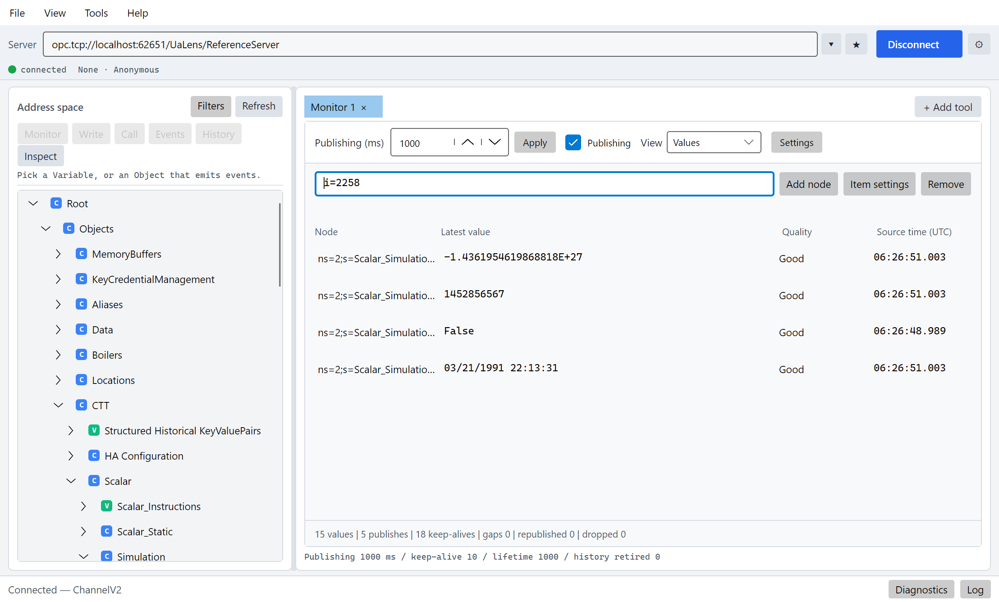
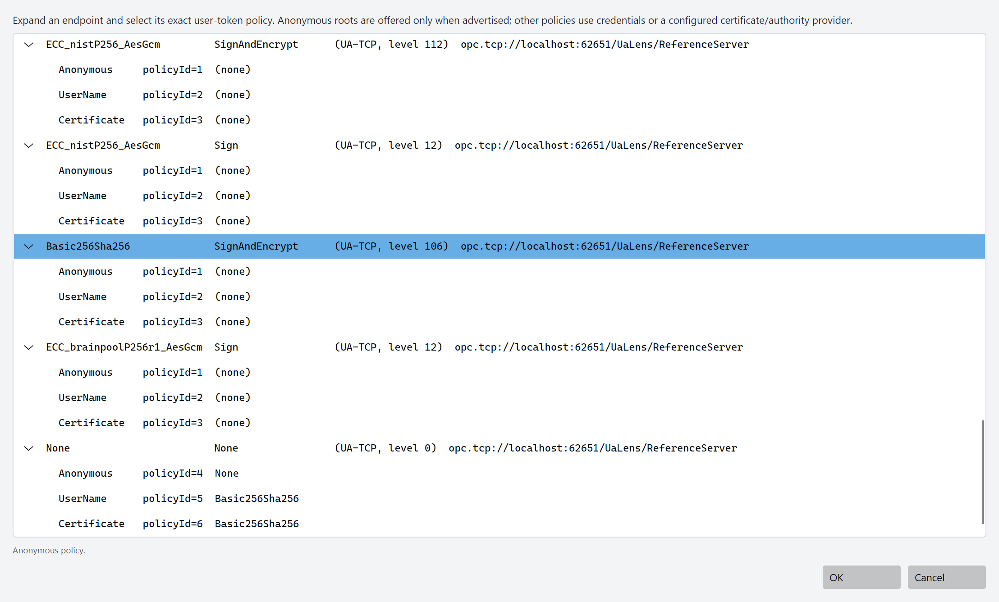
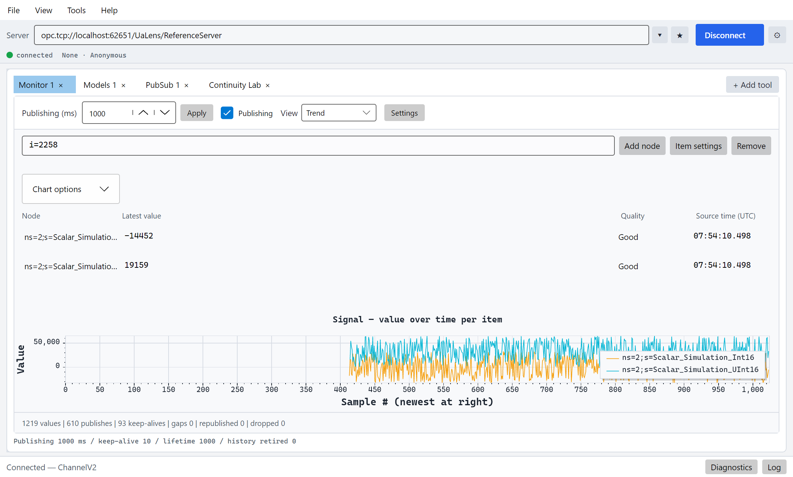
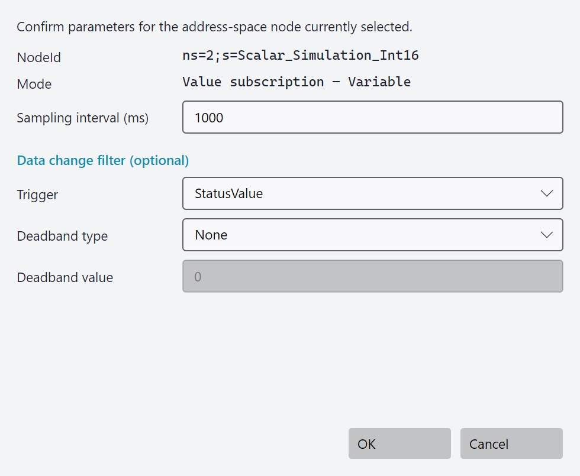
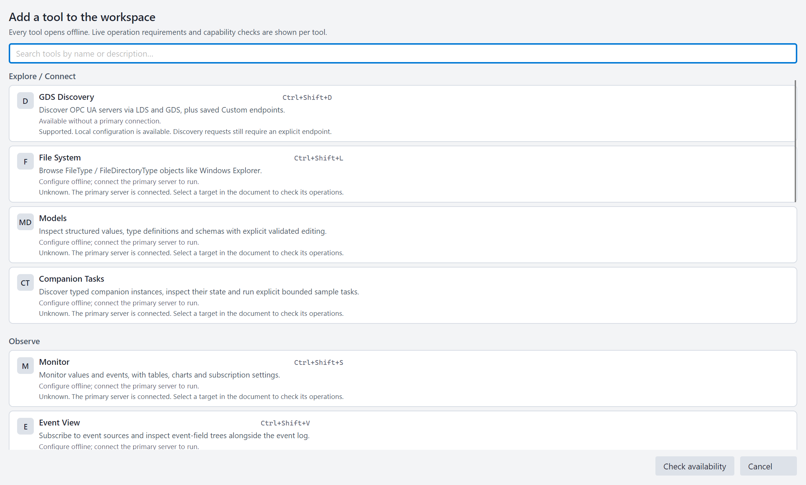
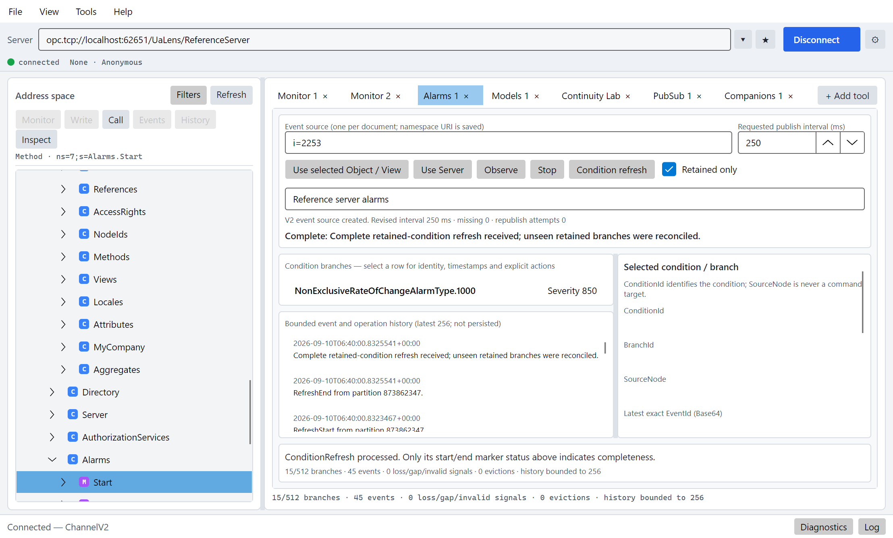
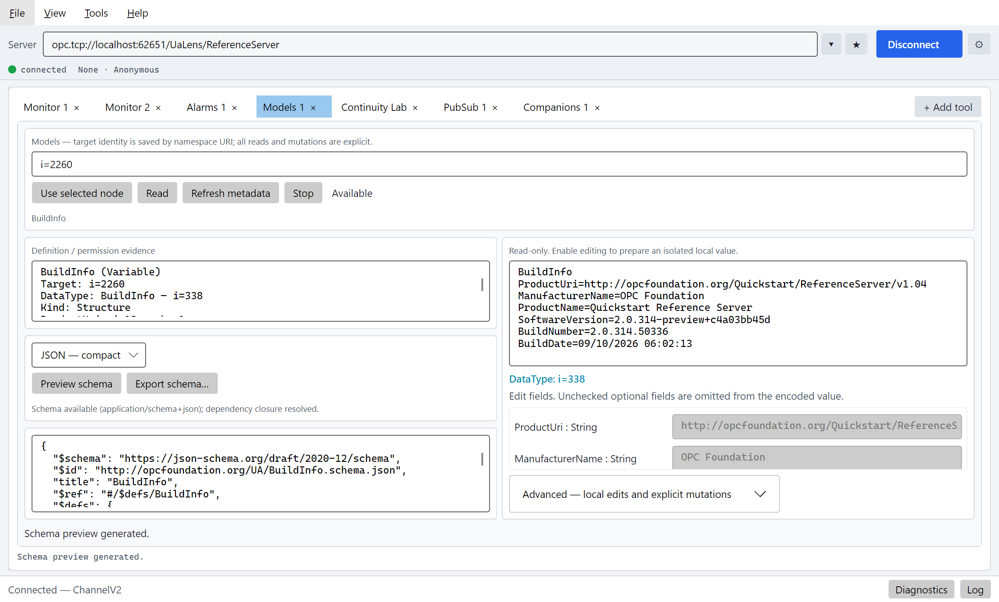
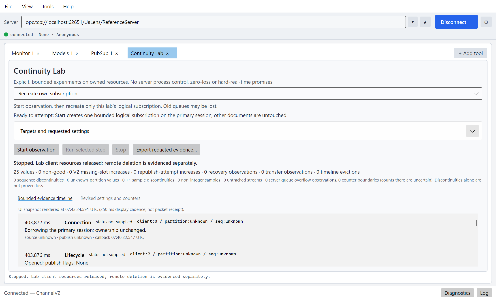
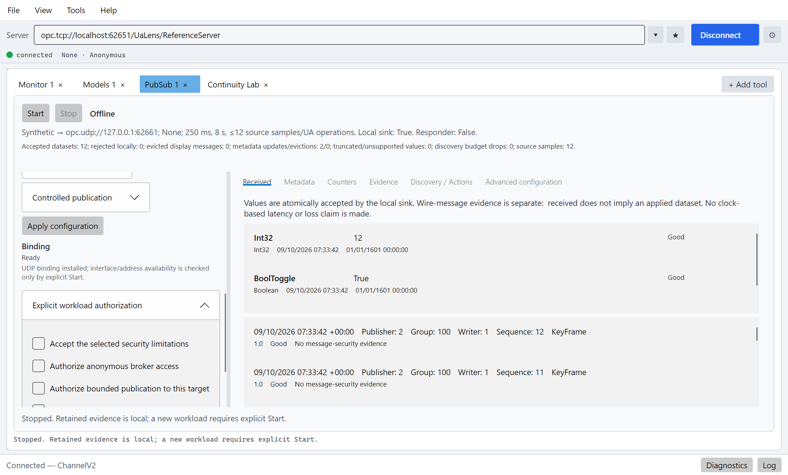

# UaLens

UaLens is the stack's Avalonia desktop engineering tool. It combines address-space
exploration, monitoring, history, events, diagnostics, and administration in one
workspace. Its source is in [`tools/Opc.Ua.Lens`](../tools/Opc.Ua.Lens).

The tool catalog provides browse/read/monitor workflows and allows you to perform
advanced operations or control advanced settings, such as connection settings.
UaLens is an engineering workspace, not a conformance certificate or a real-time
delivery guarantee.

There is one primary server connection. GDS tools can use a suitable primary
session or maintain their own secondary connection. Document tabs are working
contexts, not separate primary server sessions.

The screenshots show local examples using the repository's ConsoleReferenceServer.
The live examples use Anonymous/None on a loopback endpoint; this is not a
deployment security recommendation. Select the appropriate security policy,
identity and certificate trust for a deployed server. Sample values and counters
illustrate the interface, not timing or delivery guarantees.

## Getting started

From the repository root:

```powershell
$env:CustomTestTarget = 'net10.0'
dotnet build tools\Opc.Ua.Lens\Opc.Ua.Lens.csproj -c Release -f net10.0
dotnet run --project tools\Opc.Ua.Lens\Opc.Ua.Lens.csproj -c Release -f net10.0 --no-build
```

The application also targets .NET 8 and .NET 9. Its assembly is `UaLens`, its
package is `OPCFoundation.NetStandard.Opc.Ua.Lens`, and its tool command is `ualens`.

Use the connection bar to choose an endpoint and connect. The endpoint picker
shows the server's advertised security and identity policies. The primary state,
security policy, and identity are visible while working.

The standard headless `--smoke` and protocol probes are development diagnostics
for a reference server's explicitly selected Anonymous/None endpoint. They do
not prove secure desktop behavior or authorize accepting an untrusted certificate.

## Workspace

The menu contains **File**, **View**, **Tools**, and **Help**. Add a document
through **Add Tool**, the Tools menu, or an applicable address-space action.
The searchable catalog groups tools into Explore / Connect, Observe, Administer,
and Diagnose. Use document actions and document or connection settings to perform
advanced operations and control their configuration.

The empty workspace offers connection, workspace, discovery, and local-certificate
entry points; it is not a permanent Home or General tab. The address-space explorer
and contextual attributes/references inspector are resizable. Monitor, Write, Call,
Events, History, and Inspect are available according to the selected node.

An unavailable operation does not hide an entire document. Local certificate
management and discovery are available without a primary connection. Session-bound
documents retain their configuration while disconnected.

Rename a document with **F2** or its tab menu. **Enter** commits the draft;
**Escape** restores the original title. **Escape** also cancels the tool catalog
without opening a document.

The Write dialog reads type metadata before enabling editing. It sends at most
one write, disables editing while awaiting the response, and keeps the result
until **Acknowledge and close**. **Cancel wait** cancels the local operation and
waits for its completion; it does not roll back a value the server may already
have applied. An unknown outcome requires a fresh read to verify the value.

Add Item and Monitored Item Settings share sampling and deadband validation.
Sampling accepts `-1` (inherit publishing), `0` (fastest), or a positive number
of milliseconds up to `3600000`. A percent deadband accepts `0` through `100`.
Invalid input stays in the form, with an explanation and focus on the field
to correct. Decimal values use the current locale's decimal separator.

Status text uses `ErrorText`, `WarningText`, `SuccessText`, or `InfoText`; small
section headings use `InfoText`. Decorative fills, borders, and connection
indicators retain their accent resources. The markup regression checks both
direct foreground bindings and style setters against this separation.
Status-text resources are separate from chart-series palettes. Light and dark
appearances retain each item's palette slot while adjusting its color. Automated
source-color checks require 4.5:1 for semantic text on the defined UI surfaces
and 3:1 for every series on chart and canvas surfaces; these checks do not
replace screen-reader testing or evaluation by users.

The native desktop case
`UaLens.Tests.Desktop.DialogDesktopTests.AddItemValidationNamesAndFocusIdentifySamplingAndPercentBounds`
also produces UX06 capture evidence without adding cases to the existing desktop
selection. It keeps a real Add Item percent-bound error visible, opens the real
certificate-trust warning with a temporary self-signed fixture certificate, and
rejects it without changing any certificate store. A real `ScottPlotView`
consumes a bounded synthetic notification stream for all 12 palette slots.
Across Light, DarkStandard, and DarkNavy, it checks retained series objects,
sample buffers, axis limits, full legend labels, and palette-slot identity.

Within the test process's working directory, artifacts are written to
`TestResults/lens-desktop/ux06/<platform>-<native-scale>/` and attached to the
NUnit result. The test adapter copies attachments into the requested results
directory alongside the TRX. Each run replaces nine named PNGs (`<theme>-error.png`,
`<theme>-warning.png`, and `<theme>-all-series.png`) and two CSV reports.
Captures render the live native window's client visual after a dispatcher frame,
using Avalonia's render target; they are not OS-compositor screenshots and do
not include window decorations. PNG export uses grayscale text antialiasing:
LCD subpixel rendering produced RGB fringes rather than the source text color.
The helper restores the window's text-rendering options after capture. Signal
series use two-pixel strokes instead of ScottPlot's one-pixel default, retaining
a solid palette-colored interior. Captures are capped at 1600 by 1200 pixels and
8 MiB each. Decoded-PNG checks still require at least eight opaque pixels within
two values per RGB channel of the expected color. The checks scan the semantic
label's visible bounds and require every series color in the monitor capture; blank custom-draw
surfaces fail rather than count as evidence. Failed pixel checks retain the
candidate PNG for diagnosis; only a passing test makes it accepted capture
evidence. No image binaries are checked in.

On 2026-09-11, the strict 24-case native lane passed on Linux X11/Xvfb at all
four actual render scales, with zero failures or skips in each cell:

| Scale | X11 DPI | Native cases | Verified attachments |
|---|---:|---:|---|
| 100% | 96 | 24/24 | 9 PNGs, 2 CSVs |
| 125% | 120 | 24/24 | 9 PNGs, 2 CSVs |
| 150% | 144 | 24/24 | 9 PNGs, 2 CSVs |
| 200% | 192 | 24/24 | 9 PNGs, 2 CSVs |

The TRX files and attachment copies are under
`TestResults/lens-desktop-final-<percent>/`, where `<percent>` is `100`, `125`,
`150`, or `200`.
Each contrast CSV contains 720 data rows; each series-separation CSV contains
792. Attachment checks verify filenames, dimensions, byte bounds, expected
palette colors, report shapes, and normal-source contrast thresholds.

**Color-vision evaluation:** `contrast.csv` evaluates all four semantic text
colors on six surfaces and all 12 series on three chart/canvas surfaces.
`series-separation.csv` records all 66 series pairs in each theme. Both include
normal sRGB and the severity-1 protanopia, deuteranopia, and tritanopia matrices
from [Machado, Oliveira, and Fernandes (2009), supplementary Table 1](https://www.inf.ufrgs.br/~oliveira/pubs_files/CVD_Simulation/CVD_Simulation.html).
The helper linearizes sRGB, applies the matrix, clips to the display gamut, and
re-encodes to 8-bit sRGB. Contrast uses the shared W3C luminance implementation;
series separation is Euclidean distance in linear RGB, not a validated measure
of perceived distinguishability. Only normal-source contrast is a pass/fail
gate. Simulated ratios are diagnostics, not additional WCAG conformance claims.

Source-color calculations for the current palettes give a lowest simulated
series/background contrast of 3.630:1 (DarkStandard, protanopia). Light semantic
text falls as low as 4.266:1 under protanopia, despite meeting the normal-source
4.5:1 requirement. Some hues converge: Light slots 1 and 6 have a linear-RGB
distance of about 0.0031 under deuteranopia. These findings rule out claiming
that twelve colors alone reliably identify twelve items. The capture fixture
therefore retains full item labels and separates traces vertically. Real
overlapping traces may still need inspection by item name or separate views.
The simulation operates on palette colors, not screenshot pixels; it does not
model individual vision, display calibration, antialiasing, or all severities.
No human color-vision or screen-reader evaluation is claimed. Native execution
and its attached artifacts remain required; source calculations alone do not
establish that a desktop capture run passed.



*Browse the address space beside a monitor document. The connection bar applies
to the primary session shared by the documents.*

The default appearance follows the operating system. Light and Dark can be
selected explicitly. Saved Light, DarkStandard, and DarkNavy preferences select
an explicit appearance; System follows the operating system. Charts use the
same semantic colors as dialogs and document surfaces.

Standard text-editing shortcuts retain their usual meaning. F2 renames a document;
Ctrl+Tab and Ctrl+Shift+Tab cycle documents. The command registry is the source of
truth for displayed shortcuts and their availability.

Close and Quit await local cleanup, with bounded V2 server-side subscription
deletion even when the server is unavailable. The status bar shows shutdown
progress. A remote cleanup failure is logged rather than presented as confirmed
deletion; the server may retain resources until their lifetime expires.

## Connection and trust

An untrusted server certificate is rejected unless the user makes an explicit
decision. The choices are Reject, Accept Once, and Trust Permanently.

Accept Once applies to the selected endpoint, certificate, and overridable
validation error. It is not global trust and does not authorize a GDS secondary
connection. Disconnecting or selecting a different target clears it. Permanent
trust must be written successfully to the certificate store before retrying.
Invalid or revoked certificates are not made acceptable by the untrusted-certificate
choice.



*Choose an advertised endpoint and its user-token policy. Selecting SignAndEncrypt
does not automatically grant certificate trust.*

The validation callback never blocks on a window. Connection coordination rejects
and captures the validation failure, prompts asynchronously, and makes a bounded
retry using the decision. Cancellation does not apply a late dialog answer.

Changing engines or reconnecting preserves the selected security and identity
profile. Credentials are reacquired when necessary; a disposed session identity
is not reused. Changing the user replaces the session through the connection
owner, updating its profile and retained credentials together; document
configurations are rebound to the new session. Workspaces contain profile intent,
not passwords, private keys, or bearer tokens. The connection flow supports
Anonymous, UserName, X.509 user certificates and issued-token providers registered
by the host. Certificate stores, password/PIN providers, token
authorities, application-key providers, and reverse-connect listeners have explicit
configuration requirements; a saved provider name cannot install a provider or load
an arbitrary native module.

### Identities, hardware keys and reverse connect

X.509 user identity resolves an existing certificate through a configured source
and password/PIN provider; it is not the same certificate role as the application's
secure channel. The selected token policy must match the key and provider capability.

Issued-token selection resolves a named access-token provider and pinned authority/
profile metadata. The application does not include a general OAuth enrollment UI
or accept a workspace as authority to create a token broker. Reconnect and user
changes reacquire identity material through its owner, never reuse a disposed
session identity or downgrade to Anonymous.

Hardware-backed selection references host-registered certificate/crypto providers.
Keys stay inside their provider; PINs and bearer tokens never go into workspace
JSON. Provider modules, device enrollment, token authorities, and HSM provisioning
are external setup. No hardware or FIPS claim follows merely from selecting a name.

Reverse connect requires an explicit listener, expected ServerUri/endpoint, registered
binding and secure identity/trust configuration. Restoring a profile does not bind
its socket. A received reverse handshake is not sufficient authorization to trust
an arbitrary peer. WSS also requires listener TLS configuration. Forward transport
selection is constrained to the registered bindings and actual platform support.
Ordinary Connect goes directly to endpoint/security selection. Configure listeners
and application identity through connection settings.

See [Identity Providers](IdentityProviders.md), [Crypto Provider](CryptoProvider.md),
[Reverse Connect](ReverseConnect.md) and [Transports](Transports.md).

## Monitoring

A monitor document starts with values, quality, and source timestamps. Its **View**
selector offers Values, Trend, Timing: dots, Timing: bars, Timing: lines, Histogram,
and Heatmap. Trend plots the sampled signal; choosing a visualization does not
change server publishing.

In **Timing: lines**, use **Lane item** and **Line style** to choose Interpolated,
Wave, or Zigzag with the keyboard. Clicking a lane label cycles the same selection.
These choices affect rendering only, not subscription settings or recorded samples.



*Trend combines the latest values and quality with a signal chart. The sample
axis is a display sequence, not a measurement of network latency.*

The requested publishing interval and publishing-enabled control are immediately
available. The server's revised values are displayed separately. Item settings
control sampling, monitoring mode, queues, discard policy, and data-change filtering.
Source and server timestamps have different meanings; neither is replaced with
the time at which the UI happens to render.



*The address-space Monitor action lets you confirm sampling and an optional
data-change filter before adding the selected variable.*

Publishing, sampling, and display timing are distinct:

| Setting | Meaning |
|---|---|
| Sampling interval | How often the server evaluates a monitored value, subject to server revision and source behavior |
| Publishing interval | When a subscription has publishing opportunities; it does not force the source to change |
| Monitoring mode | Whether an item is disabled, sampling, or reporting |
| Publishing enabled | Whether the server publishes subscription notifications |
| Display pause or rendering throttle | A client presentation choice, not a server subscription setting |

Publish-worker/request limits belong to the **connection**. They affect every
subscription using that session and are not reapplied by unrelated per-document
settings changes.

Each monitor owns one notification-capture task. Charts have independent playback
cursors, so switching documents or views does not steal notifications from another
reader or reset collected history. Retention and rendering work are bounded;
retired history, dropped notifications, gaps, and republish activity must not be
confused with a lossless delivery guarantee.

Item identities stay with the document across disconnects and Classic/V2 engine
changes. CSV and JSON exports use the name and node id captured with each sample,
including samples from removed items. Offline edits do not relabel retained data.
Disconnect and close cancel and drain accepted server mutations before disposing
the adapter; local edits remain available for reconnect. The adapter's dropped
count measures actual delivery-queue evictions, separately from retired history.

Raw publish diagnostics use server subscription identifiers where the public
stack interface exposes an unambiguous identifier. Partitioned V2 callbacks can
instead carry a `client:` correlation identifier; this is deliberately not
presented as a server-assigned ID. Display-log buffering is bounded separately
from notification delivery.

## Tools and workflows

The catalog provides seventeen tool kinds:

| Tool | Workflows |
|---|---|
| Monitor | Values, events, quality/timestamps, charts, subscription/item settings, recursive node selection, export |
| Event View | Multiple sources, filters, selected fields, details, bounded event log, display pause/clear |
| Alarms | Retained conditions and branches, refresh reconciliation, explicit acknowledgement/confirmation/comment, contextual operator actions |
| Models | Type definitions, schema preview/export, native-safe structured editing, explicit read/write/call |
| Continuity Lab | Bounded recovery evidence, owned-subscription recreation, transfer/recreate-on-load, configured durable and redundant scenarios |
| PubSub | Explicitly started dataset observation, metadata and diagnostics, controlled publication and configured Action/adapter workflows |
| Companion Tasks | Typed DI, ISA-95, WoT/xRegistry, Robotics, Vision, AI and OpenUSD discovery/inspection, with bounded guided operations |
| Historian | Raw, processed, at-time and modified reads; cancellation, export, and explicitly requested updates/deletion |
| Subscription Bench | Variable pool, both live scaling sliders, aggregate rates/counts, shared defaults, shrinking and Stop cleanup |
| Performance | Explicit write/call workloads, rate/duration, run history, CSV, and comparison of up to the last three runs |
| File System | File/directory browsing, transfers, creation, rename, and deletion |
| Certificate Manager | Local application/trusted/issuer/rejected store management |
| GDS Discovery | Discovery endpoints and saved favorites |
| GDS Management / Push | Registered applications, issuance/CSR, trust lists, certificate update/apply |
| User / Role Management | Account/password restrictions and role/identity/application/endpoint mappings |



*The catalog explains configuration and live-operation prerequisites per tool.
An available document or successful browse does not establish mutation permission.*

Subscription Bench is slider-driven; there is no separate Run prerequisite. Shared
settings apply to existing resources and resources added later. Shrinking, Stop,
and document closure release the corresponding server resources.

PubSub and continuity experiments have their own explicit Start/Stop controls.
PubSub can own an independent network runtime without a primary UA session; only
configured primary-session adapters depend on that session.

Administration targets and prerequisites matter. History deletion, file deletion,
account/role changes, certificate application, and write/call workloads are not
automatically executed when a workspace loads. Certificate ApplyChanges can
intentionally terminate a connection.

## Guided workflows

### Choosing a workflow

| Goal | Open or configure | Starts work |
|---|---|---|
| Inspect retained conditions and act on a selected event | Alarms | Explicit observation/refresh and operator commands |
| Inspect or edit a custom value | Models, or a Write/Call dialog | Explicit Read, metadata refresh, Write or Call |
| Explain recovery or transfer | Continuity Lab | Start observation, then the selected step |
| Receive a published dataset | PubSub | Explicit Start with interface/broker/security configuration |
| Inspect an industry model | Companion Tasks | Discover, Inspect, then an offered task |
| Use X.509, issued tokens or hardware keys | Connection identity selection | Connect after provider selection |
| Accept a configured reverse connection | Connection setup | Explicit listener/wait and Connect |

Loading a workspace restores intent, not active workloads. It does not acknowledge
conditions, call methods, write values, start a publisher, bind a listener, restart
a server, or arm a sample task.

### Alarms

Use an event notifier that exposes real conditions. Alarms keeps the condition
identity separate from the source node, distinguishes branches, and uses the
selected event's current EventId for acknowledgement and confirmation.

Refresh reconciles retained state using the server's refresh markers. A completed
service request without the expected event sequence is not presented as a complete
refresh. Recreating a subscription and refreshing is distinct from transferring one.
Missing events and bounded retention are visible.



*Observe an event notifier and reconcile retained conditions with Condition
refresh. This example uses a bounded reference-server alarm simulation.*

Acknowledgement, confirmation, comments and applicable advanced condition
operations are explicit. A disconnected or restored document never repeats them.
Authorization errors and unsupported operations are reported as failures; the UI
does not optimistically mark a rejected acknowledgement successful.

The implementation reuses the stack's typed alarm operations, generated event
records and V2 subscription facilities. See [Alarms and Conditions](AlarmsAndConditions.md).

### Models and structured values

Select a variable, DataType or method and open Models. Read the value or definition
explicitly. The same structured editing module serves Models and the Write/Call
dialogs; it supports generated encodeables and the stack's default NativeAOT-friendly
runtime type adapters without Reflection.Emit.



*Read a structured value, inspect its definition and preview a schema. Editing
starts from a separate local draft and does not itself write to the server.*

Edits use a separate draft. A rejected or canceled draft cannot modify the original
value or write to the server. Nested fields, optional presence, unions and supported
arrays retain their type semantics. Matrix dimensions are preserved; creating
different matrix shapes requires suitable typed input. OptionSets are not presented
as a complete bit-field editor.

Schema preview/export uses the stack's schema provider. Missing definitions are
reported explicitly; denied reads, canceled resolution and connection failures
are not treated as authoritative absence. Metadata refresh and session-generation
changes discard stale definitions. Unknown opaque values are read-only.

Structure fields declared as `Number` (`i=26`), `Integer` (`i=27`) or `UInteger`
(`i=28`) use the standard Variant wire encoding in JSON, XML and binary schemas.
They do not require a server-side `DataTypeDefinition`. Unresolved custom data
types are reported as unavailable rather than exported as an untyped success.

See [Complex Types](ComplexTypes.md) and [Schema Generation](SchemaGeneration.md).

### Continuity Lab and diagnostics

Continuity Lab owns its observation subscription and any auxiliary sessions used
by its selected scenario. It uses the primary connection owner and the stack's
reconnect handling. Other documents retain their configuration.

The timeline distinguishes reconnect/recovery, transfer, recreation, missing
messages and republish activity. It records actual server subscription/partition
IDs where available; client correlation IDs are not relabeled as server IDs.
Requested and revised settings and server operation limits provide context for
throughput and failures.



*The lab retains bounded evidence after its resources are released. Recreation,
transfer and recovery are distinct observations; discontinuities alone are not
proof of lost source samples.*

The available scenarios include observation of a user-managed outage, recreation
of the lab's own subscription, transfer or recreation from its own snapshot, and
configured durable restore or redundant takeover. A snapshot used by a running
lab is separate from ordinary workspace JSON.

Durability is configured before monitored items are added, and the server may
revise its requested lifetime. Same-user transfer rules, server queues, partitioning
and triggering relationships matter. The repository's Quickstarts durable store
persists subscriptions on graceful shutdown and does not persist issued-token
subscriptions. It does not establish arbitrary crash recovery.

UaLens does not terminate arbitrary server processes. For a graceful-restart
scenario, save/close the lab-owned session, restart the explicitly selected sample
yourself, and then request restore. Redundancy requires an already configured
set/provider. Missing prerequisites are shown as setup requirements.

Evidence export is bounded and omits credentials. Sampling time, server publishing,
network receipt and UI rendering are different measurements. Unsynchronized
source/client clocks cannot establish one-way latency. A missing diagnostics
permission is not a zero counter, and republish attempts do not prove every missing
sample was recovered. Privileged packet capture is not required for the ordinary
counter view and is not automatically provisioned.

See [Subscriptions](Subscriptions.md), [Transfer](TransferSubscription.md),
[Durable Subscriptions](DurableSubscription.md), [High Availability](HighAvailability.md)
and [Diagnostics](Diagnostics.md).

### PubSub

A PubSub document owns its runtime independently of the primary UA session. Configure
the transport, address/interface or broker, publisher/writer/reader identifiers,
encoding and security requirements, then start it explicitly. Metadata, decoded
fields, state and bounded diagnostic evidence are shown together.

The default subscriber sink observes locally. Receiving a dataset does not write
to a UA server. Publication, Actions, external-server adapters and write-back need
explicit configuration and authorization. Stop/close releases the owned runtime;
primary-session loss affects only configured adapters that depend on that session.



*A bounded synthetic loopback retains received values and wire-message evidence
after Stop. Local dataset acceptance is separate from an external delivery guarantee.*

The module reuses `PubSubApplicationBuilder`, `IPubSubApplication`, transport,
metadata, source/sink, security and Action facilities. Configurations save safe
references, not raw broker credentials or SKS key material. No runtime or publisher
is started by application DI registration or workspace restore.

Reaching a sample cap is not the same as completing its final send. The runtime
finishes the final publication before stopping its writer. A synthetic UDP loopback
also gets a bounded two-second local receive drain; expiry is recorded explicitly
and does not imply remote acknowledgement or a lossless network.

UDP/UADP and configured MQTT workflows use the stack transports. Other profiles
require their registered transport/provider and platform prerequisites. Kafka uses
the managed backend in the native app; the optional Confluent backend is not a
NativeAOT substitute. DTLS, Ethernet, SKS, brokers and advanced adapter scenarios
do not install their own external infrastructure.

For a self-contained source use the repository's
[Console Reference PubSub Client](../samples/PubSub/ConsoleReferencePubSubClient/README.md)
in publisher mode with matching explicit settings. The full stack guide is
[PubSub](PubSub.md).

### Companion Tasks

Choose a model, select **Discover**, then **Inspect** a returned instance. Discovery
uses actual typed instances, not just namespace presence. Inspection is read-only.
The task list is populated by the selected instance; an arbitrary operation name
cannot be executed without a current inspection.

Sample mutations additionally require a loopback endpoint and explicit confirmation
that it is a repository sample. Loopback alone does not prove a server is safe to
mutate. Confirmation and operation input are not saved and are cleared when the
connection changes. File exports require an explicit destination.

| Family | Guided scope | Intentional limit |
|---|---|---|
| DI | Device identity/topology, parameters and software-update state; explicit sample preparation | No firmware installation or complete update-state orchestration |
| ISA-95 | Typed V1/V2 resources and job inspection; explicit sample job storage | Jobs are not automatically started |
| WoT / xRegistry | Asset/document/version/model inspection; explicit compatible sample registration/refresh | No overwrite of existing versions; server AutoRefresh policy applies |
| Robotics | Published device-system/controller/axis topology and telemetry | No physical actuation or Robot Intent commanding |
| Vision | Sensor/frame/pipeline/result inspection through typed clients | No camera provisioning, rendering or automatic inference |
| AI | Model, dataset, deployment and learning-job inspection; fixed synthetic local request where eligible | No backend/vendor SDK hosting or arbitrary prompt egress |
| OpenUSD | Representation/binding inspection, bound-value snapshot, advertised asset verification/export | No renderer, remote federation or arbitrary USD dependency fetching |

The AI sample request is offered only for a loopback backend with egress disabled;
both the UA server and backend restrictions are rechecked before invocation.
Responses and displays are bounded. A response that requires a separate transfer
workflow is not silently downloaded.

OpenUSD export uses an unused destination, advertised assets and digest checks with
bounded asset counts and sizes. Metadata inspection alone is not proof that an
asset has been verified. Read-only snapshots do not enable command bindings.
Use the address-space explorer for generic browsing of an unrecognized model.

Matching servers are listed in [Sample Applications](samples.md). Brokers, token
authorities, redundant sets, hardware and privileged network facilities must be
supplied explicitly; a gated scenario is not reported as demonstrated.

## Saved workspaces

Version 2 stores typed document configurations, order/selection, layout preferences,
the safe connection profile, and connection-level publishing limits. Each tool
serializes its own versioned configuration with generated JSON metadata. It does
not serialize running jobs, server handles, collected histories, or credential
material.

Legacy `.subex`/version-1 session files are imported as disconnected monitor
configuration. Because those files omit security and identity intent, they do not
authorize an automatic Anonymous/None connection. Original files are not overwritten
as part of import. Unsupported document kinds, versions, or malformed configuration
are reported rather than silently discarded.

Document configuration and workspace connection intent commit together. A failure
while cleaning up replaced documents is reported without pairing the newly restored
documents with the previous workspace's connection profile. Profile-less legacy
imports are saved without a connection profile.

Appearance and favorites use per-user UaLens locations. Writes use a
completed sibling temporary file before replacing the destination. Missing favorites
are an empty initial state; corrupt or inaccessible favorites are an error, not a
misleading successful empty list. Endpoint paths are case-sensitive.

## Capability evidence and prerequisites

The catalog distinguishes **Supported**, **Unsupported**, **Unknown**, **Requires
configuration**, and **Denied**. These states describe available evidence, not
unconditional permission or full server support. A probe checks a concrete target
or advertised permission; it does not claim the server implements every operation
in a tool. For example, an EventNotifier attribute can advertise events without
proving that a particular alarm method is authorized. Write and Call probes inspect
permissions; they never perform a trial mutation.

Checks are bounded and tied to the current session and namespace mapping.
A reconnect or explicit refresh invalidates stale evidence. Transport failures
are retryable rather than being cached as an absent feature.
Unknown, denied, or transient failures do not become successful empty results.
Documents can be opened for configuration while disconnected.

The [guided workflows](#guided-workflows) use the stack's alarm, model, continuity,
PubSub, connection-provider and companion modules.

| Capability | External prerequisite or intentional limit |
|---|---|
| Alarms and Conditions | Real condition source, event support and operator permissions; acknowledgement and confirmation are explicit state changes |
| X.509 / issued identity | Existing certificate with usable key, or configured token authority/provider; no automatic OAuth or PKI provisioning |
| Durable transfer / failover | Compatible server storage, same-user transfer and configured redundancy; the Quickstarts store requires graceful shutdown and excludes issued-token persistence |
| Structured values | Exposed type definitions or registered schemas; opaque values stay read-only, and OptionSets/new matrix shapes need suitable typed input |
| PubSub | Explicit network interface or broker and matching security/key providers; restoring a workspace never starts traffic |
| Reverse connect | Registered binding/listener, expected server identity, trust and firewall permissions; unknown peers are not accepted |
| Diagnostic evidence | Server counters may require authorization; absent evidence is not zero and unsynchronized clocks do not prove end-to-end latency |
| Hardware keys | Host-registered store/crypto provider and device/PIN access; no key export, module installation, HSM provisioning or blanket FIPS claim |
| Companion tasks | Matching model instances and repository samples; guided operations are not complete domain-authoring suites |

The catalog labels model maturity independently. Published OPC 40010 Robotics is
not the draft Robot Intent extension. Vision, AI Model Management, OpenUSD,
xRegistry, WoT Connectivity and individual draft bindings have their own
draft/version labels rather than one blanket conformance claim.
