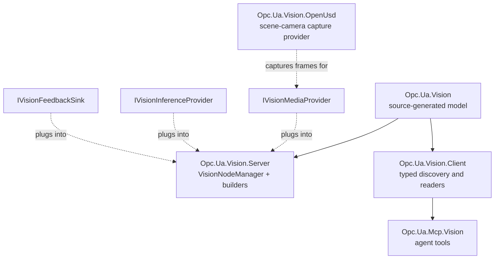
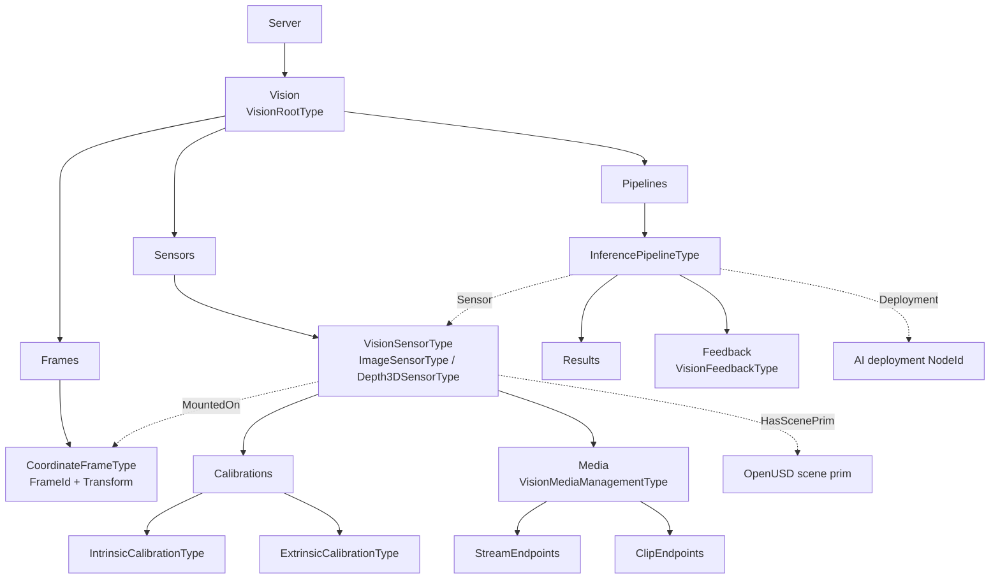
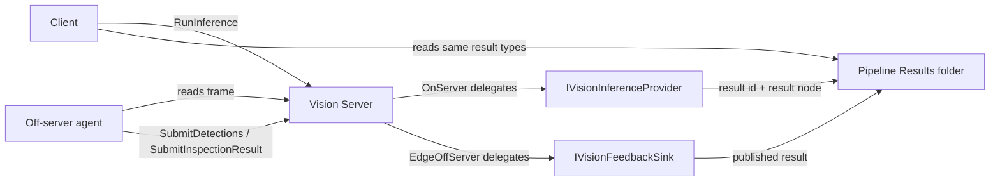
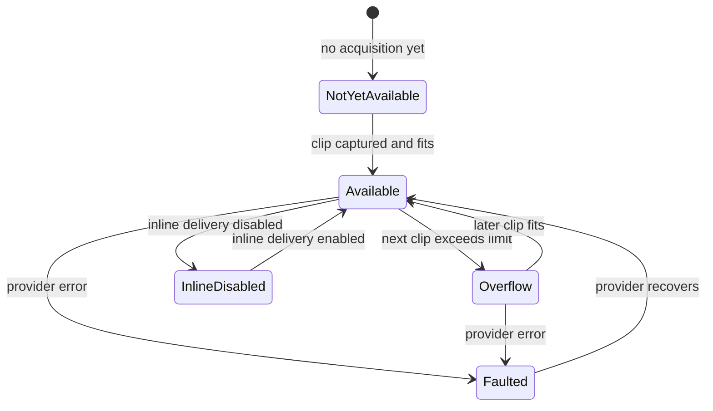
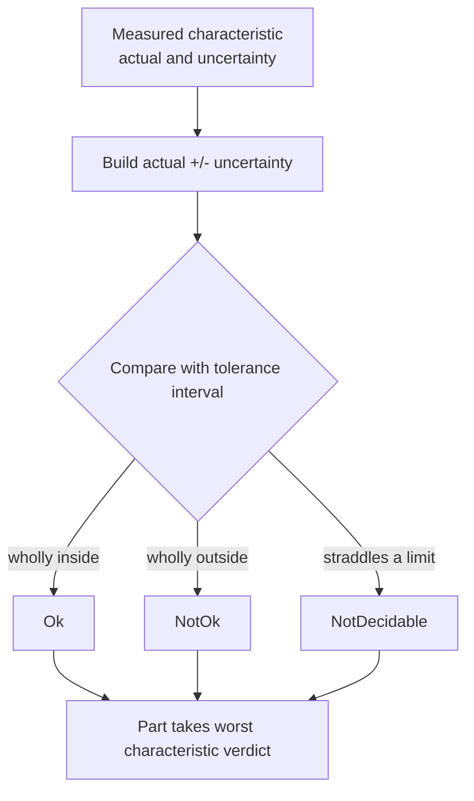
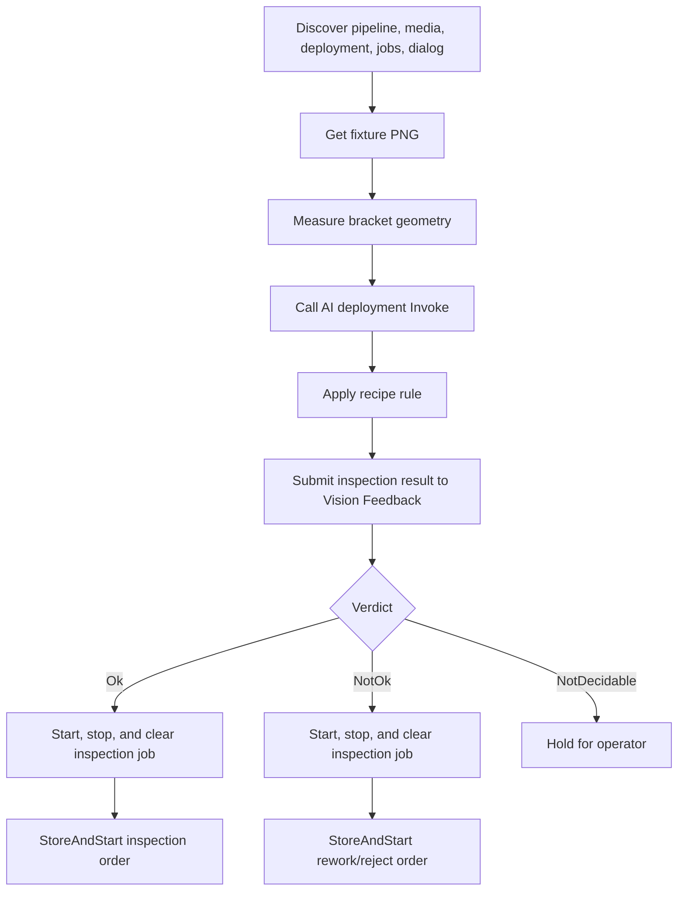
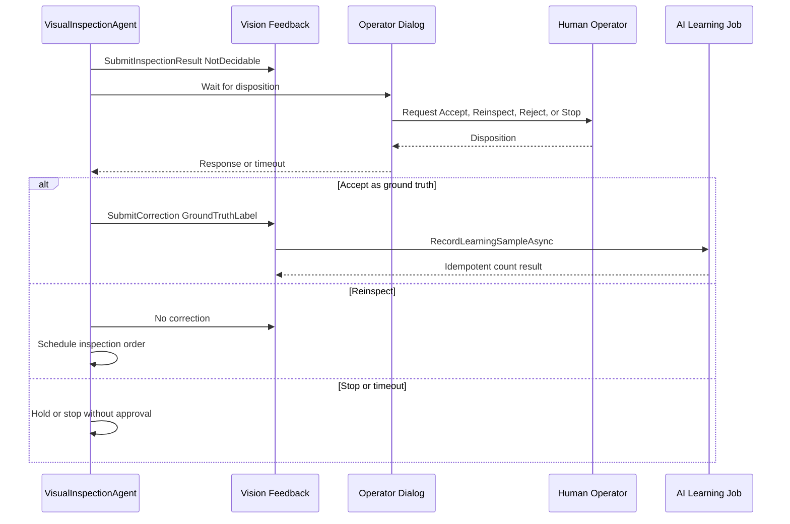

# Vision developer guide

This guide documents the `Opc.Ua.Vision`, `Opc.Ua.Vision.Server`,
`Opc.Ua.Vision.Client`, `Opc.Ua.Vision.OpenUsd` and `Opc.Ua.Mcp.Vision` package
family — the .NET implementation of the working-group draft *OPC UA — Vision*
companion specification, plus the OpenUSD offscreen capture adapter and the
Model Context Protocol tool package that lets a language-model agent see through
a Vision server and act on what it sees.

> **Draft.** The namespace `http://opcfoundation.org/UA/Vision/` and every
> NodeId in it are provisional. The model is a working-group draft and is
> neither official nor endorsed by the OPC Foundation. The API is stable within
> this repository but every ObjectType, DataType and BrowseName can still change
> when the specification is published.

Vision layers on top of the base OPC UA namespace only — it does not require
Devices, Machinery or Robotics. It composes cleanly with Robotics, as shown in the
[`samples/Robotics/BinPickingCell`](../samples/Robotics/BinPickingCell) and
[`samples/Robotics/BinPickingClient`](../samples/Robotics/BinPickingClient)
samples (`Vision` + `Robot Intent` in one server, `vision_*` +
`robotics_*` MCP tools in one agent).

## Packages

| Package | What it gives you | Depends on |
|---|---|---|
| `OPCFoundation.NetStandard.Opc.Ua.Vision` | Source-generated Vision model — ObjectTypes, ReferenceTypes, DataTypes, enums, node states, typed client proxies, `AddOpcUaVision` model loader | `Opc.Ua.Core` |
| `OPCFoundation.NetStandard.Opc.Ua.Vision.Server` | `VisionNodeManager`, `IVisionBuildContext`, fluent topology builders, `IVisionMediaProvider` / `IVisionInferenceProvider` / `IVisionFeedbackSink`, facet derivation, `AddVision` / `ConfigureVision` hosting extensions | `Opc.Ua.Vision`, `Opc.Ua.Server` |
| `OPCFoundation.NetStandard.Opc.Ua.Vision.Client` | `VisionClient` discovery, `VisionSensorClient`, `VisionPipelineClient`, `VisionResultReader`, `VisionMediaClient`, `VisionFrameGraph`, `VisionFeedbackClient`, `session.Vision(...)` extension, `AddVisionClient()` DI | `Opc.Ua.Vision`, `Opc.Ua.Client` |
| `OPCFoundation.NetStandard.Opc.Ua.Vision.OpenUsd` | `ISceneCameraCaptureProvider` implementation that renders a `UsdGeomCamera` offscreen and reports `NoRenderingBackend` gracefully when no graphics device is available | `Opc.Ua.Types`, native OpenUSD renderer payload (optional per-RID) |
| `OPCFoundation.NetStandard.Opc.Ua.Mcp.Vision` | 22 MCP tools split across discovery, monitoring, seeing, inference, feedback and geometry, plus the `vision` bounded profile and composition entry point | `Opc.Ua.Mcp.Core`, `Opc.Ua.Vision.Client` |



`Opc.Ua.Vision.OpenUsd` deliberately sits outside that dependency chain: it
depends on `Opc.Ua.Types` alone and knows nothing about the Vision server. It
offers a camera, and a host writes the `IVisionMediaProvider` that hands the
resulting frames to a pipeline — which is what
[`BinPickingCell`](../samples/Robotics/BinPickingCell) does. A host with a real
camera writes the same interface over its own SDK and never references OpenUSD
at all.

The runtime address space is rooted under the standard Server object.
Configurators add frames, sensors and pipelines through the fluent builder;
providers plug into the sensor or pipeline nodes that the builder creates.



The libraries multi-target `net8.0;net9.0;net10.0` and `netstandard2.0`
where applicable; the MCP tool package multi-targets `net8.0;net9.0;net10.0`.

## Two perception paths behind one contract

Every pipeline advertises exactly one of two inference locations, and a
client reads a `DetectionResultType` identically regardless of which is in
force:

- **`InferenceLocation = OnServer`** — the Server holds an
  `IVisionInferenceProvider` and computes results locally. This is the
  deterministic path: it needs no model, no network and no GPU, and it is
  the default for CI and offline validation. `RunInference`,
  `StartContinuous` and `Stop` all delegate to the provider; the Server
  publishes the resulting `DetectionResultType` / `InspectionResultType` /
  `SegmentationResultType` under the pipeline's `Results` folder and
  advertises `VIS-Inference-OnServer`.
- **`InferenceLocation = EdgeOffServer`** — the pipeline exposes a
  `VisionFeedbackType` object bound to an `IVisionFeedbackSink`; an
  off-Server agent (a vision-language model over MCP, an edge inference
  service, another Server) is expected to look at the current frame and
  call `SubmitDetections` / `SubmitInspectionResult` /
  `SubmitCorrection` / `SubmitImageReference`. The Server publishes those
  results into the address space unchanged, and advertises
  `VIS-Inference-OffServer`.

Choose `OnServer` when a deterministic algorithm answers the question
(vision-guided screwdriver alignment against a known fiducial; presence-or-
absence in a clean scene) or when reproducibility on CI matters. Choose
`EdgeOffServer` when a language model or a heavier out-of-process model is
what actually sees the world — the Server publishes what it did not
compute, and safety validation still applies (§9 refusals, class-label /
box / pose / confidence checks; see [Feedback validation](#feedback-validation)).

The two paths are exclusive per pipeline by design: mixing a running
`OnServer` provider with a `SubmitDetections` sink would let a computed
and a submitted result publish on the same pipeline out of any known
order.



## Minimal hosted server

The example below hosts a single simulated eye-in-hand camera, one
inference pipeline, and a two-frame tree (`world` → `flange`). It is the
smallest useful shape; the [`BinPickingCell`](../samples/Robotics/BinPickingCell)
sample is the full end-to-end version.

```csharp
using Microsoft.Extensions.Hosting;
using Opc.Ua;
using Opc.Ua.Server;
using Opc.Ua.Vision;
using Opc.Ua.Vision.Server;
using Opc.Ua.Vision.Server.Builders;

HostApplicationBuilder builder = Host.CreateApplicationBuilder(args);

builder.Services.AddSingleton<MyMediaProvider>();
builder.Services.AddSingleton<MyGroundTruthProvider>();

builder.Services
    .AddOpcUa()
    .AddServer(options =>
    {
        options.ApplicationName = "VisionServer";
        options.ApplicationUri = "urn:localhost:OPCFoundation:VisionServer";
        options.AutoAcceptUntrustedCertificates = true;
        options.EndpointUrls.Add("opc.tcp://localhost:62855/VisionServer");
    })
    .AddVision(options =>
    {
        options.InstanceNamespaceUri = "urn:example:vision:instances";
    })
    .AddVisionMediaProvider<MyMediaProvider>(sensorBrowseName: "Camera01")
    .AddVisionInferenceProvider<MyGroundTruthProvider>(
        pipelineBrowseName: "Detector",
        onServer: true)
    .ConfigureVision((context, ct) =>
    {
        IVisionNodeBuilder nodes = context.Nodes;
        // Nodes is the fluent address-space builder: everything it creates
        // becomes real OPC UA nodes under Server/Vision that any client can
        // browse. The full build context is described further down.

        nodes.AddFrame("World", frame => frame
            .WithFrameId("world")
            .WithRole(VisionFrameRoleEnum.World));

        nodes.AddFrame("Flange", frame => frame
            .WithFrameId("flange")
            .WithRole(VisionFrameRoleEnum.MechanicalInterface)
            .WithParent("world"));

        nodes.AddImageSensor("Camera01", sensor => sensor
            .WithSensorId("cam-01")
            .WithModality(VisionSensorModalityEnum.Area2D)
            .WithRealityKind(VisionRealityKindEnum.Physical)
            .WithFrameId("flange")
            .WithResolution(1920u, 1080u)
            .WithPixelFormat("Mono8")
            .AddClipEndpoint("Clips", ep => ep
                .WithEndpointId("clip-01")
                .WithEndpointUri("opcua-inline://visionserver/clips")
                .WithClipFormat(VisionClipFormatEnum.Png)
                .WithResolution(1920u, 1080u)
                .WithInlineDelivery(enabled: true, maxInlineClipSize: 8_388_608u)));

        // The pipeline is bound to its inference provider by
        // AddVisionInferenceProvider<MyGroundTruthProvider>("Detector", ...)
        // above; the ConfigureVision delegate just creates the pipeline
        // node. A real cell resolves the sensor node the pipeline is
        // reading from off Server/Vision/Sensors — see the BinPickingCell
        // sample for the walk.
        nodes.AddPipeline("Detector", pipe => pipe
            .WithPipelineId("pipe-01")
            .WithSensor(NodeId.Null));

        return ValueTask.CompletedTask;
    });

using IHost app = builder.Build();
await app.RunAsync().ConfigureAwait(false);
```

`AddVision` never modifies the Server's existing NodeManagers — it adds a
standalone `VisionNodeManager` under the well-known `Server/Vision` object
(§4.2). It also composes with `AddRobotIntent` and `AddRobotics`; both
sample cells run all three side by side without any coupling in code.

The `AddVisionMediaProvider<T>` / `AddVisionInferenceProvider<T>` /
`AddVisionFeedbackSink<T>` extensions resolve the provider from the DI
container at build time and bind it to the sensor or pipeline whose
BrowseName is passed. The equivalent `UseMediaProvider(provider)` /
`UseInferenceProvider(provider, onServer)` / `UseFeedbackSink(sink)`
methods on the fluent builders let a configurator bind a provider it
holds directly.

## Hosting API

The extension methods on `IOpcUaServerBuilder` that make up the Vision
hosting surface:

| Method | Purpose |
|---|---|
| `AddVision(Action<VisionServerOptions>?)` | Registers the standalone `VisionNodeManager` and its factory; accepts an optional options delegate |
| `AddVisionMediaProvider<TProvider>(string sensorBrowseName)` | Registers a media provider type — resolved from DI — for the sensor with the given BrowseName |
| `AddVisionMediaProvider(string sensorBrowseName, IVisionMediaProvider provider)` | Registers a media provider instance for the sensor with the given BrowseName |
| `AddVisionInferenceProvider<TProvider>(string pipelineBrowseName, bool onServer)` | Registers an inference provider type — resolved from DI — for the pipeline; `onServer` controls the advertised `VIS-Inference-OnServer` / `VIS-Inference-OffServer` facet (§8.2) |
| `AddVisionInferenceProvider(string pipelineBrowseName, bool onServer, IVisionInferenceProvider provider)` | Registers an inference provider instance |
| `AddVisionFeedbackSink<TSink>(string pipelineBrowseName)` | Registers a feedback sink type — resolved from DI — for the pipeline's `Feedback` object |
| `AddVisionFeedbackSink(string pipelineBrowseName, IVisionFeedbackSink sink)` | Registers a feedback sink instance |
| `ConfigureVision(Func<IVisionBuildContext, CancellationToken, ValueTask>)` | Async configurator, run on server start against the standalone `VisionNodeManager` |
| `ConfigureVision(Action<IVisionBuildContext>)` | Sync configurator overload |
| `ConfigureVisionFor<TNodeManager>(...)` | Configurator targeting a specific Vision node-manager type. Currently only `VisionNodeManager` is supported |

The Robotics guide's `ConfigureFor<...>` pattern also applies here — any
of these hosting extensions can be called from a class-based configurator
that reads `IServiceProvider`, keeps its own logger, and does not put a
lambda in `Program.cs`.

### `VisionServerOptions`

| Property | Purpose |
|---|---|
| `InstanceNamespaceUri` | The application-owned namespace URI used for the instances the configurator materialises. Must be distinct from the OPC UA base namespace and from `http://opcfoundation.org/UA/Vision/`. Defaults to `urn:opcfoundation:UA:Vision:Instances`. |
| `SpecificationVersion` | The value the Server reports on `Vision.SpecificationVersion`. Defaults to `"0.1.0"`. |
| `AdditionalFacets` | The facets the Server declares beyond those the facet calculator derives structurally — the escape hatch for facets whose requirements are behavioural (an interop facet that the host meets by contract). |

## Build context

`ConfigureVision(...)` receives an `IVisionBuildContext`. Here `Nodes` is
the fluent address-space builder rooted at the well-known `Server/Vision`
object; it creates the frame, sensor, calibration, media-endpoint and
pipeline nodes that ordinary OPC UA clients browse and read.


| Member | Purpose |
|---|---|
| `Nodes` | The fluent `IVisionNodeBuilder` rooted at the well-known `Server/Vision` object |
| `Manager` | The active `AsyncCustomNodeManager`, for the rare case a configurator must fall back to raw node authoring |
| `Context` | The active `ISystemContext` |
| `Root` | The `VisionRootState` (§4.2) |
| `InstanceNamespaceIndex` | The namespace index of `VisionServerOptions.InstanceNamespaceUri` |
| `VisionNamespaceIndex` | The namespace index of `http://opcfoundation.org/UA/Vision/` |
| `CancellationToken` | The startup cancellation token |
| `GetRequiredService<T>()` | Application-scoped DI resolution |

Everything a Vision cell needs (frames, sensors, pipelines, calibrations,
media endpoints) is authored through `Nodes`. The low-level members are
present for interop with hand-written NodeManagers and for the vendor
extension patterns the Robotics guide describes.

### Without DI

A `VisionNodeManager` created by hand exposes the same fluent surface
through `ConfigureVisionAsync`:

```csharp
await manager.ConfigureVisionAsync(context =>
{
    context.Nodes.AddFrame("World", f => f
        .WithFrameId("world")
        .WithRole(VisionFrameRoleEnum.World));
});
```

Prefer it over `CreateVisionBuildContext()`. The node manager indexes the
Vision root when it creates the address space, so anything the builder
grafts on afterwards has to be registered as well before it can be
browsed or read **by its own NodeId** — which is how an ordinary client
and the MCP discovery tools navigate. `ConfigureVisionAsync` does that
registration when the delegate returns; a context obtained from
`CreateVisionBuildContext()` never does, so nodes built through it stay
reachable only by browsing forward from their parent.

## Topology builders

### Frames

```csharp
nodes.AddFrame("World", f => f
    .WithFrameId("world")
    .WithRole(VisionFrameRoleEnum.World));

nodes.AddFrame("RobotBase", f => f
    .WithFrameId("robot_base")
    .WithRole(VisionFrameRoleEnum.Base)
    .WithParent("world")
    .WithTransform(new VisionPose3DDataType
    {
        FrameId = "world",
        Position = new[] { 0.0, 0.0, 0.829 }.ToArrayOf(),
        Orientation = new[] { 0.0, 0.0, 0.0, 1.0 }.ToArrayOf(),
        Covariance = ArrayOf<double>.Empty,
    }));
```

The `Transform.FrameId` names the parent frame per the §5.12 frame-
precedence rule. When the parent is added later in the configurator,
`WithParent("world")` resolves at finalise time. Passing a `NodeId`
overload (`WithParent(NodeId)`) skips the deferred resolution when the
caller already has one.

Roles: `World`, `Base`, `MechanicalInterface`, `Tool`, `Object`, `Station`,
`Camera`, `Custom`. `Camera` is the non-ISO addition Vision introduces
for the sensor's own frame.

### Sensors

`IVisionNodeBuilder` exposes three sensor entry points:

- `AddImageSensor(browseName, configure)` for `ImageSensorType`;
- `AddDepth3DSensor(browseName, configure)` for `Depth3DSensorType`;
- `AddSensor(browseName, configure)` for the abstract `VisionSensorType`
  when a vendor subtype is materialised through a `IVisionModelProvider`.

All sensor builders share the members on `IVisionSensorBuilder<TSelf>`:
identity (`WithSensorId`, `WithManufacturer`, `WithModel`,
`WithSerialNumber`, `WithDeviceUri`), the frame binding (`WithFrameId`,
`MountedOn`, `HasScenePrim`), the reality kind (`WithRealityKind`), the
modality (`WithModality`), and the nested builders — `WithOptics(...)`,
`WithIllumination(...)`, `AddIntrinsicCalibration(...)`,
`AddExtrinsicCalibration(...)`, `AddStreamEndpoint(...)`,
`AddClipEndpoint(...)`, `UseMediaProvider(...)`.

`WithFrameId(frameId)` also adds a `MountedOn` reference to the
`CoordinateFrameType` instance with the matching `FrameId` when one has
been registered under `Vision/Frames`. This is the recommended way to
attach a sensor to a frame; `MountedOn(NodeId)` and `HasScenePrim(NodeId)`
are the fallbacks for mounts that are not vision frames.

### Pipelines

A pipeline is the Vision object that connects one sensor, an optional AI
deployment reference, and the result/feedback methods for one perception task
such as detection or inspection. Clients discover pipelines first, then run
or observe the task through that pipeline.

```csharp
nodes.AddPipeline("Detector", pipe => pipe
    .WithPipelineId("pipe-01")
    .WithSensor(cameraNodeId)
    .WithDeployment(deploymentNodeId)
    .ProducedBy(controllerNodeId)
    .UseInferenceProvider(inferenceProvider, onServer: true)
    .UseFeedbackSink(feedbackSink));
```

`WithSensor(NodeId)` points the pipeline at the sensor that supplies the
frames. `WithDeployment(NodeId)` then records which model deployment, if
any, is responsible for the task. The specification deliberately keeps
`Deployment` typed as `NodeId` so a Server never has to depend on the AI
Model Management companion; a host that implements that companion can point
at its deployment node, and a host that does not can leave the value null.
`ProducedBy(NodeId)` adds the `ProducedBy` semantic reference to a controller
or process instance.

`UseFeedbackSink(sink)` is optional for `OnServer` pipelines. `OnServer`
pipelines without a feedback sink still expose a `Feedback` object
whose `Submit*` methods return `Bad_NotSupported` — a client cannot
publish detections into a pipeline where nothing consumes them.
`EdgeOffServer` pipelines almost always want both a provider (whose
`RunInference` explains the mode with `Bad_NotSupported`) and a sink
that receives the agent's submissions.

### Providers

The provider abstractions live in `Opc.Ua.Vision.Server`:

- **`IVisionMediaProvider`** — supplies media without putting pixels on
  OPC UA. `GetStreamAsync` returns a leased URI; `GetClipAsync` returns
  a `VisionImageReferenceDataType` and, when the caller asked for it and
  the encoded bytes fit the effective inline limit, an inline
  `ByteString`. Providers implement the by-reference default (§6.4) —
  Servers keep pixel bytes off the OPC UA wire.
- **`IVisionInferenceProvider`** — binds a pipeline to whatever actually
  computes results. The Server publishes the result nodes and applies
  the spec's method conventions regardless of whether the provider runs
  a deterministic detector, a GPU inference engine, an in-process
  simulation or refuses everything with `Bad_NotSupported` (the
  `EdgeOffServer` case).
- **`IVisionFeedbackSink`** — receives `SubmitDetections`,
  `SubmitInspectionResult`, `SubmitCorrection` and
  `SubmitImageReference`. Off-Server agents publish through this path
  and the Server records what it did not compute.

Every provider is registered as a DI singleton and constructed with the
same lifetime as the server host — the framework never re-creates them
per call.

## §5.12 conventions

Vision inherits and adds a small number of numerical conventions that are
silently wrong if misread. Every client, provider and configurator in
this repository respects them, and public API points that carry pose or
image geometry document them explicitly:

- **Quaternion order is `(x, y, z, w)`.** Every `Orientation` array in
  `VisionPose3DDataType` is a unit quaternion ordered `(x, y, z, w)`. The
  frame graph checks `‖q‖ = 1` within tolerance `1e-6` and refuses a
  zero-norm quaternion with `Bad_InvalidArgument`.
- **Positions are metres.** Every `Position` array is a 3-vector in
  metres. `MinDepth`, `MaxDepth`, `Baseline`, `WorkingDistance` and every
  distance-typed member are metres.
- **The principal point is corner-datum.** `VisionIntrinsicsDataType.Cx`
  and `Cy` are measured from the top-left corner of the image (pixel
  centre `(0.5, 0.5)`). A client bridging to a library that uses
  centre-datum coordinates subtracts `0.5` from `Cx` and `Cy`.
- **An empty covariance array is the sentinel for "not reported".** A
  pose that reports no covariance uses `Covariance = ArrayOf<double>.Empty`
  — not a 6×6 zero matrix, which would misrepresent the pose as having
  been measured with perfect certainty.

The `VisionFrameGraph` composes transforms strictly per these rules:
right-handed frames, `(x, y, z, w)`-ordered quaternions, no
substitutions.

## §6.4 media gating

Vision separates the by-reference default path (a `VisionImageReference`
descriptor with URI, timestamp and digest) from the optional inline
delivery of encoded still image bytes. §6.4 fixes what a Server returns
in each state, and `VisionMediaClient` classifies the raw `StatusCode`
into a `VisionInlineClipState` enum so a caller can branch cleanly:

| State | `StatusCode` | Meaning |
|---|---|---|
| `Available` | `Good` | The encoded image fits the inline limit and is returned in `VisionInlineClipReading.Bytes` |
| `NotYetAvailable` | `Bad_NoDataAvailable` | The Server has not published a clip yet — §6.4 rule 5 requires this before the first acquisition |
| `InlineDisabled` | `Bad_NotSupported` | `InlineDeliveryEnabled = false` on the endpoint; §6.4 rule 5 requires this exact code |
| `Overflow` | `Bad_EncodingLimitsExceeded` | The last acquisition exceeded the effective inline size limit; §6.4 rule 3 requires no truncation |
| `Faulted` | Other | The endpoint reported a different error |

`GetClip` is always the safe path — it returns the by-reference
descriptor, and returns the inline bytes as well when the caller passes
`requestInline: true` and the still fits. `LatestClip` and
`LatestClipMetadata` are the "read the latest" variant of the same
contract. Crucially, `LatestClipMetadata` remains readable even when
`LatestClip` reports `Bad_NotSupported` — the metadata carries the URI,
timestamp, digest and pixel format the caller needs to walk the still
out of band, and reporting `Bad_NotSupported` on the metadata read would
be wrong.



## Rendering without pixels

`Opc.Ua.Vision.OpenUsd` renders a `UsdGeomCamera` from a USD stage to an
encoded still, and is the reference `ISceneCameraCaptureProvider`
implementation the sample cell registers with
`services.AddOpenUsdSceneCameraCaptureProvider()`. When rendering is not
possible it reports the unavailable backend and leaves the address space
walkable instead of throwing from browse/read paths. It supports the
following behaviour explicitly:

- On a machine with the native OpenUSD renderer payload present and a
  usable graphics device, it renders normally and returns encoded PNG /
  JPEG bytes.
- On a machine with no graphics device — the normal case on CI — it
  reports `SceneCameraCaptureBackend.NoRenderingBackend` on
  `Backend.UnavailableReason` and returns `Bad_NoDataAvailable` for
  every capture. The sensor still exists in the address space and every
  browse still works; only the pixel bytes are absent.

The intent is that a client can rely on the address space always being
walkable, even when the process has no way to produce pixels. The
`--demo` client path in the sample skips its compose step gracefully
when the frame is unavailable rather than falsely reporting a rendering
bug.

## Facets supported

`VisionServerOptions.AdditionalFacets` is additive on top of the facets
the address-space calculator derives structurally. **Supported** means the
stock builder and calculator can claim the facet from the materialised address
space. **Partial** means the model surface exists, but the host must attest the
facet through `AdditionalFacets` because the calculator cannot verify the
behaviour or provider-owned result nodes. **Not supported** means the stock
server does not currently claim that facet.

| Facet | Support | Structural requirement or limitation |
|---|---|---|
| `VIS-Base` | Supported | A registered sensor contributes the base Vision server shape. |
| `VIS-Sensor-Params` | Supported | A sensor includes manufacturer, model or serial-number parameters. |
| `VIS-Optics` | Supported | A sensor has an `Optics` child. |
| `VIS-Media-Rtsp` | Supported | A stream endpoint uses `VisionStreamProtocolEnum.Rtsp`. |
| `VIS-Media-Jpeg` | Supported | A clip endpoint uses `VisionClipFormatEnum.Jpeg`. |
| `VIS-Media-Inline` | Supported | A clip endpoint has `InlineDeliveryEnabled = true`. |
| `VIS-Media-DataChannel` | Not supported | There is no stock data-channel endpoint builder or calculator rule. |
| `VIS-Endpoint-Config` | Supported | At least one stream endpoint is materialised. |
| `VIS-Calibration` | Supported | An intrinsic or extrinsic calibration is materialised. |
| `VIS-Result-Detection` | Partial | Providers and sinks can publish detection results, but result ownership is provider-side and not structurally derived. |
| `VIS-Result-Inspection` | Partial | `SubmitInspectionResult` exists, but the calculator does not infer inspection-result publication. |
| `VIS-Result-Segmentation` | Not supported | The stock conformance URI list and feedback surface do not claim a segmentation-result facet. |
| `VIS-Feedback` | Supported | A pipeline has a `Feedback` object bound to a sink. |
| `VIS-Inference-OnServer` | Supported | A pipeline was registered with `onServer: true`. |
| `VIS-Inference-OffServer` | Supported | A pipeline was registered with `onServer: false`. |
| `VIS-Simulation` | Supported | A sensor has `RealityKind = Simulated` or `Hybrid`. |
| `VIS-Learning` | Partial | Learning jobs are modelled by reference; the host owns the job and any `SamplesCollected` accounting. |
| `VIS-Interop-Scene` | Supported | A sensor carries a `HasScenePrim` reference. |
| `VIS-Interop-40100` | Partial | The host must attest cross-model behaviour through `AdditionalFacets`. |
| `VIS-Interop-RobotIntent` | Partial | The host must attest cross-model behaviour through `AdditionalFacets`. |

The Server publishes the composed set on
`Server.ServerCapabilities.ServerProfileArray`.

## Using the client libraries

### Registration

The client hosting extensions register a `VisionClientFactory` and the
factory function downstream services request:

```csharp
using Microsoft.Extensions.DependencyInjection;
using Opc.Ua.Client;
using Opc.Ua.Vision.Client;

builder.Services
    .AddOpcUa()
    .AddClient(options => { /* endpoint and application options */ })
    .AddVisionClient();
```

`AddVisionClient()` requires `AddClient(...)` to have been called first
so the shared `ManagedSession` factory is available.

Without DI, a `VisionClient` can be opened directly from any connected
`ISession`:

```csharp
using Opc.Ua;
using Opc.Ua.Client;
using Opc.Ua.Vision.Client;

VisionClient vision = session.Vision(telemetry);
if (!vision.IsVisionNamespaceAvailable)
{
    // The Server does not implement the Vision companion.
    return;
}
```

### Discovery

```csharp
await foreach (VisionNodeEntry sensor in vision.EnumerateSensorsAsync(ct))
{
    Console.WriteLine($"{sensor.BrowseName} ({sensor.TypeDefinition})");
}

await foreach (VisionNodeEntry pipeline in vision.EnumeratePipelinesAsync(ct))
{
    Console.WriteLine($"{pipeline.BrowseName} ({pipeline.TypeDefinition})");
}
```

Both `EnumerateSensorsAsync` and `EnumeratePipelinesAsync` are subtype
aware: a Server that specialises `ImageSensorType` with a vendor
subtype, or `DetectionResultType` with a domain result subtype, is
enumerated as an instance of the closest declared Vision base type. The
lower-level `DiscoverSensorsAsync` / `DiscoverPipelinesAsync` /
`DiscoverFramesAsync` return `ArrayOf<NodeId>` for callers that already
know how to render the picker themselves.

### Reading a detection

```csharp
using Opc.Ua.Vision;
using Opc.Ua.Vision.Client;

NodeId pipelineNodeId = /* discovered above */;
VisionPipelineClient pipe = vision.Pipeline(pipelineNodeId);

VisionPipelineSnapshot snapshot = await pipe.ReadAsync(ct);
string runId = await pipe.RunInferenceAsync(cancellationToken: ct);

await foreach (VisionNodeEntry result in pipe.EnumerateResultsAsync(ct))
{
    VisionDetectionResultSnapshot detection = await vision
        .Result(result.NodeId)
        .ReadDetectionAsync(ct);

    Console.WriteLine(
        $"result={detection.ResultId} frame={detection.FrameId} " +
        $"count={detection.Detections.Count}");
    for (int ii = 0; ii < detection.Detections.Count; ii++)
    {
        VisionDetectionDataType d = detection.Detections[ii];
        Console.WriteLine($"  [{ii}] {d.ClassLabel} conf={d.Confidence:0.###}");
    }
}
```

`VisionPipelineClient.RunInferenceAsync(default, ct)` lets the Server
acquire the frame "now"; passing a non-default `DateTimeUtc` requests a
specific acquisition timestamp — the Server may honour it or refuse per
§8.

### Composing a pose

The Vision-side calibrations and frame names match the Robotics-side
frame ids by convention — a client can walk from the vision-side pose to
the robot-side world frame without any translation table:

```csharp
VisionFrameGraph frames = vision.Frames();

NodeId cameraFrameId = /* from EnumerateFramesAsync, matching FrameId "camera_eih" */;
NodeId worldFrameId = /* likewise, matching "world" */;

VisionDetectionResultSnapshot detection =
    await vision.Result(resultNodeId).ReadDetectionAsync(ct);

for (int ii = 0; ii < detection.Detections.Count; ii++)
{
    VisionDetectionDataType d = detection.Detections[ii];
    if (!d.HasPose)
    {
        continue;
    }

    // Compose the detection's pose (expressed in the camera frame) into
    // the world frame; the frame graph walks the parent chain and
    // multiplies transforms per §5.12.
    VisionPose3DDataType inWorld = await frames.ComposeAsync(
        d.Pose, cameraFrameId, worldFrameId, ct);

    Console.WriteLine(
        $"{d.ClassLabel}: pos=[{inWorld.Position[0]:0.###}, " +
        $"{inWorld.Position[1]:0.###}, {inWorld.Position[2]:0.###}]");
}
```

`ComposeAsync` walks up to 32 frames from each side, throws
`Bad_NoMatch` when the two frames share no common ancestor, and refuses
a non-unit quaternion within tolerance `1e-6` — none of which are
substituted with an identity transform, because a silent substitution
would make an incorrect pose look correct.

### Submitting feedback

```csharp
VisionFeedbackClient? feedback = await pipe.OpenFeedbackAsync(ct);
if (feedback is null)
{
    // The pipeline does not expose a Feedback object — nothing to submit into.
    return;
}

ArrayOf<VisionDetectionDataType> detections = new[]
{
    new VisionDetectionDataType
    {
        ClassLabel = "RedCube",
        Confidence = 0.94,
        HasBoundingBox2D = true,
        BoundingBox2D = new VisionBoundingBox2DDataType
        {
            CenterX = 812.0, CenterY = 604.0, Width = 96.0, Height = 96.0,
        },
        HasPose = true,
        Pose = new VisionPose3DDataType
        {
            FrameId = "camera_eih",
            Position = new[] { 0.031, -0.017, 0.412 }.ToArrayOf(),
            Orientation = new[] { 0.0, 0.0, 0.0, 1.0 }.ToArrayOf(),
            Covariance = ArrayOf<double>.Empty,
        },
    },
}.ToArrayOf();

await feedback.SubmitDetectionsAsync(
    VisionFeedbackPurposeEnum.Reconciliation,
    detections,
    frameReference: null,
    inlineImage: ByteString.Empty,
    cancellationToken: ct);
```

The `Purpose` values `Overlay`, `Reconciliation`, `GroundTruthLabel`
and `Trigger` are all defined; a Server refuses the ones it does not
permit with `Bad_NotSupported`. `SubmitCorrection` accepts *at most
one* of the two `corrected*` arrays non-empty — passing both is an
argument error (§9.5). `SubmitInspectionResult` requires at least one
characteristic.

> **Reporting an empty scene, and retracting a false positive.**
> `SubmitDetections` takes a `SceneIsEmpty` flag and `SubmitCorrection`
> a `RetractAll` flag. They exist because an empty observation is a real
> one: "I examined this frame and there is nothing in it" is the
> terminating condition of a bin-picking task and a valid negative
> training label, and a false positive is corrected by asserting that
> nothing replaces it. Neither statement can be made by submitting an
> array, because both *are* the empty array.
>
> The pairing is checked in both directions. An empty `Detections`
> without `SceneIsEmpty` is refused — the flag is what distinguishes a
> deliberate observation from a lost payload — and `SceneIsEmpty` with
> detections attached is refused because it asserts two contradictory
> things about one frame. `RetractAll` behaves the same way against the
> corrected arrays. §9.4 requires a Server to count a negative example
> in `SamplesCollected` exactly as it counts one carrying geometry —
> that counter belongs to the learning job, so see
> [Limitations](#limitations) for where this implementation draws the
> line and what it hands the host instead.

### Streaming detections

`VisionResultReader.ObserveDetectionsAsync(IStreamingSubscription, ct)`
publishes each `DetectionResultType` change as it arrives — either a new
result or a mutation of an existing one. Use it when you need to react
to detections rather than poll:

```csharp
using Opc.Ua.Client;

// A ManagedSession exposes a shared default IStreamingSubscription
// that a caller can hand to any Observe*Async method.
IStreamingSubscription streaming = session.DefaultStreaming;

VisionResultReader reader = vision.Result(resultNodeId);
await foreach (VisionDetectionResultSnapshot snapshot in
    reader.ObserveDetectionsAsync(streaming, ct))
{
    Console.WriteLine($"result {snapshot.ResultId}: {snapshot.Detections.Count} detections");
}
```

`ObserveInspectionAsync` and `ObserveSegmentationAsync` do the same for
inspection and segmentation results.

## MCP tools

The `Opc.Ua.Mcp.Vision` package contributes 22 tools split across six
categories, and the bounded `vision` profile in `docs/McpServer.md`
carries them plus the four `ConnectionTools` — every Vision tool
resolves a named OPC UA session, and only the connection tools can open
one.

- Discovery — `vision_list_sensors`, `vision_list_pipelines`,
  `vision_list_frames`, `vision_list_calibrations`.
- Monitoring — `vision_read_sensor`, `vision_read_extrinsic_calibration`,
  `vision_read_pipeline`, `vision_read_detection_result`,
  `vision_read_inspection_result`, `vision_read_segmentation_result`.
- Seeing — `vision_get_frame` (returns the encoded still as an MCP
  `ImageContentBlock` with the correct MIME type, so a model actually
  sees pixels rather than a description of them), `vision_get_frame_metadata`.
- Inference — `vision_run_inference`, `vision_start_continuous_inference`,
  `vision_stop_inference`.
- Feedback — `vision_submit_detections`, `vision_submit_inspection_result`,
  `vision_submit_correction`, `vision_submit_image_reference`.
- Geometry — `vision_read_frame`, `vision_compose_pose`,
  `vision_compose_transform`.

Profiles compose. A host that wires the `Vision` and `Robotics` profile
sets together — the [BinPickingClient sample](../samples/Robotics/BinPickingClient)
does this — exposes 62 tools in total, measured as
`22 Vision + 4 Connection + 40 Robotics − 4 shared Connection = 62`.
The `WithOpcUaVisionTools(McpToolProfileSet)` overload never registers
`ConnectionTools` directly; the corresponding
`WithOpcUaCoreTools(McpToolProfileSet)` overload owns and deduplicates
that registration across every OPC UA MCP package a host references.

See [`docs/McpServer.md`](McpServer.md) for the full profile table and
composition rules.

## Sample: bin-picking

[`samples/Robotics/BinPickingCell`](../samples/Robotics/BinPickingCell) is
the reference from the *OPC UA Robotics-Vision Addendum*: a
UR5e-style arm with a parallel gripper, an eye-in-hand camera parented
to the flange, a bin of five parts, a fixture, and the frame tree
`world → robot_base → flange → gripper_tcp` with `camera_eih` on the
flange. It hosts `Robot Intent`, the Vision companion and the
`OpenUsdScene` companion side by side, and either the on-server
deterministic detector (`--inferenceLocation OnServer`, the default)
or the off-server agent path (`--inferenceLocation EdgeOffServer`).

[`samples/Robotics/BinPickingClient`](../samples/Robotics/BinPickingClient)
is the paired client: `--demo` runs the whole loop without an agent,
`--mcp` exposes the composed 62-tool MCP catalogue for a language-model
agent, and `--view` opens the in-process OpenUSD viewport so a human
sees the same scene the agent sees.

### Scene lighting

The scene is lit by a single `DomeLight` with `intensity = 1000`.
Do **not** reintroduce a `DistantLight` or any other bright directional or
point light for a Vision demo: at any intensity that shows geometry, a
`DistantLight` blows every surface to pure white regardless of
`displayColor`, and any agent looking at the frame sees a uniform
white blur. Under a `DomeLight` the five sample parts measure
`red (220, 37, 37)`, `green (37, 208, 49)`, `blue (37, 73, 233)` — distinct
enough for a vision-language model to reason about ("pick the red
cube"). The `Cell.usda` header records this contract explicitly.
Anyone authoring their own scene from scratch needs to know this or
their agent will see nothing they can act on.

### Feedback validation

When the cell runs in `EdgeOffServer` mode the agent sends detections
through `SubmitDetections`. The sample's feedback sink refuses malformed
submissions with `Bad_InvalidArgument` and a message the agent can act
on:

- **Unknown class label** — refused with the exact list of parts that
  do exist. `Detection 0 class 'PurplePyramid' is not a part in this cell.
  Known classes: RedCube, GreenCylinder, BlueSphere, YellowSlab, OrangeBrick.`
- **Confidence outside `[0, 1]`** — refused with the observed value.
- **Bounding box outside the image** — refused with the box coordinates
  and the image dimensions the box was measured against.
- **Zero-norm quaternion or pose with fewer than three position
  components** — refused with the detection index.

An **empty** detection set is refused too, with `Bad_InvalidArgument`,
because §9.5 states it plainly: "`Detections` empty" is an argument
error. So is a `SubmitCorrection` whose corrected arrays are both empty
or both populated — §9.5 requires *exactly one* to be non-empty.

That is worth dwelling on, because it means two useful statements cannot
be made at all. An agent that has emptied the bin cannot report "I looked
and there is nothing there"; it must either invent a detection or say
nothing. And a false positive — the model saw something that was not
there — cannot be retracted by correcting the result down to an empty
set, which is one of the more valuable labels a correction could carry.
The implementation conforms rather than deviating, and the gap is raised
against the draft; see [Limitations](#limitations).

## Limitations

- **The Vision specification is a draft.** The namespace URI and every
  NodeId are provisional; every ObjectType and BrowseName can change
  when the working group publishes.
- **No vendor drivers ship.** The reference `IVisionMediaProvider`
  covered here renders an OpenUSD stage offscreen. There is no GigE
  Vision, USB3 Vision, GenICam or vendor-native driver in the box; a
  host implementing `IVisionMediaProvider` for a real camera is the
  supported extension point.
- **`ConfigureVisionFor<TNodeManager>` only accepts `VisionNodeManager`.**
  Custom Vision node-manager types are not yet supported; vendor
  extension follows the same class-based-configurator pattern the
  Robotics guide describes.
- **Learning jobs are modelled but not driven, and `SamplesCollected` is
  not counted here.** `InferencePipelineType` carries a `LearningJob`
  optional child and the facet calculator publishes `VIS-Learning` when
  one is bound, but the standalone `VisionNodeManager` does not itself
  run training — a host provides a learning-job provider through the
  extension pattern. This has one named conformance consequence: §9.4
  requires a Server to count a negative example (`SceneIsEmpty` or
  `RetractAll` carrying a `GroundTruthLabel`) in `SamplesCollected`
  exactly as it counts one carrying geometry, and `VisionNodeManager`
  does not do that counting. It cannot: `SamplesCollected` is a property
  of `LearningJobType`, which the *AI Model Management* companion
  defines, and Vision reaches it through a `NodeId` value rather than a
  Reference precisely so this model takes no dependency on the model
  that defines the job. What the Server does guarantee is that the
  negative example survives the hop intact — `SceneIsEmpty` and
  `RetractAll` are carried verbatim on
  `VisionSubmitDetectionsRequest` / `VisionSubmitCorrectionRequest`, so
  a host that binds a learning job has everything it needs to satisfy
  §9.4 on the counter it owns.
- **AOT compatibility of the OpenUSD capture provider depends on the
  native renderer payload.** The managed layer is AOT-friendly; the
  native payload ships per-RID and its presence at runtime is what
  distinguishes a rendering capture from a `NoRenderingBackend` one.

## Visual inspection: a cross-companion cell

Inspection is the part of the specification that composes with the most
other models, so it is documented here in full rather than in isolation.
The [Vision samples](../samples/Vision) build a cell where a camera
photographs a machined bracket, a model measures it, deterministic code
judges those measurements against a recipe, the verdict drives an ISA-95 job
order, and anything the machine cannot decide escalates to an operator whose
answer is captured as ground truth and counted as a learning sample. The
sample READMEs cover how to run it; what follows is why it is built this way.

### The model never decides

The central safety property is that model output is evidence, not authority. A
model may be involved in producing measured characteristics and a confidence,
but deterministic code applies the recipe tolerances and computes the verdict.
That matters because a plant that let a language model schedule production from
what it thought it saw in a photograph would have an image-shaped path straight
into job control. In this sample, image content can influence the measured
values, but it cannot become a free-form job-control instruction.

The sample also routes inference through the AI companion's deployment
`Invoke` method instead of letting the agent call a model privately in its own
process. That keeps the deployment node, model version, and usage accounting in
the address space and in the provenance trail. A private model call would make
the most important part of the loop invisible.

### Address-space composition

`VisualInspectionCell` composes four companion areas in one server process:

- Vision publishes `BracketFixtureCamera`, `FixtureImages`,
  `BracketInspectionPipeline`, inspection results, and feedback.
- AI Model Management publishes the primary deployment
  `visual-inspection-primary`, its model metadata, and the learning job whose
  `SamplesCollected` value is incremented by host code.
- ISA-95 Job Control V2 publishes the fixed job-order catalogue and the V2
  Methods the agent calls.
- Alarms & Conditions publishes the `OperatorDispositionDialog` condition.

`BracketInspectionPipeline` points at the AI deployment through `Deployment` and
at the learning job through `LearningJob`. The Vision companion deliberately
uses `NodeId` values for those bindings; it does not take a compile-time
dependency on the AI companion. This sample is the host that binds both models
and can therefore satisfy the learning-job counter semantics that standalone
Vision cannot.

### Recipe and verdict rule

The inspected part is a machined bracket with three dimensional characteristics
in millimetres:

| Characteristic | Nominal | Tolerance |
|---|---:|---:|
| `BoreDiameter` | 12.00 | ± 0.20 |
| `SlotWidth` | 8.00 | ± 0.15 |
| `EdgeOffset` | 20.00 | ± 0.25 |

For each characteristic, the rule builds an interval from the measured value and
physical uncertainty:

```text
measurement interval = actual ± uncertainty
tolerance interval   = [nominal - lowerTol, nominal + upperTol]
```

Then it classifies the characteristic:

- wholly inside the tolerance interval -> `Ok`
- wholly outside the tolerance interval -> `NotOk`
- straddling either tolerance limit -> `NotDecidable`

The part verdict is the worst characteristic verdict, with `NotOk` worse than
`NotDecidable`, and `NotDecidable` worse than `Ok`.



### Why uncertainty is physical

The fixture images are 800 x 600 pixels at 10 px/mm. A feature edge can only land
on a pixel boundary, so a dimensional measurement carries one-pixel quantisation
uncertainty: 0.10 mm. That is the camera's pixel pitch. It is what makes
`VisionCharacteristicDataType.Uncertainty` meaningful, and it is why
`NotDecidable` arises naturally instead of being contrived.

The three fixtures exercise all branches:

| Fixture | Decisive characteristic | Interval | Verdict |
|---|---|---|---|
| `bracket-ok.png` | `BoreDiameter = 12.00` | `[11.90, 12.10]` is wholly inside `[11.80, 12.20]` | `Ok` |
| `bracket-not-ok.png` | `BoreDiameter = 12.60` | `[12.50, 12.70]` is wholly outside the bore tolerance | `NotOk` |
| `bracket-ambiguous.png` | `SlotWidth = 8.10` | `[8.00, 8.20]` straddles the 8.15 upper limit | `NotDecidable` |

The ambiguous fixture is intentionally mundane: the intended 8.15 mm slot is
81.5 pixels at 10 px/mm and cannot be drawn exactly. The raster image therefore
measures as 8.10 mm, and one pixel of uncertainty crosses the tolerance limit.
That is precisely the case the Vision `NotDecidable` value exists for.

### Inspection loop

The agent drives the process from outside the server. It discovers the Vision
pipeline, opens the media endpoint, follows the pipeline's `Deployment` to the
AI companion, discovers ISA-95 V2 endpoints, and finds the operator dialog.



The important separation is that quality outcome and job execution state are
separate facts. A defective part does not mean the inspection job failed.

| Verdict | Inspection job | Next job |
|---|---|---|
| `Ok` | complete, close | schedule next inspection |
| `NotOk` | complete, close | schedule rework/reject order |
| `NotDecidable` | hold | none until the operator answers |

Scheduling selects an order from a fixed allowlisted catalogue and calls V2
`StoreAndStart`. `InspectionJobControlProvider` accepts only
`VIS-INSP-BRACKET-001` and `VIS-REWORK-REJECT-001`; the agent never invents a
job payload.

### Escalation and ground truth

`NotDecidable` activates the human path. The design dispositions are
`AcceptAsOk`, `AcceptAsNotOk`, `Reinspect`, and `Stop`. The implementation maps
those dispositions onto the dialog response and a bounded timeout: it holds or
stops, but it does not auto-approve and does not block forever.



The operator answer becomes a Vision §9 ground-truth correction. The cell's
feedback sink calls `AiNodeManager.RecordLearningSampleAsync` and uses a stable
sample id, so a retry does not count the same label twice. A negative example is
still a learning sample: it counts exactly once even when it carries no geometry.

This closes a limitation called out in the [Vision developer guide](Vision.md#limitations):
`SamplesCollected` belongs to the AI companion's `LearningJobType`, while Vision
only names the learning job by `NodeId`. A standalone Vision node manager cannot
increment a counter owned by another companion. A host binding Vision and AI
Model Management together can, and this cell is that host. See also the
[AI Model Management developer guide](AiIntegration.md) for the deployment
and learning-job model.

### Modes

`VisualInspectionAgent` supports three modes:

- `scripted` — deterministic analyser, scripted operator policy, and a finite
  `--cycles N`. This is the unattended path.
- `live-ai` — a real model path. It requires `--ai-endpoint`; if no endpoint is
  configured, the agent exits before creating any job and never silently falls
  back to the simulated analyser.
- `human` — a real dialog subscriber path with a bounded
  `--operator-timeout`.

The no-silent-fallback rule is part of the sample's safety story. A sample that
quietly degrades can look green while proving neither model connectivity nor the
provenance path it claims to demonstrate.

### What is deliberately not implemented

The sample does not implement retraining or model promotion. It records learning
samples honestly and increments the AI learning-job count, but it does not fake
an MLOps workflow. A simulated retraining integration that appeared to work
would mislead readers about the one part of the specification a sample cannot
honestly demonstrate. The [AI Model Management sample](../samples/AI/README.md)
takes the same line.

## See also

- [Robotics developer guide](Robotics.md) — the sibling companion
  implementation Vision composes with; the `BinPickingCell` sample is
  the cross-companion example.
- [OpenUSD guide](OpenUsd.md) — the OpenUSD connector and scene
  materialisation used to bind the Vision sample cell to a live USD
  stage.
- [MCP Server guide](McpServer.md) — the `vision` MCP profile and its
  composition with `robotics`.
- [AI Model Management developer guide](AiIntegration.md) — the
  companion that owns the model, dataset and deployment a Vision
  pipeline's `Deployment` and `LearningJob` point at, and the counter
  §9.4 asks a learning job to keep.
- [Dependency Injection](DependencyInjection.md) — the `AddOpcUa()`
  builder surface that hosts `AddVision`, `AddVisionClient`, and every
  other component.