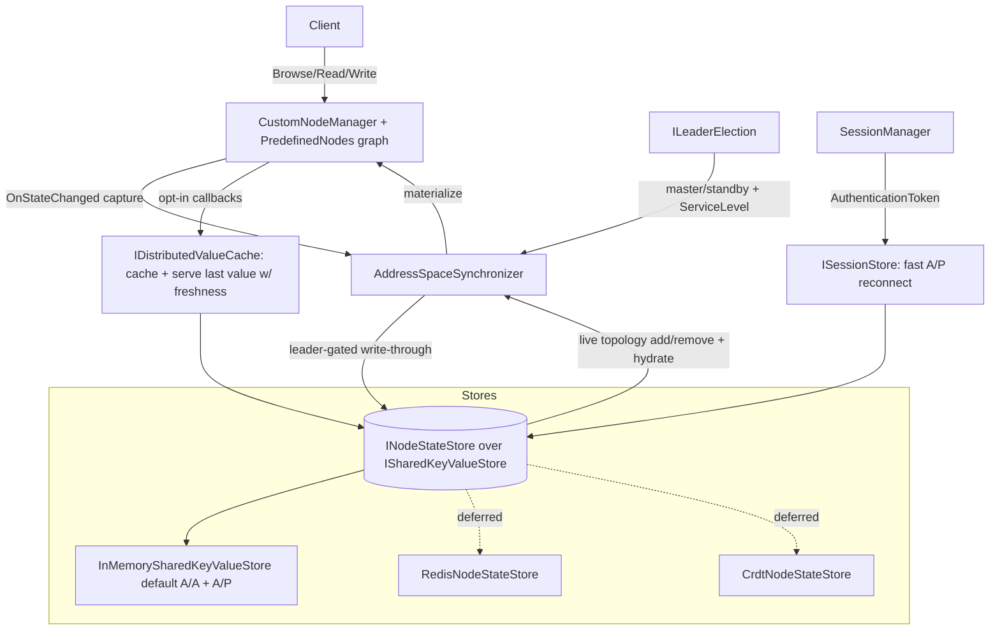

# Plan 28 — Distributed / Highly-Available Node State (Provider-Based Address Space)

## Status

**Partially implemented.** The `Opc.Ua.Server.Distributed` building blocks (P1–P6 abstractions + default implementations) are implemented and tested (47 unit/integration tests, green on net10.0; cross-compiles net48). The remaining work is the deep server-lifecycle wiring (driving the live `Server.ServiceLevel` node, populating `Server.ServerRedundancy`, integrating the session store into `SessionManager`) and the deferred Redis/CRDT providers. This document remains the architecture and phased plan.

### Implementation status (this branch)

| Phase | State | What landed |
|-------|-------|-------------|
| P0 spike | ✅ | Folded into P1; node binary round-trip + shared-k/v + AOT-safe confirmed. |
| P1 store abstraction | ✅ | `ISharedKeyValueStore` + `InMemorySharedKeyValueStore`, `INodeStateStore` + `InMemoryNodeStateStore`, `IStoredNode`/`StoredNode`, `NodeStateChange`/`KeyValueChange`, `INodeStateStoreRegistry` + `NodeStateStoreRegistry`, additive `ServerInternalData` hook. |
| P2 synchronizer | ✅ | `NodeStateSerializer`, `ILocalAddressSpace` + `DictionaryAddressSpace`, `IAddressSpaceSynchronizer` + `AddressSpaceSynchronizer` (writer/reader, live topology add/remove + value replication). Two-replica integration test. |
| P3 leader election | ✅ | `ILeaderElection`, `StaticLeaderElection`, `SharedStoreLeaseElection` (CAS lease, `TimeProvider`). |
| P4 callback participation | ✅ | `IDistributedValueCache` + `DistributedValueCache`, `DistributedValueParticipation` (+ `EnableDistributedValueParticipation`). |
| P5 redundancy exposure | ◑ | `IServiceLevelProvider` + `ConstantServiceLevelProvider` + `LeaderServiceLevelProvider` implemented & tested. **Remaining:** wire into the live `Server.ServiceLevel` node + populate `Server.ServerRedundancy` (server-lifecycle integration). |
| P6 session sharing | ◑ | `ISharedSessionStore` + `SharedSessionEntry` + `SharedKeyValueSessionStore` implemented & tested. **Remaining:** integrate into `SessionManager` activation/reconnect. |
| P7 tests | ✅ | 47 tests across P1–P6 (unit + two-replica integration), deterministic (`FakeTimeProvider`, manual change-feed enumerator). |
| P8 docs | ✅ | `Docs/HighAvailability.md` + `Docs/README.md` link. |
| P9 Redis/CRDT | ⏳ deferred | Same contracts; not started (by design). |

Build/test: `dotnet test Tests/Opc.Ua.Server.Tests/Opc.Ua.Server.Tests.csproj -f net10.0 -c Release --filter "Category=Distributed" -p:NuGetAudit=false`.

**Original design / proposal** follows. Making the server address-space state (topology **and** values) shareable across server replicas behind a pluggable store, so the stack can run **active/passive (A/P)** and **active/active (A/A)** in Kubernetes replicasets, while exposing redundancy to clients through documented OPC UA means.

## Scope (confirmed with requester)

| Aspect | Decision |
|--------|----------|
| State externalized | **Full address-space topology** (nodes, references, children) with **live add/remove propagation to all replicas**, **and** dynamic value state (`Value`/`StatusCode`/`Timestamp`). |
| HA modes | **Both A/P and A/A out of the box**, governed by a **leader-election model** with **shared read, master write — or better**. |
| Client-facing redundancy | Non-transparent (Cold/Warm/Hot) implemented now; transparent documented via a k8s Service fronting replicas. |
| Value subscriptions | **Monitored items read as today** (local Read path). They participate in shared state only *transitively*, when the read path is store-backed. |
| Read/write callback participation | Opt-in: an `OnReadValue`/`OnWriteValue` callback can **cache its last value in the distributed store** and **serve the last value with freshness** from the store. |
| Session state | **Shared across A/P for fast reconnect using just the session AuthenticationToken**. Certificate stores are assumed already shared. |
| Backing store — now | A **simple shared key/value (k/v) store** model with an **in-memory / loopback shared provider** that supports both A/A and A/P. |
| Backing store — deferred | **Redis** provider (in plan, deferred) and **CRDT** provider (deferred); both implement the same store abstraction. |
| Deliverable of this session | This design/plan document under `plans/`. |

## Problem

Every standard node state keeps its state in **in-process fields**, and each `CustomNodeManager` owns the address space as an **in-process dictionary**:

- `NodeState` holds attributes, children, and references in private fields with change tracking (`m_changeMasks`), exposing `OnStateChanged` / `StateChanged` and `ClearChangeMasks()` — `Stack/Opc.Ua.Types/State/NodeState.cs` (fields :5258-5266; `OnStateChanged` :2267; `ClearChangeMasks` :2757-2776).
- `BaseVariableState` holds `m_value` (`Variant`), `m_statusCode`, `m_timestamp`, with read/write seams `OnReadValue(Async)` (:559,:578) / `OnWriteValue(Async)` / `OnSimpleWriteValue(Async)` — `Stack/Opc.Ua.Types/State/BaseVariableState.cs`.
- `CustomNodeManager.PredefinedNodes` (`NodeIdDictionary<NodeState>`) — `Libraries/Opc.Ua.Server/NodeManager/CustomNodeManager.cs:260`, hydrated by `LoadPredefinedNodes` / `AddPredefinedNode` (:516-591).
- Subscriptions are fed by `MonitoredNode2` hooking `Node.OnStateChanged` and queueing values — `Libraries/Opc.Ua.Server/NodeManager/MonitoredItem/MonitoredNode.cs:173,301,586`.
- Sessions are keyed by `AuthenticationToken` (a `NodeId`) in `SessionManager.m_sessions` and that token is returned from `CreateSession` — `Libraries/Opc.Ua.Server/Session/SessionManager.cs:611,336`.

Because all of this is process-local, replicas cannot share topology, values, or sessions. There is no way to run a replicaset where a passive replica reflects live node/reference add/remove from the master, nor where a client can reconnect quickly to another replica using only its `AuthenticationToken`. The 2.0 migration notes already point at the desired direction:

> "associate node states only via an identifier with a backend 'system' that manages all state centrally and in your control." — `Docs/migrate/2.0.x/node-states.md:74`.

The **client** side of redundancy already works (`Libraries/Opc.Ua.Client/Session/{RedundancyMode,ServerRedundancyInfo,RedundantServer,IServerRedundancyHandler,DefaultServerRedundancyHandler}.cs` + `ManagedSession` failover). The **server** side barely advertises redundancy: `Server.ServiceLevel` is hardcoded once to `255` (`Libraries/Opc.Ua.Server/Server/ServerInternalData.cs:762`) and only `RedundantServerArray` is re-added — `RedundancySupport`/`ServerUriArray`/`CurrentServerId` exist in the model but are unpopulated (`Libraries/Opc.Ua.Server/Diagnostics/DiagnosticsNodeManager.cs:528-540`; nodes verified by `Tests/Opc.Ua.InformationModel.Tests/RedundancyModelTests.cs`).

## Goals

1. **Pluggable shared state** for topology + values behind a **shared k/v store** model, registrable through DI with a direct-construction fallback (mirrors `IFileSystemProvider`, `IHistorianProvider`/`IHistorianProviderRegistry`).
2. **Zero/near-zero overhead default**: the single-instance path stays as fast as today. The local `NodeState` graph remains the in-process serving cache for Browse/Read/Translate; externalization is opt-in (no store attached → today's behavior).
3. **Live topology replication**: node and reference **add/remove propagate to all replicas** (required for A/P instant failover and A/A consistency).
4. **A/P and A/A out of the box** with a **leader-election model** (shared read, master write, or better).
5. **Store-participating read/write callbacks**: an opt-in path lets `OnReadValue`/`OnWriteValue` callbacks cache and serve last value (with freshness) from the store. **Monitored items are unchanged** (read as today).
6. **Fast A/P reconnect** via a **shared session store** keyed by `AuthenticationToken`.
7. **Documented OPC UA redundancy exposure**: dynamic `ServiceLevel` + populated `Server.ServerRedundancy` (non-transparent now; transparent documented).
8. **k8s replicaset hosting** is documentation-only.
9. **Conventions honored**: AOT-safe, no exposed locks, `ArrayOf<T>`/`Variant`/`ByteString`/`in DataValue`, sealed-by-default + provider model, async-only, `ITelemetryContext` observability, ≥80% coverage, 1.5.378 compatibility (additive, no breaking changes).

## Key architectural decision — layering that preserves efficiency

Do **not** route every attribute access through an async store call. Instead:

- The local `NodeState` graph + `PredefinedNodes` dictionary **remains the in-process serving cache** (fast, local, unchanged for reads/browse).
- Introduce a **shared k/v–backed state store** (`INodeStateStore` over `ISharedKeyValueStore`) that is the durable/replicated copy.
- A **synchronizer** bridges the two:
  - **Local → store (write-through):** capture committed mutations via the existing `OnStateChanged` / `ClearChangeMasks` seam (same pattern `HistorianCaptureSink` already uses) and persist/replicate them. Writes are **leader-gated** (shared read, master write) by default.
  - **Store → local (live topology apply + hydration):** node/reference **add and remove propagate live** to every replica via the store change-feed, so all replicas keep a consistent topology. Full materialization also runs on startup and on failover promotion. Value changes are **not** force-fed to subscribers — monitored items read as today.
- **Default = no store attached.** The `NodeState` graph is authoritative exactly as today. The fast path is a single null check; no allocation, no indirection.



## HA modes & leader election

`ILeaderElection` (a.k.a. membership) designates which replica(s) may write and reports the peer/endpoint set:

- **Active/passive (A/P):** exactly one **master** (leader). The master writes the shared store; passives are **read-only** appliers of the change-feed and keep a hydrated topology for instant promotion. Passives advertise a **lower `ServiceLevel`**; the master advertises the highest, so non-transparent client failover picks the master.
- **Active/active (A/A):** multiple replicas serve clients and **share read**. Writes use the **simple k/v** with last-writer-wins / compare-and-swap (CAS) semantics; the leader-election layer can still elect a **master writer per partition** ("master write") to avoid conflicts, or allow multi-writer ("or better"). CRDT (deferred) later removes the need for a single writer entirely.
- **Implementations:** Kubernetes **Lease**-based (primary in-cluster), **store-based lease** (works outside k8s, lease held in the shared k/v), and **static config**. The active leader maps to `ServiceLevel` and to active/standby gating.

The store abstraction stays minimal so "shared read, master write" is the out-of-the-box behavior and "better" (multi-writer / CRDT) is a drop-in replacement of the store/leader strategy.

## Proposed components

### 1. Shared k/v + state store abstraction (new, in `Opc.Ua.Server`)

`ISharedKeyValueStore` — the minimal shared backend (Redis/in-memory/etc. are thin adapters):

```csharp
public interface ISharedKeyValueStore
{
    ValueTask<ByteString> GetAsync(string key, CancellationToken ct);
    ValueTask SetAsync(string key, ByteString value, CancellationToken ct);
    ValueTask<bool> CompareAndSwapAsync(string key, ByteString expected, ByteString value, CancellationToken ct);
    ValueTask DeleteAsync(string key, CancellationToken ct);
    IAsyncEnumerable<KeyValueChange> WatchAsync(string keyPrefix, CancellationToken ct); // change-feed
}
```

`INodeStateStore` — authoritative node state built on the k/v, for one node manager / namespace slice:

```csharp
public interface INodeStateStore
{
    // Topology (live add/remove propagate via the change-feed)
    ValueTask UpsertNodeAsync(IStoredNode node, CancellationToken ct);
    ValueTask DeleteNodeAsync(NodeId nodeId, CancellationToken ct);
    ValueTask<IStoredNode?> TryGetNodeAsync(NodeId nodeId, CancellationToken ct);
    IAsyncEnumerable<IStoredNode> EnumerateAsync(CancellationToken ct);

    // Value state
    ValueTask WriteValueAsync(NodeId nodeId, in DataValue value, CancellationToken ct);
    ValueTask<DataValue?> TryReadValueAsync(NodeId nodeId, CancellationToken ct);

    // Topology + value change feed (drives live apply / hydration)
    IAsyncEnumerable<NodeStateChange> SubscribeChangesAsync(CancellationToken ct);
}
```

- `IStoredNode` is a **portable serialized node** — reuse the existing `NodeState.SaveAsBinary` / `LoadAsBinary` (AOT-safe, no reflection); `ByteString` payload, `NodeId` key.
- `NodeStateChange` / `KeyValueChange` are discriminated records (Upsert / Delete / Value) with key + payload + a timestamp/version for last-writer-wins / CAS.
- Pass `DataValue` by `in`.

`INodeStateStoreRegistry` — mirrors `IHistorianProviderRegistry`: `RegisterDefault`, `RegisterForNamespace(uri, store)`, `RegisterForNode(nodeId, store)`, `Resolve(nodeId)`.

`InMemorySharedKeyValueStore` / `InMemoryNodeStateStore` — **default shared provider**; an in-process k/v that can be shared by multiple node managers/instances in one process (tests, single-process A/A) and is the reference implementation for both A/A and A/P.

### 2. Address-space synchronizer (new, in `Opc.Ua.Server`)

`IAddressSpaceSynchronizer` — bridges a `CustomNodeManager` graph to its `INodeStateStore`:

- **Seed or hydrate** on start (empty store → seed from NodeSet; otherwise hydrate `PredefinedNodes`).
- **Outbound (leader only):** hook `OnStateChanged` to write-through `Value`, `NonValue`, `Children`, `References` changes (batched/debounced), mirroring `HistorianCaptureSink`.
- **Inbound (all replicas):** consume `SubscribeChangesAsync` and **apply node/reference add/remove live** to `PredefinedNodes` (via `AddPredefinedNode` / `DeleteNode`), so passive replicas track the master's topology.
- `HydrateAsync()` / promotion entry point refreshes the local graph on failover.
- Opt-in: only attached when a store is registered for the node manager.

### 3. Read/write callback participation (new, in `Opc.Ua.Server`)

`IDistributedValueCache` + callback helpers let an existing read/write callback opt into the store:

- **Cache last value:** after a callback reads a live source, write the resulting `DataValue` to the store (`WriteValueAsync`).
- **Serve last value with freshness:** a wrapper reads the store's last `DataValue` and serves it when fresh (within a configurable max-age, using `DataValue.SourceTimestamp`), otherwise invokes the underlying live read. Freshness is surfaced via the `DataValue` timestamps/`StatusCode`.
- Shape: extension helpers that wrap `OnReadValueAsync` / `OnWriteValueAsync` (e.g., `variable.ParticipateInDistributedStore(store, maxAge)`), so a node manager keeps its existing callbacks and gains store participation without rewrites.
- **Monitored items are unchanged**: they read through the normal path, so they observe store-backed values only when the read path participates — exactly the requested "can or cannot participate" behavior.

### 4. Shared session store for fast reconnect (new, in `Opc.Ua.Server`)

`ISessionStore` — analogous to the existing `ISubscriptionStore`; shares the session authentication context across replicas keyed by `AuthenticationToken` (a `NodeId`):

- On `CreateSession`/`ActivateSession`, the master persists the minimal session context (identity, channel binding metadata, nonce material as required) to the store.
- On reconnect to another replica (A/P promotion), `SessionManager` can restore the session from the store using just the `AuthenticationToken`, enabling fast re-activation without a full re-handshake. (`SessionManager.cs:611` already does the token→session lookup; the store backs that lookup across replicas.)
- Certificate stores are assumed already shared (out of scope). Integrate with `ISubscriptionStore` so subscriptions survive the same promotion.
- **Security note:** session secrets are sensitive — persist with the stack's secret-handling rules (zeroization, no plaintext at rest beyond what is required; see `EncryptedSecret` / `CryptoUtils.ZeroMemory`).

### 5. Deferred backing providers (in plan, not implemented now)

- **`RedisNodeStateStore`** (deferred): `ISharedKeyValueStore` over Redis (`SET`/`GETSET`/`WATCH`-`MULTI` for CAS, keyspace notifications for the change-feed). Adds a NuGet dependency → evaluate license/AOT; gate behind its own package/AOT tests.
- **`CrdtNodeStateStore`** (deferred): LWW-Register (values) + OR-Set (children/references) + Hybrid Logical Clock, for conflict-free multi-writer A/A and split-brain-safe failover. CRDT primitives would be implemented in-repo (no external NuGet).
- Both implement the **same** `INodeStateStore` / `ISharedKeyValueStore` contract, so adopting them is a registration change.

### 6. Server-side redundancy exposure (in `Opc.Ua.Server`)

- `IServiceLevelProvider` (injectable): computes `Server.ServiceLevel` (0–255) from leadership + store health (master high, passive low, shutting-down → drop). **Default = constant 255** (today's behavior). Replace the hardcoded assignment at `ServerInternalData.cs:762` and add a periodic updater that writes the node and clears change masks so monitored `ServiceLevel` items fire.
- Drive leadership from `ILeaderElection` (§HA modes).
- **Populate the existing `Server.ServerRedundancy` nodes**: set `RedundancySupport` to the configured mode, fill `ServerUriArray` / `RedundantServerArray` / `CurrentServerId` from membership. Extend the `AddServerRedundancySdkOptionalChildren` seam (`DiagnosticsNodeManager.cs:528`).
- **Non-transparent failover** is already handled client-side; passives lower `ServiceLevel`, the master is highest, so the client picks the master.
- **Transparent** is documented via a k8s Service + `TransferSubscriptions` (already supported, `Docs/TransferSubscription.md`).

### 7. DI + fluent wiring (in `Opc.Ua.Server` + provider packages)

Extend the `services.AddOpcUa().AddServer(...)` → `IOpcUaServerBuilder` chain:

```csharp
services.AddOpcUa()
    .AddServer(o => { /* ... */ })
    .UseDistributedAddressSpace(d => d
        .UseSharedKeyValueStore()              // in-memory/loopback default (A/A + A/P)
        // .UseRedis(...) / .UseCrdt()         // deferred
        .WithMode(HaMode.ActivePassive)        // or HaMode.ActiveActive
        .UseKubernetesLeaderElection())        // or .UseStoreLease() / .UseStaticLeader(...)
    .AddServerRedundancy(r => r.Mode = RedundancySupport.Hot)
    .AddSharedSessionStore()                   // fast A/P reconnect
    .AddServiceLevelProvider<HealthServiceLevelProvider>();
```

- Default (`.UseInMemoryAddressSpace()` implied / nothing) preserves current behavior exactly.
- Direct-construction fallback mirrors Historian's `UseHistorian(this IServerInternal)` fluent for non-DI hosting.

## Reuse of existing features

| Need | Reuse |
|------|-------|
| Portable node serialization | `NodeState.SaveAsBinary` / `LoadAsBinary` / XML (AOT-safe, already exists). |
| Change capture (local → store) | `OnStateChanged` / `ClearChangeMasks`; same pattern as `HistorianCaptureSink`. |
| Provider registry shape | `IHistorianProviderRegistry` / `HistorianProviderRegistry`. |
| Session token lookup | `SessionManager` keys sessions by `AuthenticationToken` (`SessionManager.cs:611,336`). |
| Subscription survival across failover | `ISubscriptionStore` (durable subscriptions). |
| Client failover | `IServerRedundancyHandler` / `ManagedSession` (already implemented). |
| Secret handling for session state | `EncryptedSecret` / `CryptoUtils.ZeroMemory`. |
| Observability | `ITelemetryContext` → `ILogger` + metrics. |
| Concurrency | `System.Threading.Lock` / `SemaphoreSlim` internally; **no exposed locks**. |

## Compatibility & conventions

- **Additive, opt-in.** Default path unchanged; `PredefinedNodes` stays. No new mandatory dependencies in the core server (the now-store is in-memory).
- **ServiceLevel change** is behavior-preserving (default provider returns 255). Any changed public signature gets `[Obsolete]` per 1.5.378 compatibility.
- **NativeAOT:** abstractions + in-memory store + helpers must be AOT-safe (binary node serialization, no reflection). Add AOT tests. Deferred Redis is gated behind its own AOT coverage.
- `ArrayOf<T>`, `Variant`, `ByteString`, `Span<byte>`, `in DataValue` in all new public API; sealed by default; async-only.

## Testing strategy

- **Unit:** k/v store (`Get`/`Set`/`CAS`/`Watch`), `INodeStateStore`, synchronizer outbound capture + **inbound topology add/remove apply**, leader election (A/P single-writer, A/A CAS), `IServiceLevelProvider`, callback participation (cache + freshness max-age), `ISessionStore`. NUnit + Moq, `Assert.That`.
- **Integration (two in-process instances sharing one k/v):**
  - add/remove a node and a reference on the master → appears/disappears on the passive replica (live topology propagation).
  - A/P: promote the passive → it serves the latest committed state; client `ManagedSession` selects the highest `ServiceLevel`; subscriptions transfer.
  - **Fast reconnect:** reconnect using only the `AuthenticationToken` against the promoted replica.
  - A/A: two active replicas share read; concurrent writes resolve via CAS/last-writer-wins.
  - callback participation: stale source served from store within max-age; refreshed past it.
- **AOT:** add the distributed library to `Opc.Ua.Aot.Tests`.
- **Coverage:** ≥80% for new libraries; deterministic in CI.

## Documentation

- New `Docs/HighAvailability.md` — architecture, k/v store providers, leader election, A/P vs A/A, ServiceLevel, live topology propagation, callback participation, fast reconnect, non-transparent vs transparent.
- New `Docs/KubernetesDeployment.md` — replicaset, headless Service for peer discovery, **Lease-based leader election**, readiness/liveness tied to `ServiceLevel`, non-transparent endpoints vs transparent Service.
- Update `Docs/README.md`, `Docs/MigrationGuide.md` (new opt-in feature, no breaking change), `NugetREADME.md` if a package ships; cross-link `Docs/Sessions.md`, `Docs/TransferSubscription.md`, `Docs/DurableSubscription.md`.

## Phased implementation (todos)

| Phase | Todo id | Summary |
|-------|---------|---------|
| P0 | `p0-spike-sharedkv-aot` | Spike the shared k/v abstraction + live topology propagation + `NodeState` binary round-trip + AOT/dependency check. (No CRDT.) |
| P1 | `p1-store-abstraction` | `ISharedKeyValueStore`, `INodeStateStore`, `IStoredNode`, `NodeStateChange`, `INodeStateStoreRegistry`, in-memory shared default. Default off; no behavior change. |
| P2 | `p2-synchronizer` | `IAddressSpaceSynchronizer`: outbound capture + **inbound live topology add/remove apply** + seed/hydrate; opt-in wire into `CustomNodeManager`; DI + fluent (`UseDistributedAddressSpace`). |
| P3 | `p3-leader-election` | `ILeaderElection` / membership (k8s Lease, store-lease, static); **A/P (master write) and A/A (CAS) out of the box**; shared-read/master-write enforcement; leadership → `ServiceLevel`. |
| P4 | `p4-callback-participation` | `IDistributedValueCache` + read/write callback helpers (cache last value; serve last value with freshness). Monitored items unchanged. |
| P5 | `p5-redundancy-exposure` | Dynamic `Server.ServiceLevel` (`IServiceLevelProvider`) replacing the `ServerInternalData.cs:762` constant; populate `Server.ServerRedundancy`; advertise A/P vs A/A. |
| P6 | `p6-session-sharing` | `ISessionStore` keyed by `AuthenticationToken` for fast A/P reconnect; integrate `ISubscriptionStore`; secret-safe persistence. |
| P7 | `p7-tests` | Unit + two-instance integration (topology add/remove, A/P promotion, fast reconnect, A/A CAS, callback freshness) + AOT; coverage ≥80%. |
| P8 | `p8-docs` | `HighAvailability.md`, `KubernetesDeployment.md`, README/MigrationGuide updates. |
| P9 | `p9-deferred-redis-crdt` | **Deferred.** Redis provider + CRDT provider implementing the same store abstraction (CRDT for conflict-free A/A). |

Dependencies: P1→P0; P2→P1; P3→P2; P4→P2; P5→P3; P6→P2; P7→{P2,P3,P4,P5,P6}; P8→{P2,P3,P4,P5,P6}; P9 (deferred)→P1.

## Open questions / risks

1. **A/A write conflicts on a simple k/v.** Last-writer-wins / CAS can lose updates under contention. Mitigation now: leader-election "master write" per namespace/partition; CRDT (P9) removes the constraint. Confirm CAS+master-write is acceptable for the first cut.
2. **Live topology apply ordering.** Inbound node/reference changes must apply in a consistent order (parents before children; reference targets may arrive out of order). Need versioning + idempotent apply + deferred-reference resolution.
3. **Hot-path write-through cost.** High-frequency value writes must be batched/debounced (coalescing buffer keyed by `NodeId`, flush interval) to avoid per-write round-trips.
4. **Large address spaces.** Full hydration on promotion may be slow; mitigate with snapshot + delta and lazy materialization.
5. **Session-secret sharing security.** Sharing enough session context for token-only reconnect must not weaken authentication; define exactly what is stored, encryption at rest, and zeroization. Validate against the security review bar.
6. **Freshness semantics for served-from-store values.** Define how max-age maps to `StatusCode`/timestamps so clients can tell cached from live.
7. **Leader-election source of truth.** k8s Lease (in-cluster) vs store-hosted lease (portable); both offered, document trade-offs.
8. **Transparent redundancy** remains documentation-only here; a full implementation is a separate, larger effort.

## Primary references (code)

- `Stack/Opc.Ua.Types/State/NodeState.cs` — attributes, `OnStateChanged` (:2267), `ClearChangeMasks` (:2757).
- `Stack/Opc.Ua.Types/State/BaseVariableState.cs` — `Value`/`StatusCode`/`Timestamp`, `OnReadValue(Async)` (:559,:578), write seams.
- `Libraries/Opc.Ua.Server/NodeManager/CustomNodeManager.cs` — `PredefinedNodes` (:260), add/delete (:516-654).
- `Libraries/Opc.Ua.Server/NodeManager/MonitoredItem/MonitoredNode.cs` — subscription feed via `OnStateChanged` (:173,301).
- `Libraries/Opc.Ua.Server/Session/SessionManager.cs` — token→session lookup (:611), `AuthenticationToken` return (:336).
- `Libraries/Opc.Ua.Server/Historian/{IHistorianProviderRegistry,HistorianProviderRegistry,HistorianCaptureSink}.cs` — provider/registry + capture patterns.
- `Libraries/Opc.Ua.Server/FileSystem/{IFileSystemProvider,FileSystemNodeManagerFactory}.cs` — provider + factory pattern.
- `Libraries/Opc.Ua.Server/Hosting/{OpcUaServerBuilderExtensions,IOpcUaServerBuilder,OpcUaServerHostedService}.cs` — DI/fluent + hosted service.
- `Libraries/Opc.Ua.Server/Server/ServerInternalData.cs:762` — hardcoded `ServiceLevel`.
- `Libraries/Opc.Ua.Server/Diagnostics/DiagnosticsNodeManager.cs:528-540` — `ServerRedundancy` optional-children seam.
- `Libraries/Opc.Ua.Server/Subscription/Persistence/ISubscriptionStore.cs` — durable subscriptions (session-store analog).
- `Libraries/Opc.Ua.Client/Session/{RedundancyMode,ServerRedundancyInfo,RedundantServer,IServerRedundancyHandler,DefaultServerRedundancyHandler}.cs` + `ManagedSession.cs` — client failover (already implemented).
- `Docs/migrate/2.0.x/node-states.md:74` — "central backend" guidance.
