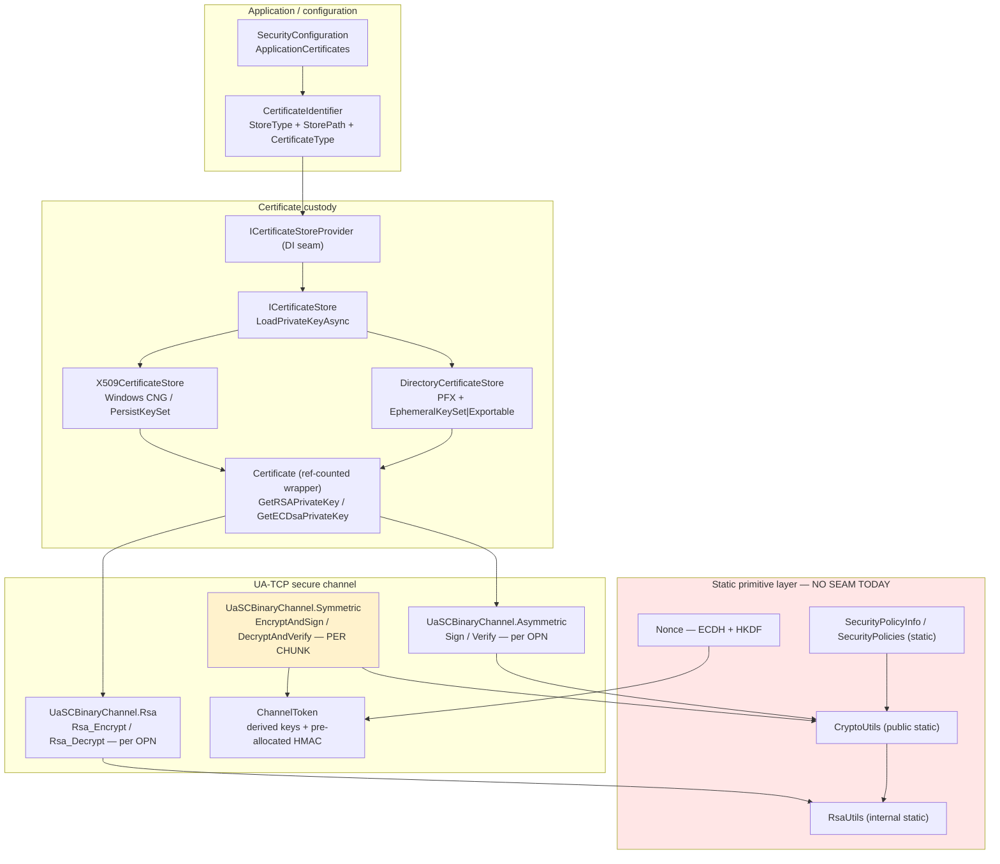
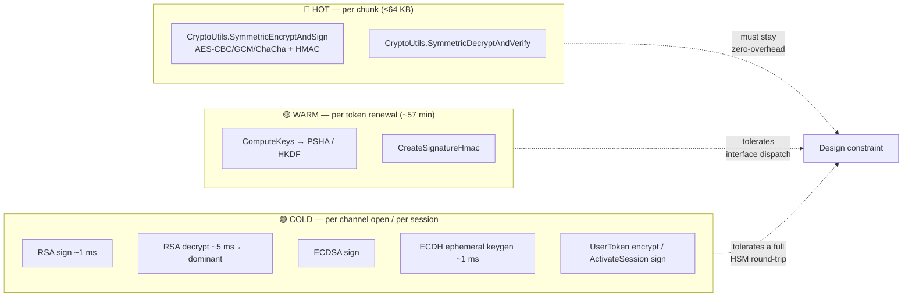
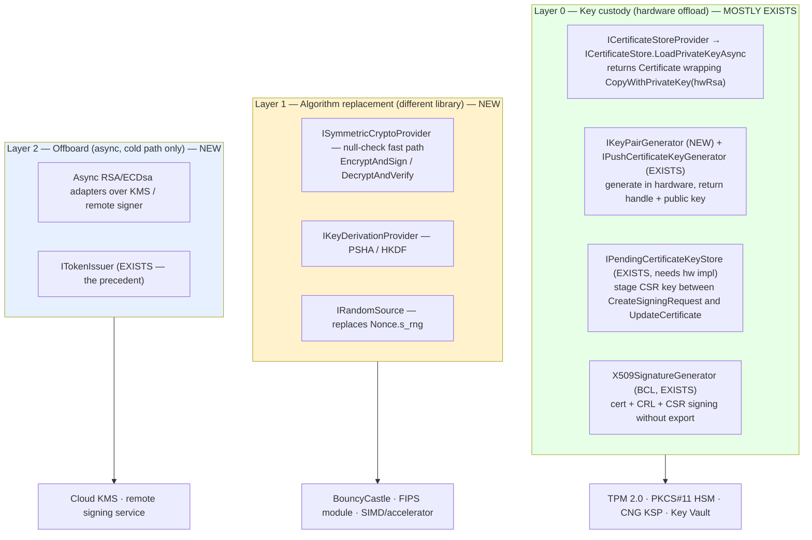
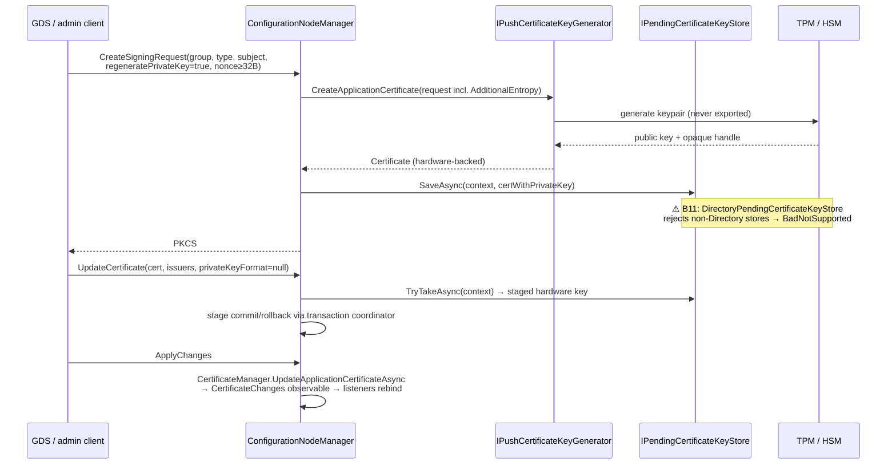

# Crypto offboarding — pluggable cryptography and hardware-held private keys

> **Status:** Research complete, design proposed, **not implemented**.
> **Tracks:** [#4190 — Feature request: fully pluggable cryptography provider to enable hardware-backed keys (TPM 2.0 / secure elements)](https://github.com/OPCFoundation/UA-.NETStandard/issues/4190)
> **Scope:** `Opc.Ua.Core`, `Opc.Ua.Security.Certificates`, `Opc.Ua.Server` (push management), `Opc.Ua.Gds.Server.Common`.

---

## 1. Executive summary

The goal is to let integrators replace the stack's cryptographic operations — with a different
library, an offboard service, or hardware (TPM 2.0 / HSM / PKCS#11 token / cloud KMS) — **without any
performance cost in the default all-software configuration**, and to extend that so private keys are
never materialised in process memory.

The central research finding is that **this is far more achievable than it looks, because .NET's own
`RSA` and `ECDsa` are abstract classes and this stack already routes 100 % of its private-key
operations through them.** A trace of a hypothetical hardware-backed certificate through the full
client and server lifecycle shows roughly **85 % of the stack works unchanged**[^trace]. Every private-key
use resolves to `certificate.GetRSAPrivateKey().SignData(...)` / `.Decrypt(...)` or
`certificate.GetECDsaPrivateKey().SignData(...)`[^rsasign][^eccsign][^rsadec], and every size/shape helper reads
`rsa.KeySize` rather than exporting key material[^sizes]. Critically, **ECDH key agreement never uses the
certificate key** — it always generates a fresh ephemeral `ECDiffieHellman`[^ephemeral], so hardware only ever
needs `Sign` and `Decrypt`.

The remaining 15 % is not the protocol: it is **six certificate *persistence and export* call sites**
that assume a PFX round-trip is always possible[^breakage]. Those are the real work.

Three conclusions drive the design:

1. **Do not invent a new asymmetric crypto interface.** `RSA`/`ECDsa` subclasses plus
   `X509Certificate2.CopyWithPrivateKey` already are the plugin contract, and they are the contract
   `RSACng` (TPM), `Pkcs11Interop.X509Store` (HSM) and `RSAKeyVault` (Azure) already implement[^rsakv][^pkcs11][^cngtpm].
   Issue #4190's own closing note reaches the same conclusion[^4190].
2. **Hardware offload never touches the hot path.** The per-chunk symmetric AES+HMAC work uses
   session keys derived per channel token; a TPM is neither needed nor wanted there. The default
   symmetric path can remain byte-for-byte unchanged.
3. **Where a seam *is* needed for "different library" scenarios, a null-check fast path costs nothing.**
   A 64 KB chunk costs ~50 µs of AES+HMAC; an interface dispatch costs ~1–9 ns — **0.002 %–0.018 %**[^perf].
   A predicted-not-taken null test is below measurement noise.

Most of the required seams already exist and simply need to be used and hardened:
`ICertificateStoreProvider`[^storeprovider], `ICertificateStore.LoadPrivateKeyAsync`[^loadpk],
`IPushCertificateKeyGenerator` (whose XML doc already says "for example, to delegate to a hardware
security module")[^pushkeygen], `X509SignatureGenerator` overloads on `ICertificateBuilder`[^certbuilder], and
`ITokenIssuer` as the established async-offboard-signing precedent[^tokenissuer].

---

## 2. Problem statement

### 2.1 What the consumer asked for

Issue #4190 was filed by `barnstee` (OPC Foundation member, UA Edge Translator maintainer) on
2026-08-06[^4190]. Verbatim framing:

> Today the stack's application instance certificate and its private key are ultimately materialized
> as an X509Certificate2 with an exportable software key, persisted to a DirectoryCertificateStore
> (e.g. pki/own/private/*.pfx). On a modern industrial device this is the weakest link in an otherwise
> strong security story: virtually all current industrial hardware ships with a TPM 2.0, an ARM
> TrustZone/secure element, or a vendor secure enclave, and the private key should never leave it.

Four named gaps[^4190]:

| # | Gap | Named APIs |
|---|---|---|
| P1 | **Key generation** — no way to say "create the keypair inside the TPM and give me only a CSR/public key" | `CertificateFactory`, `CertificateBuilder` |
| P2 | **Private-key ownership** — stores assume a loadable/exportable key, not an opaque handle | `CertificateIdentifier.LoadPrivateKey`, `ICertificateStore` |
| P3 | **Signing and key exchange** — calls concrete `RSA`/`ECDsa` obtained from the certificate | `CreateSession`, `ActivateSession`, secure-channel establishment |
| P4 | **GDS Server Push (Part 12)** — assumes the stack can produce and store the private key itself | `UpdateCertificate`, `CreateSigningRequest` |

Explicit non-functional requirements from the issue: *"A default implementation preserving today's
exact software behaviour, so this is a non-breaking, opt-in change"*, and registration *"without
recompiling the stack"*[^4190]. The author offers to contribute a TPM 2.0 provider once the shape is agreed.

This is a ten-year-old ask: the same author filed #44 ("Add support for a TPM cert store") in 2016,
closed in 2021 without an implementation; #1202 ("OPC UA Security and HSM hardware") in 2020; and
#2637 / PR #2761 fixed a *symptom* in 2024 — the stack crashed on HTTPS when the private key was
non-exportable[^issues].

### 2.2 The second requirement: replaceable crypto library

Beyond hardware custody, the request includes running crypto *offboard* or *via a different library*
(FIPS-validated module, BouncyCastle, an OpenSSL provider). This is a **broader** scope than hardware
keys, because it touches the symmetric per-message path, which hardware offload does not.

The two requirements need different mechanisms, and conflating them is the main design risk.

### 2.3 Specification backing

| Source | Statement |
|---|---|
| Part 2 §9.1 | Private keys stored *"ideally secured using a secure element (e.g. TPM)"*[^part2] |
| Part 21 §5.1 | *"Devices should provide a SecureElement storage (for an example, see ISO/IEC 11889) to ensure the associated Private Keys cannot be copied off the Device."*[^part21] — ISO/IEC 11889 **is** the TPM specification |
| Part 12 §7.10.10 | `CreateSigningRequest(RegeneratePrivateKey=true)` — server creates the key and returns only a PKCS#10 CSR. **The only fully hardware-compatible renewal flow**[^csr] |
| Part 12 §7.10.5 | `UpdateCertificate(..., PrivateKey)` — raw key bytes pushed *into* the server. **Hardware-incompatible** when non-null[^updatecert] |
| Part 7 | **No hardware-security / secure-element facet exists.** Hardware key custody cannot be declared in a conformance profile — a spec-level gap, not ours to fix[^part7] |

---

## 3. Current state — the crypto surface

### 3.1 Where crypto lives today



All cryptographic primitives are reached through **four static classes with no interface**:
`RsaUtils` (internal static)[^rsautils], `CryptoUtils` (public static)[^cryptoutils], `SecurityPolicies` (static)[^policies]
and `Utils.PSHA*`[^psha]. `Nonce` is instantiable but constructed via static factories[^nonce].

### 3.2 Hot path vs cold path — the performance question

This split is the single most important input to the design.



| Path | Operation | Frequency | Budget |
|---|---|---|---|
| 🔴 Hot | `SymmetricEncryptAndSign` / `SymmetricDecryptAndVerify` | **every chunk** (a 1 MB response = 16 chunks) | ~50 µs per 64 KB chunk[^perf] |
| 🟡 Warm | `ComputeKeys`, `DeriveKeysWithPSHA` / `DeriveKeysWithHKDF` | per token activation; default lifetime 3 600 000 ms, renewal at 95 % ≈ 57 min[^tokenlife] | microseconds |
| 🟢 Cold | `Sign`, `Verify`, `Rsa_Encrypt`, `Rsa_Decrypt`, `CreateNonce` | per `OpenSecureChannel` / `ActivateSession` | RSA-2048 private op already ~5 ms |

**The decisive observation:** a TPM/HSM is only ever asked to perform cold-path operations. Session
keys are symmetric, derived per token, and must live in process memory to sustain throughput. Therefore
**hardware key custody requires no change whatsoever to the hot path.**

Quantitatively, even if we *did* put an interface on the hot path: 9 ns dispatch against ~50 000 ns of
crypto is **0.018 %**; with guarded devirtualisation on .NET 8+ it collapses to ~0.004 %[^perf][^gdv].

### 3.3 What already works with a hardware key

Verified by trace against the v2.0 source[^trace]:

| Path | Works unchanged? | Evidence |
|---|---|---|
| RSA channel `Rsa_Decrypt` (unwrap client secret) | ✅ | `GetRSAPrivateKey()` → `rsa.Decrypt(block, padding)`; block sizes from `rsa.KeySize / 8`[^rsadec][^sizes] |
| RSA / ECDSA channel `Sign` | ✅ | `rsa.SignData(...)` / `ecdsa.SignData(...)`[^rsasign][^eccsign] |
| **ECDH key agreement** | ✅ | `ECDiffieHellman.Create(curve)` generates a **fresh ephemeral** key; the certificate key is never used[^ephemeral] |
| Key-size / signature-length helpers | ✅ | All read `.KeySize`; never `ExportParameters(true)`[^sizes] |
| Server startup validation | ✅ | Validates a de-keyed copy via `Certificate.FromRawData`; `GetPublicKeySize` reads public key only[^startup] |
| `VerifyKeyPair` on load | ✅ | Uses `SignData`+`VerifyData` / `Encrypt`+`Decrypt`, never export[^verifykp] |
| Certificate & CSR signing | ✅ | `X509SignatureGenerator.CreateForRSA/ECDsa` call `SignHash` only — including on net472/net48[^certbuilder][^bcpath] |
| HTTPS transport | ⚠️ graceful | `CreateCopyWithPrivateKey` is already wrapped in `catch (CryptographicException)` with a fallback[^httpsfallback] |
| Client `ActivateSession` user-token signing | ✅ | Same `CryptoUtils.Sign` path[^eccsign] |

### 3.4 What breaks — the actual work list

| # | File:line | Offending API | Failure | Remediation |
|---|---|---|---|---|
| B1 | `src/Opc.Ua.Security.Certificates/CertificateManager/DefaultCertificateFactory.cs:333` | `Export(X509ContentType.Pfx)` in `DetachFromSourceKey` | `CryptographicException` | `catch` → return `combined.AddRef()`; the detach only exists to escape ephemeral CNG handles |
| B2 | same file `:279,:294` | `CopyWithPrivateKey` → `DetachFromSourceKey` | cascades from B1 | as B1, or add an explicit hardware-key overload |
| B3 | `src/Opc.Ua.Core/Security/Certificates/DirectoryCertificateStore.cs:262,266` | `Export(X509ContentType.Pkcs12)` in `AddAsync` | `CryptographicException` | `catch` → persist public `.der` only; hardware keys must never be written to disk |
| B4 | `src/Opc.Ua.Core/Security/Certificates/X509CertificateStore/X509CertificateStore.cs:188` | `Export(Pfx)` in `AddAsync` (Windows) | `CryptographicException` | `catch` → `store.Add(certificate.X509)`; a CNG key is already in the KSP |
| B5–B7 | `src/Opc.Ua.Security.Certificates/PEM/PEMWriter.cs:96,109,128–144` | `ExportRSAPrivateKey`, `ExportECPrivateKey`, `ExportPkcs8PrivateKey` | `CryptographicException` | throw `NotSupportedException` with a clear message; admin path only |
| B8–B9 | `src/Opc.Ua.Security.Certificates/Org.BouncyCastle/X509Utils.cs:151,186` (`#if NETFRAMEWORK`) | `ExportParameters(true)` | `CryptographicException` | **Only reached from PEM export**, never from signing — guard at the `PEMWriter` entry point[^bcpath] |
| B10 | `src/Opc.Ua.Server/Configuration/ConfigurationNodeManager.cs:2324` | `X509Utils.CreateCopyWithPrivateKey` with **no** catch | unhandled exception during GDS `UpdateCertificate` | wrap → `ServiceResultException(BadSecurityChecksFailed)` |
| B11 | `src/Opc.Ua.Server/Configuration/DirectoryPendingCertificateKeyStore.cs` (~:180) | hard-codes `StoreType == "Directory"` | `SaveAsync` returns `false` → `CreateSigningRequest(regenerate:true)` throws `BadNotSupported` | requires a hardware `IPendingCertificateKeyStore`[^pendingstore] |
| B12 | `src/Opc.Ua.Security.Certificates/X509Certificate/Certificate.cs` (~:240) | `AsX509Certificate2()` PFX round-trip | already has a fallback | verify the fallback preserves the hardware handle |

Also note the store deliberately requests exportable keys today —
`EphemeralKeySet | Exportable | MachineKeySet`[^exportflags] — which is exactly the property #4190 objects to.

---

## 4. Design

### 4.1 Guiding principle

> **The crypto plugin interface for asymmetric operations already exists: it is `System.Security.Cryptography.RSA` and `ECDsa`.**

`RSA` and `ECDsa` are abstract. `SignData` → `HashData` → `SignHash`; `TrySignHash` funnels to the array
`SignHash`; overriding `SignHash`, `VerifyHash`, `Encrypt`, `Decrypt` and `ExportParameters(false)` is
sufficient for every call the stack makes[^rsaabstract]. `ExportParameters(true)` may throw — no BCL path used by
sign/decrypt calls it[^rsaabstract]. This is precisely how `RSACng` over the TPM KSP[^cngtpm],
`Pkcs11Interop.X509Store`[^pkcs11] and Azure's `RSAKeyVault`[^rsakv] already work.

Adopting a bespoke `IOpcUaCryptoProvider` for these operations would **reject** all three of those
ready-made implementations. Instead we adopt them, and add seams only where the BCL model genuinely
does not reach: **key generation, key custody/addressing, CSR staging, and (separately) the symmetric
and policy layers.**

### 4.2 Layered model



**Layer 0 delivers issue #4190 and requires no hot-path change at all.** Layers 1 and 2 deliver the
"replace the library / run offboard" requirement and are independently shippable.

### 4.3 Layer 0 — key custody

#### 4.3.1 Getting a hardware certificate into the stack

No new interface needed. `ICertificateStoreProvider` is already a DI seam keyed by store-type name[^storeprovider]:

```csharp
public interface ICertificateStoreProvider
{
    string StoreTypeName { get; }                     // e.g. "PKCS11"
    bool SupportsStorePath(string storePath);          // e.g. storePath.StartsWith("pkcs11:")
    ICertificateStore CreateStore(ITelemetryContext telemetry);
}
```

A hardware store implements `ICertificateStore.LoadPrivateKeyAsync` to return a `Certificate` whose
inner `X509Certificate2` was produced by `CopyWithPrivateKey(hardwareRsa)`. The addressing model is
already string-based and extensible — `SharedKeyValue` sets the precedent with a `kv:` `StorePath`
prefix[^kvscheme] — so RFC 7512 PKCS#11 URIs drop straight in:

```xml
<ApplicationCertificates>
  <CertificateIdentifier>
    <StoreType>PKCS11</StoreType>
    <StorePath>pkcs11:token=MyHSM;object=AppCert;type=cert</StorePath>
    <CertificateTypeString>RsaSha256</CertificateTypeString>
  </CertificateIdentifier>
</ApplicationCertificates>
```

`ApplicationCertificates` is already a per-certificate-type collection where each entry carries its own
`StoreType`/`StorePath`[^appcerts], so a device can hold its RSA key in a TPM and keep ECC certificates on
disk, or vice versa. Selection per security policy flows through
`CertificateIdentifier.MapSecurityPolicyToCertificateTypes`[^mapping] and
`ICertificateRegistry.AcquireApplicationCertificateBySecurityPolicy` at endpoint-build time[^endpointcert] —
neither needs changing.

> ⚠️ **Gap:** `CertificateStoreIdentifier.DetermineStoreType` auto-detection iterates only the *legacy*
> `[Obsolete]` `RegisteredStoreTypeNames` dictionary and does **not** consult DI-registered
> `ICertificateStoreProvider` instances[^determinestore]. Either extend it, or require an explicit
> `<StoreType>` (recommended, and document it).

#### 4.3.2 Key generation in hardware

Two entry points generate keys today:

- **Startup self-signed** — `ApplicationInstance.CreateApplicationInstanceCertificateAsync` →
  `builder.SetRSAKeySize(n).CreateForRSA()`, where `CreateForRSA()` unconditionally calls
  `RSA.Create(keySize)` when no public key was supplied[^keygen]. **No seam.**
- **Part 12 push** — `IPushCertificateKeyGenerator`, already injectable and already documented as the
  hardware delegation point[^pushkeygen]:

```csharp
public interface IPushCertificateKeyGenerator
{
    Certificate CreateApplicationCertificate(
        PushCertificateKeyGenerationRequest request,
        CancellationToken cancellationToken = default);
}
```

The builder already accepts an externally generated public key —
`SetRSAPublicKey(byte[] derSubjectPublicKeyInfo)` / `SetECDsaPublicKey(...)` plus
`CreateForRSA(X509SignatureGenerator)` — so the hardware flow works today[^certbuilder]:

```csharp
// Hardware generates the pair; only the public key ever leaves the device.
byte[] spki = hsm.GenerateKeyPair(KeySpec.Rsa2048);
RSA     handle = hsm.OpenKey("AppCert");           // custom RSA subclass, SignHash → C_Sign

Certificate cert = CertificateBuilder.Create("CN=MyDevice")
    .SetRSAPublicKey(spki)
    .CreateForRSA(new HsmSignatureGenerator(handle));   // self-signed, key stays in hardware
```

**Proposed addition:** a small `IKeyPairGenerator` (or an `ICertificateFactory` extension) so the
*startup* path gets the same treatment as the push path, rather than being the one place that hard-codes
`RSA.Create`.

#### 4.3.3 GDS Part 12 push



The transactional push infrastructure landed in PR #3989 (merged 2026-07-14)[^issues] and the call chains are
already correct[^pushchain]: `IPushCertificateKeyGenerator` is invoked **only** on the
`regeneratePrivateKey=true` branch — which is exactly the Part 12 hardware-compatible flow[^csr]. The one
blocker is B11, the Directory-only pending-key store[^pendingstore].

`UpdateCertificate` with a non-null `PrivateKey` is hardware-incompatible by construction[^updatecert]; a
hardware-backed certificate group must return `Bad_NotSupported` for that argument. This should be an
explicit, documented policy rather than an exception surfacing from deep in the stack (B10).

#### 4.3.4 Certificate rotation

`CertificateManager.UpdateApplicationCertificateAsync` swaps the live entry under a lock and publishes a
`CertificateChanges` observable event, with the old entry disposed *after* notification[^rotation]. This works
unchanged for hardware certificates.

### 4.4 Layer 1 — replaceable algorithms (hot path)

Required only for "use a different crypto library", **not** for hardware keys.

**Mechanism: sealed default + interface field, entered through a null-check fast path.** Evaluated
against every target framework[^tfmmatrix]:

| Mechanism | net472 | net48 | netstandard2.1 | net8/9/10 | AOT-safe | Breaking |
|---|---|---|---|---|---|---|
| **null-check fast path** | ✅ | ✅ | ✅ | ✅ | ✅ | No |
| **sealed class + interface field** (GDV/PGO) | ✅ | ✅ | ✅ | ✅ | ✅ | No |
| generic `where T : struct, IStrategy` | ✅ | ✅ | ✅ | ✅ | ✅ | **Severe** — genericises the whole channel hierarchy |
| `static abstract` interface members | ❌ CS8919 | ❌ | ❌ | ✅ | ✅ | n/a |
| `delegate*` function pointers | ❌ | ❌ | ⚠️ | ✅ | ✅ | No |

`targets.props` pins `net472;net48;netstandard2.1;net8.0;net9.0;net10.0` with `LangVersion 14.0`[^tfm], so
`static abstract` members and function pointers are excluded outright. The recommended shape:

```csharp
// UaSCBinaryChannel.Symmetric.cs — EncryptAndSign
private ArraySegment<byte> EncryptAndSign(ChannelToken token, ArraySegment<byte> data, bool useClientKeys)
{
    ISymmetricCryptoProvider? provider = m_cryptoProvider;
    if (provider is null)                      // predicted-not-taken; ≈0.1 ns
    {
        return CryptoUtils.SymmetricEncryptAndSign(/* unchanged call, byte-for-byte */);
    }
    return provider.EncryptAndSign(/* ... */);
}
```

**Reaching the channel.** `UaSCUaBinaryChannel`'s constructor takes no `IServiceProvider` — only
`BufferManager`, `ChannelQuotas`, `ICertificateRegistry`, endpoints, security mode/policy,
`ITelemetryContext` and `TimeProvider`[^chanctor]; the listener/factory chain threads the same set[^chanchain].
`ChannelQuotas` is already the per-channel configuration aggregate reaching every channel, making it
the lowest-friction carrier for an optional provider reference. This must be decided explicitly —
it is the one structural question Layer 1 raises.

**Independent wins on this path** (worth doing regardless): `SymmetricEncryptAndSign` and
`SymmetricDecryptAndVerify` construct a new `Aes` + `ICryptoTransform` on **every chunk**, and the
decrypt side allocates a fresh `HMAC` per chunk even though the encrypt side already receives a
pre-allocated one from `ChannelToken`[^allocs]. On `#if NET6_0_OR_GREATER` these become
`Aes.EncryptCbc`/`DecryptCbc` and `HMACSHA256.HashData` one-shots — three fewer allocations per chunk,
no behaviour change[^oneshot]. Doing this *first* also establishes a clean, span-shaped boundary for the
provider interface.

### 4.5 Layer 2 — offboard/async

`ITokenIssuer` is the established precedent and its doc comment states the rationale outright:
*"real-world issuers (HSMs, cloud KMSs, remote signing services) cannot be assumed to be in-process."*[^tokenissuer]

```csharp
public interface ITokenIssuer
{
    string IssuerUri { get; }
    string ProfileUri { get; }
    ValueTask<AccessToken> IssueAsync(TokenIssuanceRequest request, CancellationToken ct = default);
}
```

Registered by generic DI overload, no reflection, AOT-clean[^tokenissuer].

> 🔺 **Open design decision — sync/async tension.** The channel's asymmetric operations are synchronous
> (`CryptoUtils.Sign`, `Rsa_Decrypt` called from `WriteAsymmetricMessage`/`ReadAsymmetricMessage`)[^rsasign][^rsadec],
> and the BCL `RSA.SignHash` contract is synchronous. A network-backed `RSA` subclass therefore **blocks
> a thread** for the duration of the KMS call (Azure Key Vault ~5–20 ms, AWS/GCP KMS ~50–400 ms)[^kmslatency].
> Repo rules forbid sync-over-async. Options: (a) accept blocking on the cold path, since the RSA private
> op already blocks for ~5 ms — pragmatic, and the only option compatible with the BCL `RSA` model;
> (b) make the asymmetric channel path async end-to-end — larger change, but the only way to honour the
> rule strictly. **This must be resolved before Phase 2.** Local hardware (TPM ~5–50 ms, PKCS#11 HSM
> ~1–50 ms) makes (a) defensible; remote KMS makes (b) attractive.

### 4.6 Capability negotiation

A hardware provider will not support every policy — e.g. Windows TPM KSPs have known RSA-PSS salt-size
issues, and many TPMs do only RSA-2048 and ECDSA P-256[^tpmalgs]. The stack already has exactly the right
mechanism: `SecurityPolicies.IsPlatformSupportedName` gates the advertised policy list on runtime
capability probes such as `AesGcm.IsSupported`, `ChaCha20Poly1305.IsSupported`,
`RsaUtils.IsSupportingRSAPssSign` and per-certificate-type support[^capprobe]. A provider should extend the
same predicate so unsupported policies simply never appear in the endpoint list.

### 4.7 What we deliberately do **not** copy

open62541 has the most complete pluggable crypto layer of any OPC UA stack: a flat `UA_SecurityPolicy`
struct of function pointers (`asymSignatureAlgorithm`, `symEncryptionAlgorithm`, …) with mbedTLS,
OpenSSL and PKCS#11 backends selected by build flag, and a live PKCS#11 plugin that stores only
`CK_OBJECT_HANDLE` values — never key bytes[^o62541]. Two lessons transfer, one anti-pattern does not:

- ✅ **Store opaque handles, never key bytes, in the per-channel context.**
- ✅ **Per-policy instances** allow different keys per policy — mirrored by our per-certificate-type
  `ApplicationCertificates`.
- ❌ Its `updateCertificate(cert, privateKey)` takes raw key bytes, forcing hardware backends to reject or
  ignore the parameter — the identical trap as Part 12 `UpdateCertificate`[^o62541].
- ❌ A `void*`-based function-pointer table is not idiomatic .NET and would hide the standard BCL crypto
  model from consumers.

node-opcua has no crypto abstraction at all — its `CryptoFactory` is a concrete class over Node's
`node:crypto` with `PrivateKey` as a PEM/DER buffer; there is no hardware path[^nodeopcua].

ARM's PSA Crypto API is the reference model for opaque handles: `psa_key_id_t` plus a `lifetime` that
encodes *persistence* and *location*, dispatching to an opaque driver when the location is a secure
element, so key material never enters core memory[^psa]. .NET's `RSA`/`ECDsa` subclass model is the
managed-language equivalent, which is why we adopt it rather than reinventing it.

### 4.8 Non-goals / explicit scope limits

| Excluded | Why |
|---|---|
| **HTTPS/TLS with hardware keys on Windows & macOS** | SChannel and Security.framework require keys registered in a platform KSP/Keychain; a managed `RSA` subclass fails with `0x8009030E`. **Works on Linux/OpenSSL.** Windows works only via a vendor CNG KSP[^tls] |
| **Hot-path symmetric offload to hardware** | Session keys are ephemeral and symmetric; a TPM round-trip per chunk would destroy throughput |
| **Reflection-based plugin discovery** | `docs/NativeAoT.md` prohibits `Type.GetType`/`Activator.CreateInstance`; ~50 projects set `IsAotCompatible`, with 254 trim annotations across 78 files. Providers **must** be registered through DI before publish[^aot] |
| **PEM private-key export for hardware keys** | Physically impossible; must throw `NotSupportedException` with a clear message (B5–B9) |
| **DTLS record protection (PubSub/UDP)** | `DtlsRecordProtection` is a concrete sealed class with no interface — out of scope for phase 1, noted for later[^dtls] |

### 4.9 Other crypto surfaces (scope map)

| Surface | Existing seam | Action |
|---|---|---|
| UA-TCP channel — asymmetric | none (static `CryptoUtils`/`RsaUtils`) | works via `RSA`/`ECDsa` polymorphism (Layer 0) |
| UA-TCP channel — symmetric | none | Layer 1 (optional) |
| PubSub UADP per-message | ✅ `IPubSubSecurityPolicy` (span-based `Sign`/`Verify`/`Encrypt`/`Decrypt`) | reuse; note it passes **raw key bytes**, so an HSM variant needs handle-based keys[^pubsub] |
| PubSub SKS | ✅ `ISecurityKeyService`, `IPubSubKeyServiceServer` | reuse for an HSM-backed SKS |
| DTLS 1.3 | ❌ concrete class | extract `IDtlsRecordProtection` later[^dtls] |
| `EncryptedSecret` / user tokens | none | follows the channel design[^encsecret] |
| Redundancy shared store | ✅ `IRecordProtector` (`ByteString` in/out) | good template; constructor takes raw key bytes → needs a handle variant[^recordprotector] |
| Authorization token signing | ✅ `ITokenIssuer` | **the precedent** — copy its shape[^tokenissuer] |

---

## 5. Phased work

### Phase 0 — De-risk: remove export assumptions (no new API)
- [ ] Fix B1–B4, B10, B12: wrap every `Export(Pfx/Pkcs12)` and `CreateCopyWithPrivateKey` in
      `catch (CryptographicException)` with a defined non-export fallback.
- [ ] Fix B5–B9: make PEM/BouncyCastle private-key export throw `NotSupportedException` with an
      actionable message instead of a raw `CryptographicException`.
- [ ] Add a test double: a `TestNonExportableRsa : RSA` that throws on `ExportParameters(true)`,
      and run the existing certificate + channel test suites against it.
- **Value:** independently useful (closes the #2637 class of bug) and proves the 85 % claim in CI.

### Phase 1 — Reference hardware store + provider sample
- [ ] Implement `ICertificateStoreProvider` for a PKCS#11 store (`StoreTypeName = "PKCS11"`,
      `SupportsStorePath("pkcs11:")`) using `Pkcs11Interop` + `Pkcs11Interop.X509Store` (Apache-2.0)[^pkcs11],
      validated against SoftHSM2 in CI.
- [ ] Decide and implement store-type auto-detection: extend `DetermineStoreType` to consult DI
      providers, **or** document that `<StoreType>` is mandatory.
- [ ] Windows CNG/TPM variant using `CngProvider.MicrosoftPlatformCryptoProvider` with
      `CngExportPolicies.None`[^cngtpm].
- **Gate:** a server completes `OpenSecureChannel` + `ActivateSession` on Basic256Sha256 **and**
      ECC_nistP256 with a key that never leaves the token.

### Phase 2 — Key generation seam
- [ ] Resolve the sync/async decision from §4.5.
- [ ] Introduce `IKeyPairGenerator` (sealed default preserving `RSA.Create`/`ECDsa.Create` exactly) and
      route `ApplicationInstance.CreateApplicationInstanceCertificateAsync` through it.
- [ ] DI: `services.AddOpcUa().AddKeyPairGenerator<TGenerator>()` following the
      `WithAuthorizationService<TIssuer>()` shape[^tokenissuer]; `TryAddSingleton` so the caller wins[^diroot].

### Phase 3 — Part 12 push for hardware
- [ ] Implement a hardware `IPendingCertificateKeyStore` (fixes B11)[^pendingstore].
- [ ] Wire `IPushCertificateKeyGenerator` into the DI builder explicitly (today it is only a constructor
      parameter with a silent `?? new AdditionalEntropyCertificateKeyGenerator()` fallback)[^pushkeygen].
- [ ] Define and document the `UpdateCertificate(PrivateKey ≠ null)` → `Bad_NotSupported` policy for
      hardware-backed groups.
- **Gate:** full GDS pull/push certificate renewal against a hardware key, with rollback.

### Phase 4 — Layer 1 symmetric/library replacement
- [ ] First: land the allocation fixes (one-shot `Aes.EncryptCbc`/`HMACSHA256.HashData` on net6+,
      reuse `token.*Hmac` on the decrypt side)[^allocs][^oneshot].
- [ ] Then: `ISymmetricCryptoProvider` + `IKeyDerivationProvider` + `IRandomSource`, sealed defaults,
      null-check fast path, carried on `ChannelQuotas`.
- [ ] Extend `SecurityPolicies.IsPlatformSupportedName` for provider capability gating[^capprobe].

### Phase 5 — Docs, tests, CI
- [ ] New `docs/CryptoProvider.md`, linked from `docs/README.md` (repo rule)[^repo rules].
- [ ] Update `docs/Certificates.md`, `docs/CertificateManager.md`, `docs/DependencyInjection.md`,
      `docs/EccProfiles.md`, `docs/NativeAoT.md`, `docs/WhatsNewIn2.0.md`.
- [ ] `docs/MigrationGuide.md` if any API is obsoleted.
- [ ] AOT test coverage in `tests/Opc.Ua.Aot.Tests` for every new provider path[^aot].

---

## 6. Validation strategy

| Check | Command / criterion |
|---|---|
| Build clean | `dotnet build UA.slnx` — 0 warnings, 0 errors (`TreatWarningsAsErrors`) |
| Non-exportable key regression | New `TestNonExportableRsa` fixture across `Opc.Ua.Core.Tests`, `Opc.Ua.Security.Certificates.Tests`, `Opc.Ua.Sessions.Tests` |
| **Zero-overhead proof** | `cd tests/Opc.Ua.Sessions.Tests && dotnet run -c Release -f net10.0 -- --filter '*SecurityPolicyBenchmarks*' --job short` — 19 methods × 9 policies, `[MemoryDiagnoser]`[^bench]. Before/after must be within noise |
| Hot-path micro-benchmark | **Gap today:** no benchmark isolates `SymmetricEncryptAndSign` from network I/O. Add one — it is the only way to defend the "no performance impact" claim[^bench] |
| Certificate primitives | `tests/Opc.Ua.Security.Certificates.Tests/Benchmarks.cs` (RSA sign/verify/encrypt/decrypt, cert + CRL) |
| AOT | `tests/Opc.Ua.Aot.Tests` publishes with `PublishAot=true` on net10.0[^aot] |
| TFM matrix | net48 **and** net10.0 must pass before PR (repo rule) |
| Hardware CI | SoftHSM2 (PKCS#11) in CI; Windows TPM and real HSM as manual gates |

---

## 7. Risks and open questions

| # | Risk | Mitigation |
|---|---|---|
| R1 | **Sync/async tension** (§4.5) — BCL `RSA.SignHash` is synchronous; remote KMS blocks a thread, violating the no-sync-over-async rule | Decide before Phase 2. Local hardware makes blocking defensible; remote KMS may require an async asymmetric channel path |
| R2 | **`CopyWithPrivateKey` with a custom `RSA` on Windows** works in memory but the association is not persisted to the Windows store[^copywith] | Hardware stores must never round-trip through `X509Store.Add`; covered by B4 |
| R3 | **HTTPS excluded on Windows/macOS**[^tls] | Document explicitly; UA-TCP is the primary transport and is unaffected |
| R4 | **net472/net48 BouncyCastle** — reached only for PEM export, not signing[^bcpath] | Verified; guard at the `PEMWriter` entry point. Note `AdditionalEntropyCertificateKeyGenerator` already returns `BadNotSupported` for ECC regeneration on netstandard2.1/NETFRAMEWORK (cannot import a private-only EC scalar)[^pushkeygen] |
| R5 | **AOT** — no reflection-based discovery permitted[^aot] | DI-only registration, mirroring `WithAuthorizationService<TIssuer>()` |
| R6 | **Layer 1 API surface creep** | Ship Layer 0 first; Layer 1 is separable and only needed for library replacement |
| R7 | **`IPubSubSecurityPolicy` passes raw key bytes**[^pubsub] | Out of scope for phase 1; needs a handle-based variant later |
| R8 | **No Part 7 conformance facet** for hardware key custody[^part7] | Cannot be solved here; raise with the OPC Foundation |
| R9 | **`ChannelQuotas` as provider carrier** is a judgement call | Explicit decision required in Phase 4 review |

**Open questions for maintainers** (also asked by #4190[^4190]):
1. `Opc.Ua.Core` security layer, or a separate abstraction package? *(Research favours `Opc.Ua.Core`,
   `namespace Opc.Ua`, folder `Security/Crypto/` — consistent with `ICertificateStoreProvider` and
   `ISecretStore`.)*
2. Is a bespoke `IOpcUaCryptoProvider` wanted at all for asymmetric operations, given `RSA`/`ECDsa`
   polymorphism already covers it? This plan argues **no** for Layer 0 and **yes** for Layers 1–2.
3. Accept a `Pkcs11Interop` (Apache-2.0) dependency in a **sample/optional package**, never in `Core`?

---

## 8. Conventions this plan must honour

From `.github/copilot-instructions.md` and `docs/DeveloperGuide.md`[^repo rules]:

- New public types **sealed** by default; provider model with injectable providers.
- Must wire into DI **and** offer a direct-construct fallback; consider fluent API integration.
- `ArrayOf<T>` over `IReadOnlyList<T>`; `ByteString` over `byte[]`; `ReadOnlySpan<byte>` in any API;
  never `object` in public API.
- NativeAOT-compatible; no suppression without justification.
- Source-generated `[LoggerMessage]` logging; `System.Threading.Lock` for any sync root.
- No `#region`; XML-doc `<summary>` text on its own line; OPC Foundation MIT header.
- New feature → `docs/<Feature>.md` + link from `docs/README.md`; `[Obsolete]` + `MigrationGuide.md`
  for replaced API.
- The **ADR lives in the GitHub issue** (#4190), per the PR template; this file is the work tracker.

---

## 9. Key references

| Area | Location |
|---|---|
| Primitives | `src/Opc.Ua.Core/Security/Certificates/RsaUtils.cs`, `CryptoUtils.cs`, `Nonce.cs` |
| Channel | `src/Opc.Ua.Core/Stack/Tcp/UaSCBinaryChannel.{Symmetric,Asymmetric,Rsa}.cs`, `ChannelToken.cs` |
| Policies | `src/Opc.Ua.Core/Security/Constants/SecurityPolicies.cs`, `SecurityPolicyInfo.cs` |
| Certificates | `src/Opc.Ua.Security.Certificates/X509Certificate/{Certificate,CertificateBuilder,ICertificateBuilder}.cs` |
| Custody | `src/Opc.Ua.Core/Security/Certificates/{CertificateIdentifier,CertificateIdentifierResolver,DirectoryCertificateStore}.cs`, `CertificateManager/` |
| Push (Part 12) | `src/Opc.Ua.Server/Configuration/{ConfigurationNodeManager,IPushCertificateKeyGenerator,IPendingCertificateKeyStore}.cs` |
| Precedents | `src/Opc.Ua.Core/Security/Identity/ITokenIssuer.cs`, `src/Opc.Ua.Core/Redundancy/IRecordProtector.cs`, `src/Opc.Ua.PubSub/Security/IPubSubSecurityPolicy.cs` |
| Benchmarks | `tests/Opc.Ua.Sessions.Tests/SecurityPolicyBenchmarks.cs`, `tests/Opc.Ua.Security.Certificates.Tests/Benchmarks.cs` |
| Issues | [#4190](https://github.com/OPCFoundation/UA-.NETStandard/issues/4190) · [#44](https://github.com/OPCFoundation/UA-.NETStandard/issues/44) · [#1202](https://github.com/OPCFoundation/UA-.NETStandard/issues/1202) · [#2637](https://github.com/OPCFoundation/UA-.NETStandard/issues/2637) · [PR #2761](https://github.com/OPCFoundation/UA-.NETStandard/pull/2761) · [PR #3989](https://github.com/OPCFoundation/UA-.NETStandard/pull/3989) |
| Docs | `docs/Certificates.md`, `docs/CertificateManager.md`, `docs/DependencyInjection.md`, `docs/EccProfiles.md`, `docs/NativeAoT.md`, `docs/AuthorizationService.md` |

---

## 10. Confidence assessment

**High confidence (source-verified in the v2.0 tree):**
- The location and shape of every crypto call site, and the static-class structure blocking pluggability.
- The hot/cold split and token-renewal frequency (`DefaultSecurityTokenLifeTime = 3600000`, 95 % activation).
- **ECDH is always ephemeral** — verified in `Nonce.CreateNonce(ECCurve)`; the certificate key is never used.
- All size helpers use `.KeySize`, never `ExportParameters(true)`.
- The B1–B12 breakage list, with file and line for each.
- The existing seams (`ICertificateStoreProvider`, `IPushCertificateKeyGenerator`,
  `IPendingCertificateKeyStore`, `ITokenIssuer`, `IRecordProtector`, `IPubSubSecurityPolicy`) and DI conventions.
- TFM constraints — `static abstract` interface members are unusable on net472/net48/netstandard2.1.
- Repo conventions and the `plans/` document template.
- Issue #4190 content (fetched verbatim from the GitHub REST API).

**Medium confidence (external sources, verified but not run here):**
- AES/HMAC throughput figures (~10–18 GB/s AES-NI, ~1–2.5 GB/s HMAC-SHA256) are community benchmarks,
  not measured on this codebase. **The 0.002–0.018 % overhead conclusion holds across any plausible
  throughput value**, but the hot-path micro-benchmark in Phase 5 should confirm it before the claim is
  made in release notes.
- Interface dispatch costs (~1–9 ns) from published .NET benchmarks and the JIT `GuardedDevirtualization` design doc.
- Windows TPM KSP algorithm support and the RSA-PSS salt-size caveat are hardware/firmware dependent.
- `Pkcs11Interop.X509Store`'s `Pkcs11ECDsaProvider` was reported by search but not source-verified.

**Inferred / needs decision (flagged, not settled):**
- **The sync/async question (R1) is genuinely open** and is the most consequential unresolved item.
- macOS `SslStream` + custom `RSA` behaviour is inferred from the Security.framework architecture rather
  than a specific `dotnet/runtime` issue; Windows behaviour *is* issue-backed.
- `ChannelQuotas` as the provider carrier is a reasoned recommendation, not an established convention.
- The 85 % "works unchanged" figure is a considered estimate from the call-path trace, not a measurement.
- Whether `Certificate.GetRSAPrivateKey()` needs virtualising: the trace suggests **no**, because
  `CopyWithPrivateKey` already causes it to return the custom subclass. `Certificate` is non-sealed with
  non-virtual accessors, so subclassing remains available as a fallback if a platform rejects the
  `CopyWithPrivateKey` route.

---

[^4190]: [OPCFoundation/UA-.NETStandard#4190](https://github.com/OPCFoundation/UA-.NETStandard/issues/4190) — filed 2026-08-06T06:11:28Z by `barnstee` (author_association MEMBER), state open, 0 comments, no labels/assignees. Body fetched verbatim via the GitHub REST API.
[^trace]: Full call-path trace of a hypothetical `CopyWithPrivateKey(customRsa)` certificate through server startup, channel open, ECC path, client `ActivateSession` and store round-trip against the v2.0 working tree.
[^rsasign]: `src/Opc.Ua.Core/Security/Certificates/RsaUtils.cs:135-157` — `Rsa_Sign`: `GetRSAPrivateKey()` then `rsa.SignData(...)`.
[^eccsign]: `src/Opc.Ua.Core/Security/Certificates/CryptoUtils.cs:408-479` — `Sign(...)`: RSA branch delegates to `RsaUtils.Rsa_Sign`; ECC branch `GetECDsaPrivateKey().SignData(...)` (~:457-469). Channel entry point `src/Opc.Ua.Core/Stack/Tcp/UaSCBinaryChannel.Asymmetric.cs:1317-1328`.
[^rsadec]: `src/Opc.Ua.Core/Stack/Tcp/UaSCBinaryChannel.Rsa.cs:97-148` — `Rsa_Decrypt`: `GetRSAPrivateKey()` then per-block `rsa.Decrypt(input, rsaPadding)`. Also `src/Opc.Ua.Core/Security/Certificates/RsaUtils.cs:263-299`.
[^sizes]: `src/Opc.Ua.Core/Security/Certificates/RsaUtils.cs:80-98` (`GetPlainTextBlockSize`), `:108-119` (`GetCipherTextBlockSize`), `:121-133` (`GetSignatureLength`); `src/Opc.Ua.Core/Security/Certificates/CryptoUtils.cs:163-179` (`GetRsaPublicKeySize`), `:361-390` (`GetSignatureLength`) — all read `.KeySize`.
[^ephemeral]: `src/Opc.Ua.Core/Security/Certificates/Nonce.cs:462-477` — `CreateNonce(ECCurve)` calls `ECDiffieHellman.Create(curve)` (fresh ephemeral) and `ExportParameters(false)` on that ephemeral key; `Nonce.cs:73-96` `GenerateSecret` uses `m_ecdh.DeriveRawSecretAgreement(remoteNonce.m_ecdh.PublicKey)`. The certificate key is never referenced.
[^breakage]: Breakage inventory B1–B12 in §3.4; each row carries its own file:line.
[^perf]: A 64 KB chunk costs ~5–16 µs AES-256-CBC (AES-NI) plus ~43 µs HMAC-SHA256, ≈50 µs total. Interface dispatch: ~8–9 ns non-devirtualised, ~1–2 ns devirtualised. 9 ns / 50 000 ns = 0.018 %. Throughput figures are community benchmarks, not measured on this codebase.
[^gdv]: [dotnet/runtime `docs/design/coreclr/jit/GuardedDevirtualization.md`](https://github.com/dotnet/runtime/blob/main/docs/design/coreclr/jit/GuardedDevirtualization.md) — without GDV only ~15 % of virtual and ~5 % of interface call sites devirtualise statically; with dynamic PGO (.NET 8+) type histograms drive automatic GDV. Sealed-class dispatch measured at ~0.011 ns vs 0.447 ns non-sealed: [meziantou.net](https://www.meziantou.net/performance-benefits-of-sealed-class.htm).
[^rsaabstract]: [`System.Security.Cryptography.RSA`](https://learn.microsoft.com/en-us/dotnet/api/system.security.cryptography.rsa) — `ExportParameters`/`ImportParameters` abstract; `SignHash`, `VerifyHash`, `Encrypt`, `Decrypt` virtual. `SignData` → `HashData` → `SignHash`; default `TrySignHash` calls array `SignHash`. Verified in `dotnet/runtime` `src/libraries/System.Security.Cryptography/src/System/Security/Cryptography/RSA.cs` (~:93-103, :339-360, :379-403) and `ECDsa.cs` (~:46-65).
[^cngtpm]: [`CngProvider.MicrosoftPlatformCryptoProvider`](https://learn.microsoft.com/en-us/dotnet/api/system.security.cryptography.cngprovider.microsoftplatformcryptoprovider) — TPM KSP; `CngExportPolicies.None` makes the key non-exportable; `new RSACng(tpmKey)` yields a standard `RSA`.
[^pkcs11]: [`Pkcs11Interop`](https://www.nuget.org/packages/Pkcs11Interop/) v5.3.0, Apache-2.0, netstandard2.0 + .NET Framework 2.0+, Windows/Linux/macOS/Android/iOS; [`Pkcs11Interop.X509Store`](https://www.nuget.org/packages/Pkcs11Interop.X509Store/) supplies `Pkcs11RsaProvider : RSA` and `Pkcs11ECDsaProvider : ECDsa`. Linux TPM via [tpm2-pkcs11](https://github.com/tpm2-software/tpm2-pkcs11). .NET has **no** built-in PKCS#11 support.
[^rsakv]: `azure-sdk-for-net` `sdk/keyvault/Azure.Security.KeyVault.Keys/src/Cryptography/RSAKeyVault.cs` — `RSAKeyVault : RSA`; `SignHash` issues a REST call; `ExportParameters(true)` throws `InvalidOperationException`; `ImportParameters` throws `NotSupportedException`; hashing is done client-side so only the digest leaves the process.
[^kmslatency]: Azure Key Vault RSA-2048 sign ≈5–20 ms same-region, Managed HSM ~900 ops/s/partition ([scaling guidance](https://learn.microsoft.com/en-us/azure/key-vault/managed-hsm/scaling-guidance)); AWS KMS and Google Cloud KMS ≈50–400 ms and expose no `RSA` subclass adapter.
[^storeprovider]: `src/Opc.Ua.Core/Security/Certificates/CertificateManager/ICertificateStoreProvider.cs`; default `DirectoryStoreProvider.cs` (sealed). Resolution in `CertificateStoreIdentifier.CreateStore(string, ITelemetryContext, IEnumerable<ICertificateStoreProvider>?)` at `src/Opc.Ua.Core/Security/Certificates/CertificateStoreIdentifier.cs:193-215`, falling back to the built-in switch at `:217-240`.
[^loadpk]: `src/Opc.Ua.Core/Security/Certificates/ICertificateStore.cs` — `SupportsLoadPrivateKey` + `LoadPrivateKeyAsync(thumbprint, subjectName, applicationUri, certificateType, password, ct)`. Resolver at `CertificateIdentifierResolver.cs:195` / `:217`.
[^pushkeygen]: `src/Opc.Ua.Server/Configuration/IPushCertificateKeyGenerator.cs:56-73` (interface) and `:76-135` (`PushCertificateKeyGenerationRequest`, incl. `AdditionalEntropy` ≥32 B per Part 12 §7.10.10). Default `AdditionalEntropyCertificateKeyGenerator.cs` uses HMAC-SHA256 DRBG; ECC regeneration returns `BadNotSupported` on .NET Framework/netstandard2.1. Injected at `ConfigurationNodeManager.cs:151-168` with a `?? new AdditionalEntropyCertificateKeyGenerator()` fallback.
[^certbuilder]: `src/Opc.Ua.Security.Certificates/X509Certificate/ICertificateBuilder.cs` — `CreateForRSA(X509SignatureGenerator)` / `CreateForECDsa(X509SignatureGenerator)`; `CertificateBuilderBase.cs` (~:210) — `SetRSAPublicKey(byte[]|RSA)`, `SetECDsaPublicKey(byte[]|ECDsa)`, `SetIssuer(Certificate)`. `X509SignatureGenerator` calls `SignHash` only — no export.
[^tokenissuer]: `src/Opc.Ua.Core/Security/Identity/ITokenIssuer.cs` — `IssuerUri`, `ProfileUri`, `ValueTask<AccessToken> IssueAsync(...)`; doc comment: *"real-world issuers (HSMs, cloud KMSs, remote signing services) cannot be assumed to be in-process."* Default `src/Opc.Ua.Gds.Server.Common/Identity/CertificateJwtIssuer.cs`. Registered via `WithAuthorizationService<TIssuer>()` in `src/Opc.Ua.Gds.Server.Common/Hosting/OpcUaGdsServerBuilderExtensions.cs` using `TryAddSingleton`. Documented in `docs/AuthorizationService.md`.
[^issues]: [#44](https://github.com/OPCFoundation/UA-.NETStandard/issues/44) (2016-08-05, TPM cert store, closed 2021 unimplemented, same author as #4190) · [#1202](https://github.com/OPCFoundation/UA-.NETStandard/issues/1202) (2020-12-02, HSM) · [#2637](https://github.com/OPCFoundation/UA-.NETStandard/issues/2637) (2024-06-05, "Private key of application certificate must be set to exportable") · [PR #2761](https://github.com/OPCFoundation/UA-.NETStandard/pull/2761) (merged 2024-09-12, non-exportable HTTPS workaround) · [PR #3989](https://github.com/OPCFoundation/UA-.NETStandard/pull/3989) (merged 2026-07-14, transactional Part 12 PushManagement).
[^part2]: [OPC UA Part 2 §9](https://reference.opcfoundation.org/specs/OPC-10000-2/9) — *"stored either in the Windows Registry or a file folder ideally secured using a secure element (e.g. TPM)"*; §6.9 requires certificate stores holding private keys to be protected.
[^part21]: [OPC UA Part 21 §5](https://reference.opcfoundation.org/specs/OPC-10000-21/5) — IDevID (IEEE 802.1AR) requirement; *"The Private Key should be placed in SecureElement storage on the Device"*; *"cannot be copied off the Device"*; cites ISO/IEC 11889 (TPM).
[^csr]: [OPC UA Part 12 §7.10.10 `CreateSigningRequest`](https://reference.opcfoundation.org/specs/OPC-10000-12/7.10.10) — *"If TRUE the Server shall create a new Private Key which it stores until the matching signed Certificate is uploaded with the UpdateCertificate Method."* Only the PKCS#10 CSR is returned.
[^updatecert]: [OPC UA Part 12 §7.10.5 `UpdateCertificate`](https://reference.opcfoundation.org/specs/OPC-10000-12/7.10.5) — `PrivateKeyFormat` ("PKCS12"/"PEM") and `PrivateKey` push raw key bytes into the server.
[^part7]: No hardware-security / secure-element facet exists in the Part 7 profile catalogue; searched [profiles.opcfoundation.org](https://profiles.opcfoundation.org/) — none found.
[^rsautils]: `src/Opc.Ua.Core/Security/Certificates/RsaUtils.cs:40` — `internal static class RsaUtils`.
[^cryptoutils]: `src/Opc.Ua.Core/Security/Certificates/CryptoUtils.cs:37` — `public static class CryptoUtils`; hot-path members at `:662-765` (`SymmetricEncryptAndSign`) and `:1039-1141` (`SymmetricDecryptAndVerify`).
[^policies]: `src/Opc.Ua.Core/Security/Constants/SecurityPolicies.cs` (static) and `SecurityPolicyInfo.cs` — per-policy algorithm metadata and `CreateSignatureHmac(byte[])`.
[^psha]: `src/Opc.Ua.Core/Types/Utils/Utils.cs:1946-2060` — `PSHA1`, `PSHA256`, `PSHA` (static).
[^nonce]: `src/Opc.Ua.Core/Security/Certificates/Nonce.cs` — `public class Nonce : IDisposable`, static factory construction, `private static readonly RandomNumberGenerator s_rng` at `:54`, `DeriveKeyData` (HKDF) at `:118-175`.
[^tokenlife]: `src/Opc.Ua.Core/Stack/Tcp/TcpMessageType.cs:305` — `DefaultSecurityTokenLifeTime = 3600000` ms; `:335` — `TokenActivationPeriod = 0.95` → renewal ≈ every 57 minutes.
[^startup]: `src/Opc.Ua.Configuration/ApplicationInstance.cs:668-780` — validation uses a de-keyed copy via `Certificate.FromRawData` (~:720-724); key-size check via `X509Utils.GetPublicKeySize` (`src/Opc.Ua.Core/Security/Certificates/X509Utils.cs:148-165`), public key only.
[^verifykp]: `src/Opc.Ua.Security.Certificates/X509Certificate/X509PfxUtils.cs` — `VerifyRSAKeyPairSign` / `VerifyECDsaKeyPairSign` use `SignData`+`VerifyData`; `VerifyRSAKeyPairCrypt` uses `Encrypt`+`Decrypt`. Called from `DirectoryCertificateStore.cs:794,830`.
[^bcpath]: `src/Opc.Ua.Security.Certificates/Org.BouncyCastle/X509Utils.cs:151,186` (`#if NETFRAMEWORK`) — `ExportParameters(true)`, reached only from `Org.BouncyCastle/PEMWriter.cs:67,83`. Certificate/CRL signing on net472/net48 uses `X509SignatureGenerator.CreateForRSA/ECDsa` (`CertificateBuilder.cs:122,253`), which never exports.
[^httpsfallback]: `src/Opc.Ua.Core/Stack/Https/HttpsTransportChannel.cs:605` and `HttpsTransportListener.cs:1022` call `X509Utils.CreateCopyWithPrivateKey` inside `catch (CryptographicException)` fallbacks that reuse the original certificate.
[^exportflags]: `src/Opc.Ua.Core/Security/Certificates/DirectoryCertificateStore.cs:~725-733` — `DefaultKeySet | EphemeralKeySet (non-macOS) | Exportable`, then `MachineKeySet` and `UserKeySet` retries.
[^kvscheme]: `src/Opc.Ua.Core/Security/Certificates/CertificateManager/SharedKeyValue/SharedKeyValueCertificateStoreProvider.cs:72` — `SupportsStorePath` matches the `kv:` prefix; constant `CertificateStoreType.SharedKeyValueScheme` in `CertificateStoreIdentifier.cs:~270-300`. No RFC 7512 usage exists in the repo today.
[^appcerts]: `src/Opc.Ua.Core/Security/Certificates/SecurityConfiguration.cs` — `ApplicationCertificates` is a `CertificateIdentifierCollection`, one entry per certificate type, each with its own `StoreType`/`StorePath`. Example: `samples/ConsoleReferenceServer/Quickstarts.ReferenceServer.Config.xml:14-49` (RsaSha256, NistP256, NistP384, BrainpoolP256r1, BrainpoolP384r1).
[^mapping]: `src/Opc.Ua.Core/Security/Certificates/CertificateIdentifier.cs:525-572` — `MapSecurityPolicyToCertificateTypes`; supported type strings at `:581-591`. Consumed by `SecurityConfiguration.FindApplicationCertificateAsync` (`SecurityConfiguration.cs:154-200`).
[^endpointcert]: `src/Opc.Ua.Core/Stack/Server/ServerBase.cs:733-753` — `SetServerCertificateInEndpointDescription` via `ICertificateRegistry.AcquireApplicationCertificateBySecurityPolicy` (`ICertificateRegistry.cs:97`).
[^determinestore]: `src/Opc.Ua.Core/Security/Certificates/CertificateStoreIdentifier.cs:143-176` — `DetermineStoreType` checks empty → `LocalMachine\` → `CurrentUser\` → `kv:` → the legacy `CertificateStoreType.RegisteredStoreTypeNames` loop → `Directory`. `RegisterCertificateStoreType` is `[Obsolete]`.
[^keygen]: `src/Opc.Ua.Security.Certificates/X509Certificate/CertificateBuilder.cs` (~:100) — `rsaKeyPair = RSA.Create(m_keySize == 0 ? X509Defaults.RSAKeySize : m_keySize)` when no public key was set; ECC equivalent `ECDsa.Create(m_curve.Value)` (~:221). Startup path `src/Opc.Ua.Configuration/ApplicationInstance.cs:~941`.
[^pushchain]: `src/Opc.Ua.Server/Configuration/ConfigurationNodeManager.cs:3163-3280` (`CreateSigningRequestAsync`; `GenerateTemporaryApplicationCertificate` at `:3289-3318`), `:2041-2490` (`UpdateCertificateAsync`), `:1536-1680` (`ApplyCertificateSlotChangeAsync`); handler registration at `:558-569`.
[^pendingstore]: `src/Opc.Ua.Server/Configuration/IPendingCertificateKeyStore.cs`; `DirectoryPendingCertificateKeyStore.cs` (~:180) requires `BaseStore.StoreType == "Directory"` and otherwise returns `false`, producing `BadNotSupported`. `InMemoryPendingCertificateKeyStore.cs:43-52` is documented test-only.
[^rotation]: `src/Opc.Ua.Core/Security/Certificates/CertificateManager/CertificateManager.cs:799-881` — `UpdateApplicationCertificateAsync` swaps under `m_certificatesLock`, invalidates cached validation cores, notifies `CertificateChanges`, then disposes the old entry. Observable declared at `:123`; `ICertificateLifecycle.cs` defines the contract. `ServerBase.OnCertificateChanged` (`ServerBase.cs:889-898`) propagates to listeners.
[^tfmmatrix]: `static abstract` interface members require a .NET 7+ runtime and emit CS8919 on net472/net48/netstandard2.1 ([breaking-change note](https://learn.microsoft.com/en-us/dotnet/core/compatibility/core-libraries/6.0/static-abstract-interface-methods)). Generic struct monomorphisation works on all TFMs but would genericise `UaSCUaBinaryChannel` and its subclasses — a severe public-API break.
[^tfm]: `targets.props` — `LibCoreTargetFrameworks = net472;net48;netstandard2.1;net8.0;net9.0;net10.0`; `TestsTargetFrameworks = net472;net48;net8.0;net9.0;net10.0`. `common.props` — `LangVersion 14.0`.
[^chanctor]: `src/Opc.Ua.Core/Stack/Tcp/UaSCBinaryChannel.cs:153-175` — private master constructor taking `contextId, BufferManager, ChannelQuotas, ICertificateRegistry?, Certificate?, List<EndpointDescription>?, MessageSecurityMode, string?, ITelemetryContext, TimeProvider?`. No `IServiceProvider`.
[^chanchain]: `src/Opc.Ua.Core/Stack/Tcp/TcpTransportListener.cs:569` and `:1249` construct `TcpServerChannel` from listener fields only; `TcpTransportChannel.cs:42` takes `ITelemetryContext` + `IBufferManagerFactory`.
[^allocs]: `src/Opc.Ua.Core/Security/Certificates/CryptoUtils.cs:662-765` — CBC encrypt path creates `Aes.Create()` + `CreateEncryptor()` per chunk; `:1039-1141` — decrypt path does the same **and** builds a new `HMAC` via `securityPolicy.CreateSignatureHmac(signingKey)` (~:1101) instead of reusing `ChannelToken.ClientHmac`/`ServerHmac`, which the encrypt path already receives (`UaSCBinaryChannel.Symmetric.cs:628-648`).
[^oneshot]: `Aes.EncryptCbc`/`DecryptCbc` and `HMACSHA256.HashData` require .NET 6+. The repo has no crypto polyfills — existing polyfills in `src/Opc.Ua.Types/Polyfills/` cover collections, `System.Threading.Lock`, `CodeAnalysis` attributes, LINQ, IO and Tasks, plus `X509CertificateLoader` in `src/Opc.Ua.Security.Certificates/X509Certificate/`. AES-GCM/ChaCha20 are already gated on `#if NET8_0_OR_GREATER` (`CryptoUtils.cs:~682`).
[^capprobe]: `src/Opc.Ua.Core/Security/Constants/SecurityPolicies.cs:~200-320` — `IsPlatformSupportedName` gates on `AesGcm.IsSupported`, `ChaCha20Poly1305.IsSupported`, `RsaUtils.IsSupportingRSAPssSign.Value` and `Utils.IsSupportedCertificateType(...)`; curve25519/448 are behind `#if CURVE25519` (BouncyCastle).
[^o62541]: [open62541 `include/open62541/plugin/securitypolicy.h`](https://github.com/open62541/open62541/blob/63ca5aa807a2089395e471b71bcb4c6c7d3a82cd/include/open62541/plugin/securitypolicy.h) — `UA_SecurityPolicy` with `asymSignatureAlgorithm`, `asymEncryptionAlgorithm`, `symSignatureAlgorithm`, `symEncryptionAlgorithm`, `certSignatureAlgorithm`, channel-context lifecycle, `updateCertificate(cert, privateKey)` and `createSigningRequest(...)`. Backends under [`plugins/crypto/`](https://github.com/open62541/open62541/tree/63ca5aa807a2089395e471b71bcb4c6c7d3a82cd/plugins/crypto) (mbedtls / openssl / pkcs11). The PKCS#11 plugin [`securitypolicy_pubsub_aes256ctr_tpm.c`](https://github.com/open62541/open62541/blob/63ca5aa807a2089395e471b71bcb4c6c7d3a82cd/plugins/crypto/pkcs11/securitypolicy_pubsub_aes256ctr_tpm.c) stores only `CK_OBJECT_HANDLE` values — and covers PubSub AES-CTR only, not the asymmetric SecureChannel handshake.
[^nodeopcua]: [node-opcua `packages/node-opcua-secure-channel/source/security_policy.ts`](https://github.com/node-opcua/node-opcua/blob/e233d906138995583f42359831d1908e3cb005e7/packages/node-opcua-secure-channel/source/security_policy.ts) — concrete `CryptoFactory` class over `node:crypto`; `PrivateKey` is a PEM/DER buffer. Code search for `ICryptoFactory`, `HSM`, `PKCS11` returns no results.
[^psa]: [PSA Crypto key lifetimes](https://arm-software.github.io/psa-api/crypto/1.1/api/keys/lifetimes.html) — `psa_key_lifetime_t` bits[7:0] persistence, bits[31:8] location; [opaque driver model](https://arm-software.github.io/psa-api/crypto-driver/1.0/body/opaque.html) — key material never enters core memory for opaque keys; [key attributes](https://arm-software.github.io/psa-api/crypto/1.1/api/keys/attributes.html).
[^tls]: Windows SChannel requires keys registered in a CNG KSP/CSP; an ephemeral managed `RSA` subclass fails with `0x8009030E` ([dotnet/runtime#23749](https://github.com/dotnet/runtime/issues/23749), [#21761](https://github.com/dotnet/runtime/issues/21761), [SslStream troubleshooting](https://learn.microsoft.com/en-us/dotnet/core/extensions/sslstream-troubleshooting)). Linux/OpenSSL dispatches through the managed `RSA` and works. macOS Keychain behaviour is inferred, not issue-verified.
[^copywith]: [`RSACertificateExtensions.CopyWithPrivateKey`](https://learn.microsoft.com/en-us/dotnet/api/system.security.cryptography.x509certificates.rsacertificateextensions.copywithprivatekey) accepts any `RSA` subclass and produces an in-memory certificate whose `GetRSAPrivateKey()` returns that instance; the association is not persisted through a Windows `X509Store` round-trip ([dotnet/runtime#29144](https://github.com/dotnet/runtime/issues/29144)).
[^aot]: `tests/Opc.Ua.Aot.Tests/Opc.Ua.Aot.Tests.csproj` — `net10.0`, `PublishAot=true`, `NoWarn` limited to third-party rollups IL2104/IL3053; uses TUnit (source-generated discovery) because NUnit is reflection-heavy. ~50 src projects set `IsAotCompatible` for net10.0; 254 trim annotations across 78 files. `docs/NativeAoT.md` prohibits `Type.GetType`, `Activator.CreateInstance`, `Reflection.Emit` and `Expression.Compile`.
[^dtls]: `src/Opc.Ua.PubSub.Udp/Dtls/DtlsRecordProtection.cs` — `public sealed class` with `Seal`/`Open`/`TryOpen`, AES-GCM / ChaCha20-Poly1305 on net8+, RFC 9147 sequence-number masking, anti-replay window. No `IDtlsRecordProtection` interface exists; `IDtlsContextFactory.cs` is the only DTLS seam.
[^pubsub]: `src/Opc.Ua.PubSub/Security/IPubSubSecurityPolicy.cs` — span-based `Sign`/`Verify`/`Encrypt`/`Decrypt` taking `ReadOnlySpan<byte>` **key material**; implementations `PubSubAes128CtrPolicy`, `PubSubAes256CtrPolicy`, `PubSubNonePolicy`; registry `PubSubSecurityPolicyRegistry.cs`; hot path `UadpSecurityWrapper.cs:143-230`. SKS seams: `ISecurityKeyService.cs`, `IPubSubKeyServiceServer.cs`, `PullSecurityKeyProvider.cs`, `PushSecurityKeyProvider.cs`.
[^encsecret]: `src/Opc.Ua.Core/Security/Certificates/EncryptedSecret.cs` — `CreateForRsa` / `CreateForEcc`, ECC key derivation via `Nonce.GenerateSecret` + `DeriveKeyData`. Consumers: `src/Opc.Ua.Core/Stack/Types/UserNameIdentityTokenHandler.cs`, `IssuedIdentityTokenHandler.cs`, `src/Opc.Ua.Core/Schema/SecuredApplicationHelpers.cs`.
[^recordprotector]: `src/Opc.Ua.Core/Redundancy/IRecordProtector.cs` — `ByteString Protect(ByteString)` / `bool TryUnprotect(...)`, plus `IOwnedRecordProtector.TryUnprotectOwned`. `AesCbcHmacRecordProtector.cs` — AES-256-CBC + HMAC-SHA256 encrypt-then-MAC with `keyId` rotation; also `KeyRingRecordProtector.cs`, `NullRecordProtector.cs`. Constructor takes raw key bytes, so an HSM variant needs a handle-based form.
[^diroot]: `src/Opc.Ua.Core/Stack/Diagnostics/OpcUaServiceCollectionExtensions.cs:65-98` — `AddOpcUa()` returns `IOpcUaBuilder`, uses `TryAddSingleton` throughout so a pre-registered consumer implementation wins; concrete builder is `private sealed`.
[^bench]: `tests/Opc.Ua.Sessions.Tests/SecurityPolicyBenchmarks.cs` — 19 methods × 9 security policies, `[MemoryDiagnoser]`, `[DisassemblyDiagnoser]`; run with `dotnet run -c Release -f net10.0 -- --filter '*SecurityPolicyBenchmarks*' --job short`. Also `tests/Opc.Ua.Security.Certificates.Tests/Benchmarks.cs`, `tests/Opc.Ua.Core.Encoders.Tests/Binary{Encoder,Decoder}Benchmarks.cs`. **No benchmark isolates `SymmetricEncryptAndSign` from network I/O today.**
[^tpmalgs]: Windows TPM KSP typically supports RSA 2048/3072/4096, RSA-OAEP, ECDSA P-256/P-384 and ECDH; RSA-PSS has known TLS 1.2 client-auth salt-size issues ([Microsoft Q&A](https://learn.microsoft.com/en-us/answers/questions/467673/windows-10-tpm-2-0-client-authentication-in-tls-1)). Exact support is firmware-dependent.
[^repo rules]: `.github/copilot-instructions.md` (sealed-by-default, provider model, DI + direct-construct, `ArrayOf<T>`/`ByteString`/`ReadOnlySpan<byte>`, NativeAOT, `[LoggerMessage]`, `System.Threading.Lock`, no `#region`); `docs/DeveloperGuide.md` ("Add a new doc in `docs/` when adding new features and link from `/docs/README.md`"); `CONTRIBUTING.md` (fork/PR, CLA, `/azp run`); PR template ("a design must have been discussed in the related tracking issue and signed off (which becomes the Architectural Decision Record (ADR))"); `docs/MigrationGuide.md:1-35` (obsoletion policy). No `PublicAPI.Shipped.txt` or package-validation baseline exists.
