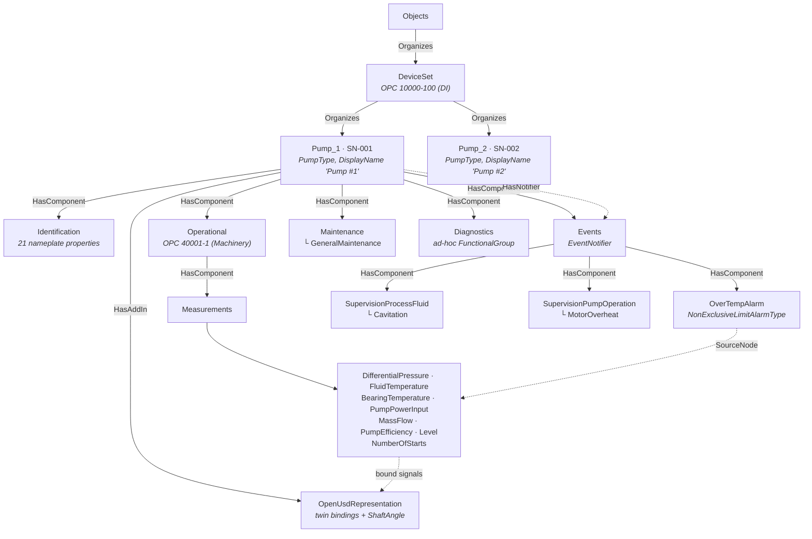
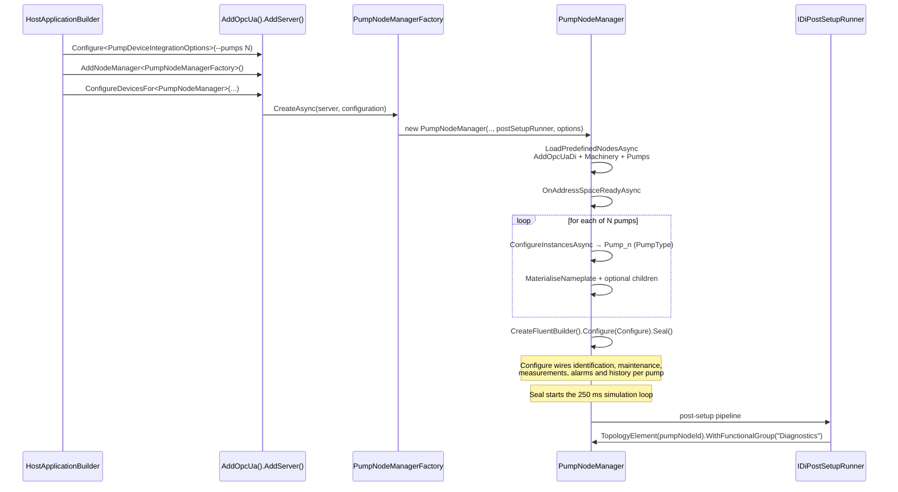
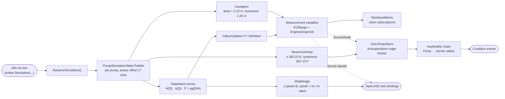

# PumpDeviceIntegrationServer

The pump measurements use the fluent historian with automatic capture enabled.
The first measurement configures the shared capture sink explicitly with an
8,192-sample bounded queue, 128-value target batches, a 50 ms batch window, and
`DropOldest` overload behavior. Subsequent historized pump variables reuse the
same per-node-manager capture pipeline.

A self-contained, NativeAOT-friendly OPC UA server that demonstrates
the [OPC 40223 Pumps companion specification](https://reference.opcfoundation.org/specs/OPC-40223)
with a full live simulation, wired through the fluent
`INodeManagerBuilder` API and the additive OPC 10000-100 topology-element
builder integration.

The pump sample is the integration test for every fluent API extension
shipped under `src/Opc.Ua.Server/Fluent/`. Each extension is
documented in
[Source-generated NodeManagers — Building richer node managers](../../../docs/NodeManagers.md#building-richer-node-managers--the-fluent-extension-surface).

The simulated asset is a *SimPump Corp PumpX-2000*. Its nameplate,
engineering ranges, alarm trip points and simulation profile are all
published in [`DATASHEET.md`](./DATASHEET.md) — an official-style product
datasheet that the server is aligned to and that
`tests/Opc.Ua.Di.Tests/PumpDatasheetConformanceTests.cs` asserts against,
so document and address space cannot drift apart.

## The simulated device

| | |
|---|---|
| Manufacturer / model | SimPump Corp PumpX-2000 |
| Type | Single-stage end-suction centrifugal process pump |
| Rated duty point | 25 m³/h (6.93 kg/s) at 25.5 m head (2.5 bar Δp) |
| Rated efficiency / shaft power | 72 % / 2.41 kW |
| Motor | 3.0 kW, 400 V 3~ 50 Hz, 2900 min⁻¹ |
| Units in the address space | SN-001 (`Pump_1`), SN-002 (`Pump_2`), … (`--pumps N`) |
| Bearing-temperature trip points | 363.15 K high, 373.15 K high-high |
| Full specification | [`DATASHEET.md`](./DATASHEET.md) |

Volumetric flow is the only independent variable in the simulation.
Head, differential pressure, mass flow, efficiency and shaft power all
follow from the datasheet characteristic curves
(`H(Q) = 32 − 0.0104·Q²`, `η(Q) = 72·(1 − 0.6·((Q−25)/25)²)`,
`P = ρ·g·Q·H/η`), so the published values are mutually consistent at
every tick rather than being independent sine waves.

## Running the sample

```pwsh
cd samples/DI/PumpDeviceIntegrationServer
dotnet run -c Release
```

The server listens on `opc.tcp://localhost:62542/PumpDeviceIntegrationServer`
by default. Override with `--host localhost`, `--port 62550`, and
`--pumps N` (or the matching `host`, `port`, and `pumps` environment
variables). `--pumps` defaults to `2` and accepts values from 1 to 100.

Sample console output:

```
info: Opc.Ua.Server.MasterNodeManager
      MasterNodeManager.Startup - NodeManagers=3
info: Opc.Ua.Di.Server.DiNodeManager
      Materialised OpenUSD facility (root ns=4;s=OpenUSD, PlantStage ns=1;s=OpenUSD_Stages_PlantStage).
info: Opc.Ua.Di.Server.DiNodeManager
      Materialised 'Pump_1' (PumpType) under DeviceSet, NodeId=ns=1;s=5001_Pump_1.
info: Opc.Ua.Di.Server.DiNodeManager
      Materialised 'Pump_2' (PumpType) under DeviceSet, NodeId=ns=1;s=5001_Pump_2.
info: Opc.Ua.Di.Server.DiNodeManager
      Materialised ProductionLine (aggregates 1..n pumps).
info: Pumps.PumpNodeManager
      Configuring PumpNodeManager fluent wiring...
info: Opc.Ua.Di.Server.DiNodeManager
      PumpNodeManager: address space ready (10997 predefined nodes).
info: Opc.Ua.Server.Hosting.OpcUaServerHostedService
      OPC UA server listening at opc.tcp://localhost:62542/PumpDeviceIntegrationServer.
```

Browse to `Objects > DeviceSet > Pump_1` in any OPC UA client (e.g.
UaExpert) to explore the first simulated pump. BrowseNames use
identifier-safe names (`Pump_1`, `Pump_2`, ...); DisplayNames keep the
operator-friendly labels (`Pump #1`, `Pump #2`, ...). Pass `--pumps N`
or set `pumps=N` to materialise more instances. Every pump is wired
through the same simulation, alarm, history, identification, maintenance,
and declarative DI `ConfigureDevicesFor` flow, so pumps added after
startup automatically join the same live simulation. All pumps are units
of the same PumpX-2000 product and differ only in serial number, asset
id, component name and installation bay. They publish monitored data
changes every 250 ms, with deterministic phase offsets so their values do
not move in lockstep.

The sample uses the bundled `InMemoryHistorianProvider`, whose default
raw-data retention window is one hour per historized variable. This keeps
the continuously running 250 ms simulation memory-bounded. Applications
that need another horizon can pass `InMemoryHistorianOptions` to
`UseInMemoryProvider`; setting `RawDataRetentionPeriod` to `TimeSpan.Zero`
restores unbounded process-lifetime retention.

Subscribe to the `EventNotifier` attribute on any pump to receive alarm
condition events when its simulated `MotorOverheat` state activates or
clears. Each pump is also registered as a root notifier, so the same events
are available from a subscription on the Server object.

## Address space



Only the subtree of `Pump_1` is drawn; every further pump (`Pump_2`, …,
up to `--pumps N`) carries an identical one. `Diagnostics` is the one
group that is not part of the model — it is added declaratively per pump
by the non-typed `WithFunctionalGroup(QualifiedName, ...)` overload from
`Program.cs`. `OpenUsdRepresentation` carries the twin bindings described
in [The OpenUSD twin](#the-openusd-twin) and is mounted as an AddIn through
the shared `CreateRepresentation` authoring helper.

## Startup and hosting flow



## Simulation and alarm dataflow



## Validating the address space

The
[`Pump Address Space Validation`](../../../.github/workflows/pump-address-space-validation.yml)
workflow runs nightly and can also be started manually. It builds this sample,
installs the latest stable
[`OpcUaAddressSpaceChecker`](https://www.nuget.org/packages/OpcUaAddressSpaceChecker)
global tool, and validates all `PumpType` instances.

To reproduce the validation locally, start the server and run the following
commands in another terminal:

```pwsh
dotnet tool install --global OpcUaAddressSpaceChecker
opcua-check-address-space `
    --endpoint opc.tcp://localhost:62542/PumpDeviceIntegrationServer `
    --type "nsu=http://opcfoundation.org/UA/Pumps/;i=1052" `
    --severity-threshold warning `
    --view-completeness complete `
    --require-complete-view
```

The nightly check keeps the tool's default `auto` validation-view policy and
fails on confirmed errors or any checker execution failure.

## The OpenUSD twin

The server also publishes an OpenUSD representation of the pump line
(the draft OPC UA — OpenUSD Bindings companion model, see
[`docs/OpenUsd.md`](../../../docs/OpenUsd.md)) and serves its USD layers as
embedded assets, so a connector can render the twin with no external
asset resolver.

**Every configured pump is a twin in its own right.** The DeviceSet
carries a plant-level representation anchored on `/Plant` whose single
`Many` component binding is scoped to `PumpType`, so a connector composes
one `@pump.usda@</Pump>` reference prim per pump — `/Plant/Pumps/Pump_1`,
`/Plant/Pumps/Pump_2`, … — and each pump's own bindings drive only its own
prim. Start the server with `--pumps 6` and six fully modelled machines
appear, each turning at its own speed, each with its own gauges, fluid
level and alarm halos. Each pump publishes its bay as a
`ThreeDCartesianCoordinates` value bound to `xformOp:translate`, which is
what lays them out in a row without the stage having to author anything
per pump.

The composition arc is `Reference`, not `Instance`: an instanceable prim
turns its descendants into a shared prototype, and a shared prototype
cannot carry the per-pump impeller rotation, casing colour or needle
positions that make each machine read as its own.

`Assets/Plant.usda` models the pump as a real machine: a horizontal
long-coupled end-suction centrifugal pump built to **EN 733** (formerly
DIN 24255), size **65-200**, following the published dimensions of the
Grundfos NK 65-200 / KSB Etanorm 65-200 family and driven by an
**IEC 160M** motor on a fabricated baseplate.

| Item | Value |
| --- | --- |
| Baseplate | 1.80 × 0.46 × 0.12 m |
| Shaft centreline above baseplate | 0.160 m (the IEC 160M frame number *is* the shaft height) |
| Volute casing | 0.355 m outer diameter × 0.110 m wide |
| Suction flange | DN80 axial, OD 0.200 m (EN 1092-2 PN16) |
| Discharge flange | DN65 vertical, OD 0.185 m (EN 1092-2 PN16) |
| Impeller | 0.198 m, six backward-curved vanes |
| Motor frame | 0.254 m outer diameter × 0.615 m long |
| Bay pitch | 2.4 m |

Livery is KSB signal blue (RAL 5005) for the wetted castings and
RAL 7035 light grey for the motor. `pump.usda` is that machine as a
self-contained component asset, referenced once per configured pump. It is
generated from the `/Plant/Pumps/P101` master by
`Assets/generate_pump_assets.py` — edit the master and re-run the
generator, never the generated layer. The master itself is authored
`active = false`, because the composed pumps are what render.

Two departures from a real pump are deliberate, so the twin can be
*seen*: the suction pipe is drawn as a stub leaving the casing eye open
(a cutaway, as trade-show display pumps are presented) and the coupling
guard is a cage rather than a solid barrel. Both let you watch the shaft
turn.

### The hall

The rendered hall holds **exactly the pumps the connected server simulates** —
one referenced `pump.usda` prim per configured pump, one bay every 2.4 m along
+Y, each with its suction vessel behind it. Nothing else is drawn: the
`ProductionLine` aggregation and the cross-server component are address-space
topology, not machines anyone is driving, so composing them put pumps in the
twin that no client could account for, and a pump federated from *another*
server is not this server's to show at all.

`HeroCamera` is an operator's viewpoint: eye height 1.65 m in the aisle on the
discharge side, pitched 7° below horizontal, framing every configured pump at a
three-quarter angle with the vessels behind them. The framing holds from one
pump up to eight, so it does not have to be retuned for `--pumps N`. Pass
`--camera /Plant/HeroCamera` to start on it.

An error draws a **red circle on the floor around the machine**. A ring reads
from anywhere in the hall and from any camera angle; a lamp on a mast only reads
when you happen to be looking straight at it. The ring says *that* a pump is in
alarm; the two fault halos — at the suction eye for cavitation, on the bearing
bracket for motor overheat — say *why*. All three are authored `invisible` and
only a live supervision binding reveals them, so a machine nothing is bound to
never shows an alarm it did not raise.

### Live bindings

All paths are relative to the pump's own prim, so every pump drives its
own copy of every target.

| Source | USD target | Effect |
| --- | --- | --- |
| `BayPosition` | `xformOp:translate` | places the pump in its bay |
| `ShaftAngle` | `…/Impeller.xformOp:rotateZ` | turns the shaft, impeller and coupling |
| `ShaftAngle` | `…/Motor/FanBlades.xformOp:rotateZ` | motor cooling fan |
| `BearingTemperature` | `…/Body.primvars:displayColor` | casing colour, blue (cool) → red (hot) |
| `BearingTemperature` | `…/PowerEnd/TempGauge/Needle.xformOp:rotateZ` | bearing-temperature gauge |
| `DifferentialPressure` | `…/Discharge/Gauge/Needle.xformOp:rotateZ` | discharge pressure gauge |
| `FluidSurfacePosition` | `…/SuctionVessel/Surface.xformOp:translate` | liquid surface rides on the published `Level` |
| `FluidTemperature` | `…/Suction/Neck/Mat/Surface.inputs:diffuseColor` | suction line tint |
| `MassFlow`, `PumpEfficiency`, `NumberOfStarts` | `…/Motor/Nameplate.inputs:*` | readouts a viewer shows on selection |
| any supervision alarm | `…/AlarmRing.visibility` | red circle on the floor around the machine |
| `Cavitation` | `…/Suction/CavitationHalo.visibility` | cavitation, at the suction eye where the fault is |
| `MotorOverheat` | `…/OverheatHalo.visibility` | overheat, on the bearing bracket |
| `SpeedSetpoint` | `…/Impeller.inputs:speedSetpoint` | opt-in `UsdToUaCommand`, fail-closed |

`MassFlow` is a *rate*, so binding it straight to a rotation op pins the
shaft at a fraction of a degree and the pump looks dead. The simulation
integrates the running speed into a `ShaftAngle` instead, and the binding
scales it down to a legible ~45°/s — a real 2900 rpm shaft would alias
into a stroboscopic blur at any practical sampling rate. Speed follows
flow, so the impeller visibly slows and picks up with the duty point, and
the phase offset the simulation gives each pump means no two shafts are
ever at the same angle.

The `OverTempAlarm` condition itself is deliberately not bound. The
fluent alarm builder leaves the condition's state children on their
standard namespace-0 declaration NodeIds — which
`PumpInstanceNodeIdRegressionTests` pins — so every pump's alarm shares
one `ActiveState`, `Severity` and `AckedState` node, and binding those
would ring every pump in the hall at once. The per-pump supervision
states are the alarm indication instead: they are genuinely per instance,
and they are what drives the condition through `ActivatesAlarm` in the
first place.

A real pump shaft is horizontal, but the binding contract fixes the
driven operation as `xformOp:rotateZ`. `Impeller` therefore carries a
static `xformOp:rotateY = 90` *ahead of* `xformOp:rotateZ` in
`xformOpOrder`, which lays its local Z along the world shaft axis. The
impeller and the coupling both hang off that one rotating prim, so they
turn together — as they do on the real machine. The gauge needles use the
same trick with `xformOp:rotateX = 90`, because their dials face the
plant Y axis.

Which op a bound prim has to declare depends on the render target, and
getting it wrong fails silently. A connector accumulates `Translation`,
`Rotation` and `Scale` into a *single* `xformOp:transform` matrix, so
that it never has to rewrite `xformOpOrder` — the list is `uniform`, and
an opinion in the asset layer cannot be cleared from the stronger layer a
connector edits. Every other `xformOp:` property, such as the scalar
`xformOp:rotateZ` above, is authored under its own name. USD evaluates
only the ops named in `xformOpOrder`, so a prim bound to a `Translation`
target must declare `xformOp:transform` — the pump root and the suction
vessel's fluid surface both do. Naming `xformOp:translate` there instead
makes USD discard every value written to it: the pumps keep reporting
their bay positions over OPC UA, and every one of them renders on the
origin, so the hall looks like it holds a single machine.
`TransformBindingsTargetDeclaredXformOpsAsync` checks each transform
binding against the op the served asset actually declares.

Because the render targets expect degrees Celsius and bar while OPC
40223 publishes Kelvin and Pascal, the colour bindings declare the
conversion themselves (`offset: -273.15` and `scale: 1e-5`); §5.8
applies `Scale` then `Offset`. The gauge scales are derived from the
`PumpDatasheet` engineering ranges, so a datasheet change moves the
needles with it. `PumpEfficiency` is a readout rather than a colour: the
`DisplayColor` ramp models a temperature, and colouring efficiency with
it would read as a lie.

### Viewing it

Run the server, then point the connector at it with `--view`:

```pwsh
Opc.Ua.OpenUsd.Connector --server opc.tcp://localhost:62542/PumpDeviceIntegrationServer `
                         --insecure --view --fetch-assets .\stage-cache
```

The connector fetches the server-delivered layers, composes a
self-contained stage and streams the live OPC UA values into
`live.usda` and the viewport. See
[`tools/Opc.Ua.OpenUsd.Connector`](../../../tools/Opc.Ua.OpenUsd.Connector).

## Running in Docker

A [`Dockerfile`](./Dockerfile) is provided that builds the Release
publish output on the .NET **AzureLinux 3** base images and runs it as a
non-root user.

> **Build from the repository root**, not from this folder. The image
> needs the full source tree (`src/`, `samples/`, `tools/`), so the
> Docker build context must be the repo root and the Dockerfile is
> selected with `-f`. Running `docker build .` from inside this folder
> fails fast with a message telling you the correct command.

```pwsh
# from the repository root:
docker build -f samples/DI/PumpDeviceIntegrationServer/Dockerfile `
             -t pumpdeviceintegrationserver:local .
```

Run it, publishing the OPC UA port:

```pwsh
docker run --rm -p 62542:62542 pumpdeviceintegrationserver:local
```

Inside the container the endpoint binds to `0.0.0.0` so it is reachable
from the host. Override the bind host and port via environment variables:

```pwsh
docker run --rm -p 62550:62550 `
           -e host=0.0.0.0 -e port=62550 -e pumps=4 `
           pumpdeviceintegrationserver:local
```

The server creates its certificate/PKI store under `/app` at runtime.
To persist certificates across container restarts, mount a volume:

```pwsh
docker run --rm -p 62542:62542 `
           -v pump-pki:/app/pki `
           pumpdeviceintegrationserver:local
```

The image is built and published to the GitHub Container Registry by the
[`pump-device-integration-server-docker.yml`](../../../.github/workflows/pump-device-integration-server-docker.yml)
workflow on every push to `master` and on manual dispatch.

## What the sample demonstrates

| Feature | Where |
|---------|-------|
| `AddOpcUa().AddServer(...).AddNodeManager<T>()` hosting | `Program.cs` |
| Multi-model composition (DI library + locally source-generated Machinery + Pumps) | `PumpNodeManager.cs` `LoadPredefinedNodesAsync` |
| Optional nameplate materialisation via generator-emitted `AddXxx(context)` helpers across three namespaces (DI / Machinery / Pumps) | `PumpNodeManager.cs` `MaterialiseNameplate` |
| Identification properties via `WithProperty(name, value)` | `PumpNodeManager.Configure.cs` `WithIdentification` |
| Optional-child materialisation via generator-emitted `AddXxx(context)` helpers (Operational / Measurements / Events / SupervisionProcessFluid / SupervisionPumpOperation / Maintenance) | `PumpNodeManager.cs` `MaterialisePumpOptionalChildren` |
| Engineering units / EURange via `WithEngineeringUnits` / `WithEURange` | `CreatePumpSimulation` |
| Push-style monitored value updates via `Bind(out IValueUpdater<T>)` | `CreatePumpSimulation` |
| Discrete `NumberOfStarts` counter published on change | `CreatePumpSimulation` |
| One 250 ms simulation tick for all phase-shifted pumps | `Configure` → `AdvanceSimulation` |
| Datasheet-driven simulation (one independent variable, derived values) | `PumpDatasheet.cs` + `PumpSimulationState.Publish` |
| Browsable/subscribable limit alarm with thresholds and acknowledge handler via `CreateLimitAlarm(...).WithLimits(...).MonitorVariable(...)` | `CreatePumpSimulation` |
| Boolean supervision (TwoStateDiscreteState) → alarm activation, condition raise/clear, and reported events via `.ActivatesAlarm(...)` | `CreatePumpSimulation` |
| `EventNotifier`, `HasNotifier`, and `HasEventSource` instance wiring | `PumpNodeManager.cs` + fluent alarm builders |
| Cross-namespace path resolution (Pump_1 in Pumps NS → Operational in Machinery NS → Measurements in Pumps NS, all in one unqualified browse path) | `src/Opc.Ua.Server/Fluent/BrowsePathResolver.cs` |
| Declarative `ConfigureDevicesFor` topology-element configuration adding an application-namespace Diagnostics functional group to every generated `PumpType` instance | `Program.cs` |
| In-memory historian wiring so NodeSet-declared historical access is genuinely serviceable for all analog measurements and historized supervision booleans | `PumpNodeManager.Configure.cs` `UseHistorian()` / `Historize()` |
| One OpenUSD twin per configured pump: per-pump prim, signals and bindings, composed from one component asset by a `Many` component binding | `OpenUsdRepresentation.cs` + `OpenUsdComposition.cs` |

## Architecture

```
PumpDeviceIntegrationServer/
├── Program.cs                          # AddOpcUa().AddServer(...).AddNodeManager<T>()
│                                       # + ConfigureDevicesFor diagnostics for every pump
├── PumpNodeManager.cs                  # Hand-written FluentNodeManagerBase
│                                       # + LoadPredefinedNodesAsync (multi-model)
│                                       # + CreateAddressSpaceAsync (builder setup)
├── PumpNodeManager.Configure.cs        # partial — fluent wiring + simulation tick
├── OpenUsdRepresentation.cs            # partial — one twin per pump: prim path,
│                                       # signal Variables and live bindings
├── OpenUsdComposition.cs               # partial — plant aggregation (one prim per
│                                       # configured pump) + ProductionLine demo
├── PumpDatasheet.cs                    # DATASHEET.md as compile-time constants
├── DATASHEET.md                        # official-style PumpX-2000 product datasheet
├── PumpDeviceIntegrationServer.csproj  # ProjectReference to Opc.Ua.Di model lib
│                                       # AdditionalFiles for Machinery + Pumps
│                                       # NodeSet2 (consumed by source generator)
├── Assets/
│   ├── Plant.usda                      # stage master (P101 is the authoring
│   │                                   # master, deactivated so only the
│   │                                   # composed pumps render)
│   ├── pump.usda                       # generated component asset, one per pump
│   └── generate_pump_assets.py         # regenerates it from the P101 master
├── Model/
│   ├── Opc.Ua.Machinery.NodeSet2.xml   # AdditionalFiles — build-time only
│   └── Opc.Ua.Pumps.NodeSet2.xml       # AdditionalFiles — build-time only
└── Properties/AssemblyInfo.cs
```

The `Opc.Ua.Di` model library is consumed as a project reference (its
types live under the `Opc.Ua.Di` namespace and are source-generated
from the ModelDesign XML). Cross-namespace references from Machinery
and Pumps to DI types resolve through the
`[assembly: ModelDependencyAttribute]` carried in the `Opc.Ua.Di`
assembly — no DI NodeSet2 XML needed in this project. The unified
attribute carries the compact type-table payload that the consumer's
source generator imports at compile time; see
[ModelDependencies.md](../../../docs/ModelDependencies.md) for the wire
format and consumer-side flow.

The Machinery and Pumps NodeSet2 XMLs are **source-generated locally
inside this assembly** via the `<AdditionalFiles>` plumbing in the
`.csproj`. The generator emits typed `*State` classes, NodeId tables,
and the `AddOpcUaMachinery` / `AddOpcUaPumps` extension methods that
`LoadPredefinedNodesAsync` calls. No runtime XML loading happens — the
`Model/` folder is a build-time input only. Consumer assemblies that
want to reference Machinery or Pumps the same way they reference
`Opc.Ua.Di` should source-generate against the model XML inside their
own assembly using the same `<AdditionalFiles>` pattern.

The sample intentionally does not add `GeneratesEvent` to pump instances.
OPC 10000-3 restricts that reference to ObjectType, VariableType, and Method
declarations; runtime delivery is provided by the notifier/event-source
hierarchy and `ReportEvent`.

## Extending the sample

> When you change a published value, update
> [`DATASHEET.md`](./DATASHEET.md) and the constants in `PumpDatasheet.cs`
> together — `PumpDatasheetConformanceTests` fails the build otherwise.

- **Add a measurement**: open `PumpNodeManager.Configure.cs`, add a
  bound updater in `CreatePumpSimulation`, store it in
  `PumpSimulationState`, and publish its value from `Publish`. Add its
  engineering range to `PumpDatasheet.Ranges` and to section 4 of the
  datasheet.
- **Add an alarm**: create it from the typed `Events` builder in
  `CreatePumpSimulation` and wire the triggering boolean variable via
  `.ActivatesAlarm(...)`. Document its trip points in section 7 of the
  datasheet.
- **Add a nameplate field**: materialise it with the generator-emitted
  `AddXxx(context)` helper in `PumpNodeManager.MaterialiseNameplate`,
  assign its value in `WithIdentification`, and add the row to section 2
  of the datasheet.
- **Add pumps**: pass `--pumps N` (or set `pumps=N`) to materialise N
  identical simulated `PumpType` instances. `PumpNodeManager` demonstrates
  the hand-written fluent style by creating every pump, wiring
  Identification, Measurements, Supervision, Maintenance, engineering
  units, alarms, history, and the simulation callbacks. `Program.cs` keeps
  the declarative DI style by wrapping each generated pump with
  `ctx.TopologyElement<PumpState>(...)` and adding the ad-hoc Diagnostics
  functional group through `ConfigureDevicesFor<PumpNodeManager>`.
  `CreatePumpAsync` registers each new instance with the shared simulation,
  so pumps created after startup join the same live tick.

## NativeAOT publishing

```pwsh
cd samples/DI/PumpDeviceIntegrationServer
dotnet publish -c Release -r win-x64
```

The pump server publishes cleanly under NativeAOT — no trim or AOT
warnings — because every fluent extension is reflection-free and the
generated model factories are statically rooted.

## See also

- [`DATASHEET.md`](./DATASHEET.md) — the official-style PumpX-2000
  product datasheet the simulation implements.
- [`docs/DeviceIntegration.md`](../../../docs/DeviceIntegration.md) —
  full developer guide for the DI library trio (device builder,
  hosting integration, lock service, software-update package store,
  client helpers).
