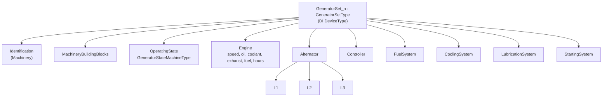

# GeneratorDeviceIntegrationServer

A self-contained OPC UA server implementing the **Generators companion
specification** (`http://opcfoundation.org/UA/Generators/`) end to end: N
simulated generating sets, a datasheet-driven simulation, DI and Machinery
integration, and a per-set OpenUSD twin.

It is the sibling of [`PumpDeviceIntegrationServer`](../PumpDeviceIntegrationServer),
and the two are composed into one scene by
[`SiteCompositionServer`](../SiteCompositionServer).

```
dotnet run --project samples/GeneratorDeviceIntegrationServer -- \
    --host localhost --port 62543 --generators 4
```

| Argument | Default | Meaning |
|---|---|---|
| `--generators N` | 2 | How many sets to simulate (1…100) |
| `--port` | 62543 | Endpoint port |
| `--host` | `0.0.0.0` | Bind host |

## The machine

A fictitious **SimGen Systems GenX-500** — 400 kW prime / 440 kW standby, 400/230 V,
50 Hz, four-pole, on a 12.5 L turbocharged inline-six. Full parameters, curves and
trip points are in [`DATASHEET.md`](DATASHEET.md), and every one of them is a
constant in [`GeneratorDatasheet.cs`](GeneratorDatasheet.cs), so the document, the
address space and the simulation cannot drift apart.

## The model



`GeneratorSetType` derives from the DI `DeviceType`, so — unlike the pump sample,
whose `PumpType` derives from the Machinery `MachineType` — sets are created
through `CreateDeviceAsync<TDevice>` and get DI registration and topology wiring
for free.

Most telemetry in the specification is **optional**, so the type fits both a bare
air-cooled residential set and a fully instrumented industrial one. This sample
models the instrumented case and opts in explicitly, including the `L2` and `L3`
phases (optional because single-phase sets populate only `L1`).

## The simulation

Load fraction is the **only** independent variable. Everything else follows from
the curves in the datasheet, so the published values reconcile by construction
rather than by coincidence:

```
V̇_f(x) = 3.67 + 100·x                 [L/h]
η(x)   = P(x) / (V̇_f(x) · ρ · LHV)
S      = P / PF        I = S / (√3 · V_LL)        f = N · p / 120
```

Verified live against a running server at 87.17 % load:

| Published | Value | Check |
|---|---|---|
| Real power | 348.69 kW | `0.8717 × 400 kW` |
| Voltage / current / PF | 400 V / 629.11 A / 0.8 | `√3·V·I·PF = 348.69 kW` |
| Fuel rate | 90.84 L/h | `3.67 + 100×0.8717` |
| Efficiency | 38.9 % | `P / (V̇·ρ·LHV)` |
| Frequency | 49.97 Hz | `1498.95 min⁻¹ × 4 / 120`, with governor droop |

Each set carries its own state and a phase-shifted duty point, so no two sets in a
plant report the same numbers — a four-set run showed 81.9 / 66.3 / 55.1 / 56.6 %.

## The OpenUSD twin

Each set owns a `GeneratorTwin` with its own prim path, signal Variables and
bindings, so `--generators N` renders N machines that move independently. Sets lay
out along +Y at 6 m pitch.

Fifteen live bindings drive the bay position, radiator fan, load and coolant gauge
needles, exhaust and radiator colour, fuel-tank surface, a red alarm ring, overheat
and low-oil halos at the subsystem each fault belongs to, a run lamp, and
frequency / power / engine-hours / load readouts.

### The authoring rule that matters

A prim a connector positions **must** declare `xformOp:transform` in its
`xformOpOrder`. A connector folds Translation, Rotation and Scale into a single
matrix op, and `xformOpOrder` is `uniform` — it cannot be rewritten from the
stronger layer the connector edits. Naming `xformOp:translate` there instead makes
USD discard every value **in silence**, and every set renders on the origin.

Indicator geometry defaults to `invisible`, the plant aggregation composes with
`Reference` (not `Instance`, which would make descendants a shared prototype that
cannot carry per-set colour or rotation), and it is not declared `dynamic` because
the set of machines is fixed at start-up.

The geometry is generated — edit
[`Assets/generate_generator_assets.py`](Assets/generate_generator_assets.py) and
re-run it; never hand-edit `generator.usda` or `Powerhouse.usda`.

## The model files

`Model/` vendors the Generators nodeset plus a reduced Machinery nodeset. The
reduction is not cosmetic: the full official Machinery nodeset does not survive the
model source generator, and it drags in the IA namespace through a single optional
`Stacklight` member that a generator set does not have.
[`prepare_machinery_nodeset.py`](Model/prepare_machinery_nodeset.py) derives the
reduced set from the official one by whitelist, so the provenance stays checkable
and the whitelist is the only thing to edit when more types are needed.

## Rendering it

```
dotnet run --project tools/Opc.Ua.OpenUsd.Connector -- \
    --server opc.tcp://localhost:62543/GeneratorDeviceIntegrationServer \
    --insecure --view
```

## See also

- [`DATASHEET.md`](DATASHEET.md) — the product datasheet the server is aligned to
- [OpenUSD bindings](../../docs/OpenUsd.md)
- [Device integration](../../docs/DeviceIntegration.md)
- [`SiteCompositionServer`](../SiteCompositionServer) — composes this server with the pump server
