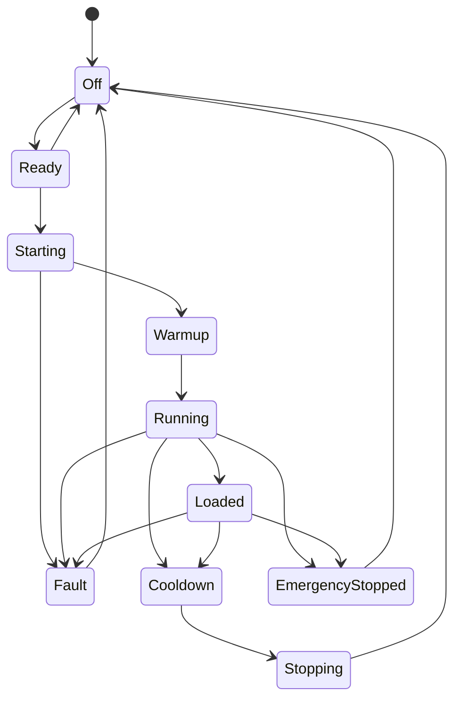
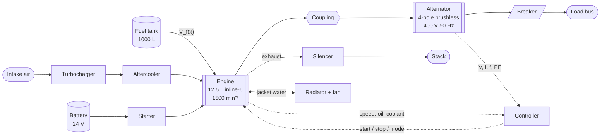

# GenX-500 Diesel Generating Set — Technical Data

**SimGen Systems** · 400 kW Prime / 440 kW Standby · 50 Hz · 400/230 V

> **This is a simulated device.** *SimGen Systems* and the *GenX-500* do not
> exist. The data below are ordinary engineering parameters for a mid-size
> industrial diesel generating set, chosen so that the simulation in
> `GeneratorServer` is physically self-consistent. They describe
> no real product.
>
> Every value here is also a constant in
> [`GeneratorDatasheet.cs`](GeneratorDatasheet.cs), which the server uses to build
> the address space and drive the simulation.
> `GeneratorDatasheetConformanceTests` fails the build if this document and the
> code ever disagree.

---

## 1 Product description

The GenX-500 is a skid-mounted, radiator-cooled diesel generating set for prime
and standby duty. A turbocharged and aftercooled inline-six drives a four-pole
brushless alternator through a flexible coupling; both are mounted on a welded
steel base frame with anti-vibration mounts and an integral fuel tank.

A single control panel provides start/stop, mode selection, metering, protection
and an OPC UA interface conforming to the
[Generators companion specification](https://opcfoundation.org/UA/Generators/).

---

## 2 Nameplate

| Field | Value | OPC UA browse path |
|---|---|---|
| Manufacturer | SimGen Systems | `2:Identification/2:Manufacturer` |
| Model | GenX-500 | `2:Identification/2:Model` |
| Product code | GX500-400-50-4W | `2:Identification/2:ProductCode` |
| Serial number | `SG-500-<nnn>` | `2:Identification/2:SerialNumber` |
| Device class | GeneratingSet | `2:Identification/3:DeviceClass` |
| Hardware revision | 3.1 | `2:Identification/2:HardwareRevision` |
| Software revision | 5.4.2 | `2:Identification/2:SoftwareRevision` |
| Device revision | 3.1/5.4.2 | `2:Identification/2:DeviceRevision` |
| Manufacturer URI | `https://simgen.example.com` | `2:Identification/2:ManufacturerUri` |
| Year of construction | 2025 | `2:Identification/3:YearOfConstruction` |
| Month of construction | 4 | `2:Identification/3:MonthOfConstruction` |

Namespace prefixes: `2:` = `http://opcfoundation.org/UA/DI/`,
`3:` = `http://opcfoundation.org/UA/Machinery/`,
`4:` = `http://opcfoundation.org/UA/Generators/`.

---

## 3 Ratings (ISO 8528)

| Duty | Real power | Apparent power | Application |
|---|---|---|---|
| **PRP** — Prime | **400 kW** | **500 kVA** | Unlimited hours, variable load |
| **ESP** — Standby | **440 kW** | **550 kVA** | Emergency use, varying load |

| Parameter | Value |
|---|---|
| Rated power factor | 0.8 lagging |
| Rated line-to-line voltage | 400 V |
| Rated line-to-neutral voltage | 230 V |
| Rated line current at PRP | 721.7 A |
| Frequency | 50 Hz |
| Phases / wires | 3 / 4 |
| Reference ambient | 25 °C |
| Reference altitude | 150 m |

Rated current is not tabulated independently — it is
`I = S / (√3 · V_LL)`, so it cannot drift away from the rating it derives from.

---

## 4 Engine

| Parameter | Value |
|---|---|
| Configuration | Inline 6-cylinder, 4-stroke |
| Aspiration | Turbocharged, air-to-air aftercooled |
| Displacement | 12.5 L |
| Bore × stroke | 130 × 157 mm |
| Compression ratio | 16.5 : 1 |
| Rated speed | 1500 min⁻¹ |
| Governor | Electronic, isochronous |
| Oil pressure at rated speed | 4.8 bar |
| Thermostat opening | 82 °C |
| Cooling | Radiator, engine-driven fan |

Rated speed follows from the pole count and output frequency:
`N = 120 · f / p = 120 · 50 / 4 = 1500 min⁻¹`.

---

## 5 Alternator

| Parameter | Value |
|---|---|
| Type | Brushless, self-excited, 4-pole |
| Connection | Star (wye), 4-wire |
| Insulation class | H |
| Voltage regulation | ±0.5 % steady state |
| Phases | L1, L2, L3 individually metered |

---

## 6 Fuel system

| Parameter | Value |
|---|---|
| Fuel | Diesel |
| Base tank capacity | 1000 L |
| Reference fuel density | 0.832 kg/L |
| Reference lower heating value | 42.7 MJ/kg |
| Usable energy per litre | 9.868 kWh/L |

---

## 7 Physical

| Parameter | Value |
|---|---|
| Length × width × height | 4.00 × 1.50 × 2.20 m |
| Dry mass | 4500 kg |
| Sound pressure at 1 m (enclosed) | 75 dB(A) |

---

## 8 Characteristic curves

Load fraction `x` — electrical output as a fraction of prime power — is the
**only independent variable**. Everything else follows from these curves, which
is what keeps the published values mutually consistent at every tick.

### 8.1 Fuel consumption

The classic affine generating-set fuel map:

```
V̇_f(x) = 3.67 + 100.00 · x        [L/h]
```

### 8.2 Electrical efficiency

```
η(x) = P(x) / (V̇_f(x) · ρ · LHV)
```

with `ρ · LHV = 9.868 kWh/L`. Efficiency is therefore never an independent
number: it always reconciles with the published power and fuel rate.

### 8.3 Thermal

```
T_coolant(x) = 82 + 13 · x        [°C]
T_exhaust(x) = 250 + 300 · x      [°C]
```

### 8.4 Electrical

```
S = P / PF                        [VA]
I = S / (√3 · V_LL)               [A]
f = N · p / 120                   [Hz]
```

---

## 9 Performance table

Derived from the curves in §8 — this table is generated by them, not
independently asserted.

| Load | Real power | Fuel rate | Efficiency | Coolant | Exhaust |
|---:|---:|---:|---:|---:|---:|
| 10 % | 40 kW | 13.7 L/h | 29.65 % | 83.3 °C | 280 °C |
| 25 % | 100 kW | 28.7 L/h | 35.34 % | 85.2 °C | 325 °C |
| 50 % | 200 kW | 53.7 L/h | 37.76 % | 88.5 °C | 400 °C |
| 75 % | 300 kW | 78.7 L/h | 38.64 % | 91.8 °C | 475 °C |
| 100 % | 400 kW | 103.7 L/h | 39.10 % | 95.0 °C | 550 °C |
| 110 % | 440 kW | 113.7 L/h | 39.22 % | 96.3 °C | 580 °C |

At 1000 L usable capacity and full prime load the set runs for approximately
**9.6 hours** on a full tank.

---

## 10 Instrumentation

| Measurement | Unit published | Engineering range | Browse path |
|---|---|---|---|
| Engine speed | min⁻¹ | 0 … 2000 | `4:Engine/4:Speed` |
| Oil pressure | Pa | 0 … 8 bar | `4:Engine/4:OilPressure` |
| Coolant temperature | K | 0 … 120 °C | `4:Engine/4:CoolantTemperature` |
| Exhaust temperature | K | 0 … 700 °C | `4:Engine/4:ExhaustTemperature` |
| Fuel rate | m³/s | 0 … 120 L/h | `4:Engine/4:FuelRate` |
| Engine hours | h | — | `4:Engine/4:EngineHours` |
| Frequency | Hz | 45 … 55 | `4:Alternator/4:Frequency` |
| Total real power | W | 0 … 550 kW | `4:Alternator/4:TotalRealPower` |
| Average voltage | V | 0 … 480 | `4:Alternator/4:AverageLineVoltage` |
| Average current | A | 0 … 800 | `4:Alternator/4:AverageCurrent` |
| Power factor | — | 0 … 1 | `4:Alternator/4:AveragePowerFactor` |
| Load percent | % | 0 … 120 | `4:Alternator/4:LoadPercent` |
| Per-phase V/I/P/PF | V/A/W/— | as above | `4:Alternator/4:L1 … 4:L3` |
| Fuel level | % | 0 … 100 | `4:FuelSystem/4:FuelLevel` |
| Battery voltage | V | 0 … 32 | `4:StartingSystem/4:BatteryVoltage` |

OPC UA publishes SI throughout: temperatures in kelvin, pressures in pascal,
volumetric rates in cubic metres per second. The datasheet's own engineering
units are converted on the way out.

---

## 11 Protection trip points

| Protection | Trip | Effect |
|---|---|---|
| Low oil pressure | < 1.7 bar | Shutdown |
| High coolant temperature | > 98 °C | Shutdown |
| Overspeed | > 1725 min⁻¹ (115 %) | Shutdown |
| Overload | > 110 % of PRP | Alarm |
| Low fuel level | < 15 % | Warning |
| Low battery voltage | < 22 V | Warning |

Protection events are reported as `4:GeneratorProtectionAlarmType`, a subtype of
`OffNormalAlarmType`, carrying the `ProtectionFunction`, severity, whether the
event is a shutdown, and the originating subsystem.

---

## 12 Operating states

`OperatingState` is a `4:GeneratorStateMachineType` with twelve states:



`OperatingMode` reflects the panel selector: `Off`, `Manual`, `Auto`, `Test`,
`Exercise`, `RemoteStart`, `Maintenance`, `Lockout`.

---

## 13 Process schematic



---

## 14 Simulation profile

The server does not replay a recording. It integrates the model above:

1. Load fraction is driven around a nominal 72 % with an 18 % swing, phase
   shifted per set so no two sets in a plant report the same duty point.
2. Real power, apparent power, per-phase voltage and current, frequency, fuel
   rate, efficiency, coolant and exhaust temperature all follow from that single
   value through §8.
3. Engine hours, total real energy and fuel consumed are integrated over time.
4. Protection states are evaluated against §11 with hysteresis, so an alarm
   latches and clears cleanly rather than chattering on the threshold.
5. The operating state machine advances through §12, staged per set so that a
   plant shows sets in different states simultaneously.

Because power and fuel rate are both functions of the same load fraction,
`η = P / (V̇_f · ρ · LHV)` and `P = √3 · V · I · PF` hold at **every** published
sample — which is exactly what the conformance tests assert.
