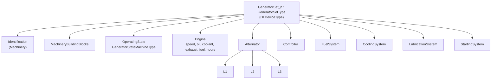

# GeneratorServer

A self-contained OPC UA server implementing the **Generators companion
specification** (`http://opcfoundation.org/UA/Generators/`) end to end: N
simulated generating sets, a datasheet-driven simulation, DI and Machinery
integration, and a per-set OpenUSD twin.

It is the sibling of [`PumpDeviceIntegrationServer`](../../PumpDeviceIntegrationServer),
and the two are composed into one scene by
[`SiteCompositionServer`](../../SiteCompositionServer).

```
dotnet run --project samples/OpenUsd/GeneratorServer -- \
    --host localhost --port 62543 --generators 4
```

| Argument | Default | Meaning |
|---|---|---|
| `--generators N` | 2 | How many sets to simulate (1…100) |
| `--faults` | `true` | Let the first set develop faults on a slow rotation |
| `--port` | 62543 | Endpoint port |
| `--host` | `0.0.0.0` | Bind host |

## The machine

A fictitious **SimGen Systems GenX-500** — 400 kW prime / 440 kW standby, 400/230 V,
50 Hz, four-pole, on a 12.5 L turbocharged inline-six. Full parameters, curves and
trip points are in [`DATASHEET.md`](DATASHEET.md), and every one of them is a
constant in [`GeneratorDatasheet.cs`](GeneratorDatasheet.cs), so the document, the
address space and the simulation cannot drift apart.

## The model



`GeneratorSetType` derives from the DI `DeviceType`, so — unlike the pump sample,
whose `PumpType` derives from the Machinery `MachineType` — sets are created
through `CreateDeviceAsync<TDevice>` and get DI registration and topology wiring
for free.

Most telemetry in the specification is **optional**, so the type fits both a bare
air-cooled residential set and a fully instrumented industrial one. This sample
models the instrumented case and opts in explicitly, including the `L2` and `L3`
phases (optional because single-phase sets populate only `L1`).

## The simulation

Load fraction is the **only** independent variable. Everything else follows from
the curves in the datasheet, so the published values reconcile by construction
rather than by coincidence:

```
V̇_f(x) = 3.67 + 100·x                 [L/h]
η(x)   = P(x) / (V̇_f(x) · ρ · LHV)
S      = P / PF        I = S / (√3 · V_LL)        f = N · p / 120
```

Verified live against a running server at 87.17 % load:

| Published | Value | Check |
|---|---|---|
| Real power | 348.69 kW | `0.8717 × 400 kW` |
| Voltage / current / PF | 400 V / 629.11 A / 0.8 | `√3·V·I·PF = 348.69 kW` |
| Fuel rate | 90.84 L/h | `3.67 + 100×0.8717` |
| Efficiency | 38.9 % | `P / (V̇·ρ·LHV)` |
| Frequency | 49.97 Hz | `1498.95 min⁻¹ × 4 / 120`, with governor droop |

Each set carries its own state and a phase-shifted duty point, so no two sets in a
plant report the same numbers — a four-set run showed 81.9 / 66.3 / 55.1 / 56.6 %.

## Control: state machine, protections, methods

The three surfaces the specification defines for controlling a set are all wired,
and all three are driven from **one** decider — the simulation's operating state.
A state machine driven independently of the physics eventually reports a machine as
running while the simulation says it is stopped, and nothing at run time notices.

### `OperatingState`

`GeneratorStateMachineType` is mandatory on the type, so it already exists; the
sample attaches behaviour to it in lifecycle mode rather than defining states:

```
Off ──▶ Ready ──▶ Starting ──▶ Warmup ──▶ Running ──┬──▶ Loaded ──▶ Cooldown ──▶ Stopping ──▶ Off
                     │                              └──▶ Synchronizing ──▶ Paralleled ──▶ Loaded
                     ▼
                   Fault ──▶ Off                 any running state ──▶ Fault / EmergencyStopped ──▶ Off
```

Twelve states, twenty-two declared transitions. The first set energises a dead bus
and closes straight onto it; every other set has to match voltage, frequency and
phase to a bus that is already live, which is what puts `Synchronizing` and
`Paralleled` on the path. Without that they would be states the model declares,
the diagram draws and a client can never observe — so a test drives the simulation
and asserts every declared state is actually entered.

`CurrentState` carries the readable name **and** its `Id` property, because a
client that gets a name it cannot resolve to a state node is no better off than one
that got nothing.

The states and transition numbers live in [`GeneratorStateMap.cs`](GeneratorStateMap.cs),
apart from the node manager, because they are a statement about the model rather
than about how this server publishes it — and because a test then holds them
against `GeneratorSimulation.IsLegalTransition` in both directions.

### Protection alarms

Four `GeneratorProtectionAlarmType` instances per set — **one per protection
function**, not one instance whose `ProtectionFunction` changes. A set can trip on
low oil pressure and overspeed in the same moment and an operator needs to see
both, which is also how a real control panel annunciates.

| Alarm | Supervises | Trips | Class |
|---|---|---|---|
| `LowOilPressureAlarm` | `LubricationSystem/OilPressure` | < 1.7 bar | shutdown |
| `HighCoolantTemperatureAlarm` | `Engine/CoolantTemperature` | > 98 °C | shutdown |
| `OverspeedAlarm` | `Engine/Speed` | > 1725 min⁻¹ | shutdown |
| `OverloadAlarm` | `Alternator/LoadPercent` | > 110 % | warning |

`OffNormalAlarmType` takes *healthy* as normal, so each instance carries `InputNode`
pointing at the variable it actually supervises — otherwise a client can see that
something tripped but not what was being watched.

**A healthy set cannot trip.** The datasheet curves are bounded well inside every
trip point — that is what a datasheet means — so a plant running to spec would
leave all four alarms, the shutdown class, `ResetFaults` and the whole `Fault`
branch of the state machine as code that never runs. The first set therefore
develops a fault on a slow rotation (`CoolingFailure` → `OilPressureLoss` →
`Overload` → `GovernorFailure`), trips, annunciates, shuts down and recovers. It
is the first set rather than the last because that is the machine nearest the
hero camera in the 3D twin — an alarm nobody can see demonstrates nothing. A
fault deviates the *measurement* from the curve, which is what a real fault does,
so the datasheet identities keep holding for every healthy set. Pass
`--faults false` for a purely healthy plant.

> **The trap that cost the most here.** `ProtectionFunction` is *mandatory* on the
> type, so the generated factory materialises it. `IsShutdown` and `SubsystemName`
> are *optional* and it does not. Calling `CreateOrReplaceIsShutdown(...).Value = x`
> on its own **appears to work** — the child exists, it is returned by
> `GetChildren`, it holds the value — but it has no `ReferenceTypeId`, so there is
> no reference for a browse to follow and the property is simply absent from every
> client's view. Optional members must be opted into with `AddXxx(context)` first.
> This was found by reading the running server with a client, not by reading the
> code, because the code looks correct. `GeneratorProtectionAlarmNodeTests` now
> asserts that every published member carries a reference a client can follow.

A shutdown trip is applied **after** every protection has been evaluated, not
inside the loop. Stopping the set mid-loop makes its remaining conditions read
healthy, so a set that lost oil pressure and overspeed in the same moment would
annunciate only whichever came first in the table — exactly the case that
one-alarm-per-function exists to show.

**A shutdown-class alarm latches; a warning-class one follows its condition.** The
trip is what removes the condition — oil pressure and coolant temperature are only
supervised while the engine turns — so an alarm that simply tracked its input would
go active for a single tick and clear, leaving an operator with a stopped machine
and no indication of why. It stays annunciated until the set leaves the shutdown
state, whether through `ResetFaults` or the automatic recovery. This was found by
watching a running server, not by a test: every unit test that checked the
*condition* passed.

Both raising and clearing report an event. A client learns of condition state
changes only through events, so clearing the node silently — which `ResetFaults`
used to do — leaves an alarm-list client showing the condition as active and
retained until it happens to issue a `ConditionRefresh`.

Low oil pressure is **bypassed while cranking**. Oil pressure has not built during
a start, so supervising it there trips every set the moment it tries to run; a real
set bypasses the trip for exactly this reason. This was a live defect here before
the bypass was added, and a test now pins it.

### Methods

| Method | Effect | Refused when |
|---|---|---|
| `Start` | `Off` → `Ready` → `Starting`, or `Ready` → `Starting` | already running |
| `Stop` | → `Cooldown` | not running |
| `EmergencyStop` | → `EmergencyStopped`, breaker open | see below |
| `ResetFaults` | clears latched alarms; `Fault`/`EmergencyStopped` → `Off` | never |
| `StartTest` | starts the set and publishes `Test` mode | already running |
| `SetOperatingMode` | writes `OperatingMode` | mode is not declared |

A refused request answers **`BadInvalidState`** rather than quietly doing nothing:
a method that silently succeeds without acting is the worst of the three outcomes,
because a client cannot tell it from a real success. Legality is decided in exactly
one place — `GeneratorSimulation.RequestState` — so no caller can drive a machine
from `Off` straight to `Loaded` by picking the right method.

Resetting a healthy set is a **no-op success**. An operator pressing reset on a
running machine has not done anything wrong, and answering `Bad` would only train
them to ignore the result.

> **A note on the emergency stop.** The model declares an emergency stop only out
> of `Running`, `Loaded` and `Paralleled`, so this sample refuses it from `Starting`
> and `Warmup`. A real panel stops from anywhere. That is the specification's shape,
> not this sample's choice, and it is left visible — with a test that pins it —
> rather than papered over with an undeclared transition.

The method semantics live in [`GeneratorCommands.cs`](GeneratorCommands.cs),
expressed against the simulation rather than against address-space nodes, so they
can be held to account by a test without standing up a server.

## The OpenUSD twin

Each set owns a `GeneratorTwin` with its own prim path, signal Variables and
bindings, so `--generators N` renders N machines that move independently. Sets lay
out along +Y at 6 m pitch.

Sixteen live bindings drive the bay position, radiator fan, load and coolant gauge
needles, exhaust and radiator colour, fuel-tank surface, a red alarm ring, overheat
and low-oil halos at the subsystem each fault belongs to, a run lamp, and
frequency / power / engine-hours / load / operating-state readouts.

Five more make the machine visibly alive rather than merely correct: both exhaust
manifolds glow with exhaust temperature — those are the parts of a running engine
that actually glow — the alternator carries a heat band driven by load, and both
turbochargers turn. The manifolds and the stack share **one** source Variable, so a
client asking why they are glowing reads the single value behind all three.

> **The fan is shown slower than it turns, deliberately.** A fan on a 1500 rpm
> engine sweeps 9000°/s. Sampled at the tick interval that is several revolutions
> per sample, so the published angle jumps by a near-arbitrary amount and the
> blades either strobe or sit still — neither of which says "this machine is
> running", which is the only thing the signal exists to say. The display rate is
> scaled so the per-tick step stays well under the blade pitch.

Fault indicators sit clear of the machine. Both halos were originally tucked into
the engine centre, which was fine against a plain block and invisible once there
was a crankcase, an aftercooler and a sump in the way — and an indicator you cannot
see is worse than none, because it reads as *no fault*. `AlarmRing` moved for the
same reason: as a decal on the floor it was hidden by the skid and by the
neighbouring machines from any operator-height camera, so it is now a beacon ring
*above* the set, at the one height nothing else occupies.

> **Colour and visibility changes are both live viewport signals.** Thermal
> bindings publish `primvars:displayColor` (`color3f[]`) for the radiator,
> exhaust, manifold glow and alternator heat band, and current OpenUSD packages
> animate those authored colours in the shipped viewer. The **visibility**
> bindings — run lamp, alarm beacon, fault halos — remain useful for binary
> state that must be unmistakable at a glance.

The operating-state readout is what makes an idle machine legible: without it the
3D view shows *that* a set is not turning but not *why* — `Cooldown` and
`EmergencyStopped` look identical from the outside.

### The machine you see

The geometry is an open-frame ~400 kW V16 genset, modelled to be recognisable
rather than schematic:

- **Skid** — channel-section side rails (web plus top and bottom flanges), five
  cross members and lifting lugs, carrying the base fuel tank
- **Engine** — 60° V16: crankcase, sump, gear case and flywheel housing, two
  tilted heads with eight rocker covers each
- **Exhaust side** — a manifold log per bank with eight risers and an elbow into
  each turbocharger, in scaled copper-oxide brown
- **Turbochargers** — turbine housing, cartridge, compressor housing and inlet
- **Charge air** — riser / crossover / drop pipes arcing over each bank into the
  aftercooler in the vee
- **Service side** — a bank of spin-on fuel filters, oil filters, starter,
  charging alternator, water pump and coolant hoses
- **Alternator** — drum with a ventilation slot band, both end bells, terminal box
  and mounting feet
- **Radiator** — core plus a fin pack, bolted guard uprights, header tanks, filler
  cap, fan shroud and a nine-blade fan
- **Control panel** — cabinet with a dark instrument fascia, display, mimic plate,
  keypad, emergency-stop mushroom and warning label strip

Detail is worth the bytes here: a viewport is the only place some of this sample's
behaviour is legible at all, and a machine that reads as a box makes a fan that
turns and a radiator that changes colour hard to interpret.

### The authoring rule that matters

A prim a connector positions **must** declare `xformOp:transform` in its
`xformOpOrder`. A connector folds Translation, Rotation and Scale into a single
matrix op, and `xformOpOrder` is `uniform` — it cannot be rewritten from the
stronger layer the connector edits. Naming `xformOp:translate` there instead makes
USD discard every value **in silence**, and every set renders on the origin.

Indicator geometry defaults to `invisible`, the plant aggregation composes with
`Reference` (not `Instance`, which would make descendants a shared prototype that
cannot carry per-set colour or rotation), and it is not declared `dynamic` because
the set of machines is fixed at start-up.

The geometry is generated — edit
[`Assets/generate_generator_assets.py`](Assets/generate_generator_assets.py) and
re-run it; never hand-edit `generator.usda` or `Powerhouse.usda`.

Prim names in that script are load-bearing. `OpenUsdBindings.cs` drives
`Radiator/Fan`, `Radiator/Core`, `Exhaust/Stack`, the two gauge needles,
`ControlPanel/RunLamp`, `FuelTank/Surface`, `AlarmRing` and the two engine halos
**by path**, so renaming any of them silently unbinds it —
`GeneratorAssetContractTests` asserts every one still resolves.

## The model files

`Model/` vendors the Generators nodeset plus a reduced Machinery nodeset. The
reduction is not cosmetic: the full official Machinery nodeset does not survive the
model source generator, and it drags in the IA namespace through a single optional
`Stacklight` member that a generator set does not have.
[`prepare_machinery_nodeset.py`](Model/prepare_machinery_nodeset.py) derives the
reduced set from the official one by whitelist, so the provenance stays checkable
and the whitelist is the only thing to edit when more types are needed.

## Rendering it

```
dotnet run --project tools/Opc.Ua.OpenUsd.Connector -- \
    --server opc.tcp://localhost:62543/GeneratorServer \
    --insecure --view
```

## See also

- [`DATASHEET.md`](DATASHEET.md) — the product datasheet the server is aligned to
- [`Generators.md`](Generators.md) — the model, the simulation design and cross-server composition
- [OpenUSD bindings](../../../docs/OpenUsd.md)
- [Device integration](../../../docs/DeviceIntegration.md)
- [`SiteCompositionServer`](../../SiteCompositionServer) — composes this server with the pump server
