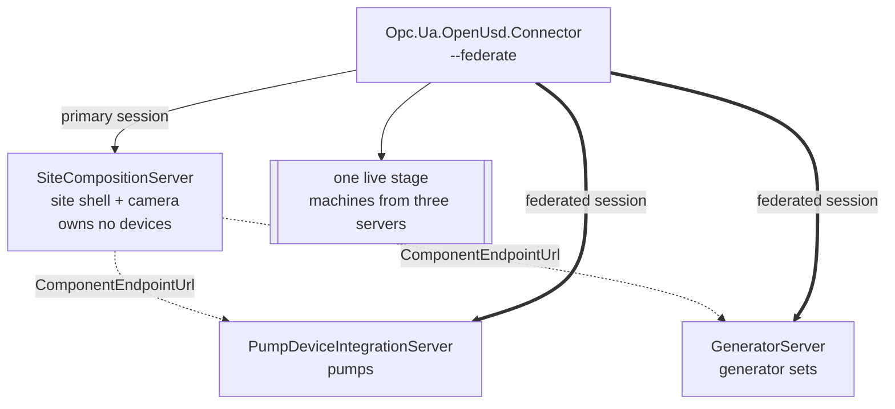

# SiteCompositionServer

A supervisory OPC UA server that owns **no devices** and composes the machines of
several subordinate servers into a single live 3D scene.

This is the SCADA-level counterpart to a device server. Where
[`PumpDeviceIntegrationServer`](../../DI/PumpDeviceIntegrationServer) and
[`GeneratorServer`](../GeneratorServer) each
publish their own machines and their own twin, this server publishes a *site* and
says which server owns what.

## What it demonstrates



The site server declares one **cross-server component binding** per subordinate,
carrying that server's `ComponentServerUri` and `ComponentEndpointUrl`. A
connector run with `--federate` opens a session to each named server, discovers
its representations and drives its bindings into the *same* stage.

Nothing is mirrored. The site server never proxies a subordinate's address space:
it only says where the machines are and lets the connector talk to each owner
directly, so there is no cache to invalidate and no second copy of the truth.

## Running it

The demo script builds the three servers, publishes the connector and viewport
side by side, waits for every endpoint, and cleans up when the viewer closes:

```powershell
pwsh samples/OpenUsd/SiteCompositionServer/run-site-composition-demo.ps1
```

Use `-Renderer D3D12`, `-PumpCount`, `-GeneratorCount`, or `-Keep` to override
the defaults. `-ViewerBundlePath` can point at an already published connector
and viewport directory.

To start each process manually, run:

Start the two device servers, then the site server:

```
dotnet run --project samples/DI/PumpDeviceIntegrationServer -- --host localhost --port 62542 --pumps 3
dotnet run --project samples/OpenUsd/GeneratorServer -- --host localhost --port 62543 --generators 2
dotnet run --project samples/OpenUsd/SiteCompositionServer -- --host localhost --port 62544
```

Then render the composed site:

```
dotnet run --project tools/Opc.Ua.OpenUsd.Connector -- \
    --server opc.tcp://localhost:62544/SiteCompositionServer \
    --insecure --federate --view
```

`--pump-server` and `--generator-server` override the subordinate endpoints.

## Why `--federate` is opt-in

The endpoint the connector dials comes from the server being rendered, not from
the operator, so honouring it is a trust decision — a server could name any
endpoint it likes. The client library is fail-closed (no session factory, no
federation) and the command-line connector mirrors that behind an explicit flag.
Federated sessions are negotiated exactly the way the primary session is, so
composing a subordinate cannot quietly downgrade security.

Federation is also **best-effort per component**: a subordinate that is down,
unreachable or refuses the session is logged and skipped. The rest of the scene
still renders and only that server's machines are missing, because one
unreachable subordinate taking down the whole stage would be a poor trade.

## What lands where

Each subordinate's machines compose at the prim paths **that subordinate**
publishes — the pump server's pumps under `/Plant/...`, the generator server's
sets under `/Powerhouse/...` — because the remote connector drives that server's
own representation. The `/Site/PumpHall` and `/Site/Powerhouse` scopes in
`Site.usda` are the site's own placeholders for those areas.

A verified run against three servers produces one override layer containing:

| From | In the stage |
|---|---|
| Pump server | `/Plant/Pumps/…` with live impeller rotation and casing colour |
| Generator server | `/Powerhouse/Generators/GeneratorSet_1…N` with frequency, power, engine hours, fan rotation and thermal colour |
| Site server | `/Site/…` shell, lighting and the control-room camera |

## Files

| File | Purpose |
|---|---|
| `SiteNodeManager.cs` | Site topology, OpenUSD facility, cross-server component bindings |
| `Assets/Site.usda` | Ground, building slabs, lighting, control-room camera — deliberately no machine geometry |
| `Program.cs` | Host wiring and endpoint arguments |

## See also

- [OpenUSD bindings](../../../docs/OpenUsd.md)
- [`GeneratorServer`](../GeneratorServer)
- [`PumpDeviceIntegrationServer`](../../DI/PumpDeviceIntegrationServer)
