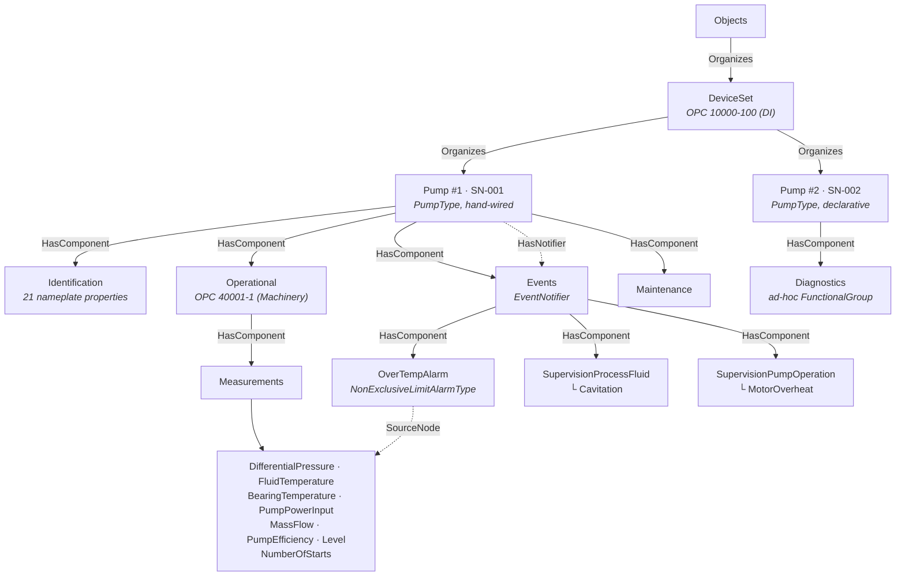
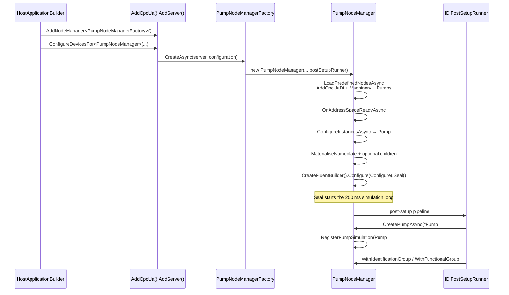
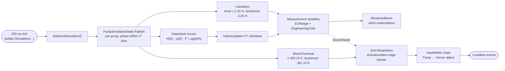

# PumpDeviceIntegrationServer

A self-contained, NativeAOT-friendly OPC UA server that demonstrates
the [OPC 40223 Pumps companion specification](https://reference.opcfoundation.org/specs/OPC-40223)
with a full live simulation, wired through the fluent
`INodeManagerBuilder` API and the additive OPC 10000-100 topology-element
builder integration.

The pump sample is the integration test for every fluent API extension
shipped under `src/Opc.Ua.Server/Fluent/`. Each extension is
documented in
[Source-generated NodeManagers — Building richer node managers](../../docs/SourceGeneratedNodeManagers.md#building-richer-node-managers--the-fluent-extension-surface).

The simulated asset is a *SimPump Corp PumpX-2000*. Its nameplate,
engineering ranges, alarm trip points and simulation profile are all
published in [`DATASHEET.md`](./DATASHEET.md) — an official-style product
datasheet that the server is aligned to and that
`tests/Opc.Ua.Di.Tests/PumpDatasheetConformanceTests.cs` asserts against,
so document and address space cannot drift apart.

## The simulated device

| | |
|---|---|
| Manufacturer / model | SimPump Corp PumpX-2000 |
| Type | Single-stage end-suction centrifugal process pump |
| Rated duty point | 25 m³/h (6.93 kg/s) at 25.5 m head (2.5 bar Δp) |
| Rated efficiency / shaft power | 72 % / 2.41 kW |
| Motor | 3.0 kW, 400 V 3~ 50 Hz, 2900 min⁻¹ |
| Units in the address space | SN-001 (`Pump #1`), SN-002 (`Pump #2`) |
| Bearing-temperature trip points | 363.15 K high, 373.15 K high-high |
| Full specification | [`DATASHEET.md`](./DATASHEET.md) |

Volumetric flow is the only independent variable in the simulation.
Head, differential pressure, mass flow, efficiency and shaft power all
follow from the datasheet characteristic curves
(`H(Q) = 32 − 0.0104·Q²`, `η(Q) = 72·(1 − 0.6·((Q−25)/25)²)`,
`P = ρ·g·Q·H/η`), so the published values are mutually consistent at
every tick rather than being independent sine waves.

## Running the sample

```pwsh
cd samples/PumpDeviceIntegrationServer
dotnet run -c Release
```

The server listens on `opc.tcp://localhost:62542/PumpDeviceIntegrationServer`
by default. Override with `--port 62550`.

Sample console output:

```
info: Opc.Ua.Server.MasterNodeManager
      MasterNodeManager.Startup - NodeManagers=3
info: Opc.Ua.Di.Server.DiNodeManager
      Materialised 'Pump #1' (PumpType) under DeviceSet, NodeId=ns=4;s=5001_Pump #1.
info: Pumps.PumpNodeManager
      Configuring PumpNodeManager fluent wiring...
info: Opc.Ua.Di.Server.DiNodeManager
      PumpNodeManager: address space ready (10196 predefined nodes).
info: Opc.Ua.Di.Server.DiNodeManager
      Materialised 'Pump #2' (PumpType) under DeviceSet, NodeId=ns=4;s=5001_Pump #2.
info: Opc.Ua.Server.Hosting.OpcUaServerHostedService
      OPC UA server listening at opc.tcp://localhost:62542/PumpDeviceIntegrationServer.
```

Browse to `Objects > DeviceSet > Pump #1` in any OPC UA client (e.g.
UaExpert) to explore the simulated pump. A second declarative pump,
`Pump #2`, is organized alongside it by the same `DeviceSet` — it
demonstrates the DI hosting `ConfigureDevicesFor` flow and automatically
joins the same live simulation. Both pumps are units of the same
PumpX-2000 product and differ only in serial number, asset id, component
name and installation bay. They publish monitored data changes every
250 ms, with deterministic phase offsets so their values do not move
in lockstep.

Subscribe to the `EventNotifier` attribute on either pump to receive alarm
condition events when its simulated `MotorOverheat` state activates or
clears. Each pump is also registered as a root notifier, so the same events
are available from a subscription on the Server object.

## Address space



`Pump #2` carries the identical `Identification` / `Operational` /
`Events` / `Maintenance` subtree; only its extra `Diagnostics` group is
drawn above, because that group is created by the non-typed
`WithFunctionalGroup(QualifiedName, ...)` overload rather than by the
model.

## Startup and hosting flow



## Simulation and alarm dataflow



## Validating the address space

The
[`Pump Address Space Validation`](../../.github/workflows/pump-address-space-validation.yml)
workflow runs nightly and can also be started manually. It builds this sample,
installs the latest stable
[`OpcUaAddressSpaceChecker`](https://www.nuget.org/packages/OpcUaAddressSpaceChecker)
global tool, and validates all `PumpType` instances.

To reproduce the validation locally, start the server and run the following
commands in another terminal:

```pwsh
dotnet tool install --global OpcUaAddressSpaceChecker
opcua-check-address-space `
    --endpoint opc.tcp://localhost:62542/PumpDeviceIntegrationServer `
    --type "nsu=http://opcfoundation.org/UA/Pumps/;i=1052" `
    --severity-threshold warning `
    --view-completeness complete `
    --require-complete-view
```

The nightly check keeps the tool's default `auto` validation-view policy and
fails on confirmed errors or any checker execution failure.

## Running in Docker

A [`Dockerfile`](./Dockerfile) is provided that builds the Release
publish output on the .NET **AzureLinux 3** base images and runs it as a
non-root user.

> **Build from the repository root**, not from this folder. The image
> needs the full source tree (`src/`, `src/`, `tools/`), so the
> Docker build context must be the repo root and the Dockerfile is
> selected with `-f`. Running `docker build .` from inside this folder
> fails fast with a message telling you the correct command.

```pwsh
# from the repository root:
docker build -f samples/PumpDeviceIntegrationServer/Dockerfile `
             -t pumpdeviceintegrationserver:local .
```

Run it, publishing the OPC UA port:

```pwsh
docker run --rm -p 62542:62542 pumpdeviceintegrationserver:local
```

Inside the container the endpoint binds to `0.0.0.0` so it is reachable
from the host. Override the bind host and port via environment variables:

```pwsh
docker run --rm -p 62550:62550 `
           -e host=0.0.0.0 -e port=62550 `
           pumpdeviceintegrationserver:local
```

The server creates its certificate/PKI store under `/app` at runtime.
To persist certificates across container restarts, mount a volume:

```pwsh
docker run --rm -p 62542:62542 `
           -v pump-pki:/app/pki `
           pumpdeviceintegrationserver:local
```

The image is built and published to the GitHub Container Registry by the
[`pump-device-integration-server-docker.yml`](../../.github/workflows/pump-device-integration-server-docker.yml)
workflow on every push to `master` and on manual dispatch.

## What the sample demonstrates

| Feature | Where |
|---------|-------|
| `AddOpcUa().AddServer(...).AddNodeManager<T>()` hosting | `Program.cs` |
| Multi-model composition (DI library + locally source-generated Machinery + Pumps) | `PumpNodeManager.cs` `LoadPredefinedNodesAsync` |
| Optional nameplate materialisation via generator-emitted `AddXxx(context)` helpers across three namespaces (DI / Machinery / Pumps) | `PumpNodeManager.cs` `MaterialiseNameplate` |
| Identification properties via `WithProperty(name, value)` | `PumpNodeManager.Configure.cs` `WithIdentification` |
| Optional-child materialisation via generator-emitted `AddXxx(context)` helpers (Operational / Measurements / Events / SupervisionProcessFluid / SupervisionPumpOperation / Maintenance) | `PumpNodeManager.cs` `MaterialisePumpOptionalChildren` |
| Engineering units / EURange via `WithEngineeringUnits` / `WithEURange` | `CreatePumpSimulation` |
| Push-style monitored value updates via `Bind(out IValueUpdater<T>)` | `CreatePumpSimulation` |
| One 250 ms simulation tick for all phase-shifted pumps | `Configure` → `AdvanceSimulation` |
| Datasheet-driven simulation (one independent variable, derived values) | `PumpDatasheet.cs` + `PumpSimulationState.Publish` |
| Limit alarm with thresholds and acknowledge handler via `CreateLimitAlarm(...).WithLimits(...).MonitorVariable(...)` | `CreatePumpSimulation` |
| Boolean supervision → reported alarm condition events via `.ActivatesAlarm(...)` | `CreatePumpSimulation` |
| `EventNotifier`, `HasNotifier`, and `HasEventSource` instance wiring | `PumpNodeManager.cs` + fluent alarm builders |
| Cross-namespace path resolution (Pump #1 in Pumps NS → Operational in Machinery NS → Measurements in Pumps NS, all in one unqualified browse path) | `src/Opc.Ua.Server/Fluent/BrowsePathResolver.cs` |
| Generated `PumpType` instance + typed Identification group configuration | `Program.cs` (`Pump #2`) |

## Architecture

```
PumpDeviceIntegrationServer/
├── Program.cs                          # AddOpcUa().AddServer(...).AddNodeManager<T>()
│                                       # + ConfigureDevicesFor declarative Pump #2
├── PumpNodeManager.cs                  # Hand-written FluentNodeManagerBase
│                                       # + LoadPredefinedNodesAsync (multi-model)
│                                       # + CreateAddressSpaceAsync (builder setup)
├── PumpNodeManager.Configure.cs        # partial — fluent wiring + simulation tick
├── PumpDatasheet.cs                    # DATASHEET.md as compile-time constants
├── DATASHEET.md                        # official-style PumpX-2000 product datasheet
├── PumpDeviceIntegrationServer.csproj  # ProjectReference to Opc.Ua.Di model lib
│                                       # AdditionalFiles for Machinery + Pumps
│                                       # NodeSet2 (consumed by source generator)
├── Model/
│   ├── Opc.Ua.Machinery.NodeSet2.xml   # AdditionalFiles — build-time only
│   └── Opc.Ua.Pumps.NodeSet2.xml       # AdditionalFiles — build-time only
└── Properties/AssemblyInfo.cs
```

The `Opc.Ua.Di` model library is consumed as a project reference (its
types live under the `Opc.Ua.Di` namespace and are source-generated
from the ModelDesign XML). Cross-namespace references from Machinery
and Pumps to DI types resolve through the
`[assembly: ModelDependencyAttribute]` carried in the `Opc.Ua.Di`
assembly — no DI NodeSet2 XML needed in this project. The unified
attribute carries the compact type-table payload that the consumer's
source generator imports at compile time; see
[ModelDependencies.md](../../docs/ModelDependencies.md) for the wire
format and consumer-side flow.

The Machinery and Pumps NodeSet2 XMLs are **source-generated locally
inside this assembly** via the `<AdditionalFiles>` plumbing in the
`.csproj`. The generator emits typed `*State` classes, NodeId tables,
and the `AddOpcUaMachinery` / `AddOpcUaPumps` extension methods that
`LoadPredefinedNodesAsync` calls. No runtime XML loading happens — the
`Model/` folder is a build-time input only. Consumer assemblies that
want to reference Machinery or Pumps the same way they reference
`Opc.Ua.Di` should source-generate against the model XML inside their
own assembly using the same `<AdditionalFiles>` pattern.

The sample intentionally does not add `GeneratesEvent` to pump instances.
OPC 10000-3 restricts that reference to ObjectType, VariableType, and Method
declarations; runtime delivery is provided by the notifier/event-source
hierarchy and `ReportEvent`.

## Extending the sample

> When you change a published value, update
> [`DATASHEET.md`](./DATASHEET.md) and the constants in `PumpDatasheet.cs`
> together — `PumpDatasheetConformanceTests` fails the build otherwise.

- **Add a measurement**: open `PumpNodeManager.Configure.cs`, add a
  bound updater in `CreatePumpSimulation`, store it in
  `PumpSimulationState`, and publish its value from `Publish`. Add its
  engineering range to `PumpDatasheet.Ranges` and to section 4 of the
  datasheet.
- **Add an alarm**: create it from the typed `Events` builder in
  `CreatePumpSimulation` and wire the triggering boolean variable via
  `.ActivatesAlarm(...)`. Document its trip points in section 7.
- **Add a nameplate field**: materialise it with the generator-emitted
  `AddXxx(context)` helper in `PumpNodeManager.MaterialiseNameplate`,
  assign the value in `WithIdentification` (Pump #1) and in the
  `WithIdentificationGroup` block of `Program.cs` (Pump #2), and add the
  row to section 2 of the datasheet.
- **Add a second pump**: two patterns are demonstrated in the sample.
  - **Hand-rolled** (used for `Pump #1`): in `PumpNodeManager.CreatePumpAsync`, create the generated `PumpState`, attach it to the DI `DeviceSet` with `Organizes`, and register it. The fluent `Configure.cs` then wires its measurements, alarms, and simulation by browse path.
  - **DI declarative** (used for `Pump #2`): in `Program.cs`, call `PumpNodeManager.CreatePumpAsync(...)` from a `ConfigureDevicesFor<PumpNodeManager>` block, wrap the generated `PumpState` with `ctx.TopologyElement<PumpState>(...)`, then configure the mandatory `Identification` group. `CreatePumpAsync` also registers the new instance with the shared simulation.

## NativeAOT publishing

```pwsh
cd samples/PumpDeviceIntegrationServer
dotnet publish -c Release -r win-x64
```

The pump server publishes cleanly under NativeAOT — no trim or AOT
warnings — because every fluent extension is reflection-free and the
generated model factories are statically rooted.

## See also

- [`DATASHEET.md`](./DATASHEET.md) — the official-style PumpX-2000
  product datasheet the simulation implements.
- [`docs/DeviceIntegration.md`](../../docs/DeviceIntegration.md) —
  full developer guide for the DI library trio (device builder,
  hosting integration, lock service, software-update package store,
  client helpers).
