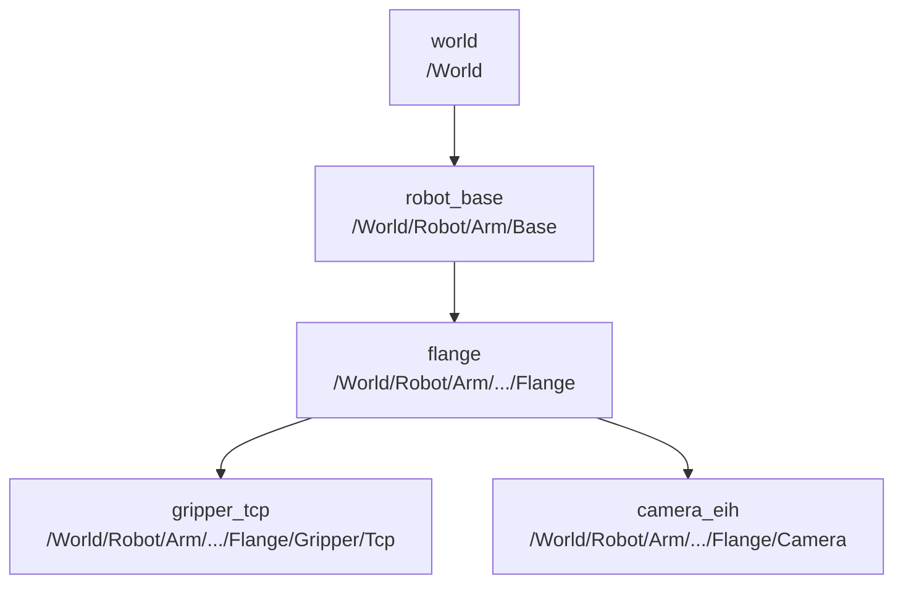

<!--
Copyright (c) 2005-2026 The OPC Foundation, Inc. All rights reserved.

OPC Foundation MIT License 1.00

The complete license agreement can be found here:
http://opcfoundation.org/License/MIT/1.00/
-->

# Bin Picking Cell

Reference server for the vision-guided bin-picking sample. Hosts a
UR5e-style robot arm as a Robot Intent controller, a Vision companion
with an eye-in-hand camera parented to the flange, an in-address-space
OpenUSD scene, and the frame tree the Robotics-Vision Addendum's
example uses:

```text
world → robot_base → flange → gripper_tcp
                          ↳ camera_eih
```



Five parts (`RedCube`, `GreenCylinder`, `BlueSphere`, `YellowSlab`,
`OrangeBrick`) sit in a bin on the workbench; a fixture is placed next
to it. The sample's paired client at
[`samples/Robotics/BinPickingClient`](../BinPickingClient) runs the
perception-to-action loop against this server, either as a scripted
demo or under the control of an MCP-connected language model.

The cell is the example that motivates the [Vision developer
guide](../../../docs/Vision.md) — every §5.12 convention (quaternion
`(x, y, z, w)`, metres, corner-datum principal point, empty-covariance
sentinel), every §6.4 media state and every facet the guide lists
appears in the cell's address space.

## Running

Prerequisites: .NET 10 SDK.

```powershell
dotnet run --project samples\Robotics\BinPickingCell\BinPickingCell.csproj -- --insecure
```

The server listens on `opc.tcp://localhost:62855/BinPickingCell` by
default. The endpoint URL and port are configurable through
`--host <name>` and `--port <number>`; the anonymous operator role is
mapped in code so the demo client can connect without user credentials.

`--insecure` is a demo convenience: it accepts any client certificate
and does not enforce trust. Do not use it in production.

## Inference-location option

The cell selects one perception path once at startup and pins it for
the lifetime of the process. The pipeline's advertised inference-
location facet is derived from this and cannot change afterwards, so
the cell always tells the truth about which path is in force.

- `--inferenceLocation OnServer` (default) — the deterministic
  `BinPickingGroundTruthInferenceProvider` computes `DetectionResultType`
  results locally. The pipeline advertises `VIS-Inference-OnServer`,
  needs no GPU, no model and no network, and is what CI runs.
- `--inferenceLocation EdgeOffServer` — the pipeline exposes a
  `VisionFeedbackType` bound to `BinPickingAgentInferenceProvider`; an
  agent connected over MCP looks at the frame and calls
  `SubmitDetections`. The pipeline advertises `VIS-Inference-OffServer`
  and publishes results the Server itself did not compute. `RunInference`
  and `StartContinuous` are refused with `Bad_NotSupported` — a client
  requesting an on-Server compute path in this mode gets an actionable
  refusal, not a silent stub.

The two paths are exclusive by construction: a pipeline binds either an
inference provider or a feedback sink, never both at once, because
mixing them would let a computed and a submitted result publish on the
same pipeline out of any known order.

## Startup options

| Option | Meaning |
|---|---|
| `--host <name>` | Endpoint host name. Default `localhost`. |
| `--port <number>` | Endpoint port. Default `62855`. |
| `--inferenceLocation OnServer\|EdgeOffServer` | Selects the perception path. `OnServer` is the default. |
| `--captureOnStartup true\|false` | Whether the capture-proof hosted service captures a still on startup and writes it to disk (see below). Default `true`. |
| `--artifactDirectory <path>` | Where the capture-proof hosted service writes its still. Defaults to a temp path chosen by the host. |
| `--insecure` | Demo-only, per the note above. |

The parser accepts `OnServer`, `EdgeOffServer`, `OffServer`,
`on-server`, `off-server` and their case-insensitive variants for
`--inferenceLocation`. Unknown values silently fall back to `OnServer`
rather than failing to start.

## What the cell publishes

- Under `Server/RobotIntent`, one Robot Intent controller
  (`BinPickingController`) with lookup tables for `Bin`, `Fixture` and
  `ParallelGripper`. The controller ships `Pick` and `Place` intents
  targeting the sample parts.
- Under `Server/Vision`:
  - The frame tree above. Every frame carries a unit `(x, y, z, w)`
    quaternion and a metres-based position; `camera_eih` is authored
    with the `EyeInHand` hand-eye pose the addendum specifies.
  - `BinPickingCameraTwin`, an `ImageSensorType` with
    `RealityKind = Simulated`, `Modality = Area2D`, an
    `IntrinsicCalibrationType` (Zhang method, residual 0.21 pixels), a
    `HandEye` `ExtrinsicCalibrationType` (`EyeInHand` mount, residual
    0.0008), an `IVisionSimulatedType` interface pointing at the USD
    stage and `Camera` prim, a live RTSP `StreamEndpointType` and a
    `PickFrames` `ClipEndpointType` with inline delivery enabled up to
    32 MiB.
  - `BinPickingPipeline` (`InferencePipelineType`) bound to the sensor
    twin, with the deployment reference `OnServerDeployment` and either
    the ground-truth inference provider or the agent inference provider
    depending on `--inferenceLocation`.
- Under `Server/OpenUSD`, the composed `Cell.usda` stage the sensor
  renders from.
- Under `Server/WorldState`, one position variable per part, in the world
  frame. This is the cell's **simulation ground truth**, not a standard OPC
  UA concept: a part lying in a bin is not something Robot Intent or Vision
  models, and the scene has to be drivable from the address space to be
  watchable. The OpenUSD live bindings follow these variables, so a picked
  part moves in the viewport, and a client comparing what the detector
  claims against where the part actually is has both halves.

## The USD stage

The scene is authored in `Assets/Cell.usda` and is extracted at
startup by `BinPickingCellStage.Extract()` into a working directory the
`BinPickingMediaProvider` and `OpenUsdSceneCameraCaptureProvider` share.
It references the UR5e-style arm from the sibling
`samples/Robotics/IntentEnabledRobot` sample and its parallel gripper,
adds the bin, fixture and parts, and parents the eye-in-hand
`UsdGeomCamera` to the flange so the view moves with the arm.

### Scene lighting is load-bearing

The stage is lit by a single `DomeLight` at intensity 1000.
**Do not reintroduce a `DistantLight`** — at any intensity that shows
geometry, a `DistantLight` blows every surface to pure white regardless
of material, and the point of this cell is that a vision-language model
can pick "the red cube" by looking at the frame. Under a `DomeLight`
the five parts measure `red (220, 37, 37)`, `green (37, 208, 49)`,
`blue (37, 73, 233)` — distinct enough for an LLM to reason about.
The `Cell.usda` header records this contract explicitly so a future
scene-authoring change does not silently break the perception path.

### Frame tree contract

- `/World` is the `world` frame origin.
- `/World/Robot/Arm/Base` is the `robot_base` frame.
- `/World/Robot/Arm/.../Flange` is the `flange` (mechanical interface).
- `/World/Robot/Arm/.../Flange/Camera` is the `camera_eih`
  `UsdGeomCamera` the Vision sensor renders from.
- `/World/Robot/Arm/.../Flange/Gripper/Tcp` is `gripper_tcp`.

The vision-side `flange` frame is authored at the scan pose the arm
would hold to point the eye-in-hand camera at the bin. In a live cell
the flange frame is dynamic and reflects the current joint state; for
this static-sample demo it is pinned to the scan pose so a consumer
composing `camera_eih → flange → robot_base → world` lands on the parts'
authored world positions — which is exactly what the ground-truth
detector reports for each detection's `Pose`. This is why the vision-
side frame ids match the robot-side frame ids exactly: the client can
compose a detection's pose from the camera into the world frame using
`VisionFrameGraph` and get a value it can hand straight to the robot-
side `Pick` intent.

The scan pose is not declared independently in three places, because it
used to be and the three disagreed. The arm's home joint angles are
**solved** so the `Camera` prim lands at the world position the Vision
model declares for `camera_eih` — `(0.38, 0, 1.35)`, looking straight
down — which puts the bin 0.50 m away and 1.8° off the optical axis.
The same solution gives the `flange` frame's pose, and the same joint
angles are authored into `Cell.usda` so the still render and the first
live update agree. Change any one of them and the other two have to be
re-solved with it.

Two constraints on that solution are easy to miss:

- **The camera prim sits 0.16 m out along the flange `Z` axis**, not on
  the tool axis. The gripper extends along flange `+X`, which is straight
  down at the scan pose, so a camera on that axis photographs its own jaws.
- **The solution is the elbow-back branch, with the camera rolled 15°.**
  The elbow-forward branches reach the same camera pose but park a link
  directly under the camera, so the frame shows the arm's own upper arm
  instead of the bin. And aiming a straight-down camera from a point on
  the base's own `X`-`Z` plane lands the wrist exactly on the J4/J6
  singularity; the 15° roll gets 25° clear of it. A singular home pose is
  not cosmetic — the first IK solve of any motion away from home fails, so
  every intent comes back `Kinematics`. The roll is why the delivered
  frame is tilted; the detections are expressed in the same rolled frame,
  so they still land on the parts.

## What an agent actually receives

`vision_get_frame` (MCP) and `GetClip` (OPC UA) return a **612 × 512
PNG**, delivered as inline bytes in the method's `ByteString` output and
base64-encoded into the MCP `ImageContentBlock`. The
`VisionImageReferenceDataType` alongside it carries a
`opcua-inline://…` **reference** and the frame's dimensions — it does not
carry the image, which would ship the payload twice.

612 × 512 is what the sensor declares, what the clip endpoint declares,
what the intrinsics describe and what the renderer produces. The
simulated device is a 2448 × 2048 area-scan camera operated with 4 × 4
binning, so the calibrated intrinsics are divided by four and the
Brown-Conrady coefficients — expressed in normalised image coordinates —
carry over unchanged. The native size survives only in the model and
serial number, where it identifies the hardware rather than the image.

This matters because the ground-truth detector projects through the
declared intrinsics: the `BoundingBox2D` on every detection is in the
same pixel frame as the PNG an agent was handed. Previously the sensor
said 2448 × 2048, the clip endpoint said 1280 × 1024 and the renderer
produced 640 × 512 — not even the same aspect ratio — so a model asked
to "pick the red cube you can see" got a picture and a set of
coordinates that pointed off it.

After a successful `GetClip`, the Server publishes the frame on the clip
endpoint's `LatestClip` and its descriptor on `LatestClipMetadata`, so a
consumer that follows the model — read the published frame, call the
method only if there is none — gets a frame rather than a permanent
`Bad_NoDataAvailable`.

## Rendering behaviour on CI

The `Opc.Ua.Vision.OpenUsd` capture provider needs a native OpenUSD
renderer payload plus a usable graphics device to produce pixels. On CI
neither is present — the provider reports
`SceneCameraCaptureBackend.NoRenderingBackend` on `UnavailableReason`,
and every `LatestClip` read against `PickFrames` reports
`Bad_NoDataAvailable`. The sensor still exists in the address space,
every browse still works, every calibration is still readable and the
inference proof hosted service still updates the world state.

This is by design: the point of the CI leg is to exercise the address
space, the fluent builder, the provider abstractions and the client
plumbing, not to prove that the machine has a GPU. `--demo` on the
paired client skips its "compose frame → world" step gracefully when
the frame is unavailable rather than falsely reporting a rendering
failure.

On a workstation with the renderer payload installed and a usable
graphics device, the same sensor renders normally and returns encoded
PNG bytes through the inline `LatestClip` or the by-reference
`GetClip` path.

## Ground-truth vs agent inference

- **Ground-truth path** (`--inferenceLocation OnServer`):
  `BinPickingGroundTruthInferenceProvider` reads the current world
  state from `BinPickingWorldState`, projects each part into the
  camera through the authored `HandEye` transform and intrinsics, and
  publishes a `DetectionResultType` with the corresponding class label,
  bounding box and pose. Because this reads real geometry, the poses
  it publishes are the ones a correct agent would submit — which is
  what makes the ground-truth path useful as a check on an agent's
  answer.
- **Agent path** (`--inferenceLocation EdgeOffServer`):
  `BinPickingAgentInferenceProvider` is the sample's off-Server
  feedback sink. `SubmitDetections`, `SubmitCorrection` and
  `SubmitImageReference` are accepted; `RunInference`,
  `StartContinuous`, `Stop` and `SubmitInspectionResult` are refused
  with `Bad_NotSupported` because this pipeline exposes
  `DetectionResultType` results only and has no on-Server compute
  path. The agent's submissions are validated before they land — see
  below.

Two hosted services publish loop-proof output regardless of MCP being
attached:

- `BinPickingCaptureProof` captures a still on startup (skipped with
  `--captureOnStartup false`), writes it to
  `--artifactDirectory` when set, and logs the resulting size or the
  `NoRenderingBackend` reason. Useful for verifying the render path
  from a CI leg.
- `BinPickingInferenceProof` (on-server) drives one round of the
  deterministic detector and mutates `BinPickingWorldState`, or
  `BinPickingOffServerProof` (off-server) drives one round of agent
  submissions with valid detections. Both prove the end-to-end write
  path independently of the MCP tool surface. The on-server proof
  **restores the bin afterwards**: it runs before any client connects,
  and leaving a part picked would mean the paired client's demo started
  against a world it had not changed itself.

The robot moves the parts too. `Pick` travels to its `Source`, closes the
gripper on the part named by the intent's `ObjectClass`, and carries it: the
part's world position follows the tool until `Place` opens the gripper and
leaves it at the destination. The ground-truth detector projects from those
same positions, so it stops reporting a part that has been moved out of the
bin — which is what makes the paired client's `--demo` verification real
rather than a formality.

## Feedback validation

When an agent submits detections through
`vision_submit_detections` (or `vision_submit_correction`), the sample's
feedback sink validates every field and refuses malformed submissions
with `Bad_InvalidArgument` and a message the agent can act on:

- **Unknown class label** — refused with the exact list of parts that
  do exist: `Detection 0 class 'PurplePyramid' is not a part in this
  cell. Known classes: RedCube, GreenCylinder, BlueSphere, YellowSlab,
  OrangeBrick.`
- **Confidence outside `[0, 1]`** — refused with the observed value.
- **Bounding box outside the image** — refused with the box centre,
  extents and the image dimensions.
- **Non-positive box extents** — refused with the extents.
- **`NaN` in a box or pose** — refused with the detection index.
- **Zero-norm quaternion or `Orientation` with fewer than four
  components** — refused with an explanation that references §5.12.
- **`Position` with fewer than three components** — refused likewise.
- **Purpose not in `Overlay | Reconciliation | GroundTruthLabel |
  Trigger`** — refused with the offending value.
- **More than 15 detections in a single submission** — refused as
  implausible for the five-part cell.

An **empty** detection set is refused too. §9.5 lists "`Detections`
empty" as `Bad_InvalidArgument`, and requires `SubmitCorrection` to
carry *exactly one* non-empty corrected array. The cell conforms, which
has a consequence worth knowing: an agent that has emptied the bin
cannot report "I looked and there is nothing there", and a false
positive cannot be retracted by correcting a result down to nothing.
Both are raised against the draft rather than worked around here — see
the [Vision developer guide](../../../docs/Vision.md#limitations).

`SubmitInspectionResult` is refused with `Bad_NotSupported` regardless
of the arguments: this pipeline is a detection pipeline, not an
inspection pipeline, and an agent submitting an inspection result is
confused about which pipeline this is.

## Related samples and docs

- [BinPickingClient](../BinPickingClient) — the paired client, with
  `--demo` for the scripted loop and `--mcp` for an agent-driven one.
- [Vision developer guide](../../../docs/Vision.md) — the
  companion documentation for `Opc.Ua.Vision*` and
  `Opc.Ua.Mcp.Vision`.
- [Robotics developer guide](../../../docs/Robotics.md) — the sibling
  companion; the Robot Intent controller in this cell is the topic of
  that guide.
- [OpenUSD guide](../../../docs/OpenUsd.md) — the connector and scene
  materialisation used to bind the address space to the USD stage.
- [MCP Server guide](../../../docs/McpServer.md) — profile composition
  (`--profile vision,robotics`), tool tables and connection semantics.
