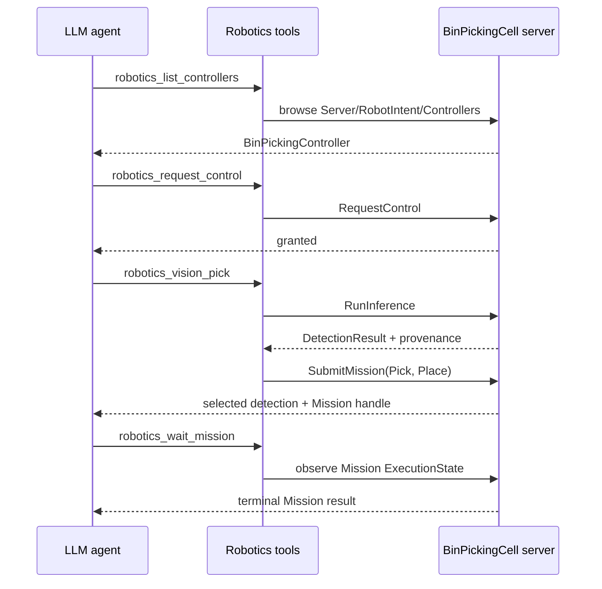

<!--
Copyright (c) 2005-2026 The OPC Foundation, Inc. All rights reserved.

OPC Foundation MIT License 1.00

The complete license agreement can be found here:
http://opcfoundation.org/License/MIT/1.00/
-->

# Bin Picking Client

This sample closes the perception-to-action loop against the `BinPickingCell` server:
it connects, discovers the Robot Intent controller and its lookup tables
(`Bin`, `Fixture`, `ParallelGripper`), requests command authority, and — with
`--mcp` — hosts the composed **Vision + Robotics** MCP catalogue so a language
model can drive the cell while a human watches. With `--view`, it can also open
the in-process OpenUSD viewport so the same session is observable in 3-D while
the agent runs.

The MCP catalogue exposed to the agent contains **64 tools** measured from the
running host: `26` Vision tools + `42` Robotics tools − `4` shared connection
tools. This includes `vision_get_frame`, which returns the eye-in-hand camera
image as an MCP `ImageContentBlock` so the model genuinely sees pixels; the
one-call `robotics_vision_pick`; typed intent/mission tools; and the state,
authority, paging and bounded-wait tools needed to plan against refusals.

## MCP hosting

With `--mcp`, the client exposes the composed catalogue so an LLM can discover
controllers, read state, request authority, capture frames from the eye-in-hand
camera, submit `Pick` and `Place` intents, wait on operations, pause / resume /
cancel / retry, and re-inspect the world — all through the same `SampleSession`
the sample opened. The Vision and Robotics tools share the connection, so an
agent that captures a frame and submits a `Pick` is observing and commanding the
same cell.

MCP hosting is compiled for `net8.0`, `net9.0`, and `net10.0`. It is unavailable
on `net48`; running that leg with `--mcp` reports the limitation on stderr.
Without `--mcp`, the sample continues to run on every framework it builds for.

MCP options:

- `--mcp` enables MCP hosting.
- `--transport stdio|http|sse` selects the MCP transport. `sse` is accepted as
  an alias for `http`.
- `--port <number>` selects the Streamable HTTP port. The default is `5170`,
  chosen so it does not collide with `IntentViewerClient`'s default of `5100`.

Transport selection is announced on stderr:

- No `--transport` and no `--view`: **stdio** is selected by default.
- No `--transport` with `--view`: **HTTP** is selected automatically and the
  client explains that MCP stdio uses stdout for protocol frames, which cannot
  safely coexist with the in-process OpenUSD viewer.
- `--transport http` with or without `--view`: **HTTP** is used.
- `--transport stdio` without `--view`: **stdio** is used.
- `--transport stdio --view`: the explicit request is honored, but the client
  warns plainly that the viewer may share stdout and corrupt the MCP stdio
  protocol.

Example MCP client configuration for viewport mode:

```json
{
  "servers": {
    "bin-picking": {
      "url": "http://localhost:5170/mcp"
    }
  }
}
```

Run the sample with HTTP MCP and the viewport:

```powershell
dotnet run --project samples\Robotics\BinPickingClient\BinPickingClient.csproj --framework net10.0 -- --server opc.tcp://localhost:62855/BinPickingCell --insecure --view --mcp --transport http --port 5170
```

For stdio MCP, point the MCP client at the command instead:

```json
{
  "servers": {
    "bin-picking": {
      "command": "dotnet",
      "args": [
        "run",
        "--project",
        "samples\\Robotics\\BinPickingClient\\BinPickingClient.csproj",
        "--",
        "--server",
        "opc.tcp://localhost:62855/BinPickingCell",
        "--insecure",
        "--mcp"
      ]
    }
  }
}
```

Agents can submit only what the server advertises and accepts. Refusals are
returned to the agent as tool results and are never retried on the agent's
behalf; the agent must decide whether to re-plan, ask for operator action, or
stop.

## Scripted demonstration mode

Use `--demo` to run the whole loop without an agent attached. This is what makes
the sample runnable in CI and by someone without an MCP client, and it is how
the loop is proven:

```powershell
dotnet run --project samples\Robotics\BinPickingCell\BinPickingCell.csproj -- --insecure
dotnet run --project samples\Robotics\BinPickingClient\BinPickingClient.csproj --framework net10.0 -- --server opc.tcp://localhost:62855/BinPickingCell --insecure --demo
```

The demo runner:

1. Discovers the sole Robot Intent controller advertised by the cell and prints
   its browse name and NodeId.
2. Requests command authority for this session.
3. Attempts to reach the sole Vision inference pipeline advertised by the cell,
   captures a frame's worth of detections, composes the target part's pose from
   the `camera_eih` frame into the `world` frame using the Vision frame graph,
   and logs the composed pose.
4. Resolves the source location (`--source`, default `Bin`), destination
   location (`--destination`, default `Fixture`) and tool (`--tool`, default
   `ParallelGripper`) against the controller's `Locations` and `Tools` lookup
   tables.
5. Builds and submits a `Pick` intent for the chosen part with a unique
   `IntentId`, waits for the returned operation to reach a terminal state, and
   logs the result.
6. Builds and submits a `Place` intent for the same part with a unique
   `IntentId`, waits for the returned operation to reach a terminal state, and
   logs the result.
7. Re-runs inference and compares detections before and after: if the target
   part disappears or its pose changed, the world state was observed to change
   as expected; otherwise the runner reports the mismatch plainly.

Use `--part <ClassLabel>` to pick a different part (`RedCube`,
`GreenCylinder`, `BlueSphere`, `YellowSlab`, `OrangeBrick`) and
`--source` / `--destination` / `--tool` to retarget without a rebuild.

Transcript from an actual run against the current cell:

```text
Controller: BinPickingController (ns=3;s=7001_Controllers_BinPickingController)
Command authority: granted for this session.
Pick admitted: intent binpickclient-20260810191928321-pick operation ns=3;s=7001_Controllers_BinPickingController_Intents_binpickclient-20260810191928321-pick-...
Pick operation terminal state: Succeeded failure=None
Place admitted: intent binpickclient-20260810191928321-place operation ns=3;s=7001_Controllers_BinPickingController_Intents_binpickclient-20260810191928321-place-...
Place operation terminal state: Succeeded failure=None
```

### Notes on Vision inference in the current cell

The client resolves the cell's Vision nodes by browse path from the Vision root,
so a Server that materialises Vision as instances in its own namespace — which
is what the fluent builder produces, and what this cell is — is discovered
correctly. `--demo` verifies the world change through the client-side detection
loop: it captures the detections before the Pick, submits Pick and Place,
re-runs inference, and reports whether the target part is still where it was.

The check is honest in both directions. If the part was never detected before
the Pick, the run is reported as **inconclusive** rather than as a pass, because
"it is gone now" proves nothing about a part that was never there.

## Viewport mode

The viewer is deliberately optional: `BinPickingClient` does not reference it,
and loads `Opc.Ua.OpenUsd.Connector.Viewer.dll` by reflection from its own
output directory. Nothing puts it there for you, so `--view` on a fresh clone
degrades to headless with a message on stderr. Publish the viewer once and copy
its output beside the client:

```powershell
dotnet publish tools\Opc.Ua.OpenUsd.Connector.Viewer\Opc.Ua.OpenUsd.Connector.Viewer.csproj `
    -c Release -f net10.0 -r win-x64 --self-contained false -o $env:TEMP\viewer-publish

Copy-Item "$env:TEMP\viewer-publish\*" `
    samples\Robotics\BinPickingClient\bin\Release\net10.0 `
    -Recurse -Force -Exclude "*.deps.json","*.runtimeconfig.json"
```

Publish rather than copying the viewer's `bin` directory: the viewport pulls in
the Avalonia UI stack and the per-RID native OpenUSD renderer on top of its own
assembly, and only a publish resolves that whole closure. Excluding the two JSON
files matters as well - they describe the viewer as an application, and letting
them overwrite the client's own leaves the client unable to start.

Then run, from the client's output directory so the native payload resolves:

```powershell
samples\Robotics\BinPickingClient\bin\Release\net10.0\BinPickingClient.exe `
    --server opc.tcp://localhost:62855/BinPickingCell --insecure --view
```

Add `--demo` to run the scripted pick-and-place while the viewport is open,
which is the quickest way to watch the loop close in 3-D. The two are sequenced
deliberately: the viewport opens first, the client waits for the live OpenUSD
stream to be subscribed, and only then commands the robot, so the motion happens
with something watching. The window stays open when the loop finishes so the
cell can still be inspected.

Both the arm and the parts move. The six joints follow `AxisState.Position`, and
each part follows its own world position variable under `Server/WorldState`, so a
part that is picked travels with the gripper and stays where it is placed.

### Where a released part ends up

A placed part comes to rest on whatever is underneath it — the bench, the fixture
plate, a locating peg, or another part. It is a resting model rather than a
physics engine: no toppling, no friction, no sliding, because none of those change
the answer a pick-and-place cell needs, which is that a part released over a bench
ends up on the bench and a part released over another part ends up on top of it
rather than inside it.

Two consequences worth knowing:

- **Stacking is automatic.** Place a second part at the same location and its base
  lands exactly on the first one's top. Three parts placed on the fixture measure
  bases 0.8380 / 0.8780 / 0.9080 against tops 0.8780 / 0.9080 / 0.9320 — no gaps,
  no intersections.
- **A Place descends before it releases.** The cell knows it is carrying something,
  because a Pick travels with the gripper empty and closes on arrival while a Place
  travels loaded and opens, so it moves to the height that leaves the part on its
  support. Releasing is a release, not a drop from the approach height.

The arm will also refuse to reach through its own bench. Several inverse-kinematic
solutions for a target near the surface pass a link through it, and the solver now
takes the nearest one that does not, reporting `WorkSurface` when every solution
would.

### Which camera the viewport opens on

The viewport opens on `/World/ObserverCamera`, a fixed camera authored in the
stage that frames the whole cell from the front and slightly above: the bench
centred, the fixture on the left, the bin on the right, and enough room for the
arm to reach up without leaving the frame. It is a fixed observer, so the arm
moves within a steady view rather than the view chasing the arm.

- `--camera auto` hands framing back to the viewer, which fits the scene bounds.
- `--camera <primPath>` opens on any other camera in the stage.

The stage has a second camera,
`/World/Robot/Palletizer/.../Flange/Camera`, which is the
eye-in-hand sensor the Vision model renders from. Opening the viewport on it
shows what the tool sees rather than the cell, which is occasionally useful for
debugging the perception path but is not a view of the robot working.

The observer camera's numbers were fitted to a reference framing and then
corrected against what the viewer actually rendered, because the analytic
placement and the rendered result disagreed. Treat them as measured rather than
derived: change one and re-check the framing against a capture.

### Diagnosing the live stream

Pass `--verbose` to raise the log level to Debug. The OpenUSD connector then
reports what it bound at start-up:

```
OpenUSD live stream bound 12 binding(s) across 10 representation(s) and is
monitoring 12 item(s).
```

and one line per live update, plus a warning for any target it had to leave
*unresolved*. That last one matters: the §5.8 profiles fail closed, so a source
value in a shape a profile does not accept produces a prim that silently never
moves while every subscription counter says the data is flowing. It is worth
knowing which of the two you are looking at.

### Viewer-only sessions receive external motion

A client started with `--view` alone can observe motion commanded by a
different OPC UA session. The OpenUSD connector creates a classic
`Subscription`; `ManagedSession` uses the V2 subscription engine by default.
The V2 publish manager therefore includes created classic session subscriptions
when sizing its Publish-worker pool, even when it owns no V2 subscriptions of
its own. This is the normal observer shape: two Publish workers stay active and
dispatch the classic subscription's notifications to the live USD sink.

The viewer host also runs its long-lived `StageReadyAsync` callback outside
Avalonia's UI synchronization context, per
[openusd-dotnet#17](https://github.com/marcschier/openusd-dotnet/issues/17).
These are separate requirements: the callback must remain runnable, and the OPC
UA session must issue Publish requests for every subscription API it supports.
Pass `--verbose` to verify both `PUBLISH Worker #... - STARTED` and
`OpenUSD live update: ...` messages while another client drives the cell.

The client fetches the cell's served OpenUSD assets automatically whenever the
viewport opens, into a per-user cache directory. Pass `--fetch-assets <dir>` only
when you want the fetched stage written somewhere you choose, for example to
inspect `stage.usda` by hand.

Where the viewer assembly or renderer payload is missing, the client says so
plainly on stderr and continues without opening the viewport. The renderer
payload supports `win-x64`, `linux-x64` and `osx-arm64`; substitute the matching
`-r` value above.

## Agent workflow for vision-guided bin picking

Use `--mcp --view` when an LLM agent should drive the same cell a human
watches. The perception-to-grasp loop is deliberately short: observe the cell,
request authority explicitly, then let `robotics_vision_pick` run inference,
select one detection and submit the Pick/Place mission on the same OPC UA
session.



The agent's tool sequence to pick and place one part:

```text
agent -> robotics_list_controllers()
server -> [{ name: "BinPickingController", nodeId: "ns=3;s=7001_Controllers_BinPickingController" }]

agent -> robotics_read_controller(controller="BinPickingController")
server -> SupportedIntents includes Pick and Place; locations include Bin,
          Fixture and per-part staging; tools include ParallelGripper.

agent -> robotics_read_state(controller="BinPickingController")
server -> Ready=true, OperationalMode=AutomaticExternal, ControlOwner=<other session>

agent -> robotics_request_control(controller="BinPickingController")
server -> { granted: true }

agent -> robotics_vision_pick(request={
    controller: "BinPickingController",
    pipeline: "BinPickingPipeline",
    source: "Bin",
    tool: "ParallelGripper",
    destination: "Fixture",
    classLabel: "RedCube",
    minimumConfidence: 0.9,
    missionId: "place-red-cube"
})
server -> {
    provenance: { resultId: "run-...", selectedDetection: { classLabel: "RedCube", ... } },
    missionSubmission: { accepted: true, missionId: "place-red-cube", operation: "ns=..."}
}

agent -> robotics_wait_mission(
    controller="BinPickingController",
    missionId="place-red-cube",
    missionNodeId="ns=...",
    timeoutMs=30000)
server -> { completed: true, terminalState: "Succeeded", ... }
```

If safety refuses the intent, the agent must observe the failure, re-read state,
and either re-plan (for example, retry with a different tool or target
location), ask for operator action, or stop.

The lower-level `vision_run_inference`, `vision_read_detection_result`,
`robotics_submit_pick` and `robotics_submit_place` tools remain available when
an agent needs to inspect or control each stage separately.

`--insecure` is for localhost demos only. It accepts any server certificate for
localhost demos; do not use it for production systems.
