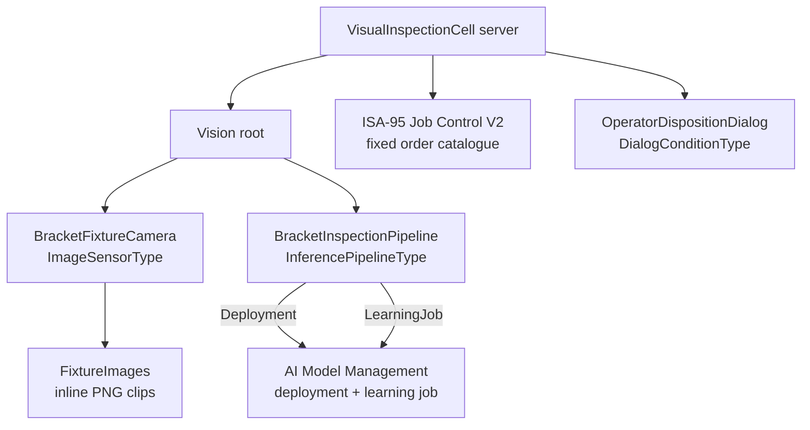

<!--
Copyright (c) 2005-2026 The OPC Foundation, Inc. All rights reserved.

OPC Foundation MIT License 1.00

The complete license agreement can be found here:
http://opcfoundation.org/License/MIT/1.00/
-->

# Visual Inspection Cell

`VisualInspectionCell` is the server half of the visual-inspection sample. It
hosts one address space containing four companion areas:

- **Vision** — `BracketFixtureCamera`, the `FixtureImages` inline PNG clip
  endpoint, and `BracketInspectionPipeline`.
- **AI Model Management** — the `visual-inspection-primary` deployment, a
  learning job, and the `Invoke` path used for model provenance.
- **ISA-95 Job Control V2** — an allowlisted inspection order and a
  rework/reject order.
- **Alarms & Conditions** — `OperatorDispositionDialog`, a
  `DialogConditionType` used when a result is not decidable.

The server is intentionally a host for companion composition, not the owner of
the production decision loop. The paired
[VisualInspectionAgent](../VisualInspectionAgent) connects as an external
orchestrator and drives the cycle with typed clients.



## Running

Prerequisites: .NET 10 SDK.

```powershell
dotnet run --project samples\Vision\VisualInspectionCell\VisualInspectionCell.csproj -- --insecure
```

The default endpoint is `opc.tcp://localhost:62865/VisualInspectionCell`.
`--host <name>` and `--port <number>` configure the endpoint host and port. The
anonymous operator role is mapped for the local sample.

On the **cell server**, `--insecure` is a trust-only demo convenience: it sets
`AutoAcceptUntrustedCertificates` and accepts `BadCertificateUntrusted` for client
application certificates. Other certificate errors remain rejected. It does not
enable None endpoints or disable signing/encryption. A warning is written to
standard error before server configuration takes effect. Do not use it in production.

On a fresh machine, provision trust or deliberately opt into the isolated demo.
Without trusted client certificates or the server's `--insecure` flag, the cell
rejects the agent's self-signed certificate with `BadCertificateUntrusted` and
the agent fails with `BadNotConnected` - which reads like a connectivity problem
rather than a trust one. Trust the agent's certificate in the server's PKI store
and the server certificate in the agent's PKI store. Alternatively, in an
isolated lab, start both halves with `--insecure`. The agent's flag is broader:
its sample callback accepts **any server-certificate validation error**. Do not
confuse that client behavior with the server's trust-only flag.

## Startup options

| Option | Meaning |
|---|---|
| `--host <name>` | Endpoint host name. Default `localhost`. |
| `--port <number>` | Endpoint port. Default `62865`. |
| `--inferenceLocation OnServer\|EdgeOffServer` | Selects the advertised Vision inference location. Default `OnServer`. |
| `--insecure` | Off by default. Trust-only acceptance of untrusted client application certificates; does not enable None. |

## Fixtures and measurement

The cell serves three 800 x 600 PNG fixtures from `Fixtures/` through the
Vision media provider. The camera scale is 10 px/mm, so one pixel is 0.10 mm.
That one-pixel pitch is carried as `VisionCharacteristicDataType.Uncertainty`;
it is not invented to force a result.

| Fixture | Why it exists |
|---|---|
| `bracket-ok.png` | Bore diameter is 12.00 mm, so the interval `[11.90, 12.10]` is wholly inside `[11.80, 12.20]`. |
| `bracket-not-ok.png` | Bore diameter is 12.60 mm, so the interval `[12.50, 12.70]` is wholly outside the bore tolerance. |
| `bracket-ambiguous.png` | The intended slot is 8.15 mm, but at 10 px/mm it draws as 81.5 px and can only be represented as 8.10 mm. The interval `[8.00, 8.20]` straddles the 8.15 mm upper limit. |

## What the cell publishes

- `BracketFixtureCamera` (`ImageSensorType`) with simulated reality,
  `RGB8`, 800 x 600 resolution, 10 px/mm intrinsics, and `fixture_table` as the
  frame id.
- `FixtureImages`, an inline PNG clip endpoint with endpoint URI
  `opcua-inline://visual-inspection-cell/fixtures`.
- `BracketInspectionPipeline`, bound to the camera, an AI deployment, a learning
  job, `VisualInspectionInferenceProvider`, and `VisualInspectionFeedbackSink`.
- A fixed ISA-95 V2 catalogue with `VIS-INSP-BRACKET-001` and
  `VIS-REWORK-REJECT-001`. `InspectionJobControlProvider` rejects any other job
  order id instead of accepting invented payloads.
- `OperatorDispositionDialog`, the human-disposition condition the agent uses
  when the deterministic rule returns `NotDecidable`.

## Deliberately not implemented

The sample publishes and counts learning samples, but it does not pretend to
retrain a model or promote a candidate. That is the same line taken by the
[AI Model Management sample](../../AI/README.md): a simulated MLOps loop would
mislead readers about the part of the specification a sample cannot honestly
demonstrate.

## Related docs

- [Vision developer guide](../../../docs/Vision.md) — see *Visual inspection: a cross-companion cell*
- [Vision developer guide](../../../docs/Vision.md)
- [AI Model Management developer guide](../../../docs/AI.md)
- [ISA-95 developer guide](../../../docs/ISA95.md)
- [Alarms and Conditions](../../../docs/AlarmsAndConditions.md)
