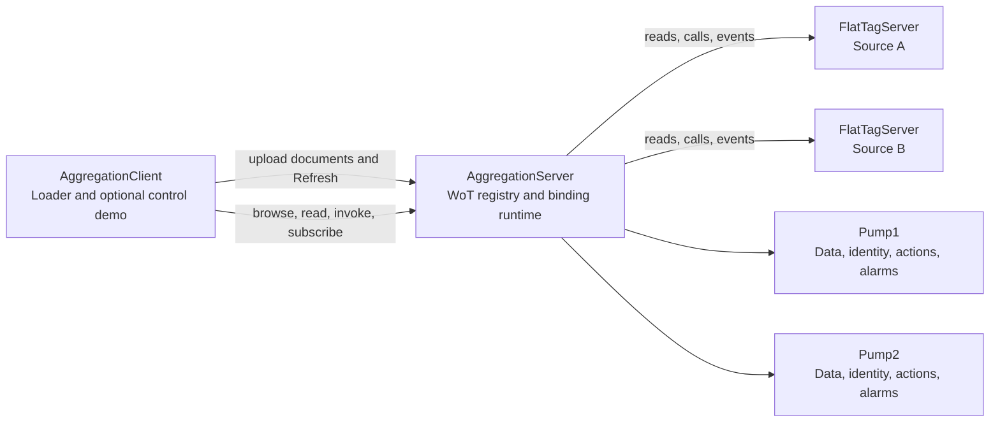

# WoT aggregation sample

The WoT aggregation sample loads the DI, Machinery, and Pumps companion models
and two pump instances from linked WoT documents. A generic aggregation server
binds their properties, management actions, and alarm notifications to two
independent OPC UA source servers.

The aggregation server contains no Pump-specific generated code and does not reference the DI, Machinery, or Pumps server/model assemblies. The complete DI/Machinery/Pumps/Pump instance shape is runtime-loaded from the files in [`samples/WotCon/AggregationClient/Documents`](AggregationClient/Documents) through the generic WoT-to-NodeSet converter, runtime NodeSet loader, and target-mapping binding runtime.

The documents ship with the client because the client is what uploads them. The aggregation server has no build-time or run-time dependency on them: it receives whatever the client writes into the registry.

## Topology

There are three long-running server processes:



`AggregationClient` is a fourth, short-lived process. It uploads the document
manifest, calls `Refresh`, discovers both pumps by browsing from `Objects`, and
reads fifteen values per pump. With `--exerciseControls true`, it also invokes
Start, Stop, and Reset, subscribes to projected alarms, and acknowledges and
confirms occurrences through the aggregate while inspecting independent source
state. Controls are opt-in because they change the source servers.

Source A and Source B expose deliberately flat variables. They do not expose a Pump companion-model hierarchy. The aggregation server creates that hierarchy from the WoT documents and routes each materialized variable to its selected upstream source.

Each flat source exposes two upstream pump roots, `Pump1` and `Pump2`. The
aggregate preserves this separation: each action has one explicit source
owner, and each projected alarm has a source- and pump-specific occurrence
route. Alternative forms are not an instruction to invoke multiple sources.

## Prerequisites

The complete sample requires .NET 8, .NET 9, or .NET 10. `AggregationServer` intentionally targets only `net8.0`, `net9.0`, and `net10.0` because the OPC UA executor required by the checked-in mappings is available only on those frameworks. Legacy `CustomTestTarget` solution builds replace that project with the repository's no-op shell; those matrix builds are not runnable aggregation-server configurations. `FlatTagServer` and `AggregationClient` remain on the shared application target matrix for standalone compatibility, but a runnable end-to-end topology always requires the modern aggregation server.

Run the commands below from the repository root with the .NET 10 SDK. All three
executables and their direct `Build` / `BuildHost` APIs reject untrusted peer
certificates by default. Clients select `SignAndEncrypt` / `Basic256Sha256`;
servers do not offer an unsecured session endpoint. Registry mutation requires
an authenticated `SecurityAdmin` on an encrypted channel.

## Run an explicitly unsecured local demonstration

The four-terminal commands below deliberately opt into unsecured channels and
anonymous registry management. Use them only on an isolated lab network. They
do not need certificate auto-accept because these connections select None.
Choose separate persistent `--pkiRoot` directories for each application when
provisioning certificates; never share source A and source B application stores.

The existing `run-aggregation-demo.ps1` wrapper must be updated to forward these
explicit opt-ins before it can run against the hardened executables. Until that
separate wrapper update is applied, use the manual commands below, not the old
implicit-trust script invocation.

Start Source A in the first terminal:

```powershell
dotnet run --project samples/WotCon/FlatTagServer/FlatTagServer.csproj -f net10.0 -- `
  --security-none `
  --port 62551 `
  --instanceName SourceA `
  --applicationName FlatTagServerSourceA `
  --namespace urn:opcfoundation.org:UA:WotAggregation:SourceA `
  --differentialPressure 111.25 `
  --fluidTemperature 301.15 `
  --massFlow 0.42 `
  --level 4.25 `
  --cavitation true `
  --pump2DifferentialPressure 211.25 `
  --pump2FluidTemperature 304.15 `
  --pump2MassFlow 0.52 `
  --pump2Level 4.75 `
  --pump2Cavitation false
```

Start Source B in the second terminal:

```powershell
dotnet run --project samples/WotCon/FlatTagServer/FlatTagServer.csproj -f net10.0 -- `
  --security-none `
  --port 62552 `
  --instanceName SourceB `
  --applicationName FlatTagServerSourceB `
  --namespace urn:opcfoundation.org:UA:WotAggregation:SourceB `
  --bearingTemperature 333.15 `
  --pumpPowerInput 17.75 `
  --pumpEfficiency 91.5 `
  --numberOfStarts 23 `
  --motorOverheat true `
  --pump2BearingTemperature 337.15 `
  --pump2PumpPowerInput 19.75 `
  --pump2PumpEfficiency 89.5 `
  --pump2NumberOfStarts 31 `
  --pump2MotorOverheat false
```

Start the generic aggregation server in the third terminal:

```powershell
dotnet run --project samples/WotCon/AggregationServer/AggregationServer.csproj -f net10.0 -- `
  --security-none --allow-anonymous-management `
  --port 62550 `
  --applicationName AggregationServer
```

Run the loader/client in a fourth terminal after all three servers are listening:

```powershell
dotnet run --project samples/WotCon/AggregationClient/AggregationClient.csproj -f net10.0 -- `
  --security-none `
  --aggregationEndpoint opc.tcp://localhost:62550/AggregationServer `
  --sourceAEndpoint opc.tcp://localhost:62551/SourceA `
  --sourceBEndpoint opc.tcp://localhost:62552/SourceB `
  --documentsDirectory ./samples/WotCon/AggregationClient/Documents `
  --exerciseControls true `
  --timeoutSeconds 480
```

The client reports the actual manifest resource count, refresh outcomes, both
recursively browsed pump hierarchies, and their typed values. The
`WOT_AGGREGATION_CONTROLS_OK` marker appears only after all four pump/source
workflows finish. `-ClientTimeoutSeconds` bounds the script's client process;
`--timeoutSeconds` bounds a manually launched client.

## Secure provisioning and authenticated management

Remove **all** lab switches for the secure path. Provision each application's
certificate and trust lists through the existing
[certificate-manager APIs](../../docs/CertificateManager.md), or import verified
public certificates using the certificate-store APIs. For self-signed peers,
verify the application URI, endpoint hostname, validity and fingerprint out of
band before adding the certificate to the peer trust list. Do not copy private
keys between distinct applications or import an entire rejected store blindly.

Trust must be mutual on each connection: loader and aggregation host; aggregation
host and Source A; aggregation host and Source B. The optional control demo also
opens direct loader-to-source connections, so provision those two pairs too.
Use stable application names/URIs and explicit PKI roots across restarts. In a
combined DI server/client host, use its effective application configuration and
certificate manager when exporting the aggregate's certificate and updating
trust; do not assume that a separately named upstream client has a second
application certificate.

The stock aggregation executable intentionally has no built-in administrator
account. Without the anonymous-management lab opt-in it is locked down. Embed
`AggregationServerHost.Build` to inject your authenticated user database and
role mapping; never give an anonymous identity the administrator role. For
example, given an already populated `IUserDatabase users` and `adminUserName`:

```csharp
using IHost host = AggregationServerHost.Build(new AggregationServerOptions
{
    PkiRoot = aggregatePkiRoot,
    ConfigureAuthentication = server =>
    {
        server.Services.AddSingleton<IUserDatabase>(users);
        server.Services.AddSingleton<IUserManagement>(services =>
            new UserManagement(services.GetRequiredService<IUserDatabase>()));
        server.Services.Configure<OpcUaServerOptions>(options =>
        {
            options.UserTokenPolicies.Add(new OpcUaUserTokenPolicy { TokenType = UserTokenType.Anonymous });
            options.UserTokenPolicies.Add(new OpcUaUserTokenPolicy { TokenType = UserTokenType.UserName });
        });
        server.AddDefaultIdentityAuthenticators(options =>
        {
            options.EnableAnonymous = true;
            options.EnableUserNamePassword = true;
            options.EnableX509 = false;
            options.EnableJwt = false;
        });
        server.ConfigureRoles(options =>
        {
            var role = new RoleDefinitionOptions { Name = "SecurityAdmin" };
            role.Identities.Add(new RoleIdentityMappingOptions
            {
                CriteriaType = IdentityCriteriaType.UserName,
                Criteria = adminUserName
            });
            options.Roles.Add(role);
        });
    }
});
await host.RunAsync(cancellationToken);
```

Anonymous bootstrap/read sessions are distinct from management authorization:
they cannot upload documents or call `Refresh`. The example leaves that
authorization at its secure default while the managed client activates its
username identity. Create users before constructing `UserManagement`, which
loads their active-state metadata at construction.

Use `Opc.Ua.Identity.UserNamePasswordIdentityProvider` with a password already
provisioned in an `ISecretRegistry`; passwords do not belong in CLI arguments or
checked-in configuration:

```csharp
var options = new AggregationClientOptions
{
    AggregationEndpoint = aggregationEndpoint,
    SourceAEndpoint = sourceAEndpoint,
    SourceBEndpoint = sourceBEndpoint,
    PkiRoot = clientPkiRoot,
    DocumentsDirectory = documentsDirectory,
    IdentityProvider = new UserNamePasswordIdentityProvider(adminUserName, secrets, passwordId)
};
AggregationClientResult result = await AggregationClientRunner.RunAsync(options, cancellationToken);
```

For a disposable encrypted demonstration without provisioning trust, explicitly
pass `--auto-accept` to every participating application and
`--allow-anonymous-management` to the aggregate, but **not** `--security-none`.
This still encrypts traffic, but does not authenticate unknown peer certificates;
it is not equivalent to the provisioned configuration above.

## Command-line and programmatic options

| CLI switch | Default | Direct option / effect |
| --- | --- | --- |
| `--auto-accept` | `false` | `AutoAcceptUntrustedCertificates`; unknown peer trust only, never endpoint security or user authorization. On the aggregate this covers inbound clients and upstream servers. |
| `--security-none` | `false` | Servers: `IncludeUnsecurePolicyNone`; client: `UseSecurityPolicyNone`. On the aggregate it also selects None for upstream sessions. |
| `--allow-anonymous-management` | `false` | Aggregate only: `AllowAnonymousManagement`. Permits registry mutation by anonymous callers; the channel remains encrypted unless None was also explicitly enabled. |
| `--help` | n/a | Prints help and exits without creating PKI or opening listeners/connections. Unknown or malformed switches fail before startup. |

Each boolean accepts explicit `=false`. Security choices come only from these
sample switches (or explicit direct-host options), not generic-host environment,
JSON or `key=value` settings. Ordinary host settings retain JSON/environment
defaults; forwarded settings after a second `--` are overridden by positional
`key=value`, then by an explicit sample switch such as `--port`. There is no
broad `--insecure` alias in these three executables.

`FlatTagServer` reads the following command-line configuration keys:

| Key | Default | Meaning |
| --- | --- | --- |
| `endpoint` | unset | Complete endpoint URL; when set, overrides `host`, `port`, and the generated path. |
| `host` | `localhost` | Endpoint host used when `endpoint` is unset. |
| `port` | `62551` | Endpoint port used when `endpoint` is unset. |
| `instanceName` | `SourceA` | Endpoint path and source instance name. |
| `applicationName` | `FlatTagServer` | OPC UA application name. |
| `namespace` | Source A namespace URI | Must be exactly the Source A or Source B namespace URI. |
| `pkiRoot` | temporary application directory | Optional certificate-store root. |
| `manufacturer` | `SimPump Corp` | Pump1 Manufacturer, exposed as LocalizedText. |
| `serialNumber` | `SN-001` | Pump1 SerialNumber. |
| `productInstanceUri` | `urn:simdevice:SimPump:PumpX-2000:SN-001` | Pump1 stable product identity. |
| `pump2Manufacturer` | `SimPump Corp` | Pump2 Manufacturer. |
| `pump2SerialNumber` | `SN-002` | Pump2 SerialNumber. |
| `pump2ProductInstanceUri` | `urn:simdevice:SimPump:PumpX-2000:SN-002` | Pump2 stable product identity. |
| `differentialPressure` | `2.75` | Flat source value. |
| `fluidTemperature` | `315.65` | Flat source value. |
| `massFlow` | `0.1825` | Flat source value. |
| `level` | `6.75` | Flat source value. |
| `cavitation` | `false` | Flat source value. |
| `bearingTemperature` | `328.4` | Flat source value. |
| `pumpPowerInput` | `12.5` | Flat source value. |
| `pumpEfficiency` | `88.0` | Flat source value. |
| `numberOfStarts` | `17` | Flat source value. |
| `motorOverheat` | `false` | Flat source value. |
| `pump2DifferentialPressure` | `3.25` | Pump2 flat source value. |
| `pump2FluidTemperature` | `318.15` | Pump2 flat source value. |
| `pump2MassFlow` | `0.275` | Pump2 flat source value. |
| `pump2Level` | `5.5` | Pump2 flat source value. |
| `pump2Cavitation` | `false` | Pump2 flat source value. |
| `pump2BearingTemperature` | `331.4` | Pump2 flat source value. |
| `pump2PumpPowerInput` | `14.25` | Pump2 flat source value. |
| `pump2PumpEfficiency` | `84.5` | Pump2 flat source value. |
| `pump2NumberOfStarts` | `29` | Pump2 flat source value. |
| `pump2MotorOverheat` | `false` | Pump2 flat source value. |

`AggregationServer` reads `endpoint`, `host` (`localhost`), `port` (`62550`), `applicationName`
(`AggregationServer`), `pkiRoot`, and `maximumDocumentBytes` (`33554432`).

`AggregationClient` reads `aggregationEndpoint`, `sourceAEndpoint`, `sourceBEndpoint`,
`applicationName` (`AggregationClient`), `pkiRoot`, `documentsDirectory`,
`exerciseControls` (`false`), and `timeoutSeconds` (`480`, range 1-3600).

## Checked-in document set

[`documents.json`](AggregationClient/Documents/documents.json) is the authoritative
inventory. It contains linked DI, Machinery, and Pumps documents, two pump
instance closures, and six projection documents per pump: Members,
ProcessData, ConditionData, Supervision, Management, and Asset.

`WotAggregationDocumentGenerator` starts with the checked-in companion NodeSets
and `SamplePump.NodeSet2.xml`. `FromNodeSetDocumentsAsync` verifies each linked
export by reconstructing the complete source facts. The generator then enriches
existing affordances by local identity with source-specific forms. It does not
replace the generated maps or add Nodes over an authoritative native partition.
Dependencies describe actual document references and ownership, not an arbitrary
upload chain. Use the manifest rather than assuming a fixed resource count.

Checked-in JSON uses sorted members, two-space indentation, and LF line endings.
Generated filenames use single hyphens with no trailing hyphen before `.json`.
The manifest maps those filenames to stable registry resource IDs; document
links and dependencies use the resource IDs, not inferred filenames.

Localizations, type bindings, method arguments, engineering units and ranges,
ordered event selections, and Condition-action relationships remain in the
generated documents. Event severity comes from the source occurrence, not an
invented severity property on an asset projection. See
[WoT / NodeSet conversion](../../docs/WoTNodeSetConversion.md) for the representation
and preservation rules.

The DI documents use **DI 1.05.0**. `ConnectsTo` derives from
`NonHierarchicalReferences`, as required by
[OPC 10000-100](https://reference.opcfoundation.org/specs/OPC-10000-100/5.5)
Section 5.5 Table 48. `DiConnectsToIsANonHierarchicalReference` pins that
relationship when the source NodeSet is refreshed.

### Asset projection shape

The checked-in Asset documents use the same shape for each modeled unit:

* A member projection selects the affordances that belong to the unit and keeps them addressable by stable local names.
* `ProcessData` and `ConditionData` are dataset projections. Their selected properties are annotated as
  `dataPoint` members so a consumer can browse measurements separately from the larger unit.
* `Supervision` contains the two supervision signal Variables and their two EventTypes.
* `Management` contains two Running Variables, six source-owned management Methods,
  four Condition-action Methods, and the two EventTypes those actions reference.
* The Asset projection organizes those four groups and selects only identity data at the Asset level. The group
  documents therefore shape browsing; they do not define another copy of the selected affordances.

Every selected member must resolve to a real local Node. A projection shapes
browsing; it does not synthesize missing Methods, EventTypes, or pump instances.
Both ProcessData and ConditionData contain four measurement Nodes. Supervision
contains four Nodes and Management fourteen, with no cross-pump membership.

### Native preservation within a linked set

An incomplete readable partition carries its complete authoritative `uav:nodes`
representation. This preserves model facts that are not reproduced by its
readable view; it is neither a whole-model singleton disguised as a linked set
nor an invitation to overlay additional Nodes. Complete readable partitions do
not need the native representation.

Nested Variable Properties, including `EURange` and `EngineeringUnits`, are
part of conversion and browsing. The source comparison covers model metadata,
attributes, references, values, and extensions as well as Node identities.
Top-level XML Node ordering can change when partitioning; ordered method
arguments, definition fields, and references remain significant. Routing-only
JSON added by the sample is retained as residue and accounted for separately
from the original model facts.

### Upload order is not a server requirement

The registry accepts documents in any order. Upload order affects only when the Pump becomes visible, never whether it can be materialized:

* A dependency closure is projected only when it is complete. While a referenced Thing Model is still missing, `WotDependencyGraph` reports the closure as not projectable, `WotMaterializationCoordinator` marks its members failed in the `DependencyResolution` phase, and the previously active generation is retained. Nothing partial is published into the address space.
* As soon as the last missing document arrives, the same closure becomes projectable and the Pump appears in one atomic generation switch.

The dependency declarations in `documents.json` are therefore a description of the model, not an upload protocol. The manifest is still validated locally before upload, because a manifest that references a document it does not contain, or that contains a cycle, is an authoring error in the sample rather than a legitimate partial upload.

`WotRegistryClient.LoadDocumentsAsync` additionally guarantees that Thing Models are processed before Thing Descriptions while preserving the caller's relative order within each document kind.

### Progress while a closure is incomplete

Both refresh models are valid, and the sample shows the second one:

* **`AutoRefresh = true` (registry default).** Every upload triggers a refresh, so a client can watch the closure fill in. Members of an incomplete closure raise `WoTLoadFailureEventType` with `LoadState` and a `DependencyResolution` reason naming the unresolved reference, and each completed pass raises `WoTRefreshCompletedEventType` with its summary and generation. Subscribing to the registry object therefore yields per-document progress and status until the closure completes.
* **`AutoRefresh = false`.** No intermediate projections and no intermediate events. The caller uploads everything and then triggers exactly one `Refresh`.

## Endpoint placeholder substitution

The pump documents contain `${SOURCE_A_ENDPOINT}` and `${SOURCE_B_ENDPOINT}`
placeholders. `AggregationClientRunner.LoadDocumentsAsync` substitutes exact
`href` values in document-level and affordance-level forms across the manifest,
entirely in memory. It does not interpret links, schema defaults, native
projections, preservation envelopes, or vendor metadata as endpoint addresses.
Documents without a substitutable form retain their original bytes. No generated
file is rewritten by the client.

Each property form also contains a portable upstream `uav:id` using the source server's `nsu=` namespace URI. The property affordance contains a separate `uav:mapToNodeId` using the materialized Pump-instance namespace. The form therefore describes where to read, while the affordance describes where the value belongs in the aggregate model.

## Registry upload and Refresh

The client creates a `WotRegistryClient` through `AddWotRegistryClient`, loads the manifest documents, and calls:

```csharp
WotRegistryBulkLoadResult loadResult = await client.LoadDocumentsAsync(
    documents,
    refresh: true,
    requestId: Guid.NewGuid().ToString("N"),
    ct: cancellationToken);
```

For each document, the registry client get-or-creates the correct Thing Model or Thing Description group, get-or-creates the resource, and uploads a new version through the inherited OPC UA `FileType` transfer. With `refresh: true`, it then calls `RefreshAllAsync`. The aggregation server validates dependencies, converts each document closure to NodeSet2, prepares its binding plans, imports the NodeSets, wires the OPC UA target mappings, and publishes the new generation.

The sample aggregation server sets `AutoRefresh = false` so manifest uploads do
not cause intermediate projections. The explicit final `Refresh` activates the
complete dependency closure. A deployment that wants live progress instead
leaves `AutoRefresh` at its default `true` and consumes the events described above.

## Pump companion-model shape

The materialized namespace is `urn:opcfoundation.org:UA:WotAggregation:PumpInstance`,
with roots `Pump1` and `Pump2` organized beneath `Objects`. Both use the same
companion-model hierarchy; the names below use Pump1 as an example:

* `Pump1` has the Pumps `PumpType` definition.
* `Pump1.Identification` uses the Pumps `PumpIdentificationType`, which OPC 40223 declares for `PumpType.Identification`. It is a subtype of Machinery's `MachineryItemIdentificationType` and ultimately of DI's `FunctionalGroupType`, so the DI identification properties remain available on it.
* `Operational`, `Operational.Measurements`, `Events`, `Events.SupervisionProcessFluid`, and `Events.SupervisionPumpOperation` use their Pumps type definitions.
* The hierarchy contains Identification, Operational, Events, and Maintenance groups.
* Measurements contain DifferentialPressure, FluidTemperature, BearingTemperature, PumpPowerInput, MassFlow, PumpEfficiency, Level, and NumberOfStarts.
* Event supervision groups contain Cavitation and MotorOverheat variables.

These nodes are not compiled into `AggregationServer`. They are produced from the DI, Machinery, Pumps, and Sample Pump WoT documents at runtime.

### Cross-checked against a hand-written server

[`WotPumpAddressSpaceComparisonTests`](../../tests/Opc.Ua.WotCon.Samples.Tests/WotPumpAddressSpaceComparisonTests.cs)
compares the declared companion-model subset against
[`PumpDeviceIntegrationServer`](../DI/PumpDeviceIntegrationServer), which builds
an OPC 40223 Pump from generated companion-model code. This provides an
independent oracle rather than only comparing the WoT documents with themselves.

It asserts two things separately:

* The complete original companion-model subset has the same BrowseNames,
  NodeClasses, and type definitions as the native `Pump_1`. The aggregation
  sample's source-specific controls and Condition proxy subtrees are separate
  sample extensions, not claimed as native Pump parity.
* The DI, Machinery and Pumps *type* definitions are equal in both servers. Both derive from the same companion models, so a difference there is a defect rather than a scope decision.

Comparison is on namespace URIs and browse names throughout; NodeIds, namespace indexes, modelling rules and values legitimately differ between the two servers and are ignored.

The native server also supplies additional Identification, alarm, simulation,
and OpenUSD features. Those are outside this sample's declared subset.

## Values from both sources

Each pump routes four measurement Variables and one supervision signal to each
source:

| Materialized Pump property | Upstream source |
| --- | --- |
| DifferentialPressure | Source A |
| FluidTemperature | Source A |
| MassFlow | Source A |
| Level | Source A |
| Cavitation | Source A |
| BearingTemperature | Source B |
| PumpPowerInput | Source B |
| PumpEfficiency | Source B |
| NumberOfStarts | Source B |
| MotorOverheat | Source B |

Three identity Properties come from Source A: Manufacturer (`LocalizedText`),
SerialNumber (`String`), and ProductInstanceUri (`String`). SourceARunning and
SourceBRunning expose each source's independent Boolean state. Together these
make fifteen readings per pump.

The example command values distinguish the pumps: Pump1 DifferentialPressure
is `111.25`, while Pump2 is `211.25`; their BearingTemperature values are
`333.15` and `337.15`. Readings use the aggregate's local NodeIds. Direct source
connections are used only by the optional control demonstration as an independent
side-effect oracle.

## Management and alarm workflow

For each pump, `SourceAStart`, `SourceAStop`, and `SourceAReset` invoke only Source
A. The corresponding `SourceB*` Methods invoke only Source B. Reset clears that
source's supervision signal; it does not acknowledge or confirm operator
obligations.

`CavitationAlarm` and `MotorOverheatAlarm` identify local EventTypes. Their
mutable Condition instances and emitted occurrences are distinct objects.
Event forms subscribe to the owning upstream pump with explicit selected
fields, including EventId and Condition identity/state. The aggregate publishes
through its local notifier hierarchy and maps each local occurrence EventId
back to the selected source.

`CavitationAcknowledge` / `CavitationConfirm` and
`MotorOverheatAcknowledge` / `MotorOverheatConfirm` carry
`uav:conditionAction` and same-document `uav:actsOn` relationships. A native OPC
UA call supplies EventId followed by Comment; use `LocalizedText.Null` for an
omitted comment. A WoT invocation may omit an optional Comment, which the OPC
UA binding normalizes to that second slot. After acknowledgement, use the
EventId from the updated occurrence for confirmation.

The demo initializes the source Condition, subscribes through the aggregate,
trips the signal, acknowledges and confirms the emitted occurrence, then calls
Reset. Return to normal alone leaves an unacknowledged or unconfirmed Condition
retained. Wrong or evicted occurrence IDs do not fall back to another source.
Shelving, suppression, dialog, and cross-WoT ConditionRefresh mappings are not
part of this demonstration.

## Local monitored items

The target-mapping runtime wires the materialized variables to async read handlers. Local OPC UA monitored items on the aggregation server sample those handlers, so creating a monitored item for `Pump1.Operational.Measurements.DifferentialPressure` reads Source A through the same compiled form and lazy OPC UA channel used by an ordinary Read.

The runtime does not create a second upstream observation bridge for the form's `observeproperty` operation. This keeps local sampling under the aggregation server's subscription engine and avoids duplicate upstream subscriptions.

The integration test creates a real subscription and monitored item with a 50 ms requested sampling interval, publishes the initial Source A differential-pressure value, and keeps that monitored item alive across a generation replacement.

## Version replacement and shadow drain

Uploading another version of a pump document and calling `RefreshAllAsync`
creates a shadow runtime NodeSet generation. New reads and monitored items use
the new generation without disconnecting clients. Existing monitored items
remain attached to the old generation until they are deleted or otherwise drain.

[`WotSampleEndToEndTests.cs`](../../tests/Opc.Ua.WotCon.Samples.Tests/WotSampleEndToEndTests.cs)
locates the actual document owning Pump1 DifferentialPressure, changes its
mapping to Source B BearingTemperature, uploads a replacement, and refreshes.
New reads use Source B while an existing monitored item can continue receiving
Source A from the retired generation. Deleting that subscription releases its
retired-generation consumer.

If conversion, mapping resolution, channel wiring, or shadow activation fails, the previous active generation remains in service and the failed refresh reports per-resource diagnostics.

## Troubleshooting

### The client cannot connect

Verify that all three server processes are listening and that the client endpoint paths exactly match `/SourceA`, `/SourceB`, and `/AggregationServer`. The generic-host command-line syntax requires the `--` separator after `dotnet run` options.

`BadCertificateUntrusted` requires verified trust-list provisioning on both
peers, not `--security-none`. A missing matching upstream endpoint now fails
with `BadSecurityPolicyRejected` instead of retrying a fabricated None endpoint.
`BadUserAccessDenied` during upload or `Refresh` requires an authenticated
`SecurityAdmin` on `SignAndEncrypt`; trusting a certificate alone does not grant
that user role.

### The source namespace is rejected

`FlatTagServer` accepts only `urn:opcfoundation.org:UA:WotAggregation:SourceA` or `urn:opcfoundation.org:UA:WotAggregation:SourceB`. Use the matching namespace and endpoint placeholder for each process.

### The manifest fails before upload

`documents.json contains a missing or cyclic dependency` means a `dependsOn` id is absent, duplicated, or cyclic. Keep resource ids unique and preserve the DI → Machinery → Pumps → Pump TD dependency graph.

### Refresh reports a document failure

Inspect the printed resource phase, outcome, and message. Invalid JSON fails format validation. A malformed or unresolved `uav:mapToNodeId` fails activation. A missing upstream server normally allows upload and projection but causes a mapped Read to fail when its lazy channel first connects.

### Reads return `BadNodeIdUnknown` or `BadNodeIdInvalid`

Check both NodeIds in the Pump TD. The form's `uav:id` must use the correct Source A or Source B namespace URI and source variable id. The affordance's `uav:mapToNodeId` must use the Pump-instance namespace and a node created by the runtime-loaded documents. Prefer `nsu=` to numeric namespace indexes.

### Values appear to come from the wrong source

Check the endpoint placeholder assignment first, then inspect the property form's upstream `uav:id`. The five Source A and five Source B assignments are listed above. The aggregation client prints stable materialized property names, so a wrong value usually indicates a TD form mapping rather than a browse problem.

### A replaced value is still observed

An existing monitored item intentionally remains on the retired generation until it drains. Create a new monitored item or delete the old subscription to observe the replacement generation immediately. Ordinary reads after the successful shadow switch use the new generation.

## Run the integration tests

The real sample tests launch all three servers in process with isolated ports and PKI roots:

```powershell
dotnet test tests/Opc.Ua.WotCon.Samples.Tests/Opc.Ua.WotCon.Samples.Tests.csproj -f net10.0 --filter "TestCategory=Samples"
```

The suite covers both pump hierarchies and all typed readings, exact projection
membership, source-owned management actions, Condition round trips, local
monitored items, replacement and shadow drain, invalid documents, missing
dependencies, invalid target mappings, and unavailable upstream endpoints.
Targeted startup tests cover direct defaults, independent flags and precedence,
help without PKI, provisioned encrypted upstream connections, and authenticated
registry management with anonymous denial. The same project also runs the
small onboarding executable bootstrap/authorization regressions.

## NativeAOT publishing

All three server/client sample projects set `PublishAot` for `net10.0`. Publish each process for the target runtime identifier; for Windows x64:

```powershell
dotnet publish samples/WotCon/FlatTagServer/FlatTagServer.csproj -c Release -f net10.0 -r win-x64 --self-contained true
dotnet publish samples/WotCon/AggregationServer/AggregationServer.csproj -c Release -f net10.0 -r win-x64 --self-contained true
dotnet publish samples/WotCon/AggregationClient/AggregationClient.csproj -c Release -f net10.0 -r win-x64 --self-contained true
```

Use the published `FlatTagServer.exe` twice with the Source A and Source B arguments above. The client project includes the checked-in `Documents` tree in its publish output, so omit `--documentsDirectory` to use `<publish-directory>/Documents` or pass an explicit external copy.

## Related documentation

* [WoT protocol bindings](../../docs/WotBindings.md)
* [WoT Connectivity model, server, registry, and client](../../docs/WoTConnectivity.md)
