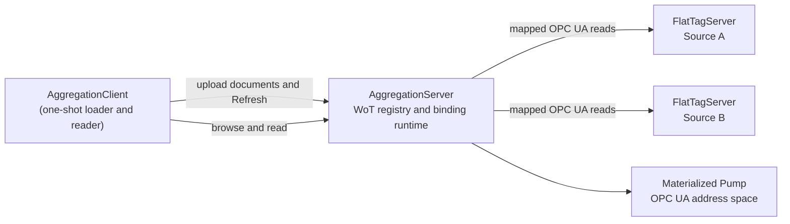

# WoT aggregation sample

The WoT aggregation sample demonstrates a generic OPC UA server that loads DI, Machinery, Pumps, and Pump-instance shape from WoT Thing Models and a Thing Description, then binds the materialized Pump variables to values read from two independent OPC UA source servers.

The aggregation server contains no Pump-specific generated code and does not reference the DI, Machinery, or Pumps server/model assemblies. The complete DI/Machinery/Pumps/Pump instance shape is runtime-loaded from the files in [`samples/WotCon/AggregationClient/Documents`](AggregationClient/Documents) through the generic WoT-to-NodeSet converter, runtime NodeSet loader, and target-mapping binding runtime.

The documents ship with the client because the client is what uploads them. The aggregation server has no build-time or run-time dependency on them: it receives whatever the client writes into the registry.

## Topology

There are three long-running server processes:



`AggregationClient` is a fourth, short-lived process. It connects to the aggregation server, uploads the checked-in documents, calls `Refresh`, browses the materialized Pump, reads ten values, prints the result, and exits.

Source A and Source B expose deliberately flat variables. They do not expose a Pump companion-model hierarchy. The aggregation server creates that hierarchy from the WoT documents and routes each materialized variable to its selected upstream source.

Each flat source exposes two upstream pump roots, `Pump1` and `Pump2`. Both roots use the same Source A / Source B split so the aggregation server can later prove that asset projections and alarms remain per-pump rather than accidentally global.

## Prerequisites

The complete sample requires .NET 8, .NET 9, or .NET 10. `AggregationServer` intentionally targets only `net8.0`, `net9.0`, and `net10.0` because the OPC UA executor required by the checked-in mappings is available only on those frameworks. Legacy `CustomTestTarget` solution builds replace that project with the repository's no-op shell; those matrix builds are not runnable aggregation-server configurations. `FlatTagServer` and `AggregationClient` remain on the shared application target matrix for standalone compatibility, but a runnable end-to-end topology always requires the modern aggregation server.

Run the commands below from the repository root with the .NET 10 SDK. The samples accept unencrypted anonymous OPC UA connections for local demonstration and auto-accept untrusted certificates; do not copy those security settings into a production deployment.

## Run the sample

From the repository root, the demo script builds all three applications, starts
the two source servers and aggregation server with isolated PKI stores, waits
for their endpoints, runs the client, verifies all sixteen uploads and ten Good
values, and stops the exact server processes:

```powershell
pwsh samples/WotCon/run-aggregation-demo.ps1
```

Use different local ports or keep the captured logs and PKI stores with:

```powershell
pwsh samples/WotCon/run-aggregation-demo.ps1 `
  -AggregationPort 62650 `
  -SourceAPort 62651 `
  -SourceBPort 62652 `
  -Keep
```

To run each process manually instead, use the four terminals below.

Start Source A in the first terminal:

```powershell
dotnet run --project samples/WotCon/FlatTagServer/FlatTagServer.csproj -f net10.0 -- `
  --port 62551 `
  --instanceName SourceA `
  --applicationName FlatTagServerSourceA `
  --namespace urn:opcfoundation.org:UA:WotAggregation:SourceA `
  --differentialPressure 111.25 `
  --fluidTemperature 301.15 `
  --massFlow 0.42 `
  --level 4.25 `
  --cavitation true `
  --pump2DifferentialPressure 211.25 `
  --pump2FluidTemperature 304.15 `
  --pump2MassFlow 0.52 `
  --pump2Level 4.75 `
  --pump2Cavitation false
```

Start Source B in the second terminal:

```powershell
dotnet run --project samples/WotCon/FlatTagServer/FlatTagServer.csproj -f net10.0 -- `
  --port 62552 `
  --instanceName SourceB `
  --applicationName FlatTagServerSourceB `
  --namespace urn:opcfoundation.org:UA:WotAggregation:SourceB `
  --bearingTemperature 333.15 `
  --pumpPowerInput 17.75 `
  --pumpEfficiency 91.5 `
  --numberOfStarts 23 `
  --motorOverheat true `
  --pump2BearingTemperature 337.15 `
  --pump2PumpPowerInput 19.75 `
  --pump2PumpEfficiency 89.5 `
  --pump2NumberOfStarts 31 `
  --pump2MotorOverheat false
```

Start the generic aggregation server in the third terminal:

```powershell
dotnet run --project samples/WotCon/AggregationServer/AggregationServer.csproj -f net10.0 -- `
  --port 62550 `
  --applicationName AggregationServer
```

Run the loader/client in a fourth terminal after all three servers are listening:

```powershell
dotnet run --project samples/WotCon/AggregationClient/AggregationClient.csproj -f net10.0 -- `
  --aggregationEndpoint opc.tcp://localhost:62550/AggregationServer `
  --sourceAEndpoint opc.tcp://localhost:62551/SourceA `
  --sourceBEndpoint opc.tcp://localhost:62552/SourceB `
  --documentsDirectory ./samples/WotCon/AggregationClient/Documents
```

The client should report sixteen uploaded resources, a successful refresh generation, the recursively browsed Pump
hierarchy, and ten Good values.

## Command-line and programmatic options

`FlatTagServer` reads the following command-line configuration keys:

| Key | Default | Meaning |
| --- | --- | --- |
| `endpoint` | unset | Complete endpoint URL; when set, overrides `host`, `port`, and the generated path. |
| `host` | `localhost` | Endpoint host used when `endpoint` is unset. |
| `port` | `62551` | Endpoint port used when `endpoint` is unset. |
| `instanceName` | `SourceA` | Endpoint path and source instance name. |
| `applicationName` | `FlatTagServer` | OPC UA application name. |
| `namespace` | Source A namespace URI | Must be exactly the Source A or Source B namespace URI. |
| `pkiRoot` | temporary application directory | Optional certificate-store root. |
| `differentialPressure` | `2.75` | Flat source value. |
| `fluidTemperature` | `315.65` | Flat source value. |
| `massFlow` | `0.1825` | Flat source value. |
| `level` | `6.75` | Flat source value. |
| `cavitation` | `false` | Flat source value. |
| `bearingTemperature` | `328.4` | Flat source value. |
| `pumpPowerInput` | `12.5` | Flat source value. |
| `pumpEfficiency` | `88.0` | Flat source value. |
| `numberOfStarts` | `17` | Flat source value. |
| `motorOverheat` | `false` | Flat source value. |
| `pump2DifferentialPressure` | `3.25` | Pump2 flat source value. |
| `pump2FluidTemperature` | `318.15` | Pump2 flat source value. |
| `pump2MassFlow` | `0.275` | Pump2 flat source value. |
| `pump2Level` | `5.5` | Pump2 flat source value. |
| `pump2Cavitation` | `false` | Pump2 flat source value. |
| `pump2BearingTemperature` | `331.4` | Pump2 flat source value. |
| `pump2PumpPowerInput` | `14.25` | Pump2 flat source value. |
| `pump2PumpEfficiency` | `84.5` | Pump2 flat source value. |
| `pump2NumberOfStarts` | `29` | Pump2 flat source value. |
| `pump2MotorOverheat` | `false` | Pump2 flat source value. |

`AggregationServer` reads `endpoint`, `host` (`localhost`), `port` (`62550`), `applicationName`
(`AggregationServer`), `pkiRoot`, and `maximumDocumentBytes` (`33554432`).

`AggregationClient` reads `aggregationEndpoint`, `sourceAEndpoint`, `sourceBEndpoint`,
`applicationName` (`AggregationClient`), `pkiRoot`, and `documentsDirectory`.

## Checked-in document set

[`documents.json`](AggregationClient/Documents/documents.json) declares the sample document set and the dependencies between its entries:

1. `Opc.Ua.Di.tm.json` as `thingmodels/opc-ua-di`.
2. `Opc.Ua.Machinery.tm.json` as `thingmodels/opc-ua-machinery`, depending on DI.
3. `Opc.Ua.Pumps.tm.json` as `thingmodels/opc-ua-pumps`, depending on DI and Machinery.
4. `SamplePump.td.json` as `thingdescriptions/sample-pump`, depending on all three Thing Models.
5. `Pump1.*.td.json` and `Pump2.*.td.json` as Thing Description projection documents, depending on
   `SamplePump.td.json`. Each pump has a member projection, four group projections (`ProcessData`,
   `ConditionData`, `Supervision`, `Management`), and an Asset projection that organizes those groups.

Each Thing Model is generated from a checked-in NodeSet2 by `WotAggregationDocumentGenerator`, and `WotAggregationDocumentTests.ThingModelsMatchCanonicalConverterRegeneration` asserts the checked-in file is byte-identical to that output, so the documents cannot drift from their sources.

Because the checked-in documents are generated output, a converter change shows up here as a re-generated document set. The current set was regenerated for WoT Binding revision 1.1: the companion Thing Models now additionally carry `titles` / `descriptions` for every locale their NodeSet states, `uav:valueRank` and `uav:arrayDimensions`, engineering units and ranges, event severity, `Method` argument schemas, the Section 13 Condition terms, and typed links for arbitrary companion ReferenceTypes in both directions. Some of them correspondingly carry *less* `uav:nodes` projection, because the readable mapping now reaches facts it previously had to fall back for. See [WoT / NodeSet conversion](../../docs/WoTNodeSetConversion.md) for what each term means and for what changes in a document you generated yourself.

`Opc.Ua.Di.tm.json` is generated from **DI 1.05.0**. That version matters: the official DI NodeSet declared the `ConnectsTo` ReferenceType as a subtype of `HierarchicalReferences` through DI 1.04, which contradicts [OPC 10000-100](https://reference.opcfoundation.org/specs/OPC-10000-100/5.5) §5.5 Table 48 ("Subtype of 0:NonHierarchicalReferences"), and the OPC Foundation corrected it in 1.05.0. `DiConnectsToIsANonHierarchicalReference` pins the corrected form so refreshing the NodeSet from an older upstream revision fails rather than silently reintroducing a non-compliant model.

### Asset projection shape

The checked-in Asset documents use the same shape for each modeled unit:

* A member projection selects the affordances that belong to the unit and keeps them addressable by stable local names.
* `ProcessData` and `ConditionData` are dataset projections. Their selected properties are annotated as
  `dataPoint` members so a consumer can browse measurements separately from the larger unit.
* `Supervision` is an event group projection selected by predicate: event affordances whose type tokens include
  `uav:eventType`.
* `Management` is a management group projection selected from action affordances.
* The Asset projection organizes those four groups and selects only identity data at the Asset level. The group
  documents therefore shape browsing; they do not define another copy of the selected affordances.

### What the projections organize, and what they do not

Running the sample reports per-resource what each View organized and, when a
selected member could not be organized, why. That reporting is the point: a View
that quietly organizes nothing is indistinguishable from one that works until a
client browses it.

What materializes today, and what does not:

| Projection | Result | Why |
| --- | --- | --- |
| `pump1-processdata`, `pump1-conditiondata` | organizes 4 Nodes each | Their selected property affordances carry `uav:id`, so the projection resolves each to the Node the pump materialized. |
| `pump1-members`, `pump1-asset` | organizes 11 of 16 | The 11 property affordances resolve; the 3 action and 2 event affordances do not. |
| `pump1-management` | organizes 0 of 3 | `SamplePump.td.json` carries a `uav:nodes` native projection, so the converter restores the pump from it and never synthesizes the action affordances. `SamplePump.NodeSet2.xml` declares no Methods, so there is no Node for `start`, `stop` or `reset` to organize. |
| `pump1-supervision` | organizes 0 of 2 | The same cause: the event affordances are declared but never materialize, so no alarm Node exists to organize. |
| every `pump2-*` projection | organizes 0 | `SamplePump.NodeSet2.xml` contains Pump1 only (35 Nodes, all `ns=1;s=Pump1…`). The Pump2 affordances are bound to upstream tags for reading but map to no local Node. |

The single root cause of the Pump1 gaps is that a document carrying `uav:nodes`
restores its Nodes from that projection and returns before affordance synthesis
runs, so any affordance the projection does not already account for contributes
nothing to the address space. The conversion now reports each such affordance as
a warning rather than accepting it silently, which is why `sample-pump` loads
with warnings.

Consequently the upstream cavitation signal is proven to raise the upstream
alarm and leave it unacknowledged, but Pump1 carries no `GeneratesEvent`
reference for its cavitation alarm and acknowledgement does not round-trip:
the projected pump actions are Start, Stop and Reset rather than Condition
Methods carrying `uav:conditionAction` / `uav:actsOn`.

### Why the pump document still carries `uav:nodes`

*OPC UA — WoT Binding* §9.2 emits the exceptional `uav:nodes` projection only when
converting the readable document back would not reproduce an equivalent NodeSet. For
this pump it is still emitted, and the reason is a gap in this implementation rather
than in the vocabulary.

The readable mapping was completed a long way. Converting `SamplePump.NodeSet2.xml`
through affordances alone once produced **one** Node in **one** namespace; it now
produces **21 of 35** Nodes in the source's exact **four**-namespace table, invents
nothing, and keeps every companion type definition, every DataType and every scalar
value. What is left is the fourteen `EURange` and `EngineeringUnits` Nodes, which are
`HasProperty` children of a Variable — one level deeper than the conversion currently
descends — and whose values are structures rather than scalars.

Both are ordinary work rather than limits. A structure's value is self-describing: the
`ExtensionObject` carries the identifier of the type it holds, `EUInformation` and
`Range` are types the stack already generates from the standard NodeSet, and the
encoder stack maps such a value to named JSON fields and back. Nothing has to infer a
unit's identifier from its symbol.

One convention the conversion follows is worth knowing when reading a generated
document: completeness is tested for *equivalence*, not for spelling. A NodeSet may
write a DataType as an alias its own `Aliases` table declares or as the identifier that
alias stands for; the check reads both sides through their own tables so the two agree.

### Upload order is not a server requirement

The registry accepts documents in any order. Upload order affects only when the Pump becomes visible, never whether it can be materialized:

* A dependency closure is projected only when it is complete. While a referenced Thing Model is still missing, `WotDependencyGraph` reports the closure as not projectable, `WotMaterializationCoordinator` marks its members failed in the `DependencyResolution` phase, and the previously active generation is retained. Nothing partial is published into the address space.
* As soon as the last missing document arrives, the same closure becomes projectable and the Pump appears in one atomic generation switch.

The dependency declarations in `documents.json` are therefore a description of the model, not an upload protocol. The manifest is still validated locally before upload, because a manifest that references a document it does not contain, or that contains a cycle, is an authoring error in the sample rather than a legitimate partial upload.

`WotRegistryClient.LoadDocumentsAsync` additionally guarantees that Thing Models are processed before Thing Descriptions while preserving the caller's relative order within each document kind.

### Progress while a closure is incomplete

Both refresh models are valid, and the sample shows the second one:

* **`AutoRefresh = true` (registry default).** Every upload triggers a refresh, so a client can watch the closure fill in. Members of an incomplete closure raise `WoTLoadFailureEventType` with `LoadState` and a `DependencyResolution` reason naming the unresolved reference, and each completed pass raises `WoTRefreshCompletedEventType` with its summary and generation. Subscribing to the registry object therefore yields per-document progress and status until the closure completes.
* **`AutoRefresh = false`.** No intermediate projections and no intermediate events. The caller uploads everything and then triggers exactly one `Refresh`.

## Endpoint placeholder substitution

The checked-in Pump TD is portable and contains `${SOURCE_A_ENDPOINT}` and `${SOURCE_B_ENDPOINT}` placeholders. `AggregationClientRunner.LoadDocumentsAsync` substitutes the two endpoint options only in `SamplePump.td.json` immediately before upload. The checked-in file remains environment-independent, and no generated file is written back to the repository.

Each property form also contains a portable upstream `uav:id` using the source server's `nsu=` namespace URI. The property affordance contains a separate `uav:mapToNodeId` using the materialized Pump-instance namespace. The form therefore describes where to read, while the affordance describes where the value belongs in the aggregate model.

## Registry upload and Refresh

The client creates a `WotRegistryClient` through `AddWotRegistryClient`, loads the manifest documents, and calls:

```csharp
WotRegistryBulkLoadResult loadResult = await client.LoadDocumentsAsync(
    documents,
    refresh: true,
    requestId: Guid.NewGuid().ToString("N"),
    ct: cancellationToken);
```

For each document, the registry client get-or-creates the correct Thing Model or Thing Description group, get-or-creates the resource, and uploads a new version through the inherited OPC UA `FileType` transfer. With `refresh: true`, it then calls `RefreshAllAsync`. The aggregation server validates dependencies, converts each document closure to NodeSet2, prepares its binding plans, imports the NodeSets, wires the OPC UA target mappings, and publishes the new generation.

The sample aggregation server sets `AutoRefresh = false` so the four uploads do not cause four intermediate projections. The explicit final `Refresh` activates one complete dependency closure. A deployment that wants live progress instead leaves `AutoRefresh` at its default `true` and consumes the events described above.

## Pump companion-model shape

The materialized namespace is `urn:opcfoundation.org:UA:WotAggregation:PumpInstance`, with root `Pump1`. The end-to-end test verifies that the runtime-loaded hierarchy and type definitions comply with the checked-in companion models:

* `Pump1` has the Pumps `PumpType` definition.
* `Pump1.Identification` uses the Pumps `PumpIdentificationType`, which OPC 40223 declares for `PumpType.Identification`. It is a subtype of Machinery's `MachineryItemIdentificationType` and ultimately of DI's `FunctionalGroupType`, so the DI identification properties remain available on it.
* `Operational`, `Operational.Measurements`, `Events`, `Events.SupervisionProcessFluid`, and `Events.SupervisionPumpOperation` use their Pumps type definitions.
* The hierarchy contains Identification, Operational, Events, and Maintenance groups.
* Measurements contain DifferentialPressure, FluidTemperature, BearingTemperature, PumpPowerInput, MassFlow, PumpEfficiency, Level, and NumberOfStarts.
* Event supervision groups contain Cavitation and MotorOverheat variables.

These nodes are not compiled into `AggregationServer`. They are produced from the DI, Machinery, Pumps, and Sample Pump WoT documents at runtime.

### Cross-checked against a hand-written server

The list above only restates what this sample's own documents ask for, so on its own it cannot catch a document that asks for the wrong thing — and it did not: `Pump1.Identification` carried DI's `FunctionalGroupType` instead of the `PumpIdentificationType` OPC 40223 declares, and every test, the sample documents and this README agreed with each other about it.

[`WotPumpAddressSpaceComparisonTests`](../../tests/Opc.Ua.WotCon.Samples.Tests/WotPumpAddressSpaceComparisonTests.cs) therefore compares this server against [`PumpDeviceIntegrationServer`](../DI/PumpDeviceIntegrationServer), which builds the same OPC 40223 Pump by a completely different route — generated from the companion NodeSets and wired by hand. It is an independent oracle rather than a restatement.

It asserts two things separately:

* Every node this server materializes under its Pump also exists under the native `Pump_1` with the same BrowseName, NodeClass and type definition. Nodes the native server has and this model does not — alarms, OpenUSD, the fuller Identification, the rest of the simulation — are reported for information, because the Thing Description deliberately models a subset.
* The DI, Machinery and Pumps *type* definitions are equal in both servers. Both derive from the same companion models, so a difference there is a defect rather than a scope decision.

Comparison is on namespace URIs and browse names throughout; NodeIds, namespace indexes, modelling rules and values legitimately differ between the two servers and are ignored.

Two known differences remain and are deliberate rather than accidental:

* `Pump1` has no hierarchical parent, so it is reachable by NodeId but not by browsing down from `Objects`. The native server organizes `Pump_1` under `DeviceSet` and `Machines`. Adding the equivalent `Organizes` reference to `SamplePump.NodeSet2.xml` round-trips through the converter but then fails activation with `IdentifierMissing`, so it needs its own fix first.
* The Thing Description models ten measurements and two supervision variables; the native server simulates considerably more.

## Values from both sources

The Pump TD routes five properties to each source:

| Materialized Pump property | Upstream source |
| --- | --- |
| DifferentialPressure | Source A |
| FluidTemperature | Source A |
| MassFlow | Source A |
| Level | Source A |
| Cavitation | Source A |
| BearingTemperature | Source B |
| PumpPowerInput | Source B |
| PumpEfficiency | Source B |
| NumberOfStarts | Source B |
| MotorOverheat | Source B |

With the commands above, the output should include Source A values such as `DifferentialPressure = 111.25` and Source B values such as `BearingTemperature = 333.15`. Every value is read through the aggregation server's local Pump NodeId, not directly from the source server by the sample client.

## Local monitored items

The target-mapping runtime wires the materialized variables to async read handlers. Local OPC UA monitored items on the aggregation server sample those handlers, so creating a monitored item for `Pump1.Operational.Measurements.DifferentialPressure` reads Source A through the same compiled form and lazy OPC UA channel used by an ordinary Read.

The runtime does not create a second upstream observation bridge for the form's `observeproperty` operation. This keeps local sampling under the aggregation server's subscription engine and avoids duplicate upstream subscriptions.

The integration test creates a real subscription and monitored item with a 50 ms requested sampling interval, publishes the initial Source A differential-pressure value, and keeps that monitored item alive across a generation replacement.

## Version replacement and shadow drain

Uploading another version of `sample-pump` and calling `RefreshAllAsync` creates a shadow runtime NodeSet generation. The new generation becomes the target for new reads and monitored items without disconnecting clients. Existing monitored items remain attached to the old generation until they are deleted or otherwise drain.

[`WotSampleEndToEndTests.cs`](../../tests/Opc.Ua.WotCon.Samples.Tests/WotSampleEndToEndTests.cs) demonstrates this by changing the DifferentialPressure mapping to read Source B's BearingTemperature, uploading the new Pump TD version, and refreshing. A normal read after the switch returns the Source B value from the new generation. The already-existing monitored item can still publish the Source A value from the retired generation. After that subscription is deleted and the retired generation drains, subsequent reads continue against the new Source B mapping.

If conversion, mapping resolution, channel wiring, or shadow activation fails, the previous active generation remains in service and the failed refresh reports per-resource diagnostics.

## Troubleshooting

### The client cannot connect

Verify that all three server processes are listening and that the client endpoint paths exactly match `/SourceA`, `/SourceB`, and `/AggregationServer`. The generic-host command-line syntax requires the `--` separator after `dotnet run` options.

### The source namespace is rejected

`FlatTagServer` accepts only `urn:opcfoundation.org:UA:WotAggregation:SourceA` or `urn:opcfoundation.org:UA:WotAggregation:SourceB`. Use the matching namespace and endpoint placeholder for each process.

### The manifest fails before upload

`documents.json contains a missing or cyclic dependency` means a `dependsOn` id is absent, duplicated, or cyclic. Keep resource ids unique and preserve the DI → Machinery → Pumps → Pump TD dependency graph.

### Refresh reports a document failure

Inspect the printed resource phase, outcome, and message. Invalid JSON fails format validation. A malformed or unresolved `uav:mapToNodeId` fails activation. A missing upstream server normally allows upload and projection but causes a mapped Read to fail when its lazy channel first connects.

### Reads return `BadNodeIdUnknown` or `BadNodeIdInvalid`

Check both NodeIds in the Pump TD. The form's `uav:id` must use the correct Source A or Source B namespace URI and source variable id. The affordance's `uav:mapToNodeId` must use the Pump-instance namespace and a node created by the runtime-loaded documents. Prefer `nsu=` to numeric namespace indexes.

### Values appear to come from the wrong source

Check the endpoint placeholder assignment first, then inspect the property form's upstream `uav:id`. The five Source A and five Source B assignments are listed above. The aggregation client prints stable materialized property names, so a wrong value usually indicates a TD form mapping rather than a browse problem.

### A replaced value is still observed

An existing monitored item intentionally remains on the retired generation until it drains. Create a new monitored item or delete the old subscription to observe the replacement generation immediately. Ordinary reads after the successful shadow switch use the new generation.

## Run the integration tests

The real sample tests launch all three servers in process with isolated ports and PKI roots:

```powershell
dotnet test tests/Opc.Ua.WotCon.Samples.Tests/Opc.Ua.WotCon.Samples.Tests.csproj -f net10.0 --filter "Category=Samples"
```

The suite covers successful upload and refresh, companion-model hierarchy, values from both sources, local monitored items, version replacement and shadow drain, invalid documents, missing manifest dependencies, invalid target mappings, and unavailable upstream endpoints.

## NativeAOT publishing

All three server/client sample projects set `PublishAot` for `net10.0`. Publish each process for the target runtime identifier; for Windows x64:

```powershell
dotnet publish samples/WotCon/FlatTagServer/FlatTagServer.csproj -c Release -f net10.0 -r win-x64 --self-contained true
dotnet publish samples/WotCon/AggregationServer/AggregationServer.csproj -c Release -f net10.0 -r win-x64 --self-contained true
dotnet publish samples/WotCon/AggregationClient/AggregationClient.csproj -c Release -f net10.0 -r win-x64 --self-contained true
```

Use the published `FlatTagServer.exe` twice with the Source A and Source B arguments above. The client project includes the checked-in `Documents` tree in its publish output, so omit `--documentsDirectory` to use `<publish-directory>/Documents` or pass an explicit external copy.

## Related documentation

* [WoT protocol bindings](../../docs/WotBindings.md)
* [WoT Connectivity model, server, registry, and client](../../docs/WoTConnectivity.md)
