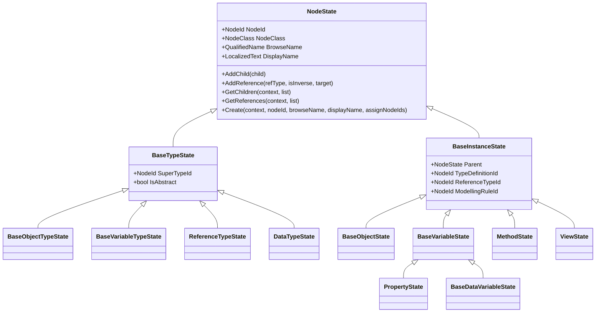
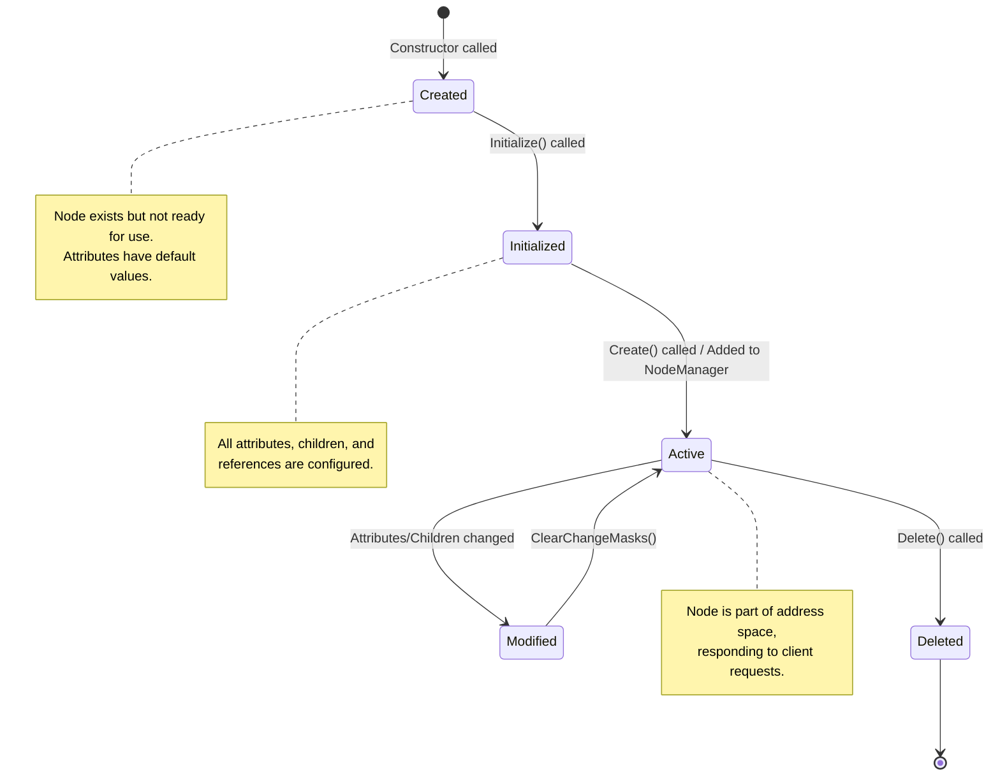
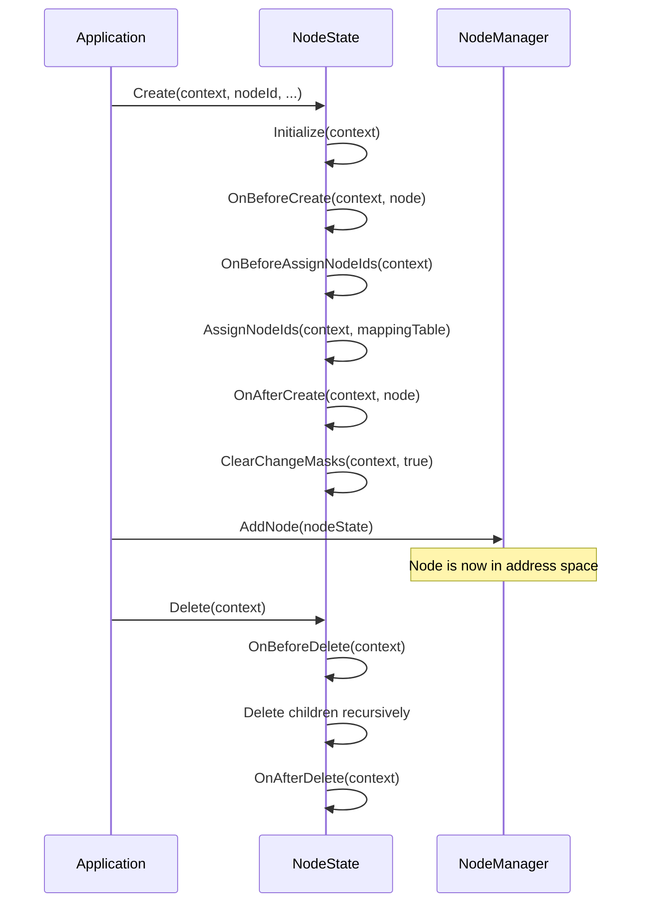
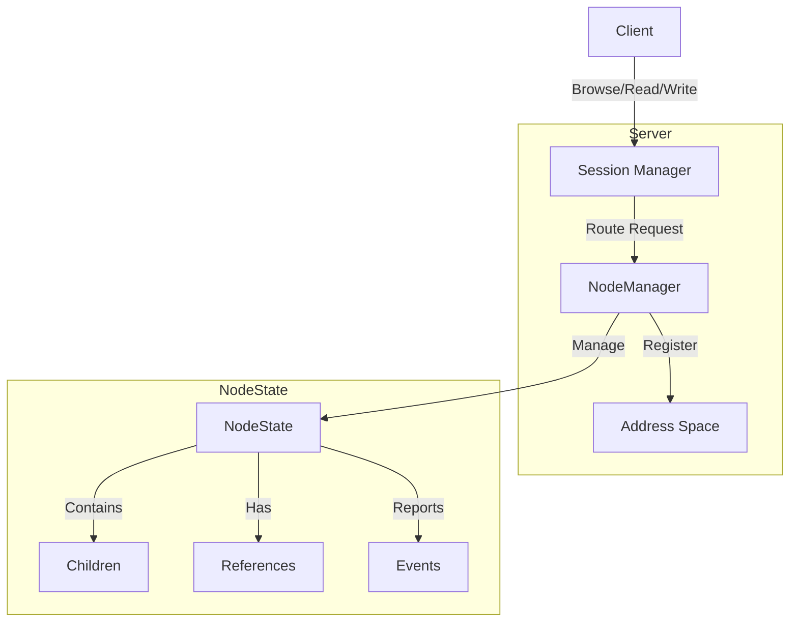
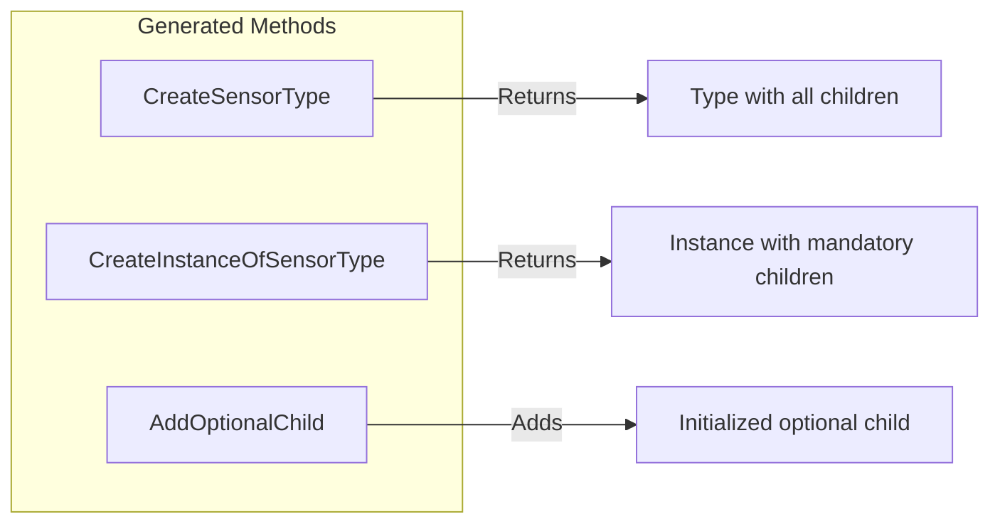

# NodeState System

The `NodeState` system is the in-memory representation of OPC UA nodes in the server address
space. It provides the foundation for managing nodes, their attributes, children, references,
and the events that occur during their lifecycle.

## Overview



## Lifecycle of a NodeState

The lifecycle of a `NodeState` involves creation, initialization, usage in the server, and disposal.



### Initialization Methods

The `NodeState` class provides several `Initialize` overloads for different scenarios:

| Method | Purpose |
|--------|---------|
| `Initialize(ITelemetryContext)` | Sets up telemetry/logging. Called by all other overloads. |
| `Initialize(ISystemContext)` | Initializes with default values. Called when creating new nodes. |
| `Initialize(ISystemContext, NodeState)` | Copies attributes from a source node (for deserialization). |
| `Initialize(ISystemContext, string)` | Initializes from XML or binary encoded string. |
| `InitializeOptionalChildren(ISystemContext)` | Initializes optional children that have been set as properties. |

### Key Lifecycle Callbacks

The following virtual methods can be overridden to customize node behavior:



### Memory Layout: Optional Metadata and Security

`BaseVariableState.Initialize(ITelemetryContext)` retains the factory's non-generic
logger for the exact category `Opc.Ua.BaseVariableState`. Logger sharing follows the
factory's own cache policy; each initialization consults the supplied factory, including
reinitialization with a different context. Nodes borrow the logger and factory without
taking disposal ownership. The existing telemetry fallback and public typed
`CreateLogger<T>()` contract are unchanged. This avoids a per-initialization typed wrapper,
not the node's logger field; bare nodes that never enter this initializer are unaffected.

Six design properties (`Extensions`, `Categories`, `ReleaseStatus`, `Specification`,
`NodeSetDocumentation`, `DesignToolOnly`) share a private metadata bag. `RolePermissions`,
`UserRolePermissions`, and `AccessRestrictions` share a separate private security bag.
Absent bags return null/default values; default reads and default writes do not allocate
a bag. Present-empty permission arrays remain distinct from absent arrays, and explicit
`AccessRestrictionType.None` remains distinct from absent restrictions.

Each bag is published using `Volatile.Read` and `Interlocked.CompareExchange`. Concurrent
first writers to different members use the same canonical bag. A bag is never replaced or
reclaimed: resetting its members retains it, avoiding races with other writers. Publication
does not provide a transactional snapshot or add synchronization to attribute change masks.

On .NET 10.0.11 x64, metadata storage reduces the unpopulated node allocation by **32 bytes**,
and security storage by another **24 bytes**. Each allocated bag costs **56 bytes**, excluding
payload objects and arrays. Metadata therefore has a 24-byte populated premium relative to
inline metadata; security has a 32-byte populated premium relative to inline security.

The inline baseline is commit `53418742a`, measured on the same runtime with both groups inline.

| Optional bags ever allocated | `BaseObjectState` | `BaseDataVariableState` | Difference from inline baseline |
|---|---:|---:|---:|
| Neither | 632 B | 968 B | -56 B |
| Metadata or security only | 688 B | 1024 B | 0 B |
| Both | 744 B | 1080 B | +56 B |

These warmed constructor/assignment allocations use identical cached payloads. Resetting
members does not reduce the retained bag cost. Savings depend on the population's history
of optional-property use; these figures do not establish real-world occupancy.

Copies receive independent bags for copied values, with shallow array/list
and permission-entry sharing. `CopyTo` does not copy
`AccessRestrictions`, and the binary/XML `NodeState.Save` formats do not persist these
optional properties. Property setters mark changed security values; successful
`RolePermissions` attribute writes always set `NonValue | RolePermissions`, whereas
`AccessRestrictions` attribute writes do not set change masks.

`Description`, `Handle`, `SymbolicName`, and `IsPartOfTypeHierarchy` use inline storage.
Callback fields also remain directly accessible public fields.

### Reproducing the Memory Baseline

The regular NUnit projects contain a managed-only measurement harness; no historical
DLLs or exported source trees are required in the repository. `NodeStateMemoryScenarios`
is the case catalog shared by `NodeStateStorageBenchmarks.ConstructPopulation` and
`NodeStateMemoryBaselineTests.ExportBaseline`. Keep its case names and semantic inputs
stable for paired optimization runs. Extend that catalog for node-storage work; extend
`NodeStateRegisteredPopulationTests` for server populations. Do not change these shared
fixtures concurrently with a measurement.

Run from the source worktree, serially on a quiet host. Use a **new external directory**
for every run: evidence files use create-new semantics rather than overwriting a baseline.
For example, in PowerShell (set `$e` to a directory outside the repository):

```powershell
$e = Join-Path ([IO.Path]::GetTempPath()) ("nodestate-" + [guid]::NewGuid())
$env:CustomTestTarget = 'net10.0'
$env:NODESTATE_SOURCE_ROOT = (Get-Location).Path
$env:NODESTATE_MEMORY_SDK = dotnet --version
$env:NODESTATE_MEMORY_REVISION = git rev-parse HEAD
$types = 'tests\Opc.Ua.Types.Tests\Opc.Ua.Types.Tests.csproj'
$server = 'tests\Opc.Ua.Server.Tests\Opc.Ua.Server.Tests.csproj'
$env:NODESTATE_MEMORY_OUTPUT = Join-Path $e 'types'
$filter = 'FullyQualifiedName=Opc.Ua.Types.Tests.State.NodeStateMemoryBaselineTests.ExportBaseline'
$env:NODESTATE_MEMORY_COMMAND = "dotnet test $types -c Release -f net10.0 --no-restore --filter $filter"
dotnet test $types -c Release -f net10.0 --no-restore --filter $filter
$env:NODESTATE_MEMORY_OUTPUT = Join-Path $e 'server'
$filter = 'FullyQualifiedName=Opc.Ua.Server.Tests.NodeStateRegisteredPopulationTests.ExportRegisteredBaselineAsync'
$env:NODESTATE_MEMORY_COMMAND = "dotnet test $server -c Release -f net10.0 --no-restore --filter $filter"
dotnet test $server -c Release -f net10.0 --no-restore --filter $filter
```

Build each selected project first if it is a fresh worktree: a no-restore test invocation
can do nothing before test SDK assets exist. Start with `dotnet build $types -c Release
-f net10.0 --no-restore` (and `$server`). Only after a missing-assets failure, repeat the
chosen command without `--no-restore`. Do not use `--no-build` for source baseline capture.
`identity.csv` records the actual host invocation and supplied build command, SDK, source
revision, GC/runtime/architecture. `assemblies.csv` records loaded assembly paths,
SHA-256, MVID and TFM. `sources.csv` hashes source/build/model inputs, including dirty files,
excluding bin/obj/test output and hidden directories. This is an input fingerprint, not
proof that an arbitrary old DLL was built from those inputs: retain the successful fresh
build log and do not modify inputs between the build and measurement. Do not use
ProductVersion or the Git revision alone to identify a dirty source baseline.

`samples.csv` separates shallow layout, constructor/initialization allocation traffic,
rooted full-GC live estimates and standalone component costs. Holding arrays are allocated
before the live baseline; nodes remain rooted through the second collection. Cached
payloads and services are already live and excluded from per-node deltas. `definitions.csv`
pins sharing and measurement semantics. Cases include bare/minimal object and variable,
full create lifecycle, matched cached/unique numeric/string names, 64-byte
values, neither/one/both optional groups and reset, explicitly **synthetic** cached callbacks,
and reference degrees 0/1/2/4/8/16/128/1024. Reference modes distinguish local NodeId
conversion, newly constructed absolute wrappers and cached preexpanded targets.
Metadata XML/list/URI payloads are shared even in unique-name cases; unique security
cases allocate one permission entry and array per node. Optional-bag reset retains the
bag, and populated costs must not be presented as universal savings.
`Variable.Telemetry` uses a field-free sealed test subclass to enter the actual protected
`Initialize(ITelemetryContext)` seam; its test verifies the logger category/factory call.
This is deliberately separate from `CreateLifecycle`: the base data-variable create
initializer does not itself call the telemetry initializer.
Managed array element strides for `NodeId`, `ExpandedNodeId`, `Variant`, `QualifiedName`
and `LocalizedText` are separate diagnostic rows, not class shallow sizes.

The server fixture uses actual fluent registration, the generated `VectorVariableState`
factory and `VectorVariableValue` binding, actual `MonitoredNode2` registration/removal,
a fluent method handler and an event source. Only server infrastructure/monitored items
are mocked; it does not start a server or bind ports. Per-node `occupancy.csv` rows record
actual group co-occurrence before/after registration, binding, monitoring, unsubscription
and removal. Children, dynamic children, explicit references, total browsed references,
synthesized edges not present in the explicit list, and notifiers are separate columns.
Browsing touches lazy state, so these diagnostic rows are captured **after** the independent
memory population, never as its warmup. Effective optional-property presence does not
claim that a previously allocated bag has been reclaimed.

Whole-test-manager live deltas include manager, mocks, services and index costs and are
not whole-server or node-only sizes. Registration may await: no current-thread allocation
claim is made for that work. Authored-builder roots are released after registration;
the post-removal memory sample also releases fixture observation roots. Standalone
string, payload, permission, delegate/closure, holding-array and index measurements are
controls, **not additive accounting** of the manager graph. GC deltas can be noisy or
negative; use repetitions, not exact-byte multi-runtime assertions.

Use the existing BenchmarkDotNet entry point for throughput, retaining the same built
Types test assembly and its baseline provenance. Its CSV/JSON export includes statistics
and raw measurements; constructor case selection adds a dictionary lookup, while the
direct allocation probe selects its factory outside the measured loop.
The same storage fixture also benchmarks last-target hit, miss, caller-buffer enumeration
and steady-state add/remove at each reference degree, with semantic assertions proving
selection and restoration. These prebuilt-node cases distinguish lookup regressions from
constructor savings.

```powershell
dotnet run --project $types -c Release -f net10.0 --no-build -- `
  --filter '*NodeStateAllocationBenchmarks.CreateBrowser*' `
           '*NodeStateReadAttributesBenchmarks.ReadVariableAttributes*' `
  --exporters json --artifacts (Join-Path $e 'throughput')
# Optional full storage throughput matrix (run separately, not concurrently):
dotnet run --project $types -c Release -f net10.0 --no-build -- `
  --filter '*NodeStateStorageBenchmarks.ConstructPopulation*' `
  --exporters json --artifacts (Join-Path $e 'storage-throughput')
```

The existing browse fixture covers first-use, warmed and bounded two-worker contended
browse; first-use includes construction. Contended allocation includes worker-thread
effects and must not be interpreted as a current-thread node allocation. The attribute
fixture measures both returned `DataValue` and caller-provided `Variant` destinations.
Short runs are representative diagnostics, not acceptance-grade significance by themselves.
Keep historical pinned measurements immutable; record a new cumulative directory after
each accepted implementation rather than relabelling a historical assembly as current.

### Explicit Reference Storage

Explicit references use a lazily created `ReferenceDictionary<object?>`; fresh nodes
have no reference table. Unfiltered enumeration follows insertion order, while
filtered browsing follows the dictionary indexes' enumeration order. Bulk insertion
ignores duplicates and preserves the first reference object; single insertion throws
on duplicates. Binary updates merge and replace matching objects without moving their
positions; XML updates clear and reload the table. Mutable external `IReference`
objects retain their insertion-time dictionary indexes. Intrinsic references synthesized
from children, parents, and type definitions are not duplicated in this storage.

### Event Dispatch Allocations

Synchronous `ReportEvent` creates its scheduling closure only when an asynchronous sink
and an ambient `SynchronizationContext` require thread-pool dispatch. With no notifiers,
the no-sink path, a nonallocating synchronous sink, and an inline-completed asynchronous
sink without an ambient context each allocate **0 bytes per call** on .NET 10.0.11 x64
using cached event payloads. Context-dispatched asynchronous sinks allocate scheduling
state; notifier snapshots, suspended asynchronous work, and callbacks can also allocate.
Skipping absent callbacks does not make every event-dispatch path allocation-free.

The synchronous sink runs before the asynchronous sink is read and invoked. `ReportEvent`
waits for asynchronous completion and propagates sink failures before taking a notifier
snapshot. `ReportEventAsync` awaits asynchronous sinks and inverse-notifier forwarding.
The scheduling-closure optimization reduces transient allocation, not retained node size.

## Usage Inside the Server

The generated `Create<SymbolicId>` and `CreateInstanceOf<SymbolicId>`
extension methods create a type declaration or a typed instance,
respectively. The instance factory materialises all mandatory children and
assigns per-instance NodeIds when a browse name and `NodeIdFactory` are
available.

The returned instance has not completed its create lifecycle. Node manager
registration completes `OnBeforeCreate`/`OnAfterCreate` and clears change
masks before indexing it. Asynchronous registration assigns any required
NodeIds first; synchronous predefined-node registration preserves
caller-assigned NodeIds. Call `CreateAsPredefinedNode` explicitly when code
must read lifecycle-established state, or set state or handlers which
`OnAfterCreate` would otherwise replace, before registration.

The caller can add optional children and placeholders with the generated
`Add<ChildName>()` methods. These call
`Create<SymbolicId>(this, forInstance: true)` internally. Additional
references and children can be attached with `AddReference` and `AddChild`.
        
### Legacy behavior
        
If the constructor is called directly the instance is created but still must be initialized
in this case the caller *must* call Initialize(context) before using the instance which will
call Initialize(context, CreateInstanceOf<SymoblicId>(context)) to initialize all attributes, 
references and mandatory children. 

If the class is extended, the same applies.
        
If optional children are "set" as properties, the InitializeOptionalChildren(context) method
*must* be called to call Initialize on all children (if they are not yet initialized).

### Address Space Integration

Nodes are managed by `NodeManager` implementations within the server. The typical flow:



### Reading and Writing Attributes

The server reads and writes node attributes through callback handlers:

```csharp
// Example: Setting up attribute callbacks
myVariable.OnReadValue = (context, node, indexRange, dataEncoding, 
                          ref value, ref statusCode, ref timestamp) =>
{
    // Custom read logic
    value = GetCurrentSensorValue();
    return ServiceResult.Good;
};

myVariable.OnWriteValue = (context, node, indexRange, dataEncoding,
                           ref value, ref statusCode, ref timestamp) =>
{
    // Custom write logic
    SetActuatorValue(value);
    return ServiceResult.Good;
};
```

### Event Handling

Nodes can report events and track monitored items:

```csharp
// Report an event from a node
nodeState.ReportEvent(context, eventInstance);

// Check if events are being monitored
if (nodeState.AreEventsMonitored)
{
    // Generate and report event
}
```

### Change Tracking

The `ChangeMasks` property tracks what has changed since the last `ClearChangeMasks()` call:

```csharp
// After modifying a node
nodeState.DisplayName = "New Name";  // Sets NodeStateChangeMasks.NonValue

// The OnStateChanged callback is invoked when clearing change masks
nodeState.OnStateChanged = (context, node, changes) =>
{
    // Handle changes (e.g., persist to database)
    if ((changes & NodeStateChangeMasks.Children) != 0)
    {
        // Children were added/removed
    }
};

nodeState.ClearChangeMasks(context, includeChildren: true);
```

## Usage Guidelines for Developers

### Creating Nodes with Generated Code (Recommended)

The source generator creates helper methods that properly initialize nodes:

```csharp
// Create a type node (includes all children from the type definition)
var sensorType = context.CreateSensorType();

// Create an instance of a type (includes mandatory children)
var sensor = context.CreateInstanceOfSensorType();

// Add optional children defined in the type
sensor.AddOptionalProperty();  // Creates and initializes the optional property

// Add placeholder instances
sensor.AddSensorReading(new QualifiedName("Temperature", namespaceIndex));
```



### Creating Nodes Manually (Legacy)

When not using generated code, manual initialization is required:

```csharp
// Step 1: Create the node
var variable = new BaseDataVariableState(parent);

// Step 2: Initialize the node (REQUIRED before use)
variable.Initialize(context);

// Step 3: Set attributes
variable.NodeId = new NodeId(1234, namespaceIndex);
variable.BrowseName = new QualifiedName("MyVariable", namespaceIndex);
variable.DisplayName = "My Variable";
variable.TypeDefinitionId = VariableTypeIds.BaseDataVariableType;
variable.DataType = DataTypeIds.Double;
variable.ValueRank = ValueRanks.Scalar;
variable.Value = 0.0;

// Step 4: Create and assign node IDs
variable.Create(context, variable.NodeId, variable.BrowseName, 
                variable.DisplayName, assignNodeIds: true);

// Step 5: Add to parent
parent.AddChild(variable);
```

### Managing Children

```csharp
// Add a child node
parent.AddChild(childNode);

// Remove a child node
parent.RemoveChild(childNode);

// Find a child by browse name
var child = parent.FindChild(context, new QualifiedName("ChildName", ns));

// Get all children
var children = new List<BaseInstanceState>();
parent.GetChildren(context, children);

// Find child by symbolic path
var deepChild = parent.FindChildBySymbolicName(context, "Child1/Child2/Target");
```

### Managing References

```csharp
// Add a reference to another node
sourceNode.AddReference(
    ReferenceTypeIds.Organizes,
    isInverse: false,
    targetId: targetNode.NodeId);

// Check if reference exists
bool exists = sourceNode.ReferenceExists(
    ReferenceTypeIds.Organizes,
    isInverse: false,
    targetId: targetNode.NodeId);

// Remove a reference
sourceNode.RemoveReference(
    ReferenceTypeIds.Organizes,
    isInverse: false,
    targetId: targetNode.NodeId);

// Get all references
var references = new List<IReference>();
sourceNode.GetReferences(context, references);
```

### Serialization and Deserialization

Nodes can be saved and loaded from streams:

```csharp
// Save to XML
using var stream = new MemoryStream();
nodeState.SaveAsXml(context, stream);

// Save to binary
using var binaryStream = new MemoryStream();
nodeState.SaveAsBinary(context, binaryStream);

// Load from XML
nodeState.LoadFromXml(context, xmlStream);

// Load from binary
nodeState.LoadAsBinary(context, binaryStream);
```

### Node State Factory

The `NodeStateFactory` creates node instances based on type definitions:

```csharp
// Register a custom factory for a type
context.NodeStateFactory.RegisterType(
    typeDefinitionId,
    new MyCustomNodeActivator());

// Create an instance using the factory
var node = context.NodeStateFactory.CreateInstance(
    context,
    parent,
    NodeClass.Object,
    browseName,
    referenceTypeId,
    typeDefinitionId);
```

### Best Practices

1. **Always Initialize**: Never use a `NodeState` without calling `Initialize()` first.

2. **Use Generated Code**: Prefer generated `Create*` and `CreateInstanceOf*` methods for type safety
   and proper initialization.

3. **Clear Change Masks**: Call `ClearChangeMasks()` after making changes to trigger
   the `OnStateChanged` callback.

4. **Thread Safety**: Use appropriate locking when accessing nodes from multiple threads.
   The `NodeState` class uses internal locks for children and references collections.

5. **Memory Management**: All resources allocated for a node state must be managed outsidee
   of the node state, e.g. in the node manager that owns the node state.

6. **Use Callbacks Sparingly**: Only attach callbacks (`OnReadValue`, `OnWriteValue`, etc.)
   when custom behavior is needed. Default behavior is often sufficient.

### Common Pitfalls

| Issue | Solution |
|-------|----------|
| Node not appearing in address space | Ensure `Create()` was called and node is added to `NodeManager` |
| Children not visible | Verify children have valid `NodeId` and are added with `AddChild()` |
| Attribute changes not persisted | Implement `OnStateChanged` callback and persist changes |
| Deserialization fails | Check namespace URIs match and type definitions are registered |
| Memory leaks with events | Unsubscribe from `StateChanged` and other events before disposal |
